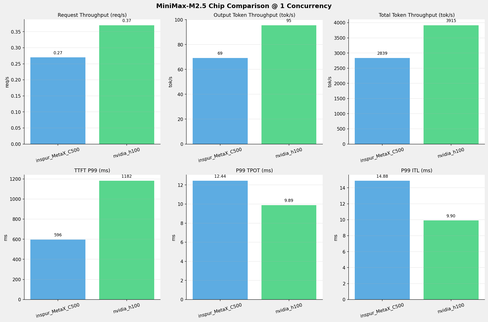
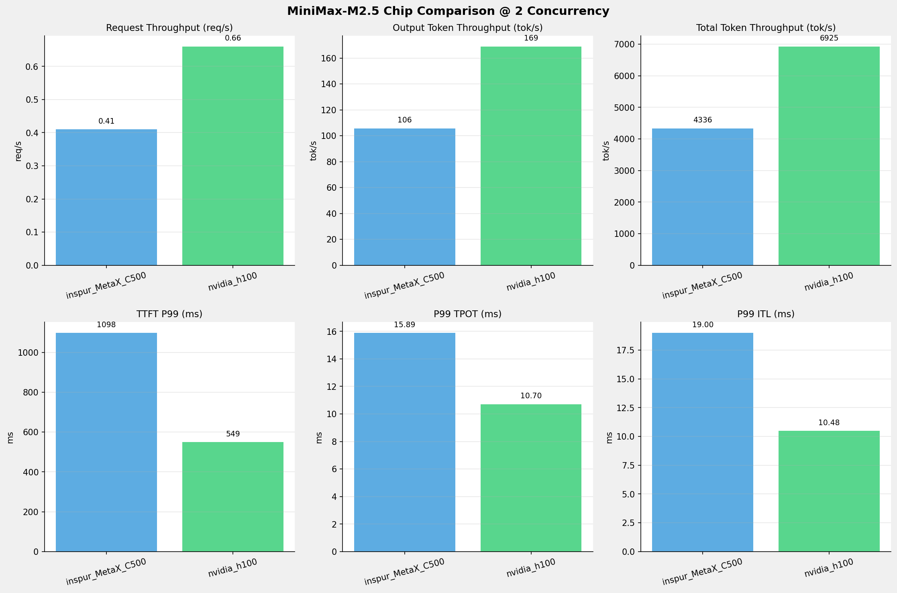
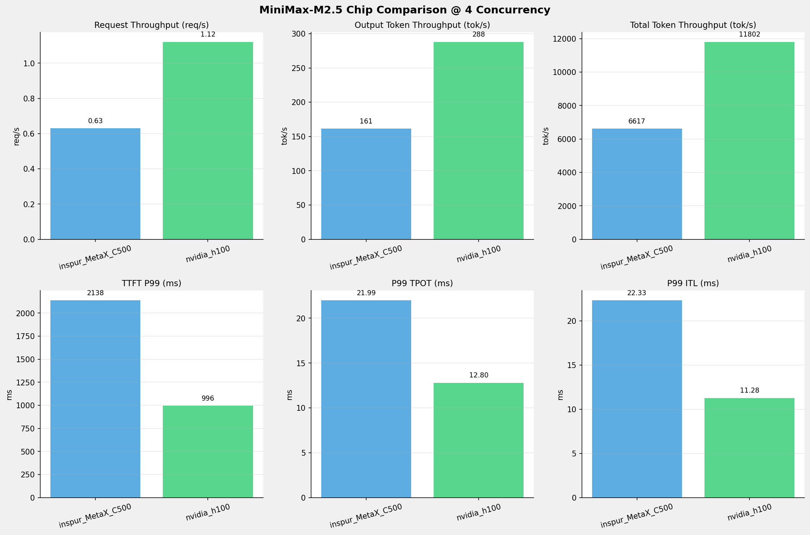
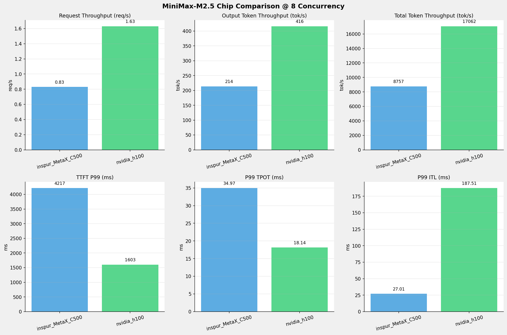
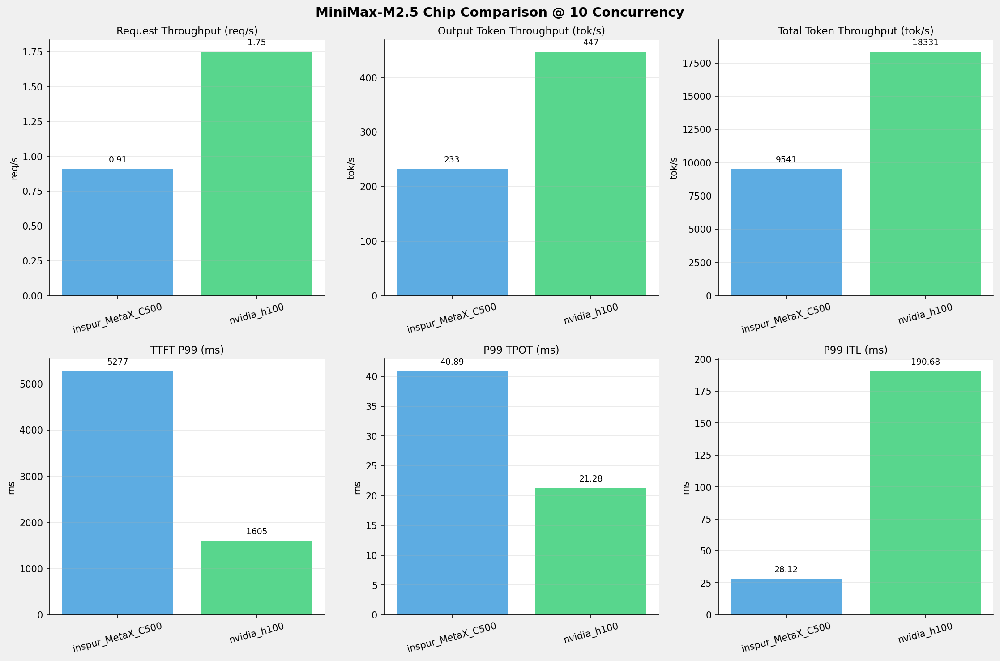
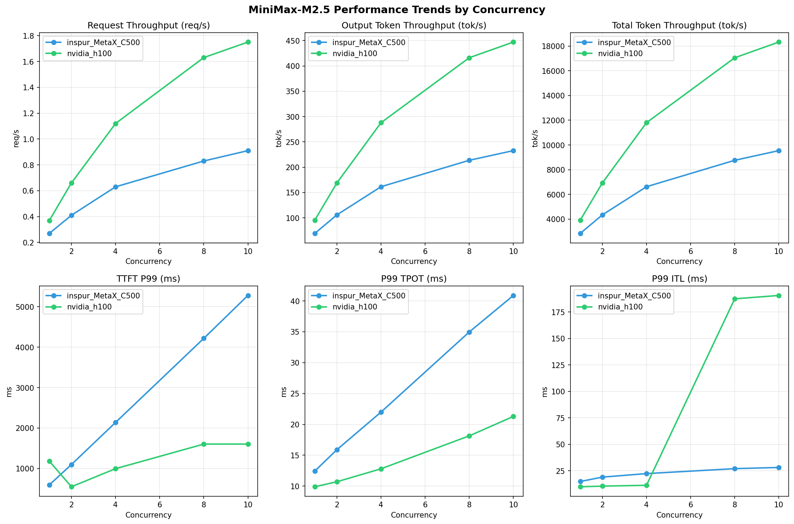

# MiniMax-M2.5模型在不同芯片下的SGLang基准测试报告

**测试日期：** 2026-04-28

---

## 测试场景
在固定请求数，输入上下文和输出上下文长度下，使用SGLang基准测试工具对并发数逐级增加场景的性能基准验证。并对比同一模型在不同芯片环境上的性能指标。

**主要采集指标**：

| 指标                  | 单位         | 含义                                 |
|---------------------|------------|------------------------------------|
| TTFT                | ms         | Time To First Token，首 token 延迟     |
| TPOT                | ms/token   | Time Per Output Token，每 token 生成时间 |
| Throughput          | tokens/s   | 系统总吞吐                              |
| QPS                 | requests/s | 请求吞吐                               |

## 📊 测试概览

| 项目            | 配置                                  | 备注  |
|---------------|-------------------------------------|-----|
| **数据集**       | random                              |     |
| **并发数**       | 1, 2, 4, 8, 10, 16, 32, 64, 80, 128 |     |
| **总请求数**      | 320                                 |     |
| **请求输入上下文长度** | 10240（10k）                          |     |
| **请求输出上下文长度** | 256（0.25k）                          |     |
| **模型**        | MiniMax-M2.5                        |     |
| **被测芯片**      | inspur_MetaX_C500, nvidia_h100      |     |

---

## 📈 各并发级别性能对比

### 1 并发

| 指标                              | inspur_MetaX_C500 | nvidia_h100   |
|---------------------------------|-------------------|---------------|
| Request throughput (req/s)      | 0.27              | **0.37** ⭐    |
| Output token throughput (tok/s) | 69.26             | **95.49** ⭐   |
| Total token throughput (tok/s)  | 2839.48           | **3915.14** ⭐ |
| P99 TTFT (ms)                   | **596.38** ⭐      | 1181.54       |
| P99 TPOT (ms)                   | 12.44             | **9.89** ⭐    |
| P99 ITL (ms)                    | 14.88             | **9.90** ⭐    |

---

### 2 并发

| 指标                              | inspur_MetaX_C500 | nvidia_h100   |
|---------------------------------|-------------------|---------------|
| Request throughput (req/s)      | 0.41              | **0.66** ⭐    |
| Output token throughput (tok/s) | 105.76            | **168.90** ⭐  |
| Total token throughput (tok/s)  | 4336.07           | **6925.05** ⭐ |
| P99 TTFT (ms)                   | 1097.81           | **549.04** ⭐  |
| P99 TPOT (ms)                   | 15.89             | **10.70** ⭐   |
| P99 ITL (ms)                    | 19.00             | **10.48** ⭐   |

---

### 4 并发

| 指标                              | inspur_MetaX_C500 | nvidia_h100    |
|---------------------------------|-------------------|----------------|
| Request throughput (req/s)      | 0.63              | **1.12** ⭐     |
| Output token throughput (tok/s) | 161.40            | **287.86** ⭐   |
| Total token throughput (tok/s)  | 6617.46           | **11802.07** ⭐ |
| P99 TTFT (ms)                   | 2137.97           | **995.93** ⭐   |
| P99 TPOT (ms)                   | 21.99             | **12.80** ⭐    |
| P99 ITL (ms)                    | 22.33             | **11.28** ⭐    |

---

### 8 并发

| 指标                              | inspur_MetaX_C500 | nvidia_h100    |
|---------------------------------|-------------------|----------------|
| Request throughput (req/s)      | 0.83              | **1.63** ⭐     |
| Output token throughput (tok/s) | 213.59            | **416.15** ⭐   |
| Total token throughput (tok/s)  | 8757.21           | **17062.16** ⭐ |
| P99 TTFT (ms)                   | 4216.68           | **1603.43** ⭐  |
| P99 TPOT (ms)                   | 34.97             | **18.14** ⭐    |
| P99 ITL (ms)                    | **27.01** ⭐       | 187.51         |

---

### 10 并发

| 指标                              | inspur_MetaX_C500 | nvidia_h100    |
|---------------------------------|-------------------|----------------|
| Request throughput (req/s)      | 0.91              | **1.75** ⭐     |
| Output token throughput (tok/s) | 232.70            | **447.09** ⭐   |
| Total token throughput (tok/s)  | 9540.82           | **18330.76** ⭐ |
| P99 TTFT (ms)                   | 5277.45           | **1604.56** ⭐  |
| P99 TPOT (ms)                   | 40.89             | **21.28** ⭐    |
| P99 ITL (ms)                    | **28.12** ⭐       | 190.68         |

---

## 📊 芯片性能柱状图

---

## 📈 性能趋势对比图 (所有芯片)

---

*报告生成时间: 2026-04-28*

