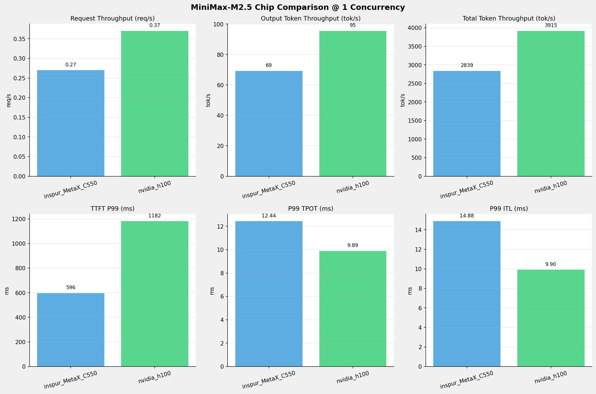
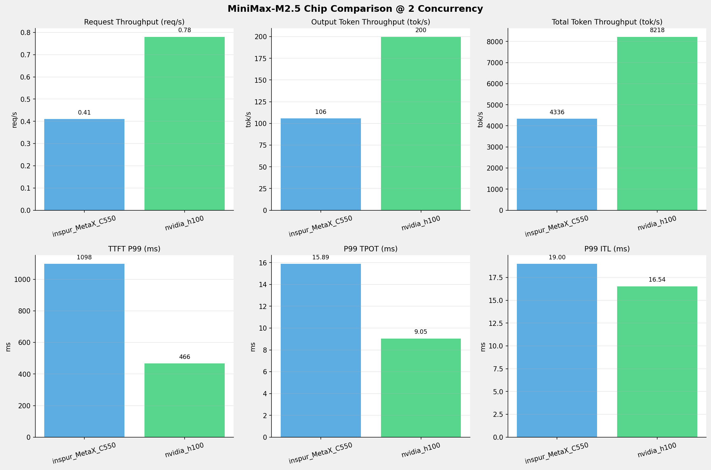
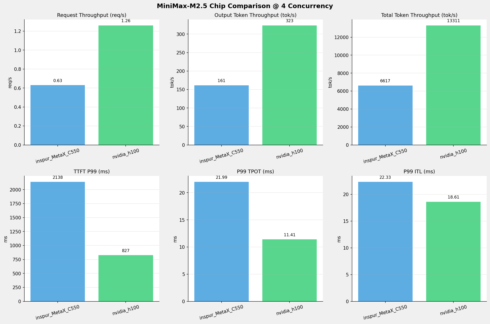
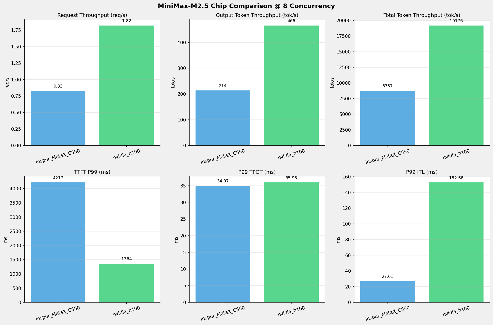
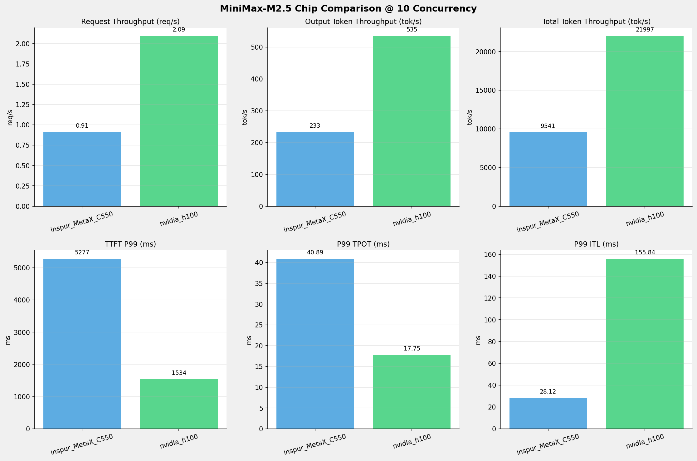
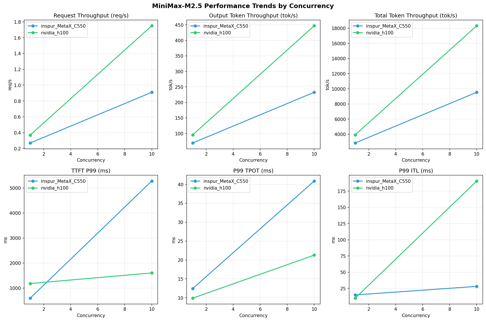

# MiniMax-M2.5模型在不同芯片下的基准测试报告

**测试日期：** 2026-05-07

---

## 测试场景
在固定请求数，输入上下文和输出上下文长度下，使用SGLang基准测试工具对并发数逐级增加场景的性能基准验证。并对比同一模型在不同芯片环境上的性能指标。

**主要采集指标**：

| 指标                  | 单位         | 含义                                 |
|---------------------|------------|------------------------------------|
| TTFT                | ms         | Time To First Token，首 token 延迟     |
| TPOT                | ms/token   | Time Per Output Token，每 token 生成时间 |
| Throughput          | tokens/s   | 系统总吞吐                              |
| QPS                 | requests/s | 请求吞吐                               |

## 📊 测试概览

| 项目            | 配置                                     | 备注  |
|---------------|----------------------------------------|-----|
| **数据集**       | random                                 |     |
| **并发数**       | 1, 2, 4, 8, 10, 16, 32, 64, 80, 128    |     |
| **总请求数**      | 320                                    |     |
| **请求输入上下文长度** | 10240（10k）                             |     |
| **请求输出上下文长度** | 256（0.25k）                             |     |
| **被测芯片**      | inspur_MetaX_C550, nvidia_h100 |     |
| **被测模型**      | inspur_MetaX_C550 (MiniMax-M2.5-W8A8), nvidia_h100 (MiniMax-M2.5) |     |

---

## 📊 芯片性能对比柱状图

---

## 📈 性能趋势对比图 (所有芯片)

---

## 📈 各并发级别性能对比详情

### 1 并发

| 指标 | inspur_MetaX_C550 | nvidia_h100 |
|------|----------- | -----------|
| Request throughput (req/s) | 0.27 | **0.45** ⭐ |
| Output token throughput (tok/s) | 69.26 | **115.31** ⭐ |
| Total token throughput (tok/s) | 2839.48 | **4745.14** ⭐ |
| P99 TTFT (ms) | 596.38 | **286.01** ⭐ |
| P99 TPOT (ms) | 12.44 | **7.68** ⭐ |
| P99 ITL (ms) | 14.88 | **8.57** ⭐ |

---

### 2 并发

| 指标 | inspur_MetaX_C550 | nvidia_h100 |
|------|----------- | -----------|
| Request throughput (req/s) | 0.41 | **0.78** ⭐ |
| Output token throughput (tok/s) | 105.76 | **199.70** ⭐ |
| Total token throughput (tok/s) | 4336.07 | **8217.92** ⭐ |
| P99 TTFT (ms) | 1097.81 | **466.40** ⭐ |
| P99 TPOT (ms) | 15.89 | **9.05** ⭐ |
| P99 ITL (ms) | 19.00 | **16.54** ⭐ |

---

### 4 并发

| 指标 | inspur_MetaX_C550 | nvidia_h100 |
|------|----------- | -----------|
| Request throughput (req/s) | 0.63 | **1.26** ⭐ |
| Output token throughput (tok/s) | 161.40 | **323.45** ⭐ |
| Total token throughput (tok/s) | 6617.46 | **13310.92** ⭐ |
| P99 TTFT (ms) | 2137.97 | **826.89** ⭐ |
| P99 TPOT (ms) | 21.99 | **11.41** ⭐ |
| P99 ITL (ms) | 22.33 | **18.61** ⭐ |

---

### 8 并发

| 指标 | inspur_MetaX_C550 | nvidia_h100 |
|------|----------- | -----------|
| Request throughput (req/s) | 0.83 | **1.82** ⭐ |
| Output token throughput (tok/s) | 213.59 | **465.99** ⭐ |
| Total token throughput (tok/s) | 8757.21 | **19176.39** ⭐ |
| P99 TTFT (ms) | 4216.68 | **1364.44** ⭐ |
| P99 TPOT (ms) | **34.97** ⭐ | 35.95 |
| P99 ITL (ms) | **27.01** ⭐ | 152.68 |

---

### 10 并发

| 指标 | inspur_MetaX_C550 | nvidia_h100 |
|------|----------- | -----------|
| Request throughput (req/s) | 0.91 | **2.09** ⭐ |
| Output token throughput (tok/s) | 232.70 | **534.52** ⭐ |
| Total token throughput (tok/s) | 9540.82 | **21996.95** ⭐ |
| P99 TTFT (ms) | 5277.45 | **1534.23** ⭐ |
| P99 TPOT (ms) | 40.89 | **17.75** ⭐ |
| P99 ITL (ms) | **28.12** ⭐ | 155.84 |

---

---

*报告生成时间: 2026-05-07*

