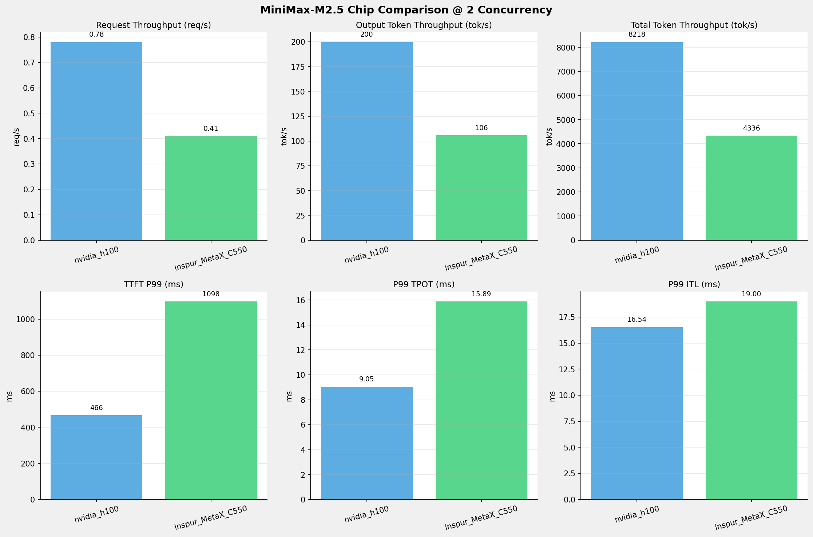
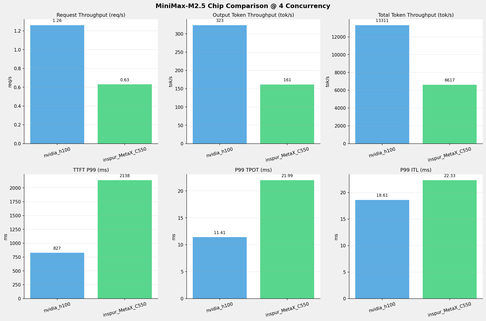
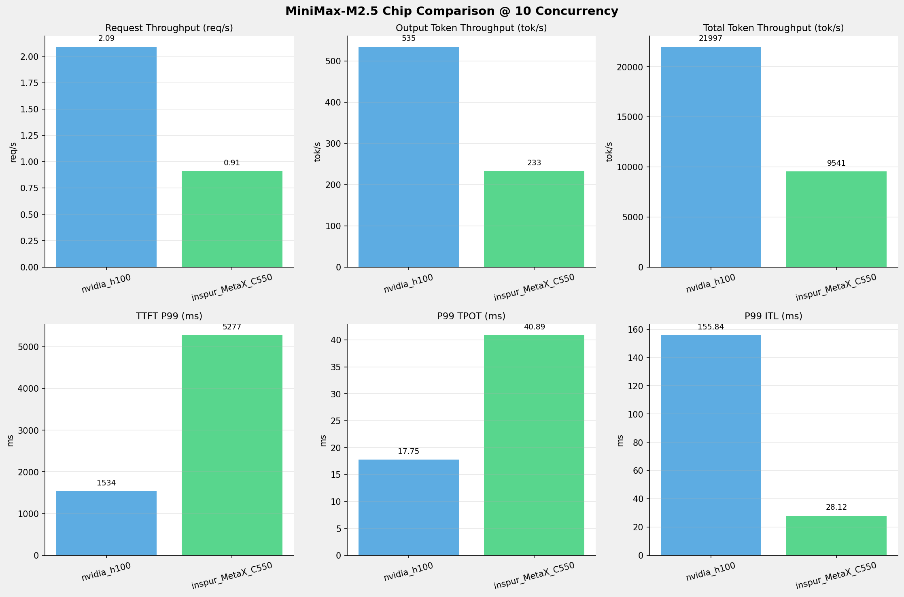
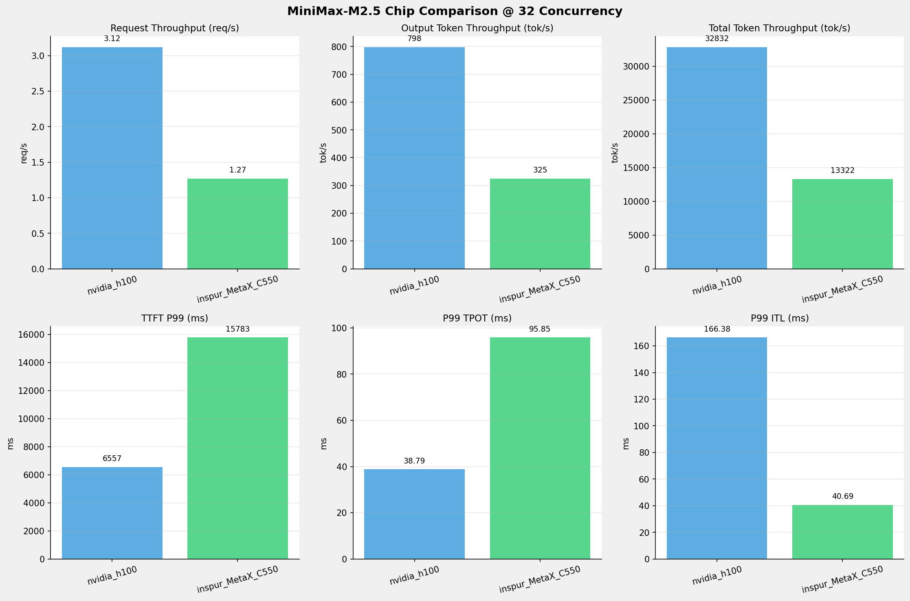
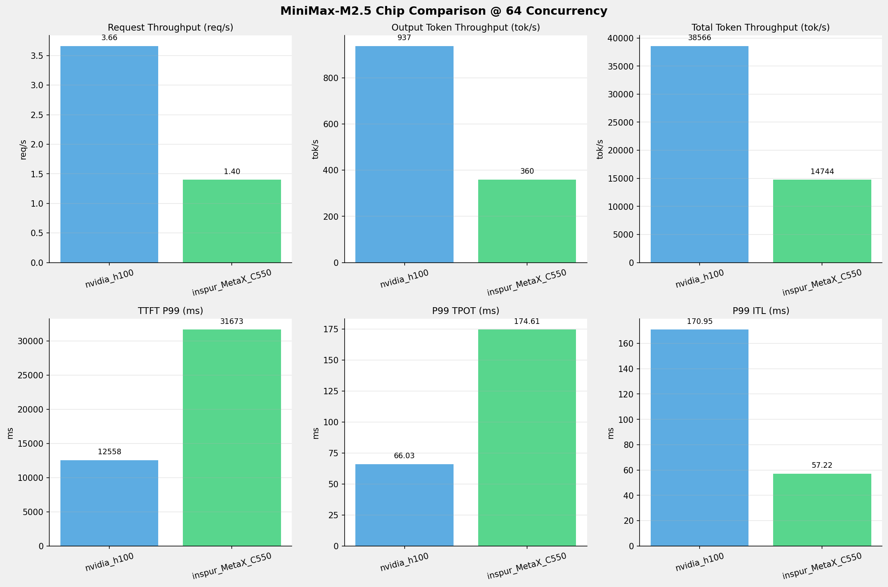

# MiniMax-M2.5模型在不同芯片下的基准测试报告

**测试日期：** 2026-05-19

---

## 测试场景
在固定请求数，输入上下文和输出上下文长度下，使用SGLang基准测试工具对并发数逐级增加场景的性能基准验证。并对比同一模型在不同芯片环境上的性能指标。

**主要采集指标**：

| 指标                  | 单位         | 含义                                 |
|---------------------|------------|------------------------------------|
| TTFT                | ms         | Time To First Token，首 token 延迟     |
| TPOT                | ms/token   | Time Per Output Token，每 token 生成时间 |
| Throughput          | tokens/s   | 系统总吞吐                              |
| QPS                 | requests/s | 请求吞吐                               |

### 📊 测试概览

| 项目            | 配置                                     | 备注  |
|---------------|----------------------------------------|-----|
| **数据集**       | random                                 |     |
| **并发数**       | 1, 2, 4, 8, 10, 16, 32, 64, 80, 128    |     |
| **总请求数**      | 320                                    |     |
| **请求输入上下文长度** | 10240（10k）                             |     |
| **请求输出上下文长度** | 256（0.25k）                             |     |
| **被测芯片**      | nvidia_h100, inspur_MetaX_C550 |     |
| **被测模型**      | nvidia_h100 (MiniMax-M2.5), inspur_MetaX_C550 (MiniMax-M2.5-W8A8) |     |

---

### 📊 芯片性能对比柱状图

**1并发**

**2并发**

**4并发**

**8并发**

**10并发**

**16并发**

**32并发**

**64并发**

**80并发**

**128并发**

### 📈 性能趋势对比图 (所有芯片)

---

### 📈 各指标随并发级别性能对比详情

#### 请求吞吐量（Request throughput (req/s)）

| 并发数 | nvidia_h100 | inspur_MetaX_C550 | 差值 | 百分比 |
|-----|----------- | ----------- | ----------- | -----------|
| 1   | **0.45** ⭐ | 0.27 | -0.18 | -40.0% |
| 2   | **0.78** ⭐ | 0.41 | -0.37 | -47.4% |
| 4   | **1.26** ⭐ | 0.63 | -0.63 | -50.0% |
| 8   | **1.82** ⭐ | 0.83 | -0.99 | -54.4% |
| 10   | **2.09** ⭐ | 0.91 | -1.18 | -56.5% |
| 16   | **2.51** ⭐ | 1.08 | -1.43 | -57.0% |
| 32   | **3.12** ⭐ | 1.27 | -1.85 | -59.3% |
| 64   | **3.66** ⭐ | 1.40 | -2.26 | -61.7% |
| 80   | **3.67** ⭐ | 1.41 | -2.26 | -61.6% |
| 128   | **3.66** ⭐ | 1.41 | -2.25 | -61.5% |

#### 输入token吞吐量（Input token throughput (tok/s)）

| 并发数 | nvidia_h100 | inspur_MetaX_C550 | 差值 | 百分比 |
|-----|----------- | ----------- | ----------- | -----------|
| 1   | N/A | 2770.22 | N/A | N/A |
| 2   | N/A | 4230.31 | N/A | N/A |
| 4   | N/A | 6456.06 | N/A | N/A |
| 8   | N/A | 8543.62 | N/A | N/A |
| 10   | N/A | 9308.12 | N/A | N/A |
| 16   | N/A | 11072.12 | N/A | N/A |
| 32   | N/A | 12997.18 | N/A | N/A |
| 64   | N/A | 14384.76 | N/A | N/A |
| 80   | N/A | 14405.36 | N/A | N/A |
| 128   | N/A | 14396.10 | N/A | N/A |

#### 输出token吞吐量（Output token throughput (tok/s)）

| 并发数 | nvidia_h100 | inspur_MetaX_C550 | 差值 | 百分比 |
|-----|----------- | ----------- | ----------- | -----------|
| 1   | **115.31** ⭐ | 69.26 | -46.05 | -39.9% |
| 2   | **199.70** ⭐ | 105.76 | -93.94 | -47.0% |
| 4   | **323.45** ⭐ | 161.40 | -162.05 | -50.1% |
| 8   | **465.99** ⭐ | 213.59 | -252.40 | -54.2% |
| 10   | **534.52** ⭐ | 232.70 | -301.82 | -56.5% |
| 16   | **643.80** ⭐ | 276.80 | -367.00 | -57.0% |
| 32   | **797.81** ⭐ | 324.93 | -472.88 | -59.3% |
| 64   | **937.16** ⭐ | 359.62 | -577.54 | -61.6% |
| 80   | **938.91** ⭐ | 360.13 | -578.78 | -61.6% |
| 128   | **937.61** ⭐ | 359.90 | -577.71 | -61.6% |

#### 总token吞吐量（Total token throughput (tok/s)）

| 并发数 | nvidia_h100 | inspur_MetaX_C550 | 差值 | 百分比 |
|-----|----------- | ----------- | ----------- | -----------|
| 1   | **4745.14** ⭐ | 2839.48 | -1905.66 | -40.2% |
| 2   | **8217.92** ⭐ | 4336.07 | -3881.85 | -47.2% |
| 4   | **13310.92** ⭐ | 6617.46 | -6693.46 | -50.3% |
| 8   | **19176.39** ⭐ | 8757.21 | -10419.18 | -54.3% |
| 10   | **21996.95** ⭐ | 9540.82 | -12456.13 | -56.6% |
| 16   | **26494.03** ⭐ | 11348.92 | -15145.11 | -57.2% |
| 32   | **32831.81** ⭐ | 13322.11 | -19509.70 | -59.4% |
| 64   | **38566.45** ⭐ | 14744.38 | -23822.07 | -61.8% |
| 80   | **38638.21** ⭐ | 14765.49 | -23872.72 | -61.8% |
| 128   | **38585.00** ⭐ | 14756.01 | -23828.99 | -61.8% |

#### 首token延迟（P99 TTFT (ms)）

| 并发数 | nvidia_h100 | inspur_MetaX_C550 | 差值 | 百分比 |
|-----|----------- | ----------- | ----------- | -----------|
| 1   | 286.01 | 596.38 | +310.37 | +108.5% |
| 2   | 466.40 | 1097.81 | +631.41 | +135.4% |
| 4   | 826.89 | 2137.97 | +1311.08 | +158.6% |
| 8   | 1364.44 | 4216.68 | +2852.24 | +209.0% |
| 10   | 1534.23 | 5277.45 | +3743.22 | +244.0% |
| 16   | 2630.84 | 8059.86 | +5429.02 | +206.4% |
| 32   | 6556.86 | 15782.91 | +9226.05 | +140.7% |
| 64   | 12557.76 | 31672.66 | +19114.90 | +152.2% |
| 80   | 19679.20 | 53556.78 | +33877.58 | +172.1% |
| 128   | 29645.32 | 76792.15 | +47146.83 | +159.0% |

#### 每token生成时间（P99 TPOT (ms)）

| 并发数 | nvidia_h100 | inspur_MetaX_C550 | 差值 | 百分比 |
|-----|----------- | ----------- | ----------- | -----------|
| 1   | 7.68 | 12.44 | +4.76 | +62.0% |
| 2   | 9.05 | 15.89 | +6.84 | +75.6% |
| 4   | 11.41 | 21.99 | +10.58 | +92.7% |
| 8   | 35.95 | 34.97 | -0.98 | -2.7% |
| 10   | 17.75 | 40.89 | +23.14 | +130.4% |
| 16   | 23.92 | 55.86 | +31.94 | +133.5% |
| 32   | 38.79 | 95.85 | +57.06 | +147.1% |
| 64   | 66.03 | 174.61 | +108.58 | +164.4% |
| 80   | 66.45 | 174.32 | +107.87 | +162.3% |
| 128   | 66.52 | 174.13 | +107.61 | +161.8% |

#### token间延迟（P99 ITL (ms)）

| 并发数 | nvidia_h100 | inspur_MetaX_C550 | 差值 | 百分比 |
|-----|----------- | ----------- | ----------- | -----------|
| 1   | 8.57 | 14.88 | +6.31 | +73.6% |
| 2   | 16.54 | 19.00 | +2.46 | +14.9% |
| 4   | 18.61 | 22.33 | +3.72 | +20.0% |
| 8   | 152.68 | 27.01 | -125.67 | -82.3% |
| 10   | 155.84 | 28.12 | -127.72 | -82.0% |
| 16   | 161.83 | 31.26 | -130.57 | -80.7% |
| 32   | 166.38 | 40.69 | -125.69 | -75.5% |
| 64   | 170.95 | 57.22 | -113.73 | -66.5% |
| 80   | 171.22 | 57.32 | -113.90 | -66.5% |
| 128   | 170.62 | 57.60 | -113.02 | -66.2% |

### 📈 各并发级别性能对比详情

#### 1 并发

| 指标 | nvidia_h100 | inspur_MetaX_C550 |
|------|----------- | -----------|
| 请求吞吐量（Request throughput (req/s)） | **0.45** ⭐ | 0.27 |
| 输入token吞吐量（Input token throughput (tok/s)） | N/A | 2770.22 |
| 输出token吞吐量（Output token throughput (tok/s)） | **115.31** ⭐ | 69.26 |
| 总token吞吐量（Total token throughput (tok/s)） | **4745.14** ⭐ | 2839.48 |
| 首token延迟（P99 TTFT (ms)） | **286.01** ⭐ | 596.38 |
| 每token生成时间（P99 TPOT (ms)） | **7.68** ⭐ | 12.44 |
| token间延迟（P99 ITL (ms)） | **8.57** ⭐ | 14.88 |

#### 2 并发

| 指标 | nvidia_h100 | inspur_MetaX_C550 |
|------|----------- | -----------|
| 请求吞吐量（Request throughput (req/s)） | **0.78** ⭐ | 0.41 |
| 输入token吞吐量（Input token throughput (tok/s)） | N/A | 4230.31 |
| 输出token吞吐量（Output token throughput (tok/s)） | **199.70** ⭐ | 105.76 |
| 总token吞吐量（Total token throughput (tok/s)） | **8217.92** ⭐ | 4336.07 |
| 首token延迟（P99 TTFT (ms)） | **466.40** ⭐ | 1097.81 |
| 每token生成时间（P99 TPOT (ms)） | **9.05** ⭐ | 15.89 |
| token间延迟（P99 ITL (ms)） | **16.54** ⭐ | 19.00 |

#### 4 并发

| 指标 | nvidia_h100 | inspur_MetaX_C550 |
|------|----------- | -----------|
| 请求吞吐量（Request throughput (req/s)） | **1.26** ⭐ | 0.63 |
| 输入token吞吐量（Input token throughput (tok/s)） | N/A | 6456.06 |
| 输出token吞吐量（Output token throughput (tok/s)） | **323.45** ⭐ | 161.40 |
| 总token吞吐量（Total token throughput (tok/s)） | **13310.92** ⭐ | 6617.46 |
| 首token延迟（P99 TTFT (ms)） | **826.89** ⭐ | 2137.97 |
| 每token生成时间（P99 TPOT (ms)） | **11.41** ⭐ | 21.99 |
| token间延迟（P99 ITL (ms)） | **18.61** ⭐ | 22.33 |

#### 8 并发

| 指标 | nvidia_h100 | inspur_MetaX_C550 |
|------|----------- | -----------|
| 请求吞吐量（Request throughput (req/s)） | **1.82** ⭐ | 0.83 |
| 输入token吞吐量（Input token throughput (tok/s)） | N/A | 8543.62 |
| 输出token吞吐量（Output token throughput (tok/s)） | **465.99** ⭐ | 213.59 |
| 总token吞吐量（Total token throughput (tok/s)） | **19176.39** ⭐ | 8757.21 |
| 首token延迟（P99 TTFT (ms)） | **1364.44** ⭐ | 4216.68 |
| 每token生成时间（P99 TPOT (ms)） | 35.95 | **34.97** ⭐ |
| token间延迟（P99 ITL (ms)） | 152.68 | **27.01** ⭐ |

#### 10 并发

| 指标 | nvidia_h100 | inspur_MetaX_C550 |
|------|----------- | -----------|
| 请求吞吐量（Request throughput (req/s)） | **2.09** ⭐ | 0.91 |
| 输入token吞吐量（Input token throughput (tok/s)） | N/A | 9308.12 |
| 输出token吞吐量（Output token throughput (tok/s)） | **534.52** ⭐ | 232.70 |
| 总token吞吐量（Total token throughput (tok/s)） | **21996.95** ⭐ | 9540.82 |
| 首token延迟（P99 TTFT (ms)） | **1534.23** ⭐ | 5277.45 |
| 每token生成时间（P99 TPOT (ms)） | **17.75** ⭐ | 40.89 |
| token间延迟（P99 ITL (ms)） | 155.84 | **28.12** ⭐ |

#### 16 并发

| 指标 | nvidia_h100 | inspur_MetaX_C550 |
|------|----------- | -----------|
| 请求吞吐量（Request throughput (req/s)） | **2.51** ⭐ | 1.08 |
| 输入token吞吐量（Input token throughput (tok/s)） | N/A | 11072.12 |
| 输出token吞吐量（Output token throughput (tok/s)） | **643.80** ⭐ | 276.80 |
| 总token吞吐量（Total token throughput (tok/s)） | **26494.03** ⭐ | 11348.92 |
| 首token延迟（P99 TTFT (ms)） | **2630.84** ⭐ | 8059.86 |
| 每token生成时间（P99 TPOT (ms)） | **23.92** ⭐ | 55.86 |
| token间延迟（P99 ITL (ms)） | 161.83 | **31.26** ⭐ |

#### 32 并发

| 指标 | nvidia_h100 | inspur_MetaX_C550 |
|------|----------- | -----------|
| 请求吞吐量（Request throughput (req/s)） | **3.12** ⭐ | 1.27 |
| 输入token吞吐量（Input token throughput (tok/s)） | N/A | 12997.18 |
| 输出token吞吐量（Output token throughput (tok/s)） | **797.81** ⭐ | 324.93 |
| 总token吞吐量（Total token throughput (tok/s)） | **32831.81** ⭐ | 13322.11 |
| 首token延迟（P99 TTFT (ms)） | **6556.86** ⭐ | 15782.91 |
| 每token生成时间（P99 TPOT (ms)） | **38.79** ⭐ | 95.85 |
| token间延迟（P99 ITL (ms)） | 166.38 | **40.69** ⭐ |

#### 64 并发

| 指标 | nvidia_h100 | inspur_MetaX_C550 |
|------|----------- | -----------|
| 请求吞吐量（Request throughput (req/s)） | **3.66** ⭐ | 1.40 |
| 输入token吞吐量（Input token throughput (tok/s)） | N/A | 14384.76 |
| 输出token吞吐量（Output token throughput (tok/s)） | **937.16** ⭐ | 359.62 |
| 总token吞吐量（Total token throughput (tok/s)） | **38566.45** ⭐ | 14744.38 |
| 首token延迟（P99 TTFT (ms)） | **12557.76** ⭐ | 31672.66 |
| 每token生成时间（P99 TPOT (ms)） | **66.03** ⭐ | 174.61 |
| token间延迟（P99 ITL (ms)） | 170.95 | **57.22** ⭐ |

#### 80 并发

| 指标 | nvidia_h100 | inspur_MetaX_C550 |
|------|----------- | -----------|
| 请求吞吐量（Request throughput (req/s)） | **3.67** ⭐ | 1.41 |
| 输入token吞吐量（Input token throughput (tok/s)） | N/A | 14405.36 |
| 输出token吞吐量（Output token throughput (tok/s)） | **938.91** ⭐ | 360.13 |
| 总token吞吐量（Total token throughput (tok/s)） | **38638.21** ⭐ | 14765.49 |
| 首token延迟（P99 TTFT (ms)） | **19679.20** ⭐ | 53556.78 |
| 每token生成时间（P99 TPOT (ms)） | **66.45** ⭐ | 174.32 |
| token间延迟（P99 ITL (ms)） | 171.22 | **57.32** ⭐ |

#### 128 并发

| 指标 | nvidia_h100 | inspur_MetaX_C550 |
|------|----------- | -----------|
| 请求吞吐量（Request throughput (req/s)） | **3.66** ⭐ | 1.41 |
| 输入token吞吐量（Input token throughput (tok/s)） | N/A | 14396.10 |
| 输出token吞吐量（Output token throughput (tok/s)） | **937.61** ⭐ | 359.90 |
| 总token吞吐量（Total token throughput (tok/s)） | **38585.00** ⭐ | 14756.01 |
| 首token延迟（P99 TTFT (ms)） | **29645.32** ⭐ | 76792.15 |
| 每token生成时间（P99 TPOT (ms)） | **66.52** ⭐ | 174.13 |
| token间延迟（P99 ITL (ms)） | 170.62 | **57.60** ⭐ |

---

*报告生成时间: 2026-05-19*

