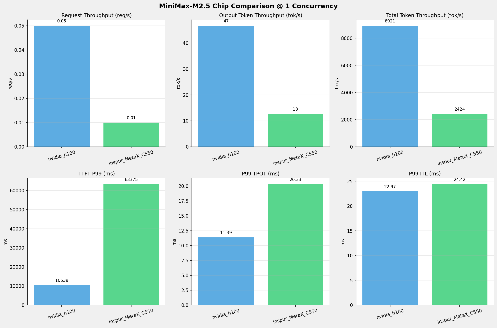
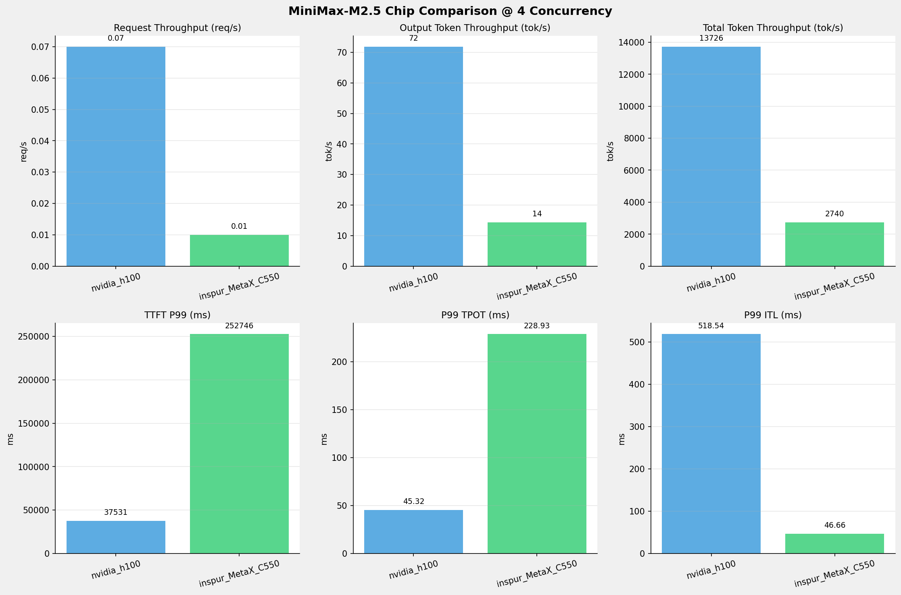
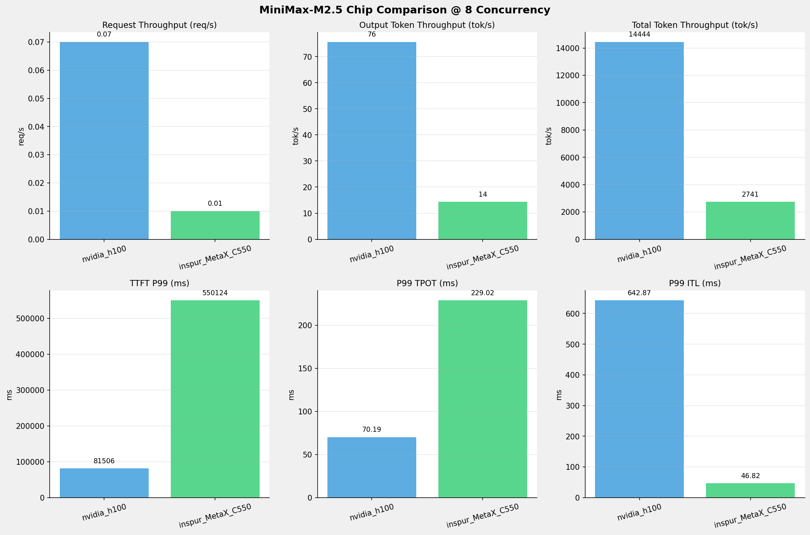
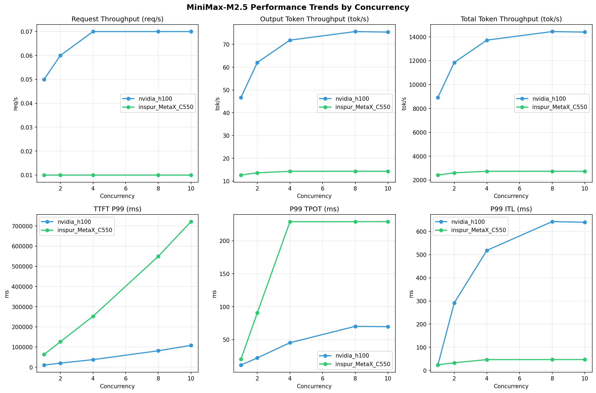

# MiniMax-M2.5模型在不同芯片下的基准测试报告

**测试日期：** 2026-05-19

---

## 测试场景
在固定请求数，输入上下文和输出上下文长度下，使用SGLang基准测试工具对并发数逐级增加场景的性能基准验证。并对比同一模型在不同芯片环境上的性能指标。

**主要采集指标**：

| 指标                  | 单位         | 含义                                 |
|---------------------|------------|------------------------------------|
| TTFT                | ms         | Time To First Token，首 token 延迟     |
| TPOT                | ms/token   | Time Per Output Token，每 token 生成时间 |
| Throughput          | tokens/s   | 系统总吞吐                              |
| QPS                 | requests/s | 请求吞吐                               |

### 📊 测试概览

| 项目            | 配置                                     | 备注  |
|---------------|----------------------------------------|-----|
| **数据集**       | random                                 |     |
| **并发数**       | 1, 2, 4, 8, 10    |     |
| **总请求数**      | 100                                    |     |
| **请求输入上下文长度** | 194560（190k）                             |     |
| **请求输出上下文长度** | 1024（1k）                             |     |
| **被测芯片**      | nvidia_h100, inspur_MetaX_C550 |     |
| **被测模型**      | nvidia_h100 (MiniMax-M2.5), inspur_MetaX_C550 (MiniMax-M2.5-W8A8) |     |

---

### 📊 芯片性能对比柱状图

**1并发**

**2并发**

**4并发**

**8并发**

**10并发**

### 📈 性能趋势对比图 (所有芯片)

---

### 📈 各指标随并发级别性能对比详情

#### 请求吞吐量（Request throughput (req/s)）

| 并发数 | nvidia_h100 | inspur_MetaX_C550 | 差值 | 百分比 |
|-----|----------- | ----------- | ----------- | -----------|
| 1   | **0.05** ⭐ | 0.01 | -0.04 | -80.0% |
| 2   | **0.06** ⭐ | 0.01 | -0.05 | -83.3% |
| 4   | **0.07** ⭐ | 0.01 | -0.06 | -85.7% |
| 8   | **0.07** ⭐ | 0.01 | -0.06 | -85.7% |
| 10   | **0.07** ⭐ | 0.01 | -0.06 | -85.7% |

#### 输入token吞吐量（Input token throughput (tok/s)）

| 并发数 | nvidia_h100 | inspur_MetaX_C550 | 差值 | 百分比 |
|-----|----------- | ----------- | ----------- | -----------|
| 1   | N/A | 2411.45 | N/A | N/A |
| 2   | N/A | 2597.12 | N/A | N/A |
| 4   | N/A | 2725.34 | N/A | N/A |
| 8   | N/A | 2727.02 | N/A | N/A |
| 10   | N/A | 2725.25 | N/A | N/A |

#### 输出token吞吐量（Output token throughput (tok/s)）

| 并发数 | nvidia_h100 | inspur_MetaX_C550 | 差值 | 百分比 |
|-----|----------- | ----------- | ----------- | -----------|
| 1   | **46.70** ⭐ | 12.69 | -34.01 | -72.8% |
| 2   | **62.03** ⭐ | 13.67 | -48.36 | -78.0% |
| 4   | **71.85** ⭐ | 14.34 | -57.51 | -80.0% |
| 8   | **75.61** ⭐ | 14.35 | -61.26 | -81.0% |
| 10   | **75.37** ⭐ | 14.34 | -61.03 | -81.0% |

#### 总token吞吐量（Total token throughput (tok/s)）

| 并发数 | nvidia_h100 | inspur_MetaX_C550 | 差值 | 百分比 |
|-----|----------- | ----------- | ----------- | -----------|
| 1   | **8921.40** ⭐ | 2424.14 | -6497.26 | -72.8% |
| 2   | **11850.06** ⭐ | 2610.79 | -9239.27 | -78.0% |
| 4   | **13726.45** ⭐ | 2739.69 | -10986.76 | -80.0% |
| 8   | **14443.68** ⭐ | 2741.37 | -11702.31 | -81.0% |
| 10   | **14398.41** ⭐ | 2739.59 | -11658.82 | -81.0% |

#### 首token延迟（P99 TTFT (ms)）

| 并发数 | nvidia_h100 | inspur_MetaX_C550 | 差值 | 百分比 |
|-----|----------- | ----------- | ----------- | -----------|
| 1   | 10539.10 | 63374.54 | +52835.44 | +501.3% |
| 2   | 20205.87 | 126438.40 | +106232.53 | +525.8% |
| 4   | 37530.99 | 252746.14 | +215215.15 | +573.4% |
| 8   | 81506.35 | 550123.80 | +468617.45 | +574.9% |
| 10   | 108342.29 | 721962.01 | +613619.72 | +566.4% |

#### 每token生成时间（P99 TPOT (ms)）

| 并发数 | nvidia_h100 | inspur_MetaX_C550 | 差值 | 百分比 |
|-----|----------- | ----------- | ----------- | -----------|
| 1   | 11.39 | 20.33 | +8.94 | +78.5% |
| 2   | 22.27 | 90.66 | +68.39 | +307.1% |
| 4   | 45.32 | 228.93 | +183.61 | +405.1% |
| 8   | 70.19 | 229.02 | +158.83 | +226.3% |
| 10   | 69.61 | 229.15 | +159.54 | +229.2% |

#### token间延迟（P99 ITL (ms)）

| 并发数 | nvidia_h100 | inspur_MetaX_C550 | 差值 | 百分比 |
|-----|----------- | ----------- | ----------- | -----------|
| 1   | 22.97 | 24.42 | +1.45 | +6.3% |
| 2   | 291.30 | 32.89 | -258.41 | -88.7% |
| 4   | 518.54 | 46.66 | -471.88 | -91.0% |
| 8   | 642.87 | 46.82 | -596.05 | -92.7% |
| 10   | 639.97 | 46.84 | -593.13 | -92.7% |

### 📈 各并发级别性能对比详情

#### 1 并发

| 指标 | nvidia_h100 | inspur_MetaX_C550 |
|------|----------- | -----------|
| 请求吞吐量（Request throughput (req/s)） | **0.05** ⭐ | 0.01 |
| 输入token吞吐量（Input token throughput (tok/s)） | N/A | 2411.45 |
| 输出token吞吐量（Output token throughput (tok/s)） | **46.70** ⭐ | 12.69 |
| 总token吞吐量（Total token throughput (tok/s)） | **8921.40** ⭐ | 2424.14 |
| 首token延迟（P99 TTFT (ms)） | **10539.10** ⭐ | 63374.54 |
| 每token生成时间（P99 TPOT (ms)） | **11.39** ⭐ | 20.33 |
| token间延迟（P99 ITL (ms)） | **22.97** ⭐ | 24.42 |

#### 2 并发

| 指标 | nvidia_h100 | inspur_MetaX_C550 |
|------|----------- | -----------|
| 请求吞吐量（Request throughput (req/s)） | **0.06** ⭐ | 0.01 |
| 输入token吞吐量（Input token throughput (tok/s)） | N/A | 2597.12 |
| 输出token吞吐量（Output token throughput (tok/s)） | **62.03** ⭐ | 13.67 |
| 总token吞吐量（Total token throughput (tok/s)） | **11850.06** ⭐ | 2610.79 |
| 首token延迟（P99 TTFT (ms)） | **20205.87** ⭐ | 126438.40 |
| 每token生成时间（P99 TPOT (ms)） | **22.27** ⭐ | 90.66 |
| token间延迟（P99 ITL (ms)） | 291.30 | **32.89** ⭐ |

#### 4 并发

| 指标 | nvidia_h100 | inspur_MetaX_C550 |
|------|----------- | -----------|
| 请求吞吐量（Request throughput (req/s)） | **0.07** ⭐ | 0.01 |
| 输入token吞吐量（Input token throughput (tok/s)） | N/A | 2725.34 |
| 输出token吞吐量（Output token throughput (tok/s)） | **71.85** ⭐ | 14.34 |
| 总token吞吐量（Total token throughput (tok/s)） | **13726.45** ⭐ | 2739.69 |
| 首token延迟（P99 TTFT (ms)） | **37530.99** ⭐ | 252746.14 |
| 每token生成时间（P99 TPOT (ms)） | **45.32** ⭐ | 228.93 |
| token间延迟（P99 ITL (ms)） | 518.54 | **46.66** ⭐ |

#### 8 并发

| 指标 | nvidia_h100 | inspur_MetaX_C550 |
|------|----------- | -----------|
| 请求吞吐量（Request throughput (req/s)） | **0.07** ⭐ | 0.01 |
| 输入token吞吐量（Input token throughput (tok/s)） | N/A | 2727.02 |
| 输出token吞吐量（Output token throughput (tok/s)） | **75.61** ⭐ | 14.35 |
| 总token吞吐量（Total token throughput (tok/s)） | **14443.68** ⭐ | 2741.37 |
| 首token延迟（P99 TTFT (ms)） | **81506.35** ⭐ | 550123.80 |
| 每token生成时间（P99 TPOT (ms)） | **70.19** ⭐ | 229.02 |
| token间延迟（P99 ITL (ms)） | 642.87 | **46.82** ⭐ |

#### 10 并发

| 指标 | nvidia_h100 | inspur_MetaX_C550 |
|------|----------- | -----------|
| 请求吞吐量（Request throughput (req/s)） | **0.07** ⭐ | 0.01 |
| 输入token吞吐量（Input token throughput (tok/s)） | N/A | 2725.25 |
| 输出token吞吐量（Output token throughput (tok/s)） | **75.37** ⭐ | 14.34 |
| 总token吞吐量（Total token throughput (tok/s)） | **14398.41** ⭐ | 2739.59 |
| 首token延迟（P99 TTFT (ms)） | **108342.29** ⭐ | 721962.01 |
| 每token生成时间（P99 TPOT (ms)） | **69.61** ⭐ | 229.15 |
| token间延迟（P99 ITL (ms)） | 639.97 | **46.84** ⭐ |

---

*报告生成时间: 2026-05-19*

