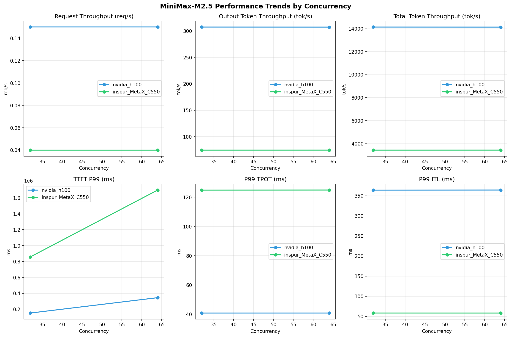

# MiniMax-M2.5模型在不同芯片下的基准测试报告

**测试日期：** 2026-05-13

---

## 测试场景
在固定请求数，输入上下文和输出上下文长度下，使用SGLang基准测试工具对并发数逐级增加场景的性能基准验证。并对比同一模型在不同芯片环境上的性能指标。

**主要采集指标**：

| 指标                  | 单位         | 含义                                 |
|---------------------|------------|------------------------------------|
| TTFT                | ms         | Time To First Token，首 token 延迟     |
| TPOT                | ms/token   | Time Per Output Token，每 token 生成时间 |
| Throughput          | tokens/s   | 系统总吞吐                              |
| QPS                 | requests/s | 请求吞吐                               |

### 📊 测试概览

| 项目            | 配置                                     | 备注  |
|---------------|----------------------------------------|-----|
| **数据集**       | random                                 |     |
| **并发数**       | 32, 64    |     |
| **总请求数**      | 1000                                    |     |
| **请求输入上下文长度** | 90000（87k）                             |     |
| **请求输出上下文长度** | 2000（1k）                             |     |
| **被测芯片**      | nvidia_h100, inspur_MetaX_C550 |     |
| **被测模型**      | nvidia_h100 (MiniMax-M2.5), inspur_MetaX_C550 (MiniMax-M2.5-W8A8) |     |

---

### 📊 芯片性能对比柱状图

**32并发**

**64并发**

### 📈 性能趋势对比图 (所有芯片)

---

### 📈 各指标随并发级别性能对比详情

#### 请求吞吐量（Request throughput (req/s)）

| 并发数 | nvidia_h100 | inspur_MetaX_C550 | 差值 | 百分比 |
|-----|----------- | ----------- | ----------- | -----------|
| 32   | **0.15** ⭐ | 0.04 | -0.11 | -73.3% |
| 64   | **0.15** ⭐ | 0.04 | -0.11 | -73.3% |

#### 输出token吞吐量（Output token throughput (tok/s)）

| 并发数 | nvidia_h100 | inspur_MetaX_C550 | 差值 | 百分比 |
|-----|----------- | ----------- | ----------- | -----------|
| 32   | **307.27** ⭐ | 74.75 | -232.52 | -75.7% |
| 64   | **307.19** ⭐ | 74.77 | -232.42 | -75.7% |

#### 总token吞吐量（Total token throughput (tok/s)）

| 并发数 | nvidia_h100 | inspur_MetaX_C550 | 差值 | 百分比 |
|-----|----------- | ----------- | ----------- | -----------|
| 32   | **14140.63** ⭐ | 3438.38 | -10702.25 | -75.7% |
| 64   | **14136.71** ⭐ | 3439.56 | -10697.15 | -75.7% |

#### 首token延迟（P99 TTFT (ms)）

| 并发数 | nvidia_h100 | inspur_MetaX_C550 | 差值 | 百分比 |
|-----|----------- | ----------- | ----------- | -----------|
| 32   | 151671.11 | 857488.09 | +705816.98 | +465.4% |
| 64   | 345223.92 | 1699446.48 | +1354222.56 | +392.3% |

#### 每token生成时间（P99 TPOT (ms)）

| 并发数 | nvidia_h100 | inspur_MetaX_C550 | 差值 | 百分比 |
|-----|----------- | ----------- | ----------- | -----------|
| 32   | 40.78 | 124.93 | +84.15 | +206.4% |
| 64   | 40.79 | 124.97 | +84.18 | +206.4% |

#### token间延迟（P99 ITL (ms)）

| 并发数 | nvidia_h100 | inspur_MetaX_C550 | 差值 | 百分比 |
|-----|----------- | ----------- | ----------- | -----------|
| 32   | 363.93 | 58.30 | -305.63 | -84.0% |
| 64   | 364.12 | 58.25 | -305.87 | -84.0% |

### 📈 各并发级别性能对比详情

#### 32 并发

| 指标 | nvidia_h100 | inspur_MetaX_C550 |
|------|----------- | -----------|
| 请求吞吐量（Request throughput (req/s)） | **0.15** ⭐ | 0.04 |
| 输出token吞吐量（Output token throughput (tok/s)） | **307.27** ⭐ | 74.75 |
| 总token吞吐量（Total token throughput (tok/s)） | **14140.63** ⭐ | 3438.38 |
| 首token延迟（P99 TTFT (ms)） | **151671.11** ⭐ | 857488.09 |
| 每token生成时间（P99 TPOT (ms)） | **40.78** ⭐ | 124.93 |
| token间延迟（P99 ITL (ms)） | 363.93 | **58.30** ⭐ |

#### 64 并发

| 指标 | nvidia_h100 | inspur_MetaX_C550 |
|------|----------- | -----------|
| 请求吞吐量（Request throughput (req/s)） | **0.15** ⭐ | 0.04 |
| 输出token吞吐量（Output token throughput (tok/s)） | **307.19** ⭐ | 74.77 |
| 总token吞吐量（Total token throughput (tok/s)） | **14136.71** ⭐ | 3439.56 |
| 首token延迟（P99 TTFT (ms)） | **345223.92** ⭐ | 1699446.48 |
| 每token生成时间（P99 TPOT (ms)） | **40.79** ⭐ | 124.97 |
| token间延迟（P99 ITL (ms)） | 364.12 | **58.25** ⭐ |

---

*报告生成时间: 2026-05-13*

