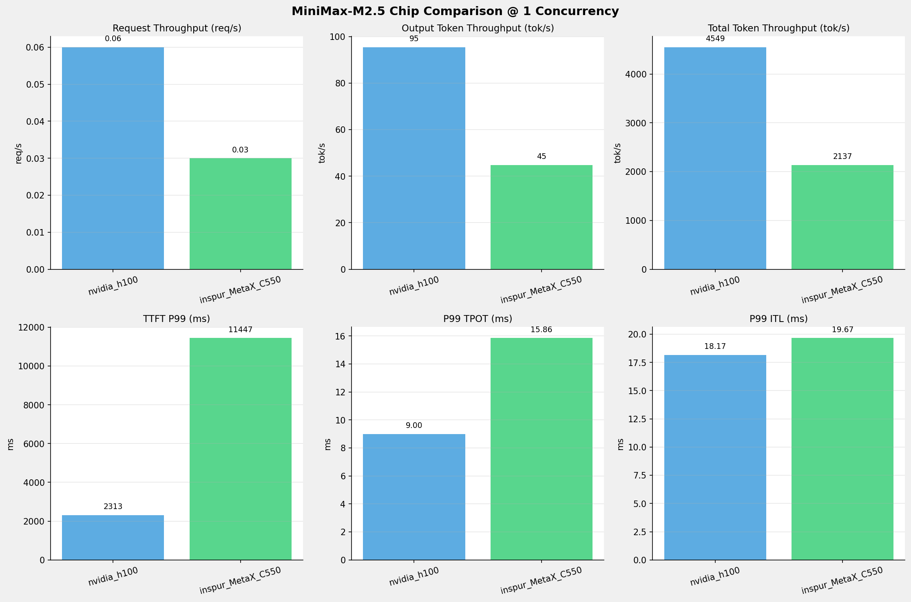
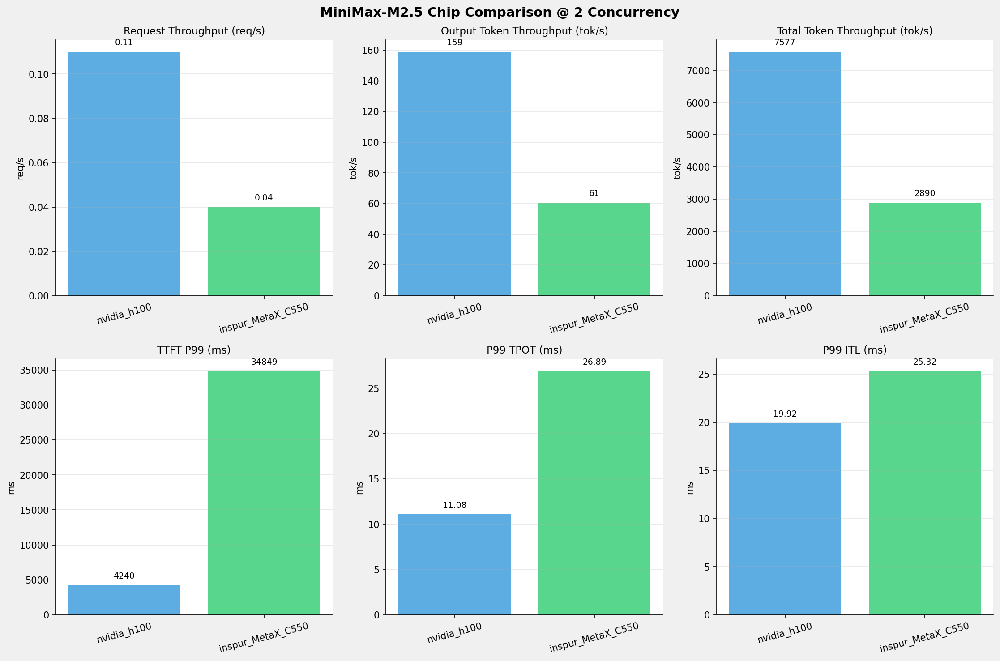
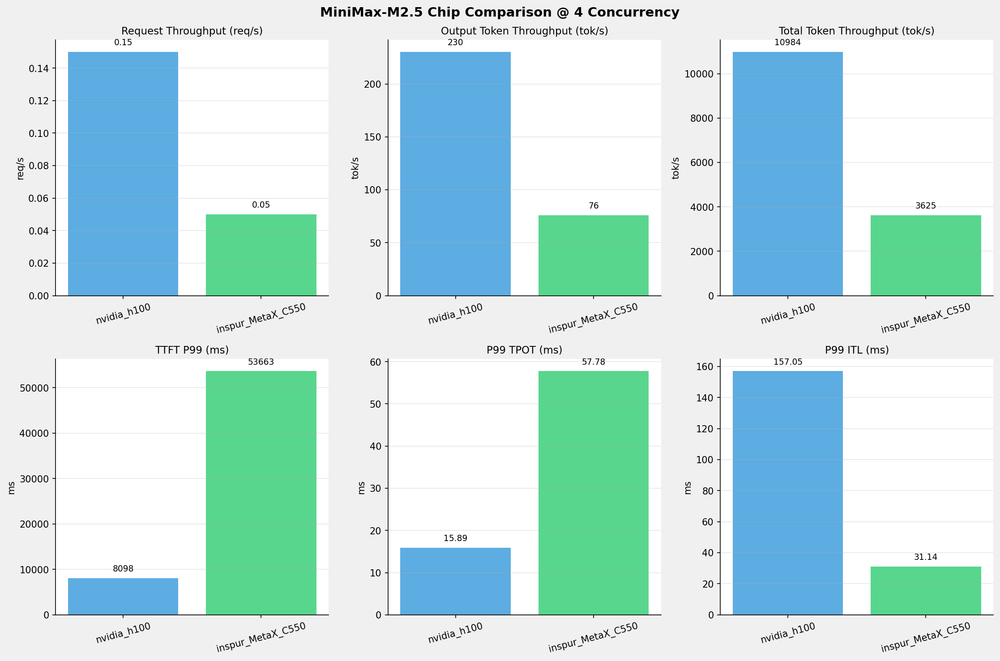
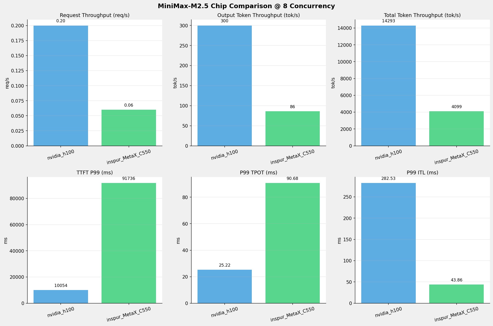
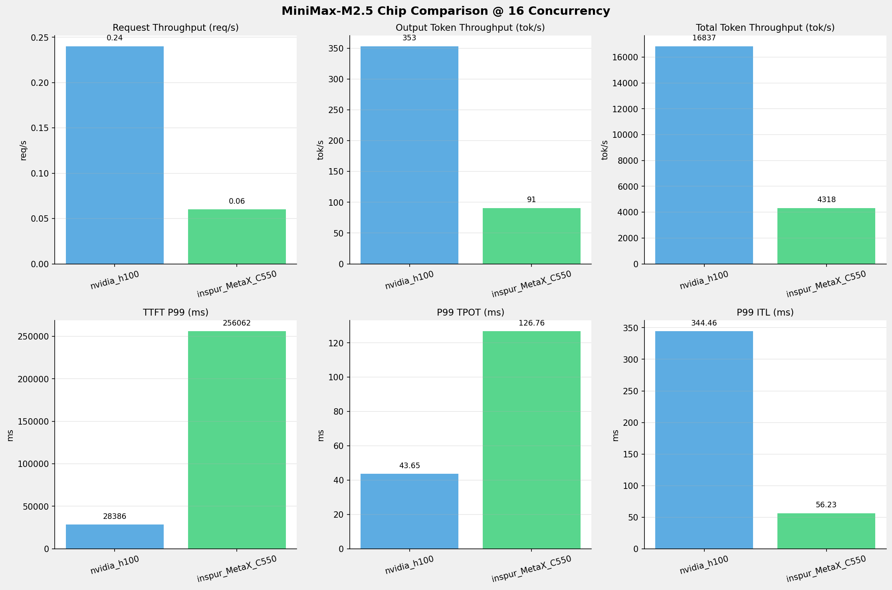
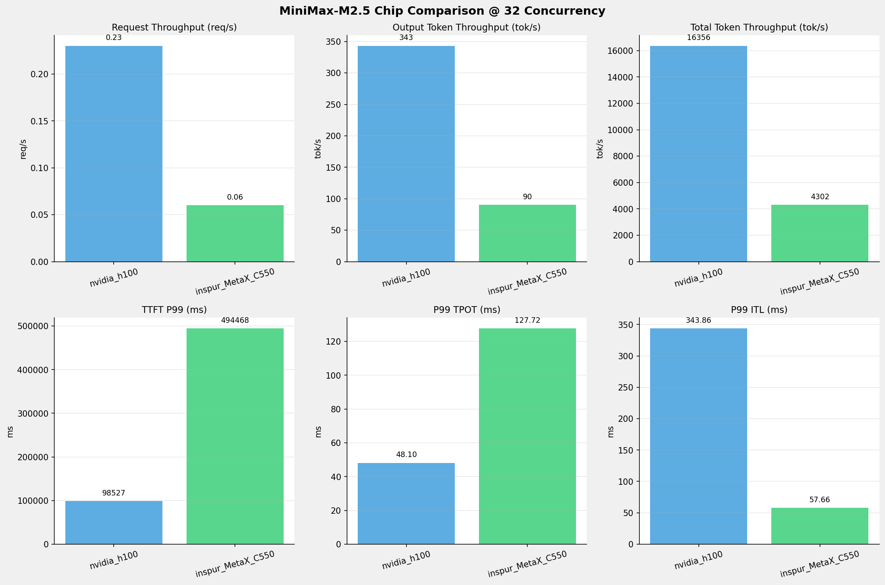
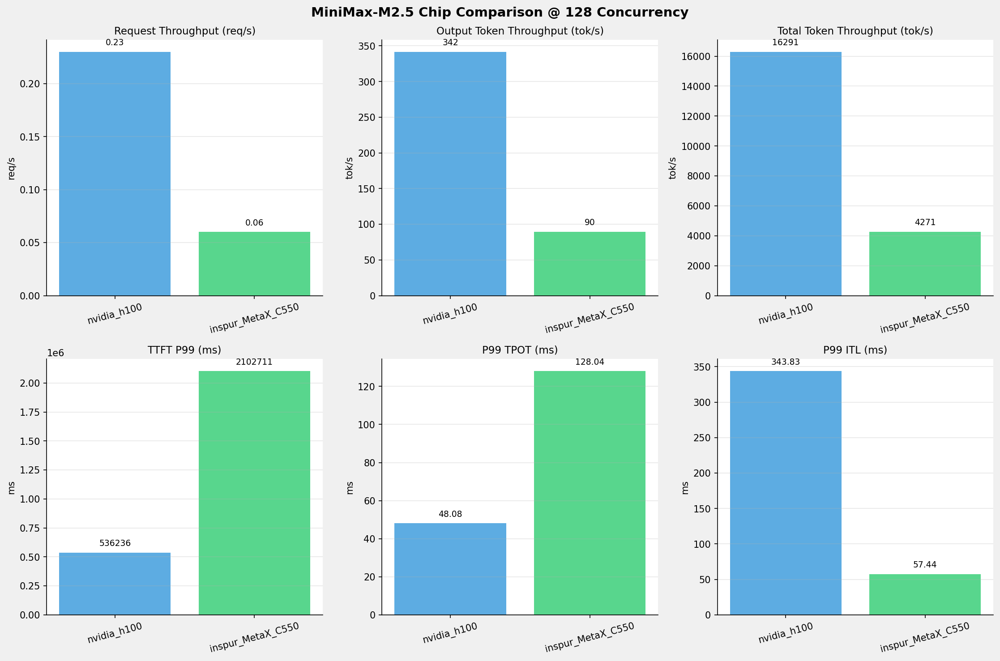
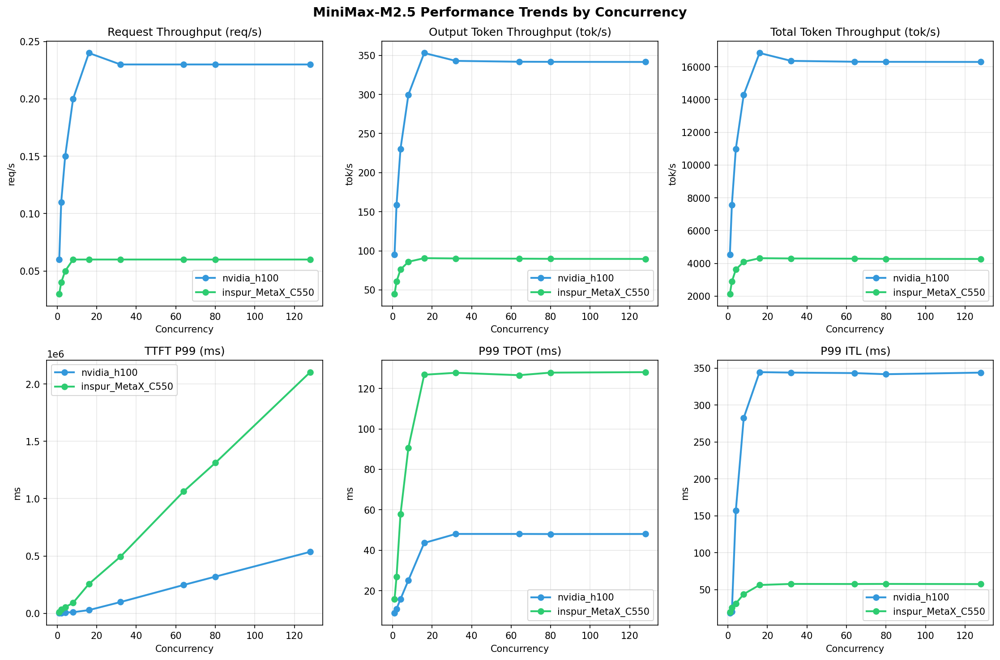

# MiniMax-M2.5模型在不同芯片下的基准测试报告

**测试日期：** 2026-05-14

---

## 测试场景
在固定请求数，输入上下文和输出上下文长度下，使用SGLang基准测试工具对并发数逐级增加场景的性能基准验证。并对比同一模型在不同芯片环境上的性能指标。

**主要采集指标**：

| 指标                  | 单位         | 含义                                 |
|---------------------|------------|------------------------------------|
| TTFT                | ms         | Time To First Token，首 token 延迟     |
| TPOT                | ms/token   | Time Per Output Token，每 token 生成时间 |
| Throughput          | tokens/s   | 系统总吞吐                              |
| QPS                 | requests/s | 请求吞吐                               |

### 📊 测试概览

| 项目            | 配置                                     | 备注  |
|---------------|----------------------------------------|-----|
| **数据集**       | random                                 |     |
| **并发数**       | 1, 2, 4, 8, 16, 32, 64, 80, 128    |     |
| **总请求数**      | 300                                    |     |
| **请求输入上下文长度** | 70000（68k）                             |     |
| **请求输出上下文长度** | 1500（1k）                             |     |
| **被测芯片**      | nvidia_h100, inspur_MetaX_C550 |     |
| **被测模型**      | nvidia_h100 (MiniMax-M2.5), inspur_MetaX_C550 (MiniMax-M2.5-W8A8) |     |

---

### 📊 芯片性能对比柱状图

**1并发**

**2并发**

**4并发**

**8并发**

**16并发**

**32并发**

**64并发**

**80并发**

**128并发**

### 📈 性能趋势对比图 (所有芯片)

---

### 📈 各指标随并发级别性能对比详情

#### 请求吞吐量（Request throughput (req/s)）

| 并发数 | nvidia_h100 | inspur_MetaX_C550 | 差值 | 百分比 |
|-----|----------- | ----------- | ----------- | -----------|
| 1   | **0.06** ⭐ | 0.03 | -0.03 | -50.0% |
| 2   | **0.11** ⭐ | 0.04 | -0.07 | -63.6% |
| 4   | **0.15** ⭐ | 0.05 | -0.10 | -66.7% |
| 8   | **0.20** ⭐ | 0.06 | -0.14 | -70.0% |
| 16   | **0.24** ⭐ | 0.06 | -0.18 | -75.0% |
| 32   | **0.23** ⭐ | 0.06 | -0.17 | -73.9% |
| 64   | **0.23** ⭐ | 0.06 | -0.17 | -73.9% |
| 80   | **0.23** ⭐ | 0.06 | -0.17 | -73.9% |
| 128   | **0.23** ⭐ | 0.06 | -0.17 | -73.9% |

#### 输出token吞吐量（Output token throughput (tok/s)）

| 并发数 | nvidia_h100 | inspur_MetaX_C550 | 差值 | 百分比 |
|-----|----------- | ----------- | ----------- | -----------|
| 1   | **95.39** ⭐ | 44.83 | -50.56 | -53.0% |
| 2   | **158.87** ⭐ | 60.64 | -98.23 | -61.8% |
| 4   | **230.31** ⭐ | 76.05 | -154.26 | -67.0% |
| 8   | **299.68** ⭐ | 85.98 | -213.70 | -71.3% |
| 16   | **353.03** ⭐ | 90.59 | -262.44 | -74.3% |
| 32   | **342.94** ⭐ | 90.24 | -252.70 | -73.7% |
| 64   | **341.85** ⭐ | 89.97 | -251.88 | -73.7% |
| 80   | **341.72** ⭐ | 89.73 | -251.99 | -73.7% |
| 128   | **341.57** ⭐ | 89.60 | -251.97 | -73.8% |

#### 总token吞吐量（Total token throughput (tok/s)）

| 并发数 | nvidia_h100 | inspur_MetaX_C550 | 差值 | 百分比 |
|-----|----------- | ----------- | ----------- | -----------|
| 1   | **4549.40** ⭐ | 2137.13 | -2412.27 | -53.0% |
| 2   | **7577.10** ⭐ | 2890.50 | -4686.60 | -61.9% |
| 4   | **10984.25** ⭐ | 3625.24 | -7359.01 | -67.0% |
| 8   | **14292.56** ⭐ | 4098.56 | -10194.00 | -71.3% |
| 16   | **16836.89** ⭐ | 4318.09 | -12518.80 | -74.4% |
| 32   | **16355.82** ⭐ | 4301.58 | -12054.24 | -73.7% |
| 64   | **16303.60** ⭐ | 4288.52 | -12015.08 | -73.7% |
| 80   | **16297.33** ⭐ | 4277.11 | -12020.22 | -73.8% |
| 128   | **16290.56** ⭐ | 4270.93 | -12019.63 | -73.8% |

#### 首token延迟（P99 TTFT (ms)）

| 并发数 | nvidia_h100 | inspur_MetaX_C550 | 差值 | 百分比 |
|-----|----------- | ----------- | ----------- | -----------|
| 1   | 2312.95 | 11447.33 | +9134.38 | +394.9% |
| 2   | 4240.42 | 34848.72 | +30608.30 | +721.8% |
| 4   | 8098.15 | 53663.29 | +45565.14 | +562.7% |
| 8   | 10054.11 | 91735.80 | +81681.69 | +812.4% |
| 16   | 28385.80 | 256062.39 | +227676.59 | +802.1% |
| 32   | 98526.87 | 494467.75 | +395940.88 | +401.9% |
| 64   | 247650.08 | 1063399.69 | +815749.61 | +329.4% |
| 80   | 320130.95 | 1311772.38 | +991641.43 | +309.8% |
| 128   | 536235.57 | 2102711.33 | +1566475.76 | +292.1% |

#### 每token生成时间（P99 TPOT (ms)）

| 并发数 | nvidia_h100 | inspur_MetaX_C550 | 差值 | 百分比 |
|-----|----------- | ----------- | ----------- | -----------|
| 1   | 9.00 | 15.86 | +6.86 | +76.2% |
| 2   | 11.08 | 26.89 | +15.81 | +142.7% |
| 4   | 15.89 | 57.78 | +41.89 | +263.6% |
| 8   | 25.22 | 90.68 | +65.46 | +259.6% |
| 16   | 43.65 | 126.76 | +83.11 | +190.4% |
| 32   | 48.10 | 127.72 | +79.62 | +165.5% |
| 64   | 48.10 | 126.53 | +78.43 | +163.1% |
| 80   | 48.05 | 127.80 | +79.75 | +166.0% |
| 128   | 48.08 | 128.04 | +79.96 | +166.3% |

#### token间延迟（P99 ITL (ms)）

| 并发数 | nvidia_h100 | inspur_MetaX_C550 | 差值 | 百分比 |
|-----|----------- | ----------- | ----------- | -----------|
| 1   | 18.17 | 19.67 | +1.50 | +8.3% |
| 2   | 19.92 | 25.32 | +5.40 | +27.1% |
| 4   | 157.05 | 31.14 | -125.91 | -80.2% |
| 8   | 282.53 | 43.86 | -238.67 | -84.5% |
| 16   | 344.46 | 56.23 | -288.23 | -83.7% |
| 32   | 343.86 | 57.66 | -286.20 | -83.2% |
| 64   | 343.18 | 57.55 | -285.63 | -83.2% |
| 80   | 341.65 | 57.68 | -283.97 | -83.1% |
| 128   | 343.83 | 57.44 | -286.39 | -83.3% |

### 📈 各并发级别性能对比详情

#### 1 并发

| 指标 | nvidia_h100 | inspur_MetaX_C550 |
|------|----------- | -----------|
| 请求吞吐量（Request throughput (req/s)） | **0.06** ⭐ | 0.03 |
| 输出token吞吐量（Output token throughput (tok/s)） | **95.39** ⭐ | 44.83 |
| 总token吞吐量（Total token throughput (tok/s)） | **4549.40** ⭐ | 2137.13 |
| 首token延迟（P99 TTFT (ms)） | **2312.95** ⭐ | 11447.33 |
| 每token生成时间（P99 TPOT (ms)） | **9.00** ⭐ | 15.86 |
| token间延迟（P99 ITL (ms)） | **18.17** ⭐ | 19.67 |

#### 2 并发

| 指标 | nvidia_h100 | inspur_MetaX_C550 |
|------|----------- | -----------|
| 请求吞吐量（Request throughput (req/s)） | **0.11** ⭐ | 0.04 |
| 输出token吞吐量（Output token throughput (tok/s)） | **158.87** ⭐ | 60.64 |
| 总token吞吐量（Total token throughput (tok/s)） | **7577.10** ⭐ | 2890.50 |
| 首token延迟（P99 TTFT (ms)） | **4240.42** ⭐ | 34848.72 |
| 每token生成时间（P99 TPOT (ms)） | **11.08** ⭐ | 26.89 |
| token间延迟（P99 ITL (ms)） | **19.92** ⭐ | 25.32 |

#### 4 并发

| 指标 | nvidia_h100 | inspur_MetaX_C550 |
|------|----------- | -----------|
| 请求吞吐量（Request throughput (req/s)） | **0.15** ⭐ | 0.05 |
| 输出token吞吐量（Output token throughput (tok/s)） | **230.31** ⭐ | 76.05 |
| 总token吞吐量（Total token throughput (tok/s)） | **10984.25** ⭐ | 3625.24 |
| 首token延迟（P99 TTFT (ms)） | **8098.15** ⭐ | 53663.29 |
| 每token生成时间（P99 TPOT (ms)） | **15.89** ⭐ | 57.78 |
| token间延迟（P99 ITL (ms)） | 157.05 | **31.14** ⭐ |

#### 8 并发

| 指标 | nvidia_h100 | inspur_MetaX_C550 |
|------|----------- | -----------|
| 请求吞吐量（Request throughput (req/s)） | **0.20** ⭐ | 0.06 |
| 输出token吞吐量（Output token throughput (tok/s)） | **299.68** ⭐ | 85.98 |
| 总token吞吐量（Total token throughput (tok/s)） | **14292.56** ⭐ | 4098.56 |
| 首token延迟（P99 TTFT (ms)） | **10054.11** ⭐ | 91735.80 |
| 每token生成时间（P99 TPOT (ms)） | **25.22** ⭐ | 90.68 |
| token间延迟（P99 ITL (ms)） | 282.53 | **43.86** ⭐ |

#### 16 并发

| 指标 | nvidia_h100 | inspur_MetaX_C550 |
|------|----------- | -----------|
| 请求吞吐量（Request throughput (req/s)） | **0.24** ⭐ | 0.06 |
| 输出token吞吐量（Output token throughput (tok/s)） | **353.03** ⭐ | 90.59 |
| 总token吞吐量（Total token throughput (tok/s)） | **16836.89** ⭐ | 4318.09 |
| 首token延迟（P99 TTFT (ms)） | **28385.80** ⭐ | 256062.39 |
| 每token生成时间（P99 TPOT (ms)） | **43.65** ⭐ | 126.76 |
| token间延迟（P99 ITL (ms)） | 344.46 | **56.23** ⭐ |

#### 32 并发

| 指标 | nvidia_h100 | inspur_MetaX_C550 |
|------|----------- | -----------|
| 请求吞吐量（Request throughput (req/s)） | **0.23** ⭐ | 0.06 |
| 输出token吞吐量（Output token throughput (tok/s)） | **342.94** ⭐ | 90.24 |
| 总token吞吐量（Total token throughput (tok/s)） | **16355.82** ⭐ | 4301.58 |
| 首token延迟（P99 TTFT (ms)） | **98526.87** ⭐ | 494467.75 |
| 每token生成时间（P99 TPOT (ms)） | **48.10** ⭐ | 127.72 |
| token间延迟（P99 ITL (ms)） | 343.86 | **57.66** ⭐ |

#### 64 并发

| 指标 | nvidia_h100 | inspur_MetaX_C550 |
|------|----------- | -----------|
| 请求吞吐量（Request throughput (req/s)） | **0.23** ⭐ | 0.06 |
| 输出token吞吐量（Output token throughput (tok/s)） | **341.85** ⭐ | 89.97 |
| 总token吞吐量（Total token throughput (tok/s)） | **16303.60** ⭐ | 4288.52 |
| 首token延迟（P99 TTFT (ms)） | **247650.08** ⭐ | 1063399.69 |
| 每token生成时间（P99 TPOT (ms)） | **48.10** ⭐ | 126.53 |
| token间延迟（P99 ITL (ms)） | 343.18 | **57.55** ⭐ |

#### 80 并发

| 指标 | nvidia_h100 | inspur_MetaX_C550 |
|------|----------- | -----------|
| 请求吞吐量（Request throughput (req/s)） | **0.23** ⭐ | 0.06 |
| 输出token吞吐量（Output token throughput (tok/s)） | **341.72** ⭐ | 89.73 |
| 总token吞吐量（Total token throughput (tok/s)） | **16297.33** ⭐ | 4277.11 |
| 首token延迟（P99 TTFT (ms)） | **320130.95** ⭐ | 1311772.38 |
| 每token生成时间（P99 TPOT (ms)） | **48.05** ⭐ | 127.80 |
| token间延迟（P99 ITL (ms)） | 341.65 | **57.68** ⭐ |

#### 128 并发

| 指标 | nvidia_h100 | inspur_MetaX_C550 |
|------|----------- | -----------|
| 请求吞吐量（Request throughput (req/s)） | **0.23** ⭐ | 0.06 |
| 输出token吞吐量（Output token throughput (tok/s)） | **341.57** ⭐ | 89.60 |
| 总token吞吐量（Total token throughput (tok/s)） | **16290.56** ⭐ | 4270.93 |
| 首token延迟（P99 TTFT (ms)） | **536235.57** ⭐ | 2102711.33 |
| 每token生成时间（P99 TPOT (ms)） | **48.08** ⭐ | 128.04 |
| token间延迟（P99 ITL (ms)） | 343.83 | **57.44** ⭐ |

---

*报告生成时间: 2026-05-14*

