# MiniMax-M2.5模型在不同芯片下的多I/O测试比对报告

**测试日期：** 2026-05-14

---

## 测试场景
测试不同输入输出长度和并发级别下的性能表现。

| 项目 | 配置 |
|------|------|
| **数据集** | random |
| **并发数** | 1, 4, 8, 16, 32, 64, 128 |
| **总请求数** | 1000 |
| **输入输出长度** | (128, 128), (512, 256), (1024, 512), (2048, 1024), (4096, 2048), (8192, 1024) |
| **被测芯片** | inspur_MetaX_C550, nvidia_h100 |
| **被测模型** | inspur_MetaX_C550 (MiniMax-M2.5-W8A8), nvidia_h100 (MiniMax-M2.5) |

---

## 📋 各I/O测试汇总（固定上下文长度，随并发变化）

### input: 128, output: 128

**inspur_MetaX_C550**

| 并发数 | 请求吞吐量（Request throughput (req/s)） | 输出token吞吐量（Output token throughput (tok/s)） | 总token吞吐量（Total token throughput (tok/s)） | 首token延迟（P99 TTFT (ms)） | 每token生成时间（P99 TPOT (ms)） | token间延迟（P99 ITL (ms)） |
|--------------- | --------------- | --------------- | --------------- | --------------- | --------------- | ---------------|
| 1 | 0.60 | 77.40 | 154.81 | 153.05 | 11.97 | 15.08 |
| 4 | 1.90 | 242.97 | 485.94 | 155.80 | 15.55 | 21.82 |
| 8 | 3.04 | 389.71 | 779.42 | 254.37 | 20.46 | 26.82 |
| 16 | 5.32 | 680.39 | 1360.78 | 579.39 | 23.01 | 28.35 |
| 32 | 8.73 | 1116.94 | 2233.88 | 575.15 | 27.81 | 31.51 |
| 64 | 14.12 | 1807.14 | 3614.28 | 699.95 | 33.33 | 43.92 |
| 128 | 14.73 | 1885.90 | 3771.79 | 4774.73 | 30.95 | 35.96 |

**nvidia_h100**

| 并发数 | 请求吞吐量（Request throughput (req/s)） | 输出token吞吐量（Output token throughput (tok/s)） | 总token吞吐量（Total token throughput (tok/s)） | 首token延迟（P99 TTFT (ms)） | 每token生成时间（P99 TPOT (ms)） | token间延迟（P99 ITL (ms)） |
|--------------- | --------------- | --------------- | --------------- | --------------- | --------------- | ---------------|
| 1 | 1.03 | 132.10 | 304.45 | 29.15 | 7.43 | 7.81 |
| 4 | 3.34 | 427.14 | 984.42 | 105.78 | 9.31 | 9.81 |
| 8 | 6.02 | 770.36 | 1775.45 | 153.33 | 10.22 | 10.83 |
| 16 | 10.09 | 1291.07 | 2975.50 | 116.92 | 12.53 | 19.61 |
| 32 | 17.11 | 2190.57 | 5048.59 | 256.75 | 14.25 | 19.96 |
| 64 | 27.90 | 3571.65 | 8231.54 | 354.30 | 17.66 | 23.73 |
| 128 | 28.81 | 3687.40 | 8498.30 | 2585.21 | 16.86 | 21.18 |

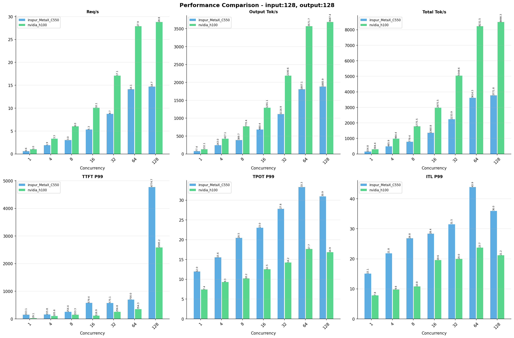

---

### input: 512, output: 256

**inspur_MetaX_C550**

| 并发数 | 请求吞吐量（Request throughput (req/s)） | 输出token吞吐量（Output token throughput (tok/s)） | 总token吞吐量（Total token throughput (tok/s)） | 首token延迟（P99 TTFT (ms)） | 每token生成时间（P99 TPOT (ms)） | token间延迟（P99 ITL (ms)） |
|--------------- | --------------- | --------------- | --------------- | --------------- | --------------- | ---------------|
| 1 | 0.31 | 80.35 | 241.04 | 156.87 | 11.99 | 15.35 |
| 4 | 0.96 | 246.10 | 738.30 | 249.24 | 16.06 | 23.55 |
| 8 | 1.55 | 397.98 | 1193.94 | 291.68 | 19.51 | 26.40 |
| 16 | 2.72 | 697.34 | 2092.01 | 417.62 | 22.05 | 28.20 |
| 32 | 4.35 | 1112.46 | 3337.39 | 889.77 | 28.15 | 31.62 |
| 64 | 6.82 | 1744.79 | 5234.37 | 1507.81 | 35.07 | 36.08 |
| 128 | 6.86 | 1756.27 | 5268.82 | 10546.24 | 34.72 | 36.14 |

**nvidia_h100**

| 并发数 | 请求吞吐量（Request throughput (req/s)） | 输出token吞吐量（Output token throughput (tok/s)） | 总token吞吐量（Total token throughput (tok/s)） | 首token延迟（P99 TTFT (ms)） | 每token生成时间（P99 TPOT (ms)） | token间延迟（P99 ITL (ms)） |
|--------------- | --------------- | --------------- | --------------- | --------------- | --------------- | ---------------|
| 1 | 0.50 | 129.25 | 407.43 | 101.94 | 7.45 | 7.97 |
| 4 | 1.67 | 426.71 | 1345.13 | 170.36 | 9.29 | 9.95 |
| 8 | 3.06 | 782.80 | 2467.65 | 165.00 | 9.98 | 10.91 |
| 16 | 5.17 | 1322.61 | 4169.31 | 199.16 | 11.85 | 13.06 |
| 32 | 8.41 | 2153.58 | 6788.82 | 357.62 | 14.49 | 27.58 |
| 64 | 13.68 | 3502.52 | 11041.15 | 531.95 | 17.74 | 57.55 |
| 128 | 13.68 | 3502.84 | 11042.17 | 5255.30 | 17.79 | 60.71 |

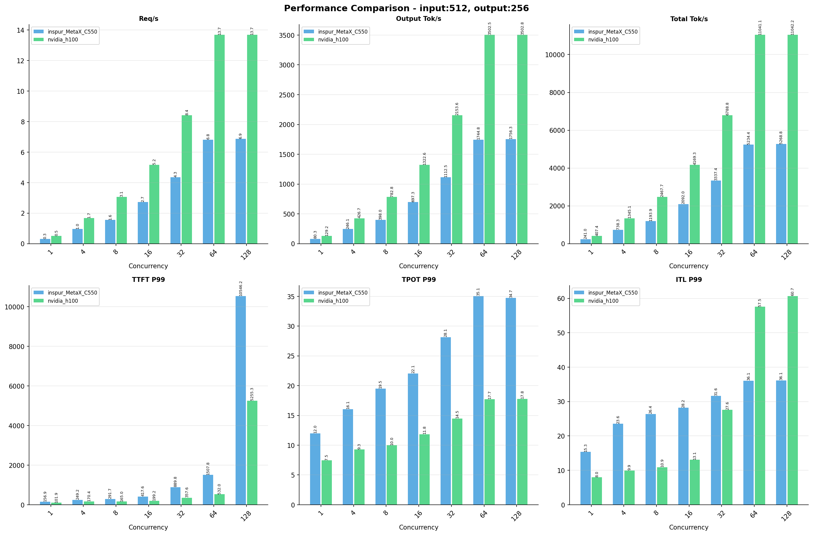

---

### input: 1024, output: 512

**inspur_MetaX_C550**

| 并发数 | 请求吞吐量（Request throughput (req/s)） | 输出token吞吐量（Output token throughput (tok/s)） | 总token吞吐量（Total token throughput (tok/s)） | 首token延迟（P99 TTFT (ms)） | 每token生成时间（P99 TPOT (ms)） | token间延迟（P99 ITL (ms)） |
|--------------- | --------------- | --------------- | --------------- | --------------- | --------------- | ---------------|
| 1 | 0.16 | 81.65 | 244.96 | 158.39 | 12.03 | 17.67 |
| 4 | 0.49 | 250.36 | 751.07 | 301.36 | 15.64 | 21.83 |
| 8 | 0.78 | 399.06 | 1197.18 | 390.54 | 19.66 | 27.69 |
| 16 | 1.34 | 685.28 | 2055.85 | 842.72 | 23.08 | 29.02 |
| 32 | 2.14 | 1093.45 | 3280.35 | 1436.18 | 28.61 | 32.11 |
| 64 | 3.30 | 1688.26 | 5064.77 | 2586.51 | 36.85 | 37.13 |
| 128 | 3.31 | 1695.32 | 5085.96 | 21520.32 | 36.64 | 37.19 |

**nvidia_h100**

| 并发数 | 请求吞吐量（Request throughput (req/s)） | 输出token吞吐量（Output token throughput (tok/s)） | 总token吞吐量（Total token throughput (tok/s)） | 首token延迟（P99 TTFT (ms)） | 每token生成时间（P99 TPOT (ms)） | token间延迟（P99 ITL (ms)） |
|--------------- | --------------- | --------------- | --------------- | --------------- | --------------- | ---------------|
| 1 | 0.26 | 131.35 | 404.06 | 105.19 | 7.47 | 15.01 |
| 4 | 0.86 | 439.84 | 1353.02 | 177.82 | 8.99 | 17.86 |
| 8 | 1.55 | 792.15 | 2436.78 | 208.22 | 10.11 | 19.82 |
| 16 | 2.62 | 1339.60 | 4120.83 | 337.29 | 11.90 | 23.16 |
| 32 | 4.22 | 2161.89 | 6650.35 | 483.29 | 14.73 | 29.45 |
| 64 | 6.70 | 3430.95 | 10554.20 | 779.16 | 18.78 | 71.82 |
| 128 | 6.78 | 3469.97 | 10674.24 | 10222.45 | 18.59 | 56.76 |

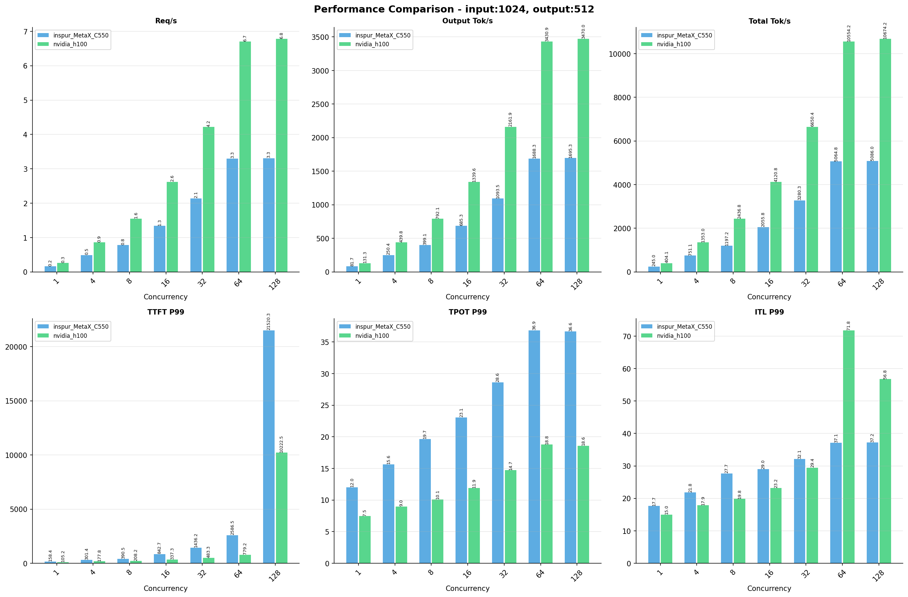

---

### input: 2048, output: 1024

**inspur_MetaX_C550**

| 并发数 | 请求吞吐量（Request throughput (req/s)） | 输出token吞吐量（Output token throughput (tok/s)） | 总token吞吐量（Total token throughput (tok/s)） | 首token延迟（P99 TTFT (ms)） | 每token生成时间（P99 TPOT (ms)） | token间延迟（P99 ITL (ms)） |
|--------------- | --------------- | --------------- | --------------- | --------------- | --------------- | ---------------|
| 1 | 0.08 | 82.15 | 246.46 | 159.25 | 12.08 | 16.73 |
| 4 | 0.24 | 250.25 | 750.74 | 427.62 | 15.83 | 21.32 |
| 8 | 0.38 | 391.51 | 1174.52 | 738.03 | 20.36 | 27.78 |
| 16 | 0.65 | 663.16 | 1989.48 | 1468.34 | 23.96 | 29.45 |
| 32 | 1.02 | 1040.81 | 3122.42 | 2667.43 | 30.20 | 33.35 |
| 64 | 1.52 | 1558.99 | 4676.97 | 5071.27 | 40.22 | 39.86 |
| 128 | 1.52 | 1561.07 | 4683.20 | 46445.07 | 40.18 | 40.13 |

**nvidia_h100**

| 并发数 | 请求吞吐量（Request throughput (req/s)） | 输出token吞吐量（Output token throughput (tok/s)） | 总token吞吐量（Total token throughput (tok/s)） | 首token延迟（P99 TTFT (ms)） | 每token生成时间（P99 TPOT (ms)） | token间延迟（P99 ITL (ms)） |
|--------------- | --------------- | --------------- | --------------- | --------------- | --------------- | ---------------|
| 1 | 0.13 | 132.15 | 401.49 | 111.86 | 7.49 | 15.14 |
| 4 | 0.43 | 444.20 | 1349.53 | 225.74 | 9.05 | 18.00 |
| 8 | 0.78 | 796.35 | 2419.37 | 361.65 | 10.13 | 20.01 |
| 16 | 1.31 | 1338.77 | 4067.31 | 579.97 | 12.00 | 23.49 |
| 32 | 2.06 | 2108.53 | 6405.90 | 1137.22 | 15.01 | 29.04 |
| 64 | 3.18 | 3257.09 | 9895.33 | 2322.59 | 19.34 | 146.03 |
| 128 | 3.18 | 3260.17 | 9904.68 | 21939.31 | 19.38 | 145.04 |

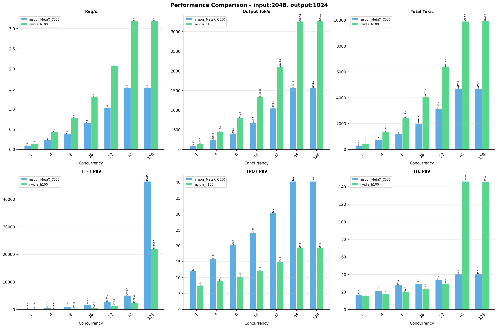

---

### input: 4096, output: 2048

**inspur_MetaX_C550**

| 并发数 | 请求吞吐量（Request throughput (req/s)） | 输出token吞吐量（Output token throughput (tok/s)） | 总token吞吐量（Total token throughput (tok/s)） | 首token延迟（P99 TTFT (ms)） | 每token生成时间（P99 TPOT (ms)） | token间延迟（P99 ITL (ms)） |
|--------------- | --------------- | --------------- | --------------- | --------------- | --------------- | ---------------|
| 1 | 0.04 | 81.37 | 244.12 | 217.04 | 12.22 | 16.26 |
| 4 | 0.12 | 243.35 | 730.04 | 750.50 | 16.48 | 21.81 |
| 8 | 0.18 | 373.22 | 1119.65 | 1401.61 | 21.41 | 28.13 |
| 16 | 0.30 | 622.42 | 1867.27 | 2726.73 | 25.58 | 30.11 |
| 32 | 0.46 | 939.34 | 2818.03 | 5355.02 | 33.65 | 35.66 |
| 64 | 0.66 | 1343.93 | 4031.78 | 10612.19 | 46.94 | 46.28 |
| 128 | 0.66 | 1343.79 | 4031.36 | 107114.91 | 46.90 | 46.39 |

**nvidia_h100**

| 并发数 | 请求吞吐量（Request throughput (req/s)） | 输出token吞吐量（Output token throughput (tok/s)） | 总token吞吐量（Total token throughput (tok/s)） | 首token延迟（P99 TTFT (ms)） | 每token生成时间（P99 TPOT (ms)） | token间延迟（P99 ITL (ms)） |
|--------------- | --------------- | --------------- | --------------- | --------------- | --------------- | ---------------|
| 1 | 0.06 | 131.17 | 396.00 | 126.64 | 7.59 | 15.39 |
| 4 | 0.22 | 441.66 | 1333.39 | 347.71 | 9.15 | 18.28 |
| 8 | 0.38 | 782.67 | 2362.93 | 625.36 | 10.40 | 20.56 |
| 16 | 0.64 | 1303.31 | 3934.74 | 887.67 | 12.43 | 24.37 |
| 32 | 0.99 | 2030.40 | 6129.87 | 2019.10 | 15.85 | 31.03 |
| 64 | 1.48 | 3026.85 | 9138.18 | 4507.91 | 20.95 | 151.06 |
| 128 | 1.48 | 3025.82 | 9135.07 | 46883.70 | 21.04 | 151.92 |

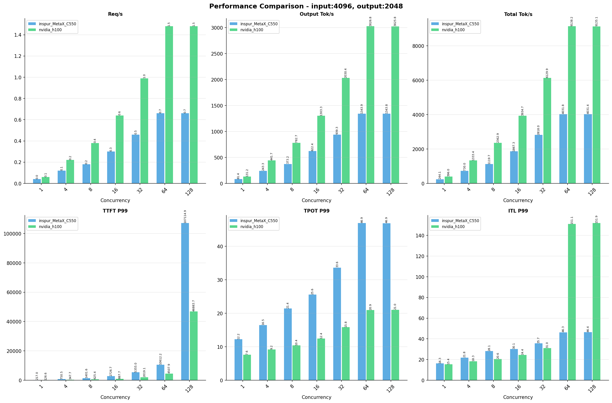

---

### input: 8192, output: 1024

**inspur_MetaX_C550**

| 并发数 | 请求吞吐量（Request throughput (req/s)） | 输出token吞吐量（Output token throughput (tok/s)） | 总token吞吐量（Total token throughput (tok/s)） | 首token延迟（P99 TTFT (ms)） | 每token生成时间（P99 TPOT (ms)） | token间延迟（P99 ITL (ms)） |
|--------------- | --------------- | --------------- | --------------- | --------------- | --------------- | ---------------|
| 1 | 0.08 | 78.29 | 704.57 | 520.17 | 12.47 | 17.77 |
| 4 | 0.21 | 219.44 | 1975.00 | 1674.84 | 18.01 | 23.89 |
| 8 | 0.32 | 322.67 | 2904.05 | 3159.86 | 24.60 | 27.16 |
| 16 | 0.48 | 494.64 | 4451.74 | 6149.73 | 32.34 | 31.66 |
| 32 | 0.66 | 673.65 | 6062.88 | 12147.10 | 46.88 | 39.63 |
| 64 | 0.84 | 856.52 | 7708.66 | 23889.08 | 73.84 | 54.52 |
| 128 | 0.84 | 857.26 | 7715.33 | 99741.36 | 73.69 | 54.66 |

**nvidia_h100**

| 并发数 | 请求吞吐量（Request throughput (req/s)） | 输出token吞吐量（Output token throughput (tok/s)） | 总token吞吐量（Total token throughput (tok/s)） | 首token延迟（P99 TTFT (ms)） | 每token生成时间（P99 TPOT (ms)） | token间延迟（P99 ITL (ms)） |
|--------------- | --------------- | --------------- | --------------- | --------------- | --------------- | ---------------|
| 1 | 0.12 | 127.41 | 1151.56 | 219.81 | 7.67 | 15.53 |
| 4 | 0.40 | 410.74 | 3712.34 | 656.13 | 9.65 | 18.64 |
| 8 | 0.68 | 695.31 | 6284.28 | 1095.11 | 11.50 | 21.33 |
| 16 | 1.06 | 1083.50 | 9792.79 | 1314.68 | 14.71 | 152.01 |
| 32 | 1.52 | 1557.65 | 14078.15 | 4184.75 | 20.26 | 159.35 |
| 64 | 2.05 | 2104.06 | 19016.63 | 9208.08 | 29.92 | 183.86 |
| 128 | 2.06 | 2106.36 | 19037.48 | 39923.84 | 29.85 | 317.44 |

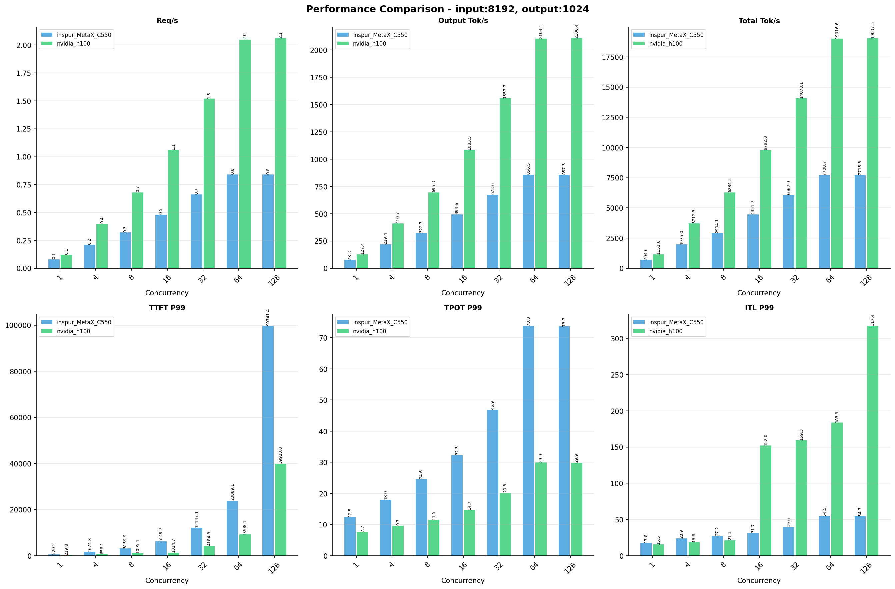

---

## 📊 I/O对比（固定并发数，随上下文长度变化）

### 1 并发

**inspur_MetaX_C550**

| 输入输出 | 请求吞吐量（Request throughput (req/s)） | 输出token吞吐量（Output token throughput (tok/s)） | 总token吞吐量（Total token throughput (tok/s)） | 首token延迟（P99 TTFT (ms)） | 每token生成时间（P99 TPOT (ms)） | token间延迟（P99 ITL (ms)） |
|--------------- | --------------- | --------------- | --------------- | --------------- | --------------- | ---------------|
| i128_o128 | 0.60 | 77.40 | 154.81 | 153.05 | 11.97 | 15.08 |
| i512_o256 | 0.31 | 80.35 | 241.04 | 156.87 | 11.99 | 15.35 |
| i1024_o512 | 0.16 | 81.65 | 244.96 | 158.39 | 12.03 | 17.67 |
| i2048_o1024 | 0.08 | 82.15 | 246.46 | 159.25 | 12.08 | 16.73 |
| i4096_o2048 | 0.04 | 81.37 | 244.12 | 217.04 | 12.22 | 16.26 |
| i8192_o1024 | 0.08 | 78.29 | 704.57 | 520.17 | 12.47 | 17.77 |

**nvidia_h100**

| 输入输出 | 请求吞吐量（Request throughput (req/s)） | 输出token吞吐量（Output token throughput (tok/s)） | 总token吞吐量（Total token throughput (tok/s)） | 首token延迟（P99 TTFT (ms)） | 每token生成时间（P99 TPOT (ms)） | token间延迟（P99 ITL (ms)） |
|--------------- | --------------- | --------------- | --------------- | --------------- | --------------- | ---------------|
| i128_o128 | 1.03 | 132.10 | 304.45 | 29.15 | 7.43 | 7.81 |
| i512_o256 | 0.50 | 129.25 | 407.43 | 101.94 | 7.45 | 7.97 |
| i1024_o512 | 0.26 | 131.35 | 404.06 | 105.19 | 7.47 | 15.01 |
| i2048_o1024 | 0.13 | 132.15 | 401.49 | 111.86 | 7.49 | 15.14 |
| i4096_o2048 | 0.06 | 131.17 | 396.00 | 126.64 | 7.59 | 15.39 |
| i8192_o1024 | 0.12 | 127.41 | 1151.56 | 219.81 | 7.67 | 15.53 |

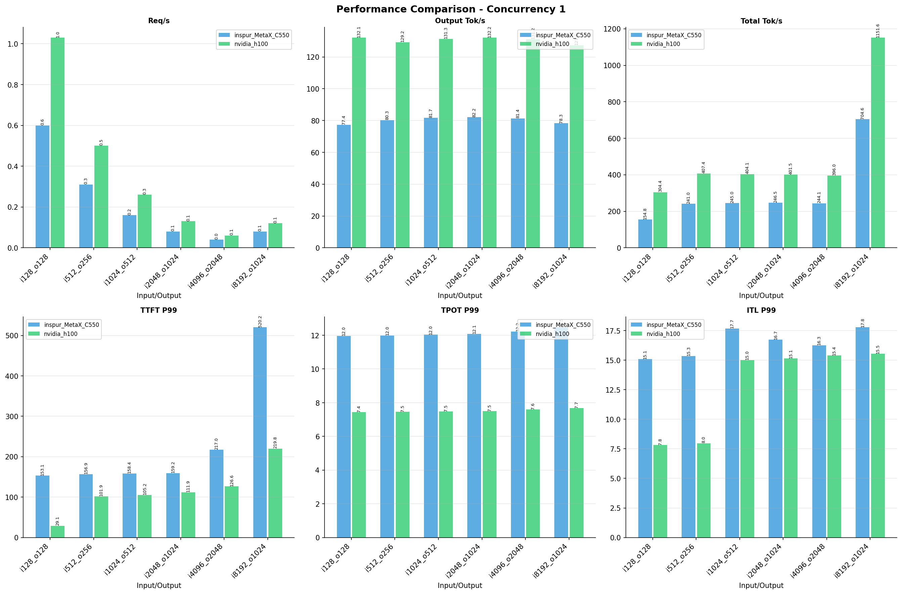

---

### 4 并发

**inspur_MetaX_C550**

| 输入输出 | 请求吞吐量（Request throughput (req/s)） | 输出token吞吐量（Output token throughput (tok/s)） | 总token吞吐量（Total token throughput (tok/s)） | 首token延迟（P99 TTFT (ms)） | 每token生成时间（P99 TPOT (ms)） | token间延迟（P99 ITL (ms)） |
|--------------- | --------------- | --------------- | --------------- | --------------- | --------------- | ---------------|
| i128_o128 | 1.90 | 242.97 | 485.94 | 155.80 | 15.55 | 21.82 |
| i512_o256 | 0.96 | 246.10 | 738.30 | 249.24 | 16.06 | 23.55 |
| i1024_o512 | 0.49 | 250.36 | 751.07 | 301.36 | 15.64 | 21.83 |
| i2048_o1024 | 0.24 | 250.25 | 750.74 | 427.62 | 15.83 | 21.32 |
| i4096_o2048 | 0.12 | 243.35 | 730.04 | 750.50 | 16.48 | 21.81 |
| i8192_o1024 | 0.21 | 219.44 | 1975.00 | 1674.84 | 18.01 | 23.89 |

**nvidia_h100**

| 输入输出 | 请求吞吐量（Request throughput (req/s)） | 输出token吞吐量（Output token throughput (tok/s)） | 总token吞吐量（Total token throughput (tok/s)） | 首token延迟（P99 TTFT (ms)） | 每token生成时间（P99 TPOT (ms)） | token间延迟（P99 ITL (ms)） |
|--------------- | --------------- | --------------- | --------------- | --------------- | --------------- | ---------------|
| i128_o128 | 3.34 | 427.14 | 984.42 | 105.78 | 9.31 | 9.81 |
| i512_o256 | 1.67 | 426.71 | 1345.13 | 170.36 | 9.29 | 9.95 |
| i1024_o512 | 0.86 | 439.84 | 1353.02 | 177.82 | 8.99 | 17.86 |
| i2048_o1024 | 0.43 | 444.20 | 1349.53 | 225.74 | 9.05 | 18.00 |
| i4096_o2048 | 0.22 | 441.66 | 1333.39 | 347.71 | 9.15 | 18.28 |
| i8192_o1024 | 0.40 | 410.74 | 3712.34 | 656.13 | 9.65 | 18.64 |

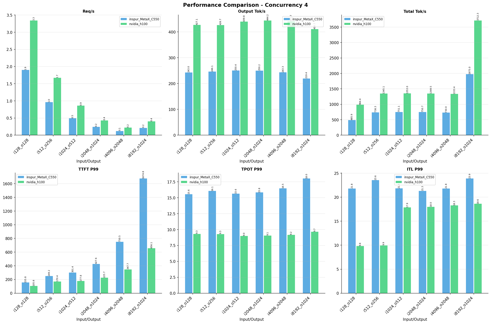

---

### 8 并发

**inspur_MetaX_C550**

| 输入输出 | 请求吞吐量（Request throughput (req/s)） | 输出token吞吐量（Output token throughput (tok/s)） | 总token吞吐量（Total token throughput (tok/s)） | 首token延迟（P99 TTFT (ms)） | 每token生成时间（P99 TPOT (ms)） | token间延迟（P99 ITL (ms)） |
|--------------- | --------------- | --------------- | --------------- | --------------- | --------------- | ---------------|
| i128_o128 | 3.04 | 389.71 | 779.42 | 254.37 | 20.46 | 26.82 |
| i512_o256 | 1.55 | 397.98 | 1193.94 | 291.68 | 19.51 | 26.40 |
| i1024_o512 | 0.78 | 399.06 | 1197.18 | 390.54 | 19.66 | 27.69 |
| i2048_o1024 | 0.38 | 391.51 | 1174.52 | 738.03 | 20.36 | 27.78 |
| i4096_o2048 | 0.18 | 373.22 | 1119.65 | 1401.61 | 21.41 | 28.13 |
| i8192_o1024 | 0.32 | 322.67 | 2904.05 | 3159.86 | 24.60 | 27.16 |

**nvidia_h100**

| 输入输出 | 请求吞吐量（Request throughput (req/s)） | 输出token吞吐量（Output token throughput (tok/s)） | 总token吞吐量（Total token throughput (tok/s)） | 首token延迟（P99 TTFT (ms)） | 每token生成时间（P99 TPOT (ms)） | token间延迟（P99 ITL (ms)） |
|--------------- | --------------- | --------------- | --------------- | --------------- | --------------- | ---------------|
| i128_o128 | 6.02 | 770.36 | 1775.45 | 153.33 | 10.22 | 10.83 |
| i512_o256 | 3.06 | 782.80 | 2467.65 | 165.00 | 9.98 | 10.91 |
| i1024_o512 | 1.55 | 792.15 | 2436.78 | 208.22 | 10.11 | 19.82 |
| i2048_o1024 | 0.78 | 796.35 | 2419.37 | 361.65 | 10.13 | 20.01 |
| i4096_o2048 | 0.38 | 782.67 | 2362.93 | 625.36 | 10.40 | 20.56 |
| i8192_o1024 | 0.68 | 695.31 | 6284.28 | 1095.11 | 11.50 | 21.33 |

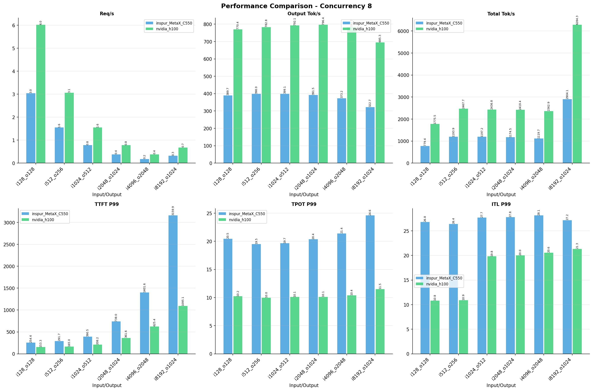

---

### 16 并发

**inspur_MetaX_C550**

| 输入输出 | 请求吞吐量（Request throughput (req/s)） | 输出token吞吐量（Output token throughput (tok/s)） | 总token吞吐量（Total token throughput (tok/s)） | 首token延迟（P99 TTFT (ms)） | 每token生成时间（P99 TPOT (ms)） | token间延迟（P99 ITL (ms)） |
|--------------- | --------------- | --------------- | --------------- | --------------- | --------------- | ---------------|
| i128_o128 | 5.32 | 680.39 | 1360.78 | 579.39 | 23.01 | 28.35 |
| i512_o256 | 2.72 | 697.34 | 2092.01 | 417.62 | 22.05 | 28.20 |
| i1024_o512 | 1.34 | 685.28 | 2055.85 | 842.72 | 23.08 | 29.02 |
| i2048_o1024 | 0.65 | 663.16 | 1989.48 | 1468.34 | 23.96 | 29.45 |
| i4096_o2048 | 0.30 | 622.42 | 1867.27 | 2726.73 | 25.58 | 30.11 |
| i8192_o1024 | 0.48 | 494.64 | 4451.74 | 6149.73 | 32.34 | 31.66 |

**nvidia_h100**

| 输入输出 | 请求吞吐量（Request throughput (req/s)） | 输出token吞吐量（Output token throughput (tok/s)） | 总token吞吐量（Total token throughput (tok/s)） | 首token延迟（P99 TTFT (ms)） | 每token生成时间（P99 TPOT (ms)） | token间延迟（P99 ITL (ms)） |
|--------------- | --------------- | --------------- | --------------- | --------------- | --------------- | ---------------|
| i128_o128 | 10.09 | 1291.07 | 2975.50 | 116.92 | 12.53 | 19.61 |
| i512_o256 | 5.17 | 1322.61 | 4169.31 | 199.16 | 11.85 | 13.06 |
| i1024_o512 | 2.62 | 1339.60 | 4120.83 | 337.29 | 11.90 | 23.16 |
| i2048_o1024 | 1.31 | 1338.77 | 4067.31 | 579.97 | 12.00 | 23.49 |
| i4096_o2048 | 0.64 | 1303.31 | 3934.74 | 887.67 | 12.43 | 24.37 |
| i8192_o1024 | 1.06 | 1083.50 | 9792.79 | 1314.68 | 14.71 | 152.01 |

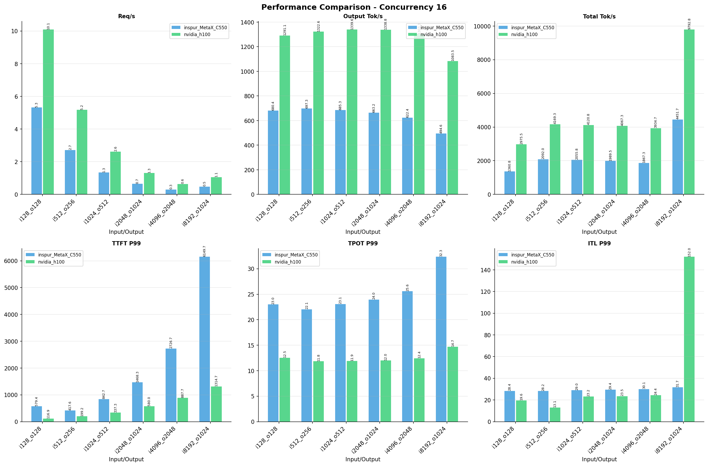

---

### 32 并发

**inspur_MetaX_C550**

| 输入输出 | 请求吞吐量（Request throughput (req/s)） | 输出token吞吐量（Output token throughput (tok/s)） | 总token吞吐量（Total token throughput (tok/s)） | 首token延迟（P99 TTFT (ms)） | 每token生成时间（P99 TPOT (ms)） | token间延迟（P99 ITL (ms)） |
|--------------- | --------------- | --------------- | --------------- | --------------- | --------------- | ---------------|
| i128_o128 | 8.73 | 1116.94 | 2233.88 | 575.15 | 27.81 | 31.51 |
| i512_o256 | 4.35 | 1112.46 | 3337.39 | 889.77 | 28.15 | 31.62 |
| i1024_o512 | 2.14 | 1093.45 | 3280.35 | 1436.18 | 28.61 | 32.11 |
| i2048_o1024 | 1.02 | 1040.81 | 3122.42 | 2667.43 | 30.20 | 33.35 |
| i4096_o2048 | 0.46 | 939.34 | 2818.03 | 5355.02 | 33.65 | 35.66 |
| i8192_o1024 | 0.66 | 673.65 | 6062.88 | 12147.10 | 46.88 | 39.63 |

**nvidia_h100**

| 输入输出 | 请求吞吐量（Request throughput (req/s)） | 输出token吞吐量（Output token throughput (tok/s)） | 总token吞吐量（Total token throughput (tok/s)） | 首token延迟（P99 TTFT (ms)） | 每token生成时间（P99 TPOT (ms)） | token间延迟（P99 ITL (ms)） |
|--------------- | --------------- | --------------- | --------------- | --------------- | --------------- | ---------------|
| i128_o128 | 17.11 | 2190.57 | 5048.59 | 256.75 | 14.25 | 19.96 |
| i512_o256 | 8.41 | 2153.58 | 6788.82 | 357.62 | 14.49 | 27.58 |
| i1024_o512 | 4.22 | 2161.89 | 6650.35 | 483.29 | 14.73 | 29.45 |
| i2048_o1024 | 2.06 | 2108.53 | 6405.90 | 1137.22 | 15.01 | 29.04 |
| i4096_o2048 | 0.99 | 2030.40 | 6129.87 | 2019.10 | 15.85 | 31.03 |
| i8192_o1024 | 1.52 | 1557.65 | 14078.15 | 4184.75 | 20.26 | 159.35 |

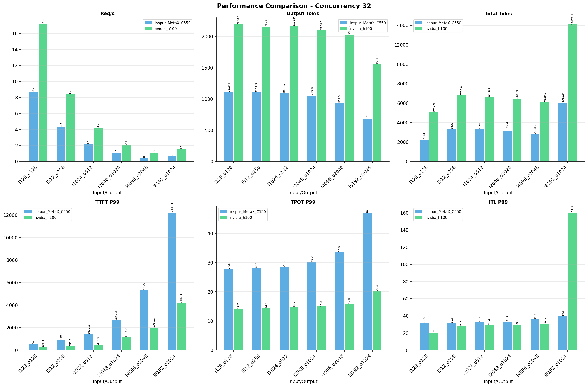

---

### 64 并发

**inspur_MetaX_C550**

| 输入输出 | 请求吞吐量（Request throughput (req/s)） | 输出token吞吐量（Output token throughput (tok/s)） | 总token吞吐量（Total token throughput (tok/s)） | 首token延迟（P99 TTFT (ms)） | 每token生成时间（P99 TPOT (ms)） | token间延迟（P99 ITL (ms)） |
|--------------- | --------------- | --------------- | --------------- | --------------- | --------------- | ---------------|
| i128_o128 | 14.12 | 1807.14 | 3614.28 | 699.95 | 33.33 | 43.92 |
| i512_o256 | 6.82 | 1744.79 | 5234.37 | 1507.81 | 35.07 | 36.08 |
| i1024_o512 | 3.30 | 1688.26 | 5064.77 | 2586.51 | 36.85 | 37.13 |
| i2048_o1024 | 1.52 | 1558.99 | 4676.97 | 5071.27 | 40.22 | 39.86 |
| i4096_o2048 | 0.66 | 1343.93 | 4031.78 | 10612.19 | 46.94 | 46.28 |
| i8192_o1024 | 0.84 | 856.52 | 7708.66 | 23889.08 | 73.84 | 54.52 |

**nvidia_h100**

| 输入输出 | 请求吞吐量（Request throughput (req/s)） | 输出token吞吐量（Output token throughput (tok/s)） | 总token吞吐量（Total token throughput (tok/s)） | 首token延迟（P99 TTFT (ms)） | 每token生成时间（P99 TPOT (ms)） | token间延迟（P99 ITL (ms)） |
|--------------- | --------------- | --------------- | --------------- | --------------- | --------------- | ---------------|
| i128_o128 | 27.90 | 3571.65 | 8231.54 | 354.30 | 17.66 | 23.73 |
| i512_o256 | 13.68 | 3502.52 | 11041.15 | 531.95 | 17.74 | 57.55 |
| i1024_o512 | 6.70 | 3430.95 | 10554.20 | 779.16 | 18.78 | 71.82 |
| i2048_o1024 | 3.18 | 3257.09 | 9895.33 | 2322.59 | 19.34 | 146.03 |
| i4096_o2048 | 1.48 | 3026.85 | 9138.18 | 4507.91 | 20.95 | 151.06 |
| i8192_o1024 | 2.05 | 2104.06 | 19016.63 | 9208.08 | 29.92 | 183.86 |

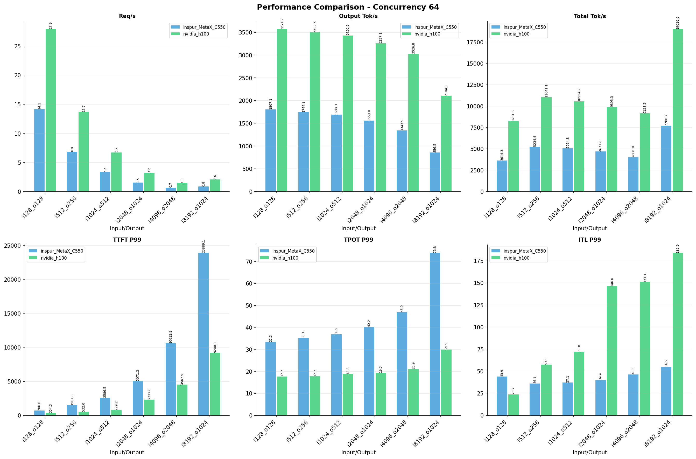

---

### 128 并发

**inspur_MetaX_C550**

| 输入输出 | 请求吞吐量（Request throughput (req/s)） | 输出token吞吐量（Output token throughput (tok/s)） | 总token吞吐量（Total token throughput (tok/s)） | 首token延迟（P99 TTFT (ms)） | 每token生成时间（P99 TPOT (ms)） | token间延迟（P99 ITL (ms)） |
|--------------- | --------------- | --------------- | --------------- | --------------- | --------------- | ---------------|
| i128_o128 | 14.73 | 1885.90 | 3771.79 | 4774.73 | 30.95 | 35.96 |
| i512_o256 | 6.86 | 1756.27 | 5268.82 | 10546.24 | 34.72 | 36.14 |
| i1024_o512 | 3.31 | 1695.32 | 5085.96 | 21520.32 | 36.64 | 37.19 |
| i2048_o1024 | 1.52 | 1561.07 | 4683.20 | 46445.07 | 40.18 | 40.13 |
| i4096_o2048 | 0.66 | 1343.79 | 4031.36 | 107114.91 | 46.90 | 46.39 |
| i8192_o1024 | 0.84 | 857.26 | 7715.33 | 99741.36 | 73.69 | 54.66 |

**nvidia_h100**

| 输入输出 | 请求吞吐量（Request throughput (req/s)） | 输出token吞吐量（Output token throughput (tok/s)） | 总token吞吐量（Total token throughput (tok/s)） | 首token延迟（P99 TTFT (ms)） | 每token生成时间（P99 TPOT (ms)） | token间延迟（P99 ITL (ms)） |
|--------------- | --------------- | --------------- | --------------- | --------------- | --------------- | ---------------|
| i128_o128 | 28.81 | 3687.40 | 8498.30 | 2585.21 | 16.86 | 21.18 |
| i512_o256 | 13.68 | 3502.84 | 11042.17 | 5255.30 | 17.79 | 60.71 |
| i1024_o512 | 6.78 | 3469.97 | 10674.24 | 10222.45 | 18.59 | 56.76 |
| i2048_o1024 | 3.18 | 3260.17 | 9904.68 | 21939.31 | 19.38 | 145.04 |
| i4096_o2048 | 1.48 | 3025.82 | 9135.07 | 46883.70 | 21.04 | 151.92 |
| i8192_o1024 | 2.06 | 2106.36 | 19037.48 | 39923.84 | 29.85 | 317.44 |

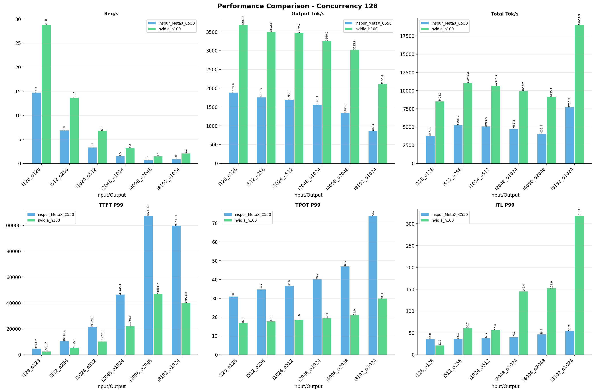

---

*报告生成时间: 2026-05-14*

