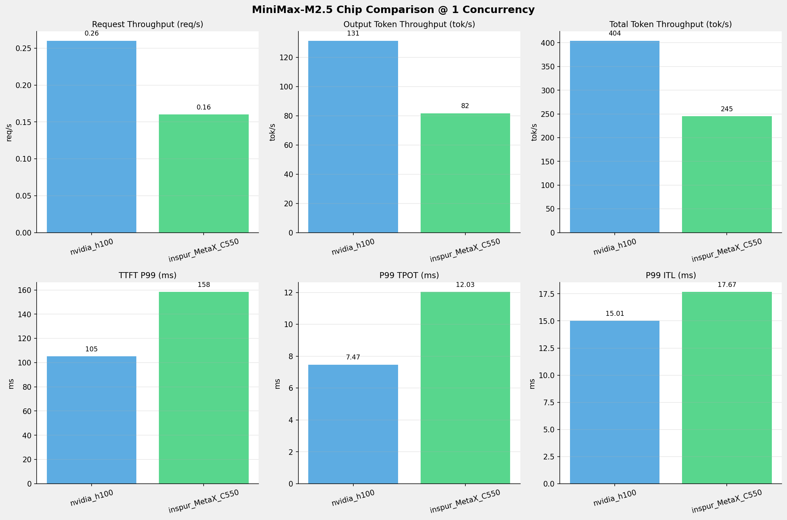
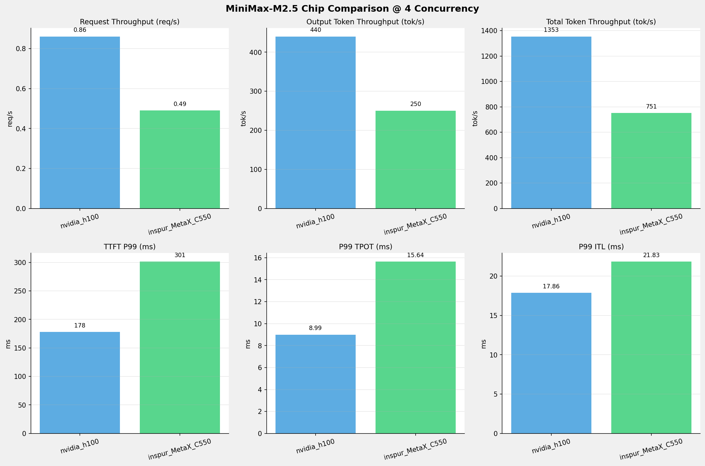
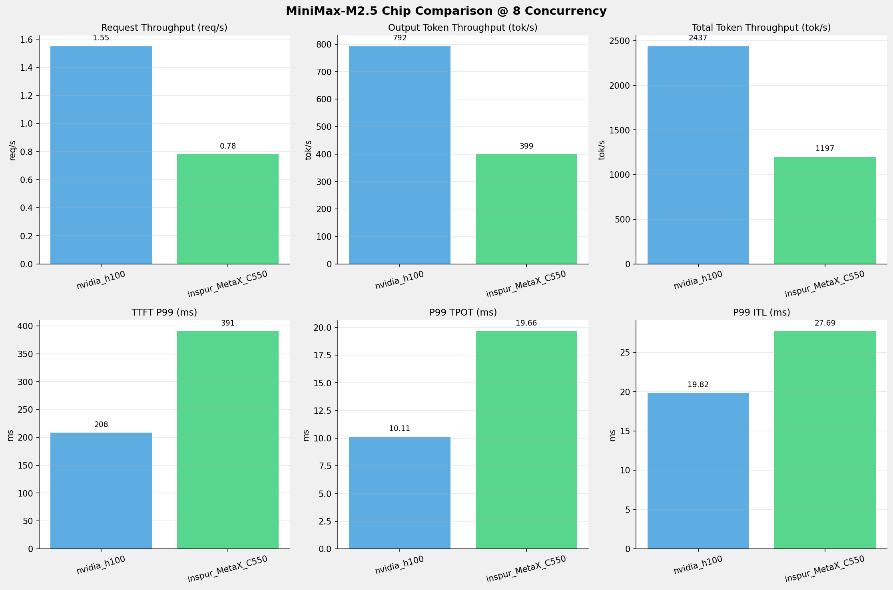
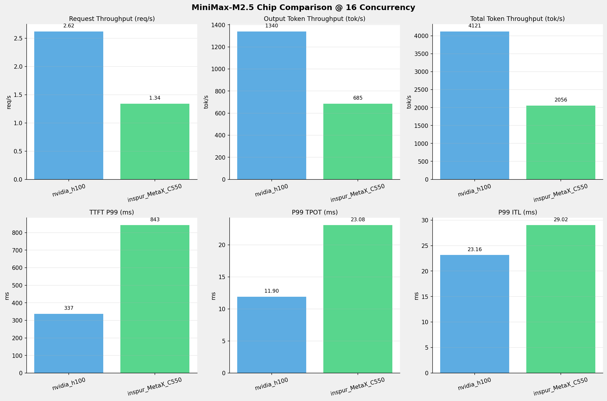
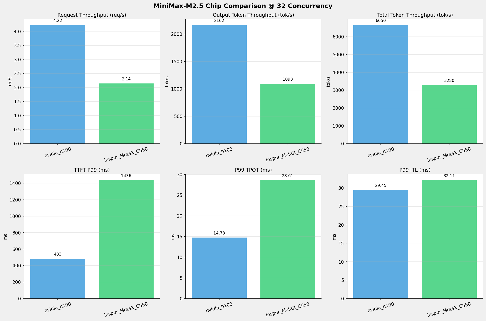
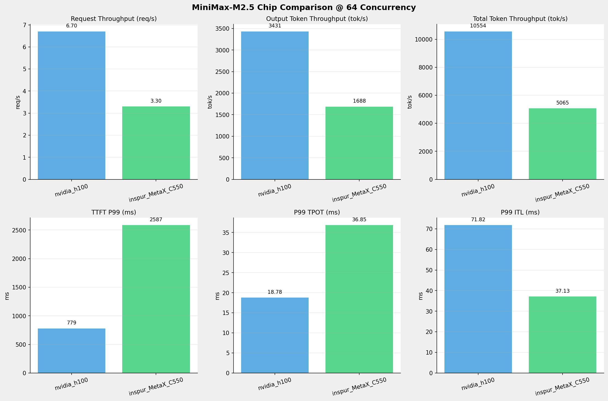
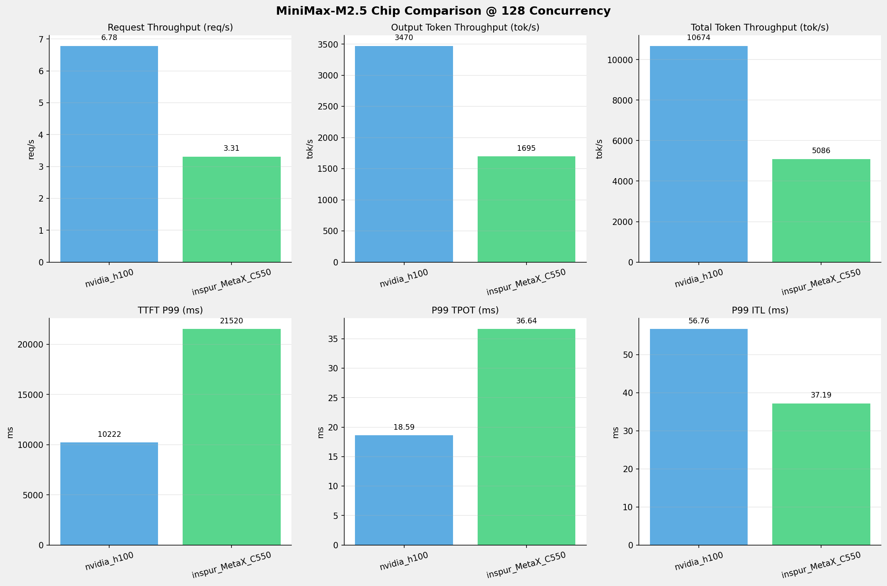
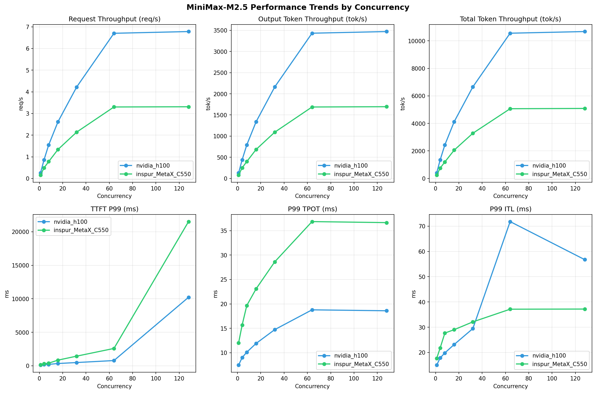

# MiniMax-M2.5模型在不同芯片下的基准测试报告

**测试日期：** 2026-05-19

---

## 测试场景
在固定请求数，输入上下文和输出上下文长度下，使用SGLang基准测试工具对并发数逐级增加场景的性能基准验证。并对比同一模型在不同芯片环境上的性能指标。

**主要采集指标**：

| 指标                  | 单位         | 含义                                 |
|---------------------|------------|------------------------------------|
| TTFT                | ms         | Time To First Token，首 token 延迟     |
| TPOT                | ms/token   | Time Per Output Token，每 token 生成时间 |
| Throughput          | tokens/s   | 系统总吞吐                              |
| QPS                 | requests/s | 请求吞吐                               |

### 📊 测试概览

| 项目            | 配置                                     | 备注  |
|---------------|----------------------------------------|-----|
| **数据集**       | random                                 |     |
| **并发数**       | 1, 4, 8, 16, 32, 64, 128    |     |
| **总请求数**      | 1000                                    |     |
| **请求输入上下文长度** | 1024（1k）                             |     |
| **请求输出上下文长度** | 512（0.50k）                             |     |
| **被测芯片**      | nvidia_h100, inspur_MetaX_C550 |     |
| **被测模型**      | nvidia_h100 (MiniMax-M2.5), inspur_MetaX_C550 (MiniMax-M2.5-W8A8) |     |

---

### 📊 芯片性能对比柱状图

**1并发**

**4并发**

**8并发**

**16并发**

**32并发**

**64并发**

**128并发**

### 📈 性能趋势对比图 (所有芯片)

---

### 📈 各指标随并发级别性能对比详情

#### 请求吞吐量（Request throughput (req/s)）

| 并发数 | nvidia_h100 | inspur_MetaX_C550 | 差值 | 百分比 |
|-----|----------- | ----------- | ----------- | -----------|
| 1   | **0.26** ⭐ | 0.16 | -0.10 | -38.5% |
| 4   | **0.86** ⭐ | 0.49 | -0.37 | -43.0% |
| 8   | **1.55** ⭐ | 0.78 | -0.77 | -49.7% |
| 16   | **2.62** ⭐ | 1.34 | -1.28 | -48.9% |
| 32   | **4.22** ⭐ | 2.14 | -2.08 | -49.3% |
| 64   | **6.70** ⭐ | 3.30 | -3.40 | -50.7% |
| 128   | **6.78** ⭐ | 3.31 | -3.47 | -51.2% |

#### 输入token吞吐量（Input token throughput (tok/s)）

| 并发数 | nvidia_h100 | inspur_MetaX_C550 | 差值 | 百分比 |
|-----|----------- | ----------- | ----------- | -----------|
| 1   | N/A | 163.31 | N/A | N/A |
| 4   | N/A | 500.71 | N/A | N/A |
| 8   | N/A | 798.12 | N/A | N/A |
| 16   | N/A | 1370.57 | N/A | N/A |
| 32   | N/A | 2186.90 | N/A | N/A |
| 64   | N/A | 3376.51 | N/A | N/A |
| 128   | N/A | 3390.64 | N/A | N/A |

#### 输出token吞吐量（Output token throughput (tok/s)）

| 并发数 | nvidia_h100 | inspur_MetaX_C550 | 差值 | 百分比 |
|-----|----------- | ----------- | ----------- | -----------|
| 1   | **131.35** ⭐ | 81.65 | -49.70 | -37.8% |
| 4   | **439.84** ⭐ | 250.36 | -189.48 | -43.1% |
| 8   | **792.15** ⭐ | 399.06 | -393.09 | -49.6% |
| 16   | **1339.60** ⭐ | 685.28 | -654.32 | -48.8% |
| 32   | **2161.89** ⭐ | 1093.45 | -1068.44 | -49.4% |
| 64   | **3430.95** ⭐ | 1688.26 | -1742.69 | -50.8% |
| 128   | **3469.97** ⭐ | 1695.32 | -1774.65 | -51.1% |

#### 总token吞吐量（Total token throughput (tok/s)）

| 并发数 | nvidia_h100 | inspur_MetaX_C550 | 差值 | 百分比 |
|-----|----------- | ----------- | ----------- | -----------|
| 1   | **404.06** ⭐ | 244.96 | -159.10 | -39.4% |
| 4   | **1353.02** ⭐ | 751.07 | -601.95 | -44.5% |
| 8   | **2436.78** ⭐ | 1197.18 | -1239.60 | -50.9% |
| 16   | **4120.83** ⭐ | 2055.85 | -2064.98 | -50.1% |
| 32   | **6650.35** ⭐ | 3280.35 | -3370.00 | -50.7% |
| 64   | **10554.20** ⭐ | 5064.77 | -5489.43 | -52.0% |
| 128   | **10674.24** ⭐ | 5085.96 | -5588.28 | -52.4% |

#### 首token延迟（P99 TTFT (ms)）

| 并发数 | nvidia_h100 | inspur_MetaX_C550 | 差值 | 百分比 |
|-----|----------- | ----------- | ----------- | -----------|
| 1   | 105.19 | 158.39 | +53.20 | +50.6% |
| 4   | 177.82 | 301.36 | +123.54 | +69.5% |
| 8   | 208.22 | 390.54 | +182.32 | +87.6% |
| 16   | 337.29 | 842.72 | +505.43 | +149.9% |
| 32   | 483.29 | 1436.18 | +952.89 | +197.2% |
| 64   | 779.16 | 2586.51 | +1807.35 | +232.0% |
| 128   | 10222.45 | 21520.32 | +11297.87 | +110.5% |

#### 每token生成时间（P99 TPOT (ms)）

| 并发数 | nvidia_h100 | inspur_MetaX_C550 | 差值 | 百分比 |
|-----|----------- | ----------- | ----------- | -----------|
| 1   | 7.47 | 12.03 | +4.56 | +61.0% |
| 4   | 8.99 | 15.64 | +6.65 | +74.0% |
| 8   | 10.11 | 19.66 | +9.55 | +94.5% |
| 16   | 11.90 | 23.08 | +11.18 | +93.9% |
| 32   | 14.73 | 28.61 | +13.88 | +94.2% |
| 64   | 18.78 | 36.85 | +18.07 | +96.2% |
| 128   | 18.59 | 36.64 | +18.05 | +97.1% |

#### token间延迟（P99 ITL (ms)）

| 并发数 | nvidia_h100 | inspur_MetaX_C550 | 差值 | 百分比 |
|-----|----------- | ----------- | ----------- | -----------|
| 1   | 15.01 | 17.67 | +2.66 | +17.7% |
| 4   | 17.86 | 21.83 | +3.97 | +22.2% |
| 8   | 19.82 | 27.69 | +7.87 | +39.7% |
| 16   | 23.16 | 29.02 | +5.86 | +25.3% |
| 32   | 29.45 | 32.11 | +2.66 | +9.0% |
| 64   | 71.82 | 37.13 | -34.69 | -48.3% |
| 128   | 56.76 | 37.19 | -19.57 | -34.5% |

### 📈 各并发级别性能对比详情

#### 1 并发

| 指标 | nvidia_h100 | inspur_MetaX_C550 |
|------|----------- | -----------|
| 请求吞吐量（Request throughput (req/s)） | **0.26** ⭐ | 0.16 |
| 输入token吞吐量（Input token throughput (tok/s)） | N/A | 163.31 |
| 输出token吞吐量（Output token throughput (tok/s)） | **131.35** ⭐ | 81.65 |
| 总token吞吐量（Total token throughput (tok/s)） | **404.06** ⭐ | 244.96 |
| 首token延迟（P99 TTFT (ms)） | **105.19** ⭐ | 158.39 |
| 每token生成时间（P99 TPOT (ms)） | **7.47** ⭐ | 12.03 |
| token间延迟（P99 ITL (ms)） | **15.01** ⭐ | 17.67 |

#### 4 并发

| 指标 | nvidia_h100 | inspur_MetaX_C550 |
|------|----------- | -----------|
| 请求吞吐量（Request throughput (req/s)） | **0.86** ⭐ | 0.49 |
| 输入token吞吐量（Input token throughput (tok/s)） | N/A | 500.71 |
| 输出token吞吐量（Output token throughput (tok/s)） | **439.84** ⭐ | 250.36 |
| 总token吞吐量（Total token throughput (tok/s)） | **1353.02** ⭐ | 751.07 |
| 首token延迟（P99 TTFT (ms)） | **177.82** ⭐ | 301.36 |
| 每token生成时间（P99 TPOT (ms)） | **8.99** ⭐ | 15.64 |
| token间延迟（P99 ITL (ms)） | **17.86** ⭐ | 21.83 |

#### 8 并发

| 指标 | nvidia_h100 | inspur_MetaX_C550 |
|------|----------- | -----------|
| 请求吞吐量（Request throughput (req/s)） | **1.55** ⭐ | 0.78 |
| 输入token吞吐量（Input token throughput (tok/s)） | N/A | 798.12 |
| 输出token吞吐量（Output token throughput (tok/s)） | **792.15** ⭐ | 399.06 |
| 总token吞吐量（Total token throughput (tok/s)） | **2436.78** ⭐ | 1197.18 |
| 首token延迟（P99 TTFT (ms)） | **208.22** ⭐ | 390.54 |
| 每token生成时间（P99 TPOT (ms)） | **10.11** ⭐ | 19.66 |
| token间延迟（P99 ITL (ms)） | **19.82** ⭐ | 27.69 |

#### 16 并发

| 指标 | nvidia_h100 | inspur_MetaX_C550 |
|------|----------- | -----------|
| 请求吞吐量（Request throughput (req/s)） | **2.62** ⭐ | 1.34 |
| 输入token吞吐量（Input token throughput (tok/s)） | N/A | 1370.57 |
| 输出token吞吐量（Output token throughput (tok/s)） | **1339.60** ⭐ | 685.28 |
| 总token吞吐量（Total token throughput (tok/s)） | **4120.83** ⭐ | 2055.85 |
| 首token延迟（P99 TTFT (ms)） | **337.29** ⭐ | 842.72 |
| 每token生成时间（P99 TPOT (ms)） | **11.90** ⭐ | 23.08 |
| token间延迟（P99 ITL (ms)） | **23.16** ⭐ | 29.02 |

#### 32 并发

| 指标 | nvidia_h100 | inspur_MetaX_C550 |
|------|----------- | -----------|
| 请求吞吐量（Request throughput (req/s)） | **4.22** ⭐ | 2.14 |
| 输入token吞吐量（Input token throughput (tok/s)） | N/A | 2186.90 |
| 输出token吞吐量（Output token throughput (tok/s)） | **2161.89** ⭐ | 1093.45 |
| 总token吞吐量（Total token throughput (tok/s)） | **6650.35** ⭐ | 3280.35 |
| 首token延迟（P99 TTFT (ms)） | **483.29** ⭐ | 1436.18 |
| 每token生成时间（P99 TPOT (ms)） | **14.73** ⭐ | 28.61 |
| token间延迟（P99 ITL (ms)） | **29.45** ⭐ | 32.11 |

#### 64 并发

| 指标 | nvidia_h100 | inspur_MetaX_C550 |
|------|----------- | -----------|
| 请求吞吐量（Request throughput (req/s)） | **6.70** ⭐ | 3.30 |
| 输入token吞吐量（Input token throughput (tok/s)） | N/A | 3376.51 |
| 输出token吞吐量（Output token throughput (tok/s)） | **3430.95** ⭐ | 1688.26 |
| 总token吞吐量（Total token throughput (tok/s)） | **10554.20** ⭐ | 5064.77 |
| 首token延迟（P99 TTFT (ms)） | **779.16** ⭐ | 2586.51 |
| 每token生成时间（P99 TPOT (ms)） | **18.78** ⭐ | 36.85 |
| token间延迟（P99 ITL (ms)） | 71.82 | **37.13** ⭐ |

#### 128 并发

| 指标 | nvidia_h100 | inspur_MetaX_C550 |
|------|----------- | -----------|
| 请求吞吐量（Request throughput (req/s)） | **6.78** ⭐ | 3.31 |
| 输入token吞吐量（Input token throughput (tok/s)） | N/A | 3390.64 |
| 输出token吞吐量（Output token throughput (tok/s)） | **3469.97** ⭐ | 1695.32 |
| 总token吞吐量（Total token throughput (tok/s)） | **10674.24** ⭐ | 5085.96 |
| 首token延迟（P99 TTFT (ms)） | **10222.45** ⭐ | 21520.32 |
| 每token生成时间（P99 TPOT (ms)） | **18.59** ⭐ | 36.64 |
| token间延迟（P99 ITL (ms)） | 56.76 | **37.19** ⭐ |

---

*报告生成时间: 2026-05-19*

