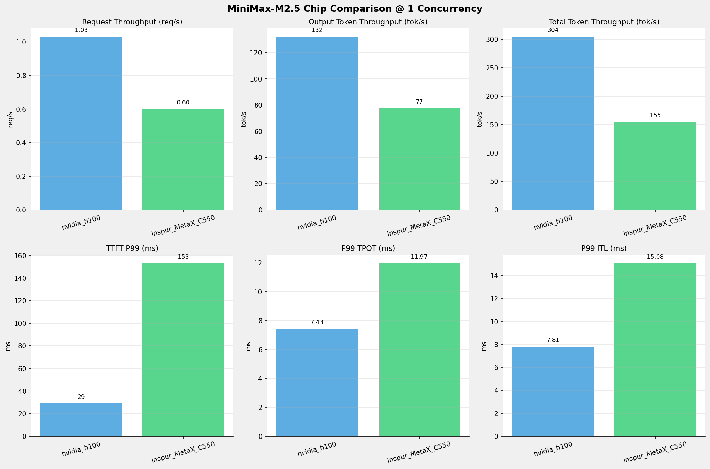
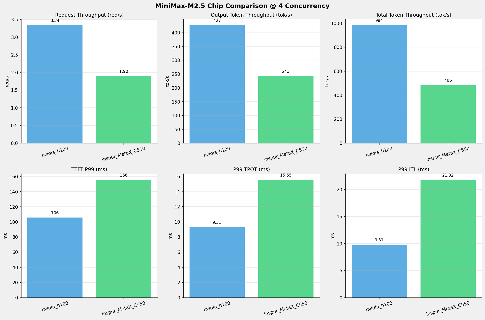
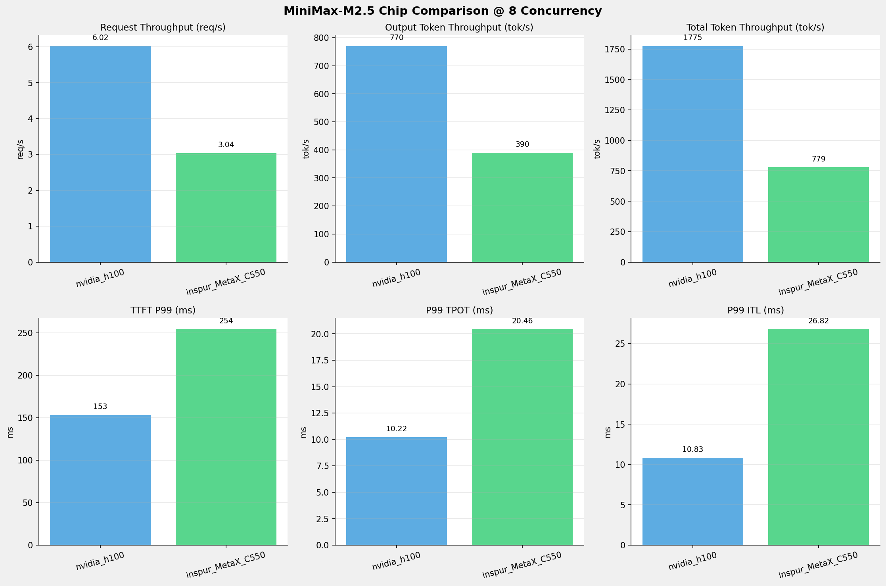
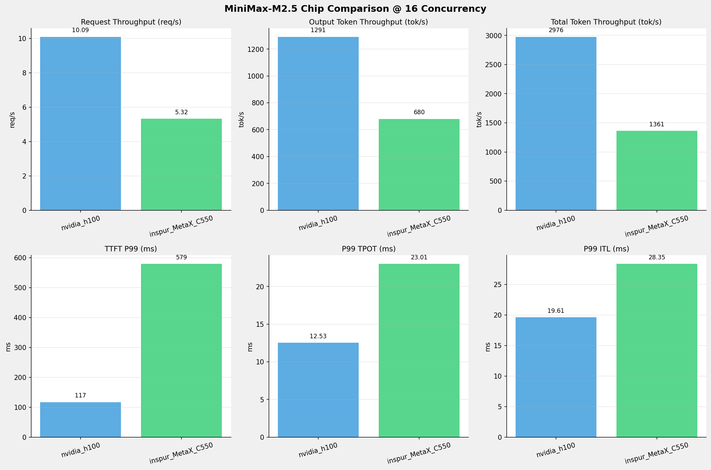
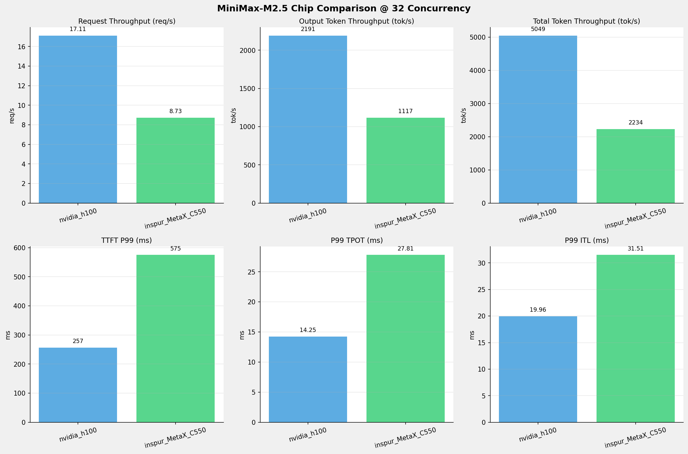
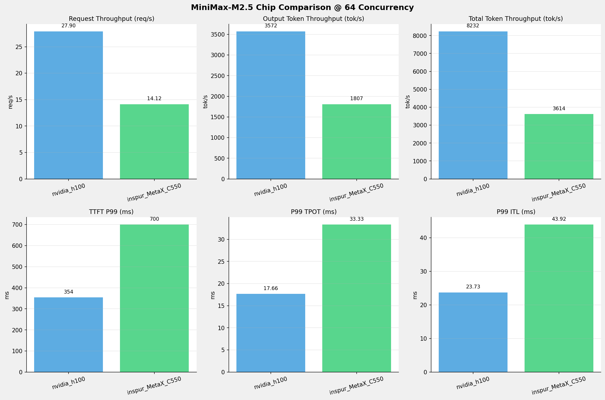
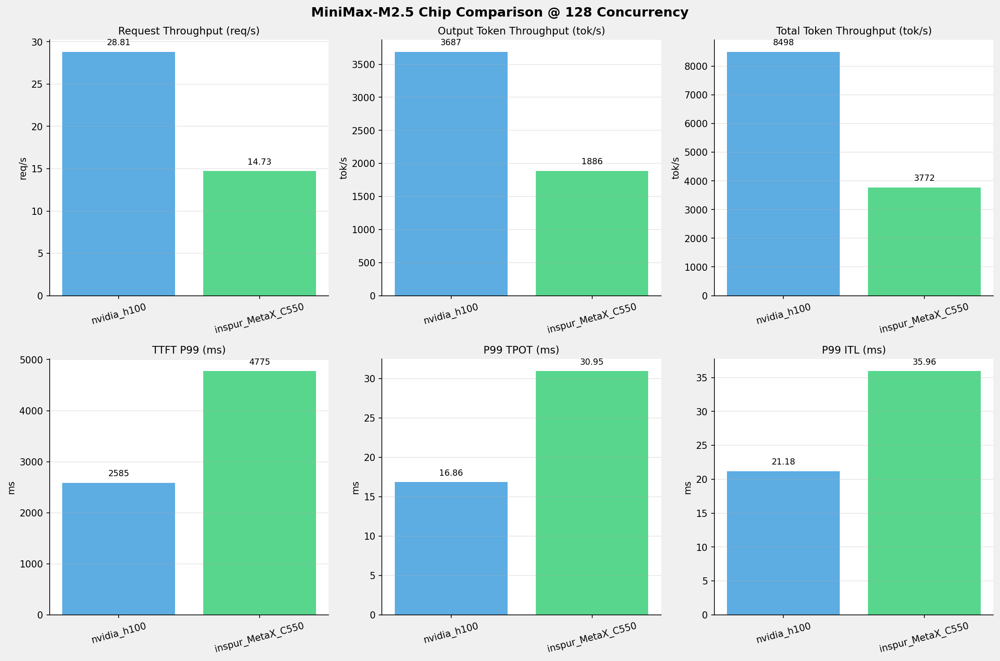
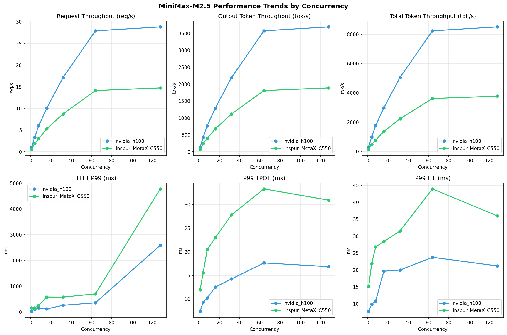

# MiniMax-M2.5模型在不同芯片下的基准测试报告

**测试日期：** 2026-05-19

---

## 测试场景
在固定请求数，输入上下文和输出上下文长度下，使用SGLang基准测试工具对并发数逐级增加场景的性能基准验证。并对比同一模型在不同芯片环境上的性能指标。

**主要采集指标**：

| 指标                  | 单位         | 含义                                 |
|---------------------|------------|------------------------------------|
| TTFT                | ms         | Time To First Token，首 token 延迟     |
| TPOT                | ms/token   | Time Per Output Token，每 token 生成时间 |
| Throughput          | tokens/s   | 系统总吞吐                              |
| QPS                 | requests/s | 请求吞吐                               |

### 📊 测试概览

| 项目            | 配置                                     | 备注  |
|---------------|----------------------------------------|-----|
| **数据集**       | random                                 |     |
| **并发数**       | 1, 4, 8, 16, 32, 64, 128    |     |
| **总请求数**      | 1000                                    |     |
| **请求输入上下文长度** | 128（0.12k）                             |     |
| **请求输出上下文长度** | 128（0.12k）                             |     |
| **被测芯片**      | nvidia_h100, inspur_MetaX_C550 |     |
| **被测模型**      | nvidia_h100 (MiniMax-M2.5), inspur_MetaX_C550 (MiniMax-M2.5-W8A8) |     |

---

### 📊 芯片性能对比柱状图

**1并发**

**4并发**

**8并发**

**16并发**

**32并发**

**64并发**

**128并发**

### 📈 性能趋势对比图 (所有芯片)

---

### 📈 各指标随并发级别性能对比详情

#### 请求吞吐量（Request throughput (req/s)）

| 并发数 | nvidia_h100 | inspur_MetaX_C550 | 差值 | 百分比 |
|-----|----------- | ----------- | ----------- | -----------|
| 1   | **1.03** ⭐ | 0.60 | -0.43 | -41.7% |
| 4   | **3.34** ⭐ | 1.90 | -1.44 | -43.1% |
| 8   | **6.02** ⭐ | 3.04 | -2.98 | -49.5% |
| 16   | **10.09** ⭐ | 5.32 | -4.77 | -47.3% |
| 32   | **17.11** ⭐ | 8.73 | -8.38 | -49.0% |
| 64   | **27.90** ⭐ | 14.12 | -13.78 | -49.4% |
| 128   | **28.81** ⭐ | 14.73 | -14.08 | -48.9% |

#### 输入token吞吐量（Input token throughput (tok/s)）

| 并发数 | nvidia_h100 | inspur_MetaX_C550 | 差值 | 百分比 |
|-----|----------- | ----------- | ----------- | -----------|
| 1   | N/A | 77.40 | N/A | N/A |
| 4   | N/A | 242.97 | N/A | N/A |
| 8   | N/A | 389.71 | N/A | N/A |
| 16   | N/A | 680.39 | N/A | N/A |
| 32   | N/A | 1116.94 | N/A | N/A |
| 64   | N/A | 1807.14 | N/A | N/A |
| 128   | N/A | 1885.90 | N/A | N/A |

#### 输出token吞吐量（Output token throughput (tok/s)）

| 并发数 | nvidia_h100 | inspur_MetaX_C550 | 差值 | 百分比 |
|-----|----------- | ----------- | ----------- | -----------|
| 1   | **132.10** ⭐ | 77.40 | -54.70 | -41.4% |
| 4   | **427.14** ⭐ | 242.97 | -184.17 | -43.1% |
| 8   | **770.36** ⭐ | 389.71 | -380.65 | -49.4% |
| 16   | **1291.07** ⭐ | 680.39 | -610.68 | -47.3% |
| 32   | **2190.57** ⭐ | 1116.94 | -1073.63 | -49.0% |
| 64   | **3571.65** ⭐ | 1807.14 | -1764.51 | -49.4% |
| 128   | **3687.40** ⭐ | 1885.90 | -1801.50 | -48.9% |

#### 总token吞吐量（Total token throughput (tok/s)）

| 并发数 | nvidia_h100 | inspur_MetaX_C550 | 差值 | 百分比 |
|-----|----------- | ----------- | ----------- | -----------|
| 1   | **304.45** ⭐ | 154.81 | -149.64 | -49.2% |
| 4   | **984.42** ⭐ | 485.94 | -498.48 | -50.6% |
| 8   | **1775.45** ⭐ | 779.42 | -996.03 | -56.1% |
| 16   | **2975.50** ⭐ | 1360.78 | -1614.72 | -54.3% |
| 32   | **5048.59** ⭐ | 2233.88 | -2814.71 | -55.8% |
| 64   | **8231.54** ⭐ | 3614.28 | -4617.26 | -56.1% |
| 128   | **8498.30** ⭐ | 3771.79 | -4726.51 | -55.6% |

#### 首token延迟（P99 TTFT (ms)）

| 并发数 | nvidia_h100 | inspur_MetaX_C550 | 差值 | 百分比 |
|-----|----------- | ----------- | ----------- | -----------|
| 1   | 29.15 | 153.05 | +123.90 | +425.0% |
| 4   | 105.78 | 155.80 | +50.02 | +47.3% |
| 8   | 153.33 | 254.37 | +101.04 | +65.9% |
| 16   | 116.92 | 579.39 | +462.47 | +395.5% |
| 32   | 256.75 | 575.15 | +318.40 | +124.0% |
| 64   | 354.30 | 699.95 | +345.65 | +97.6% |
| 128   | 2585.21 | 4774.73 | +2189.52 | +84.7% |

#### 每token生成时间（P99 TPOT (ms)）

| 并发数 | nvidia_h100 | inspur_MetaX_C550 | 差值 | 百分比 |
|-----|----------- | ----------- | ----------- | -----------|
| 1   | 7.43 | 11.97 | +4.54 | +61.1% |
| 4   | 9.31 | 15.55 | +6.24 | +67.0% |
| 8   | 10.22 | 20.46 | +10.24 | +100.2% |
| 16   | 12.53 | 23.01 | +10.48 | +83.6% |
| 32   | 14.25 | 27.81 | +13.56 | +95.2% |
| 64   | 17.66 | 33.33 | +15.67 | +88.7% |
| 128   | 16.86 | 30.95 | +14.09 | +83.6% |

#### token间延迟（P99 ITL (ms)）

| 并发数 | nvidia_h100 | inspur_MetaX_C550 | 差值 | 百分比 |
|-----|----------- | ----------- | ----------- | -----------|
| 1   | 7.81 | 15.08 | +7.27 | +93.1% |
| 4   | 9.81 | 21.82 | +12.01 | +122.4% |
| 8   | 10.83 | 26.82 | +15.99 | +147.6% |
| 16   | 19.61 | 28.35 | +8.74 | +44.6% |
| 32   | 19.96 | 31.51 | +11.55 | +57.9% |
| 64   | 23.73 | 43.92 | +20.19 | +85.1% |
| 128   | 21.18 | 35.96 | +14.78 | +69.8% |

### 📈 各并发级别性能对比详情

#### 1 并发

| 指标 | nvidia_h100 | inspur_MetaX_C550 |
|------|----------- | -----------|
| 请求吞吐量（Request throughput (req/s)） | **1.03** ⭐ | 0.60 |
| 输入token吞吐量（Input token throughput (tok/s)） | N/A | 77.40 |
| 输出token吞吐量（Output token throughput (tok/s)） | **132.10** ⭐ | 77.40 |
| 总token吞吐量（Total token throughput (tok/s)） | **304.45** ⭐ | 154.81 |
| 首token延迟（P99 TTFT (ms)） | **29.15** ⭐ | 153.05 |
| 每token生成时间（P99 TPOT (ms)） | **7.43** ⭐ | 11.97 |
| token间延迟（P99 ITL (ms)） | **7.81** ⭐ | 15.08 |

#### 4 并发

| 指标 | nvidia_h100 | inspur_MetaX_C550 |
|------|----------- | -----------|
| 请求吞吐量（Request throughput (req/s)） | **3.34** ⭐ | 1.90 |
| 输入token吞吐量（Input token throughput (tok/s)） | N/A | 242.97 |
| 输出token吞吐量（Output token throughput (tok/s)） | **427.14** ⭐ | 242.97 |
| 总token吞吐量（Total token throughput (tok/s)） | **984.42** ⭐ | 485.94 |
| 首token延迟（P99 TTFT (ms)） | **105.78** ⭐ | 155.80 |
| 每token生成时间（P99 TPOT (ms)） | **9.31** ⭐ | 15.55 |
| token间延迟（P99 ITL (ms)） | **9.81** ⭐ | 21.82 |

#### 8 并发

| 指标 | nvidia_h100 | inspur_MetaX_C550 |
|------|----------- | -----------|
| 请求吞吐量（Request throughput (req/s)） | **6.02** ⭐ | 3.04 |
| 输入token吞吐量（Input token throughput (tok/s)） | N/A | 389.71 |
| 输出token吞吐量（Output token throughput (tok/s)） | **770.36** ⭐ | 389.71 |
| 总token吞吐量（Total token throughput (tok/s)） | **1775.45** ⭐ | 779.42 |
| 首token延迟（P99 TTFT (ms)） | **153.33** ⭐ | 254.37 |
| 每token生成时间（P99 TPOT (ms)） | **10.22** ⭐ | 20.46 |
| token间延迟（P99 ITL (ms)） | **10.83** ⭐ | 26.82 |

#### 16 并发

| 指标 | nvidia_h100 | inspur_MetaX_C550 |
|------|----------- | -----------|
| 请求吞吐量（Request throughput (req/s)） | **10.09** ⭐ | 5.32 |
| 输入token吞吐量（Input token throughput (tok/s)） | N/A | 680.39 |
| 输出token吞吐量（Output token throughput (tok/s)） | **1291.07** ⭐ | 680.39 |
| 总token吞吐量（Total token throughput (tok/s)） | **2975.50** ⭐ | 1360.78 |
| 首token延迟（P99 TTFT (ms)） | **116.92** ⭐ | 579.39 |
| 每token生成时间（P99 TPOT (ms)） | **12.53** ⭐ | 23.01 |
| token间延迟（P99 ITL (ms)） | **19.61** ⭐ | 28.35 |

#### 32 并发

| 指标 | nvidia_h100 | inspur_MetaX_C550 |
|------|----------- | -----------|
| 请求吞吐量（Request throughput (req/s)） | **17.11** ⭐ | 8.73 |
| 输入token吞吐量（Input token throughput (tok/s)） | N/A | 1116.94 |
| 输出token吞吐量（Output token throughput (tok/s)） | **2190.57** ⭐ | 1116.94 |
| 总token吞吐量（Total token throughput (tok/s)） | **5048.59** ⭐ | 2233.88 |
| 首token延迟（P99 TTFT (ms)） | **256.75** ⭐ | 575.15 |
| 每token生成时间（P99 TPOT (ms)） | **14.25** ⭐ | 27.81 |
| token间延迟（P99 ITL (ms)） | **19.96** ⭐ | 31.51 |

#### 64 并发

| 指标 | nvidia_h100 | inspur_MetaX_C550 |
|------|----------- | -----------|
| 请求吞吐量（Request throughput (req/s)） | **27.90** ⭐ | 14.12 |
| 输入token吞吐量（Input token throughput (tok/s)） | N/A | 1807.14 |
| 输出token吞吐量（Output token throughput (tok/s)） | **3571.65** ⭐ | 1807.14 |
| 总token吞吐量（Total token throughput (tok/s)） | **8231.54** ⭐ | 3614.28 |
| 首token延迟（P99 TTFT (ms)） | **354.30** ⭐ | 699.95 |
| 每token生成时间（P99 TPOT (ms)） | **17.66** ⭐ | 33.33 |
| token间延迟（P99 ITL (ms)） | **23.73** ⭐ | 43.92 |

#### 128 并发

| 指标 | nvidia_h100 | inspur_MetaX_C550 |
|------|----------- | -----------|
| 请求吞吐量（Request throughput (req/s)） | **28.81** ⭐ | 14.73 |
| 输入token吞吐量（Input token throughput (tok/s)） | N/A | 1885.90 |
| 输出token吞吐量（Output token throughput (tok/s)） | **3687.40** ⭐ | 1885.90 |
| 总token吞吐量（Total token throughput (tok/s)） | **8498.30** ⭐ | 3771.79 |
| 首token延迟（P99 TTFT (ms)） | **2585.21** ⭐ | 4774.73 |
| 每token生成时间（P99 TPOT (ms)） | **16.86** ⭐ | 30.95 |
| token间延迟（P99 ITL (ms)） | **21.18** ⭐ | 35.96 |

---

*报告生成时间: 2026-05-19*

