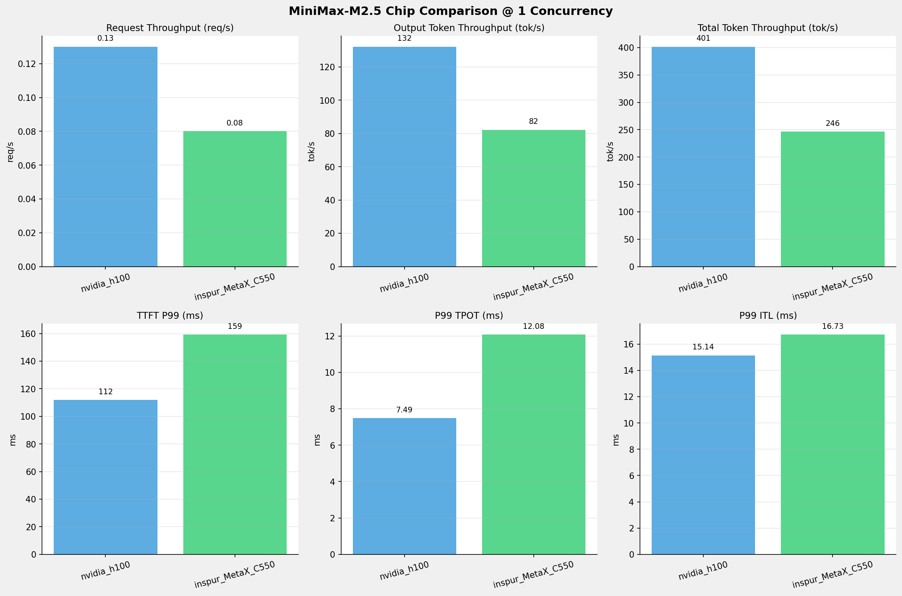
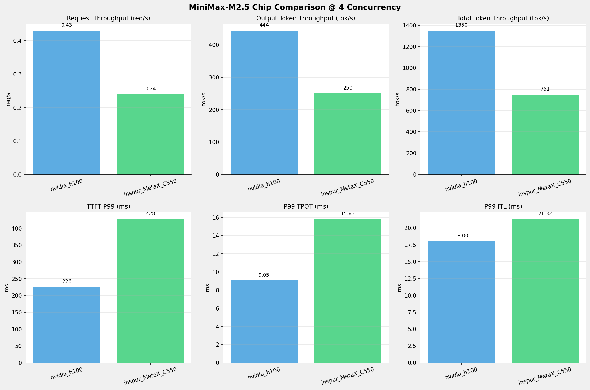
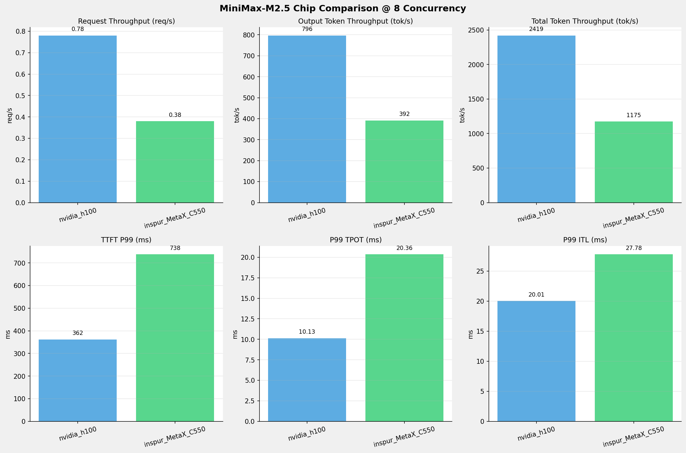
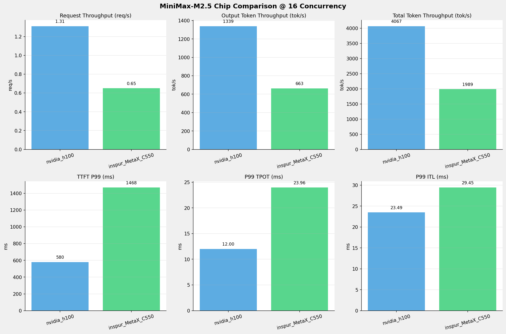
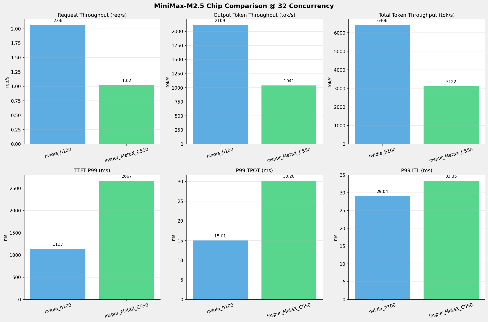
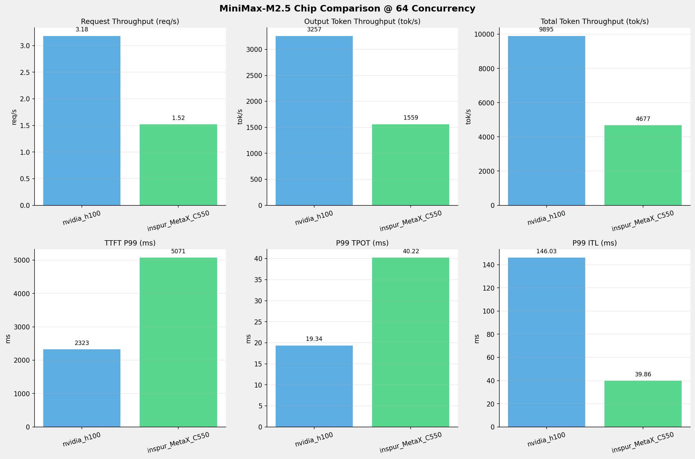
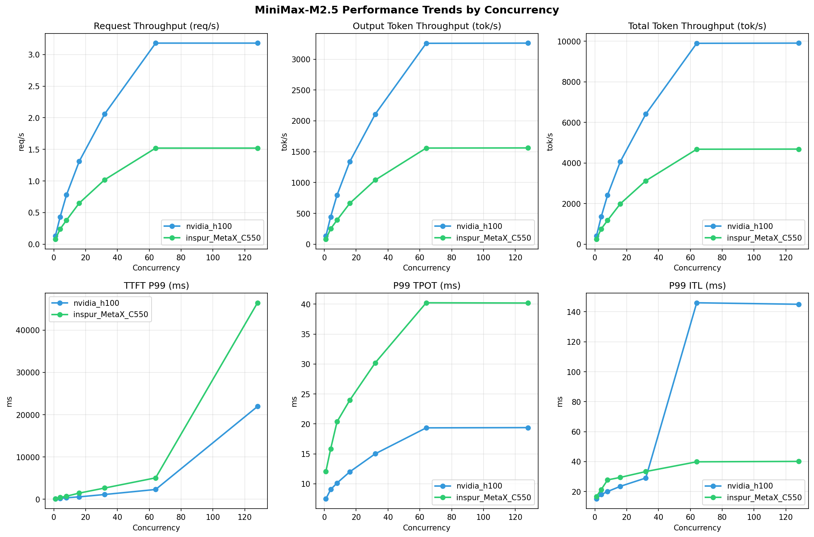

# MiniMax-M2.5模型在不同芯片下的基准测试报告

**测试日期：** 2026-05-19

---

## 测试场景
在固定请求数，输入上下文和输出上下文长度下，使用SGLang基准测试工具对并发数逐级增加场景的性能基准验证。并对比同一模型在不同芯片环境上的性能指标。

**主要采集指标**：

| 指标                  | 单位         | 含义                                 |
|---------------------|------------|------------------------------------|
| TTFT                | ms         | Time To First Token，首 token 延迟     |
| TPOT                | ms/token   | Time Per Output Token，每 token 生成时间 |
| Throughput          | tokens/s   | 系统总吞吐                              |
| QPS                 | requests/s | 请求吞吐                               |

### 📊 测试概览

| 项目            | 配置                                     | 备注  |
|---------------|----------------------------------------|-----|
| **数据集**       | random                                 |     |
| **并发数**       | 1, 4, 8, 16, 32, 64, 128    |     |
| **总请求数**      | 1000                                    |     |
| **请求输入上下文长度** | 2048（2k）                             |     |
| **请求输出上下文长度** | 1024（1k）                             |     |
| **被测芯片**      | nvidia_h100, inspur_MetaX_C550 |     |
| **被测模型**      | nvidia_h100 (MiniMax-M2.5), inspur_MetaX_C550 (MiniMax-M2.5-W8A8) |     |

---

### 📊 芯片性能对比柱状图

**1并发**

**4并发**

**8并发**

**16并发**

**32并发**

**64并发**

**128并发**

### 📈 性能趋势对比图 (所有芯片)

---

### 📈 各指标随并发级别性能对比详情

#### 请求吞吐量（Request throughput (req/s)）

| 并发数 | nvidia_h100 | inspur_MetaX_C550 | 差值 | 百分比 |
|-----|----------- | ----------- | ----------- | -----------|
| 1   | **0.13** ⭐ | 0.08 | -0.05 | -38.5% |
| 4   | **0.43** ⭐ | 0.24 | -0.19 | -44.2% |
| 8   | **0.78** ⭐ | 0.38 | -0.40 | -51.3% |
| 16   | **1.31** ⭐ | 0.65 | -0.66 | -50.4% |
| 32   | **2.06** ⭐ | 1.02 | -1.04 | -50.5% |
| 64   | **3.18** ⭐ | 1.52 | -1.66 | -52.2% |
| 128   | **3.18** ⭐ | 1.52 | -1.66 | -52.2% |

#### 输入token吞吐量（Input token throughput (tok/s)）

| 并发数 | nvidia_h100 | inspur_MetaX_C550 | 差值 | 百分比 |
|-----|----------- | ----------- | ----------- | -----------|
| 1   | N/A | 164.31 | N/A | N/A |
| 4   | N/A | 500.50 | N/A | N/A |
| 8   | N/A | 783.02 | N/A | N/A |
| 16   | N/A | 1326.32 | N/A | N/A |
| 32   | N/A | 2081.61 | N/A | N/A |
| 64   | N/A | 3117.98 | N/A | N/A |
| 128   | N/A | 3122.14 | N/A | N/A |

#### 输出token吞吐量（Output token throughput (tok/s)）

| 并发数 | nvidia_h100 | inspur_MetaX_C550 | 差值 | 百分比 |
|-----|----------- | ----------- | ----------- | -----------|
| 1   | **132.15** ⭐ | 82.15 | -50.00 | -37.8% |
| 4   | **444.20** ⭐ | 250.25 | -193.95 | -43.7% |
| 8   | **796.35** ⭐ | 391.51 | -404.84 | -50.8% |
| 16   | **1338.77** ⭐ | 663.16 | -675.61 | -50.5% |
| 32   | **2108.53** ⭐ | 1040.81 | -1067.72 | -50.6% |
| 64   | **3257.09** ⭐ | 1558.99 | -1698.10 | -52.1% |
| 128   | **3260.17** ⭐ | 1561.07 | -1699.10 | -52.1% |

#### 总token吞吐量（Total token throughput (tok/s)）

| 并发数 | nvidia_h100 | inspur_MetaX_C550 | 差值 | 百分比 |
|-----|----------- | ----------- | ----------- | -----------|
| 1   | **401.49** ⭐ | 246.46 | -155.03 | -38.6% |
| 4   | **1349.53** ⭐ | 750.74 | -598.79 | -44.4% |
| 8   | **2419.37** ⭐ | 1174.52 | -1244.85 | -51.5% |
| 16   | **4067.31** ⭐ | 1989.48 | -2077.83 | -51.1% |
| 32   | **6405.90** ⭐ | 3122.42 | -3283.48 | -51.3% |
| 64   | **9895.33** ⭐ | 4676.97 | -5218.36 | -52.7% |
| 128   | **9904.68** ⭐ | 4683.20 | -5221.48 | -52.7% |

#### 首token延迟（P99 TTFT (ms)）

| 并发数 | nvidia_h100 | inspur_MetaX_C550 | 差值        | 百分比     |
|-----|-------------|-------------------|-----------|---------|
| 1   | 111.86      | 159.25            | +47.39    | +42.4%  |
| 4   | 225.74      | 427.62            | +201.88   | +89.4%  |
| 8   | 361.65      | 738.03            | +376.38   | +104.1% |
| 16  | 579.97      | 1468.34           | +888.37   | +153.2% |
| 32  | 1137.22     | 2667.43           | +1530.21  | +134.6% |
| 64  | 2322.59     | 5071.27           | +2748.68  | +118.3% |
| 128 | 21939.31    | 46445.07          | +24505.76 | +111.7% |

#### 每token生成时间（P99 TPOT (ms)）

| 并发数 | nvidia_h100 | inspur_MetaX_C550 | 差值 | 百分比 |
|-----|----------- | ----------- | ----------- | -----------|
| 1   | 7.49 | 12.08 | +4.59 | +61.3% |
| 4   | 9.05 | 15.83 | +6.78 | +74.9% |
| 8   | 10.13 | 20.36 | +10.23 | +101.0% |
| 16   | 12.00 | 23.96 | +11.96 | +99.7% |
| 32   | 15.01 | 30.20 | +15.19 | +101.2% |
| 64   | 19.34 | 40.22 | +20.88 | +108.0% |
| 128   | 19.38 | 40.18 | +20.80 | +107.3% |

#### token间延迟（P99 ITL (ms)）

| 并发数 | nvidia_h100 | inspur_MetaX_C550 | 差值 | 百分比 |
|-----|----------- | ----------- | ----------- | -----------|
| 1   | 15.14 | 16.73 | +1.59 | +10.5% |
| 4   | 18.00 | 21.32 | +3.32 | +18.4% |
| 8   | 20.01 | 27.78 | +7.77 | +38.8% |
| 16   | 23.49 | 29.45 | +5.96 | +25.4% |
| 32   | 29.04 | 33.35 | +4.31 | +14.8% |
| 64   | 146.03 | 39.86 | -106.17 | -72.7% |
| 128   | 145.04 | 40.13 | -104.91 | -72.3% |

### 📈 各并发级别性能对比详情

#### 1 并发

| 指标 | nvidia_h100 | inspur_MetaX_C550 |
|------|----------- | -----------|
| 请求吞吐量（Request throughput (req/s)） | **0.13** ⭐ | 0.08 |
| 输入token吞吐量（Input token throughput (tok/s)） | N/A | 164.31 |
| 输出token吞吐量（Output token throughput (tok/s)） | **132.15** ⭐ | 82.15 |
| 总token吞吐量（Total token throughput (tok/s)） | **401.49** ⭐ | 246.46 |
| 首token延迟（P99 TTFT (ms)） | **111.86** ⭐ | 159.25 |
| 每token生成时间（P99 TPOT (ms)） | **7.49** ⭐ | 12.08 |
| token间延迟（P99 ITL (ms)） | **15.14** ⭐ | 16.73 |

#### 4 并发

| 指标 | nvidia_h100 | inspur_MetaX_C550 |
|------|----------- | -----------|
| 请求吞吐量（Request throughput (req/s)） | **0.43** ⭐ | 0.24 |
| 输入token吞吐量（Input token throughput (tok/s)） | N/A | 500.50 |
| 输出token吞吐量（Output token throughput (tok/s)） | **444.20** ⭐ | 250.25 |
| 总token吞吐量（Total token throughput (tok/s)） | **1349.53** ⭐ | 750.74 |
| 首token延迟（P99 TTFT (ms)） | **225.74** ⭐ | 427.62 |
| 每token生成时间（P99 TPOT (ms)） | **9.05** ⭐ | 15.83 |
| token间延迟（P99 ITL (ms)） | **18.00** ⭐ | 21.32 |

#### 8 并发

| 指标 | nvidia_h100 | inspur_MetaX_C550 |
|------|----------- | -----------|
| 请求吞吐量（Request throughput (req/s)） | **0.78** ⭐ | 0.38 |
| 输入token吞吐量（Input token throughput (tok/s)） | N/A | 783.02 |
| 输出token吞吐量（Output token throughput (tok/s)） | **796.35** ⭐ | 391.51 |
| 总token吞吐量（Total token throughput (tok/s)） | **2419.37** ⭐ | 1174.52 |
| 首token延迟（P99 TTFT (ms)） | **361.65** ⭐ | 738.03 |
| 每token生成时间（P99 TPOT (ms)） | **10.13** ⭐ | 20.36 |
| token间延迟（P99 ITL (ms)） | **20.01** ⭐ | 27.78 |

#### 16 并发

| 指标 | nvidia_h100 | inspur_MetaX_C550 |
|------|----------- | -----------|
| 请求吞吐量（Request throughput (req/s)） | **1.31** ⭐ | 0.65 |
| 输入token吞吐量（Input token throughput (tok/s)） | N/A | 1326.32 |
| 输出token吞吐量（Output token throughput (tok/s)） | **1338.77** ⭐ | 663.16 |
| 总token吞吐量（Total token throughput (tok/s)） | **4067.31** ⭐ | 1989.48 |
| 首token延迟（P99 TTFT (ms)） | **579.97** ⭐ | 1468.34 |
| 每token生成时间（P99 TPOT (ms)） | **12.00** ⭐ | 23.96 |
| token间延迟（P99 ITL (ms)） | **23.49** ⭐ | 29.45 |

#### 32 并发

| 指标 | nvidia_h100 | inspur_MetaX_C550 |
|------|----------- | -----------|
| 请求吞吐量（Request throughput (req/s)） | **2.06** ⭐ | 1.02 |
| 输入token吞吐量（Input token throughput (tok/s)） | N/A | 2081.61 |
| 输出token吞吐量（Output token throughput (tok/s)） | **2108.53** ⭐ | 1040.81 |
| 总token吞吐量（Total token throughput (tok/s)） | **6405.90** ⭐ | 3122.42 |
| 首token延迟（P99 TTFT (ms)） | **1137.22** ⭐ | 2667.43 |
| 每token生成时间（P99 TPOT (ms)） | **15.01** ⭐ | 30.20 |
| token间延迟（P99 ITL (ms)） | **29.04** ⭐ | 33.35 |

#### 64 并发

| 指标 | nvidia_h100 | inspur_MetaX_C550 |
|------|----------- | -----------|
| 请求吞吐量（Request throughput (req/s)） | **3.18** ⭐ | 1.52 |
| 输入token吞吐量（Input token throughput (tok/s)） | N/A | 3117.98 |
| 输出token吞吐量（Output token throughput (tok/s)） | **3257.09** ⭐ | 1558.99 |
| 总token吞吐量（Total token throughput (tok/s)） | **9895.33** ⭐ | 4676.97 |
| 首token延迟（P99 TTFT (ms)） | **2322.59** ⭐ | 5071.27 |
| 每token生成时间（P99 TPOT (ms)） | **19.34** ⭐ | 40.22 |
| token间延迟（P99 ITL (ms)） | 146.03 | **39.86** ⭐ |

#### 128 并发

| 指标 | nvidia_h100 | inspur_MetaX_C550 |
|------|----------- | -----------|
| 请求吞吐量（Request throughput (req/s)） | **3.18** ⭐ | 1.52 |
| 输入token吞吐量（Input token throughput (tok/s)） | N/A | 3122.14 |
| 输出token吞吐量（Output token throughput (tok/s)） | **3260.17** ⭐ | 1561.07 |
| 总token吞吐量（Total token throughput (tok/s)） | **9904.68** ⭐ | 4683.20 |
| 首token延迟（P99 TTFT (ms)） | **21939.31** ⭐ | 46445.07 |
| 每token生成时间（P99 TPOT (ms)） | **19.38** ⭐ | 40.18 |
| token间延迟（P99 ITL (ms)） | 145.04 | **40.13** ⭐ |

---

*报告生成时间: 2026-05-19*

