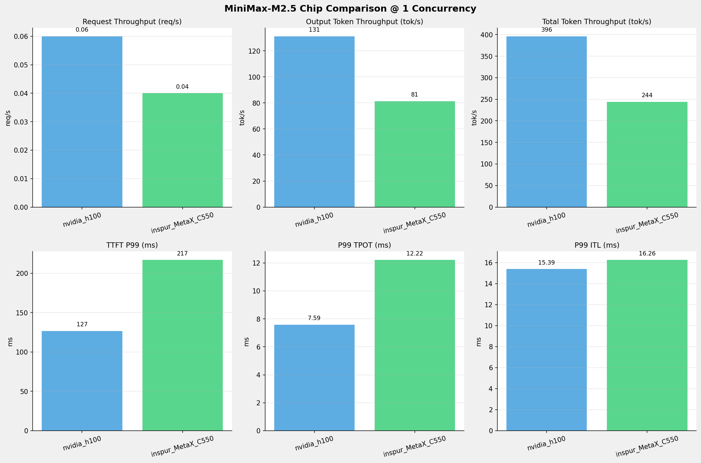
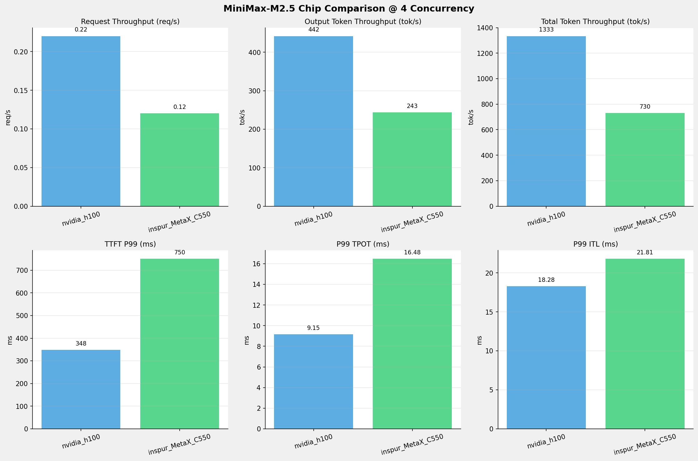
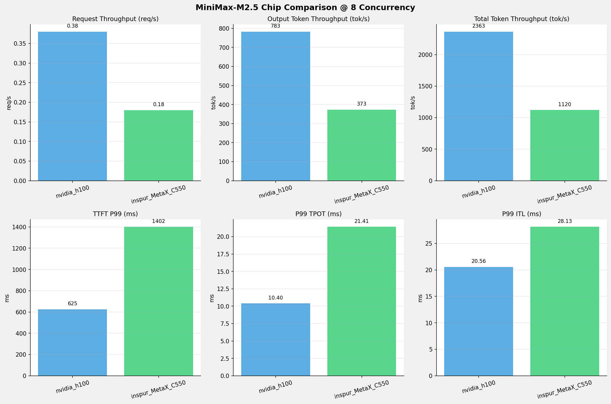
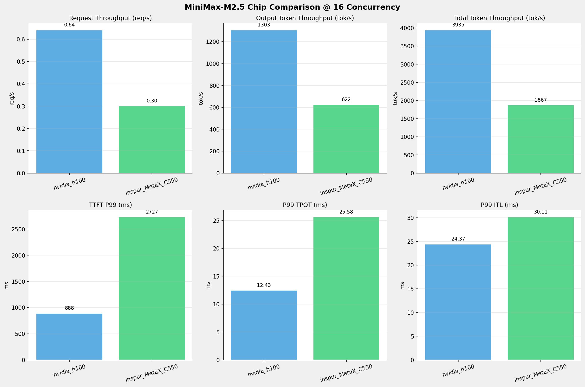
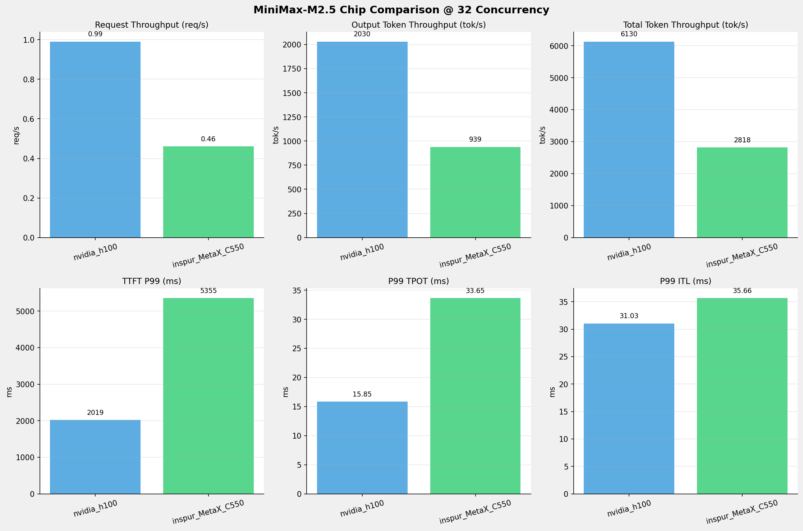
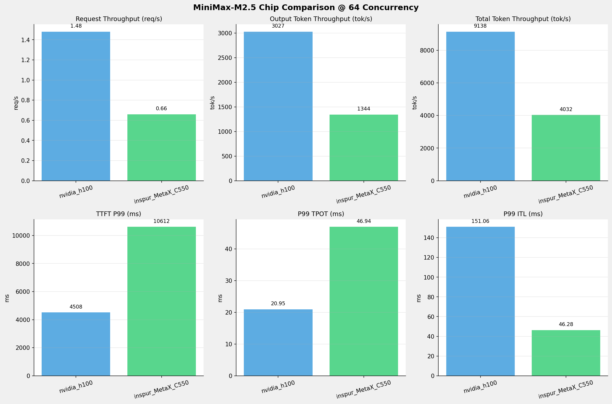
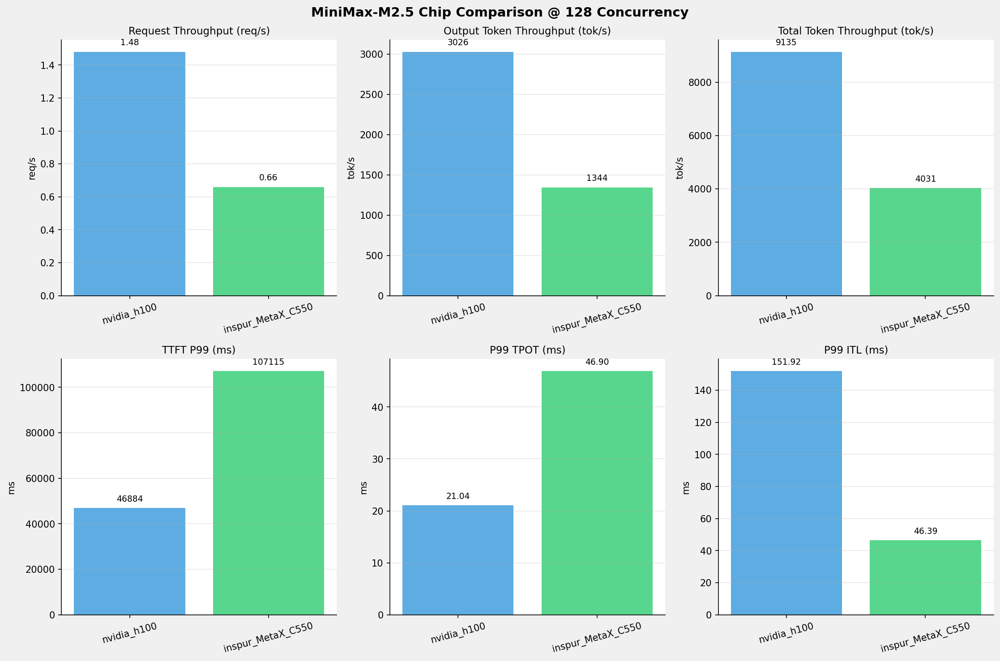
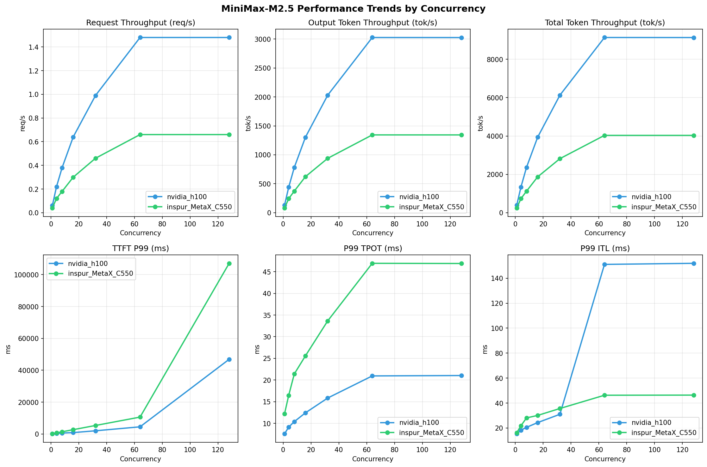

# MiniMax-M2.5模型在不同芯片下的基准测试报告

**测试日期：** 2026-05-19

---

## 测试场景
在固定请求数，输入上下文和输出上下文长度下，使用SGLang基准测试工具对并发数逐级增加场景的性能基准验证。并对比同一模型在不同芯片环境上的性能指标。

**主要采集指标**：

| 指标                  | 单位         | 含义                                 |
|---------------------|------------|------------------------------------|
| TTFT                | ms         | Time To First Token，首 token 延迟     |
| TPOT                | ms/token   | Time Per Output Token，每 token 生成时间 |
| Throughput          | tokens/s   | 系统总吞吐                              |
| QPS                 | requests/s | 请求吞吐                               |

### 📊 测试概览

| 项目            | 配置                                     | 备注  |
|---------------|----------------------------------------|-----|
| **数据集**       | random                                 |     |
| **并发数**       | 1, 4, 8, 16, 32, 64, 128    |     |
| **总请求数**      | 1000                                    |     |
| **请求输入上下文长度** | 4096（4k）                             |     |
| **请求输出上下文长度** | 2048（2k）                             |     |
| **被测芯片**      | nvidia_h100, inspur_MetaX_C550 |     |
| **被测模型**      | nvidia_h100 (MiniMax-M2.5), inspur_MetaX_C550 (MiniMax-M2.5-W8A8) |     |

---

### 📊 芯片性能对比柱状图

**1并发**

**4并发**

**8并发**

**16并发**

**32并发**

**64并发**

**128并发**

### 📈 性能趋势对比图 (所有芯片)

---

### 📈 各指标随并发级别性能对比详情

#### 请求吞吐量（Request throughput (req/s)）

| 并发数 | nvidia_h100 | inspur_MetaX_C550 | 差值 | 百分比 |
|-----|----------- | ----------- | ----------- | -----------|
| 1   | **0.06** ⭐ | 0.04 | -0.02 | -33.3% |
| 4   | **0.22** ⭐ | 0.12 | -0.10 | -45.5% |
| 8   | **0.38** ⭐ | 0.18 | -0.20 | -52.6% |
| 16   | **0.64** ⭐ | 0.30 | -0.34 | -53.1% |
| 32   | **0.99** ⭐ | 0.46 | -0.53 | -53.5% |
| 64   | **1.48** ⭐ | 0.66 | -0.82 | -55.4% |
| 128   | **1.48** ⭐ | 0.66 | -0.82 | -55.4% |

#### 输入token吞吐量（Input token throughput (tok/s)）

| 并发数 | nvidia_h100 | inspur_MetaX_C550 | 差值 | 百分比 |
|-----|----------- | ----------- | ----------- | -----------|
| 1   | N/A | 162.75 | N/A | N/A |
| 4   | N/A | 486.70 | N/A | N/A |
| 8   | N/A | 746.43 | N/A | N/A |
| 16   | N/A | 1244.84 | N/A | N/A |
| 32   | N/A | 1878.69 | N/A | N/A |
| 64   | N/A | 2687.85 | N/A | N/A |
| 128   | N/A | 2687.57 | N/A | N/A |

#### 输出token吞吐量（Output token throughput (tok/s)）

| 并发数 | nvidia_h100 | inspur_MetaX_C550 | 差值 | 百分比 |
|-----|----------- | ----------- | ----------- | -----------|
| 1   | **131.17** ⭐ | 81.37 | -49.80 | -38.0% |
| 4   | **441.66** ⭐ | 243.35 | -198.31 | -44.9% |
| 8   | **782.67** ⭐ | 373.22 | -409.45 | -52.3% |
| 16   | **1303.31** ⭐ | 622.42 | -680.89 | -52.2% |
| 32   | **2030.40** ⭐ | 939.34 | -1091.06 | -53.7% |
| 64   | **3026.85** ⭐ | 1343.93 | -1682.92 | -55.6% |
| 128   | **3025.82** ⭐ | 1343.79 | -1682.03 | -55.6% |

#### 总token吞吐量（Total token throughput (tok/s)）

| 并发数 | nvidia_h100 | inspur_MetaX_C550 | 差值 | 百分比 |
|-----|----------- | ----------- | ----------- | -----------|
| 1   | **396.00** ⭐ | 244.12 | -151.88 | -38.4% |
| 4   | **1333.39** ⭐ | 730.04 | -603.35 | -45.2% |
| 8   | **2362.93** ⭐ | 1119.65 | -1243.28 | -52.6% |
| 16   | **3934.74** ⭐ | 1867.27 | -2067.47 | -52.5% |
| 32   | **6129.87** ⭐ | 2818.03 | -3311.84 | -54.0% |
| 64   | **9138.18** ⭐ | 4031.78 | -5106.40 | -55.9% |
| 128   | **9135.07** ⭐ | 4031.36 | -5103.71 | -55.9% |

#### 首token延迟（P99 TTFT (ms)）

| 并发数 | nvidia_h100 | inspur_MetaX_C550 | 差值 | 百分比 |
|-----|----------- | ----------- | ----------- | -----------|
| 1   | 126.64 | 217.04 | +90.40 | +71.4% |
| 4   | 347.71 | 750.50 | +402.79 | +115.8% |
| 8   | 625.36 | 1401.61 | +776.25 | +124.1% |
| 16   | 887.67 | 2726.73 | +1839.06 | +207.2% |
| 32   | 2019.10 | 5355.02 | +3335.92 | +165.2% |
| 64   | 4507.91 | 10612.19 | +6104.28 | +135.4% |
| 128   | 46883.70 | 107114.91 | +60231.21 | +128.5% |

#### 每token生成时间（P99 TPOT (ms)）

| 并发数 | nvidia_h100 | inspur_MetaX_C550 | 差值 | 百分比 |
|-----|----------- | ----------- | ----------- | -----------|
| 1   | 7.59 | 12.22 | +4.63 | +61.0% |
| 4   | 9.15 | 16.48 | +7.33 | +80.1% |
| 8   | 10.40 | 21.41 | +11.01 | +105.9% |
| 16   | 12.43 | 25.58 | +13.15 | +105.8% |
| 32   | 15.85 | 33.65 | +17.80 | +112.3% |
| 64   | 20.95 | 46.94 | +25.99 | +124.1% |
| 128   | 21.04 | 46.90 | +25.86 | +122.9% |

#### token间延迟（P99 ITL (ms)）

| 并发数 | nvidia_h100 | inspur_MetaX_C550 | 差值 | 百分比 |
|-----|----------- | ----------- | ----------- | -----------|
| 1   | 15.39 | 16.26 | +0.87 | +5.7% |
| 4   | 18.28 | 21.81 | +3.53 | +19.3% |
| 8   | 20.56 | 28.13 | +7.57 | +36.8% |
| 16   | 24.37 | 30.11 | +5.74 | +23.6% |
| 32   | 31.03 | 35.66 | +4.63 | +14.9% |
| 64   | 151.06 | 46.28 | -104.78 | -69.4% |
| 128   | 151.92 | 46.39 | -105.53 | -69.5% |

### 📈 各并发级别性能对比详情

#### 1 并发

| 指标 | nvidia_h100 | inspur_MetaX_C550 |
|------|----------- | -----------|
| 请求吞吐量（Request throughput (req/s)） | **0.06** ⭐ | 0.04 |
| 输入token吞吐量（Input token throughput (tok/s)） | N/A | 162.75 |
| 输出token吞吐量（Output token throughput (tok/s)） | **131.17** ⭐ | 81.37 |
| 总token吞吐量（Total token throughput (tok/s)） | **396.00** ⭐ | 244.12 |
| 首token延迟（P99 TTFT (ms)） | **126.64** ⭐ | 217.04 |
| 每token生成时间（P99 TPOT (ms)） | **7.59** ⭐ | 12.22 |
| token间延迟（P99 ITL (ms)） | **15.39** ⭐ | 16.26 |

#### 4 并发

| 指标 | nvidia_h100 | inspur_MetaX_C550 |
|------|----------- | -----------|
| 请求吞吐量（Request throughput (req/s)） | **0.22** ⭐ | 0.12 |
| 输入token吞吐量（Input token throughput (tok/s)） | N/A | 486.70 |
| 输出token吞吐量（Output token throughput (tok/s)） | **441.66** ⭐ | 243.35 |
| 总token吞吐量（Total token throughput (tok/s)） | **1333.39** ⭐ | 730.04 |
| 首token延迟（P99 TTFT (ms)） | **347.71** ⭐ | 750.50 |
| 每token生成时间（P99 TPOT (ms)） | **9.15** ⭐ | 16.48 |
| token间延迟（P99 ITL (ms)） | **18.28** ⭐ | 21.81 |

#### 8 并发

| 指标 | nvidia_h100 | inspur_MetaX_C550 |
|------|----------- | -----------|
| 请求吞吐量（Request throughput (req/s)） | **0.38** ⭐ | 0.18 |
| 输入token吞吐量（Input token throughput (tok/s)） | N/A | 746.43 |
| 输出token吞吐量（Output token throughput (tok/s)） | **782.67** ⭐ | 373.22 |
| 总token吞吐量（Total token throughput (tok/s)） | **2362.93** ⭐ | 1119.65 |
| 首token延迟（P99 TTFT (ms)） | **625.36** ⭐ | 1401.61 |
| 每token生成时间（P99 TPOT (ms)） | **10.40** ⭐ | 21.41 |
| token间延迟（P99 ITL (ms)） | **20.56** ⭐ | 28.13 |

#### 16 并发

| 指标 | nvidia_h100 | inspur_MetaX_C550 |
|------|----------- | -----------|
| 请求吞吐量（Request throughput (req/s)） | **0.64** ⭐ | 0.30 |
| 输入token吞吐量（Input token throughput (tok/s)） | N/A | 1244.84 |
| 输出token吞吐量（Output token throughput (tok/s)） | **1303.31** ⭐ | 622.42 |
| 总token吞吐量（Total token throughput (tok/s)） | **3934.74** ⭐ | 1867.27 |
| 首token延迟（P99 TTFT (ms)） | **887.67** ⭐ | 2726.73 |
| 每token生成时间（P99 TPOT (ms)） | **12.43** ⭐ | 25.58 |
| token间延迟（P99 ITL (ms)） | **24.37** ⭐ | 30.11 |

#### 32 并发

| 指标 | nvidia_h100 | inspur_MetaX_C550 |
|------|----------- | -----------|
| 请求吞吐量（Request throughput (req/s)） | **0.99** ⭐ | 0.46 |
| 输入token吞吐量（Input token throughput (tok/s)） | N/A | 1878.69 |
| 输出token吞吐量（Output token throughput (tok/s)） | **2030.40** ⭐ | 939.34 |
| 总token吞吐量（Total token throughput (tok/s)） | **6129.87** ⭐ | 2818.03 |
| 首token延迟（P99 TTFT (ms)） | **2019.10** ⭐ | 5355.02 |
| 每token生成时间（P99 TPOT (ms)） | **15.85** ⭐ | 33.65 |
| token间延迟（P99 ITL (ms)） | **31.03** ⭐ | 35.66 |

#### 64 并发

| 指标 | nvidia_h100 | inspur_MetaX_C550 |
|------|----------- | -----------|
| 请求吞吐量（Request throughput (req/s)） | **1.48** ⭐ | 0.66 |
| 输入token吞吐量（Input token throughput (tok/s)） | N/A | 2687.85 |
| 输出token吞吐量（Output token throughput (tok/s)） | **3026.85** ⭐ | 1343.93 |
| 总token吞吐量（Total token throughput (tok/s)） | **9138.18** ⭐ | 4031.78 |
| 首token延迟（P99 TTFT (ms)） | **4507.91** ⭐ | 10612.19 |
| 每token生成时间（P99 TPOT (ms)） | **20.95** ⭐ | 46.94 |
| token间延迟（P99 ITL (ms)） | 151.06 | **46.28** ⭐ |

#### 128 并发

| 指标 | nvidia_h100 | inspur_MetaX_C550 |
|------|----------- | -----------|
| 请求吞吐量（Request throughput (req/s)） | **1.48** ⭐ | 0.66 |
| 输入token吞吐量（Input token throughput (tok/s)） | N/A | 2687.57 |
| 输出token吞吐量（Output token throughput (tok/s)） | **3025.82** ⭐ | 1343.79 |
| 总token吞吐量（Total token throughput (tok/s)） | **9135.07** ⭐ | 4031.36 |
| 首token延迟（P99 TTFT (ms)） | **46883.70** ⭐ | 107114.91 |
| 每token生成时间（P99 TPOT (ms)） | **21.04** ⭐ | 46.90 |
| token间延迟（P99 ITL (ms)） | 151.92 | **46.39** ⭐ |

---

*报告生成时间: 2026-05-19*

