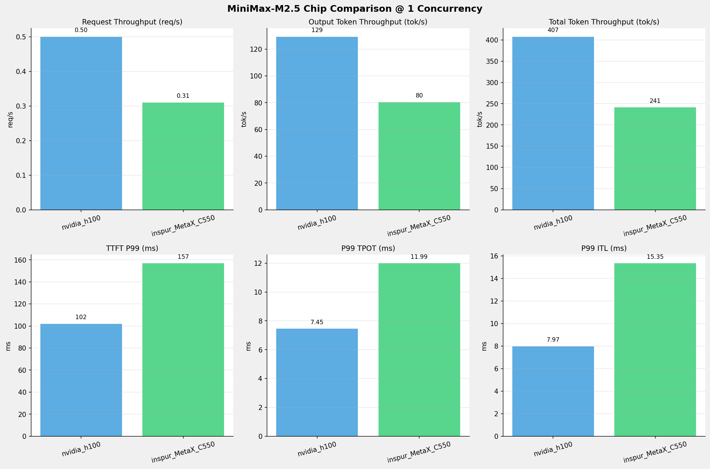
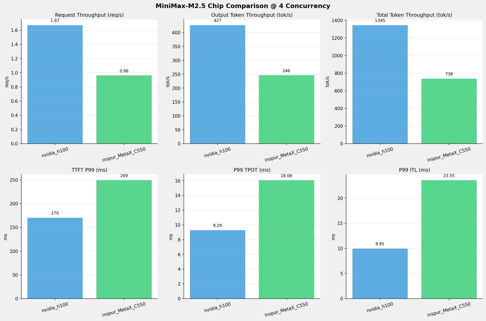
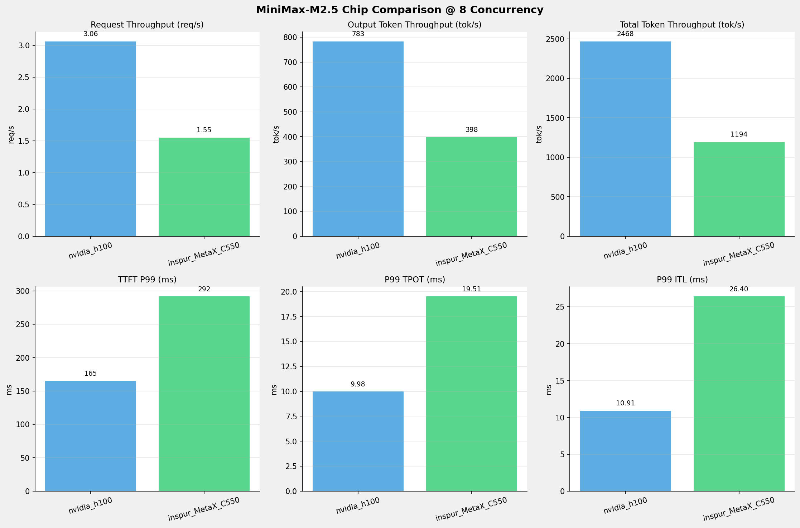
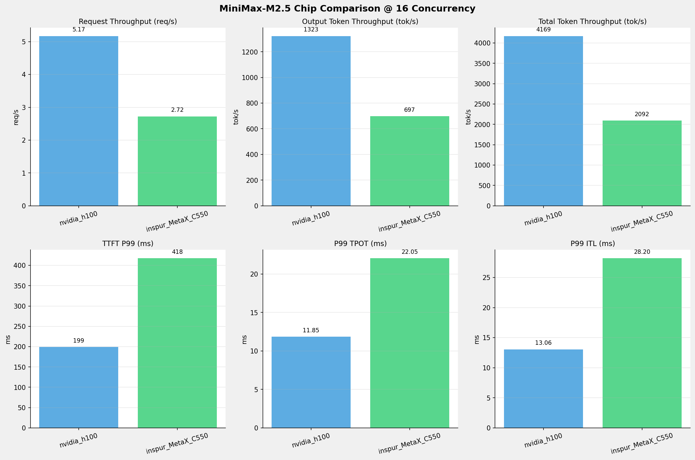
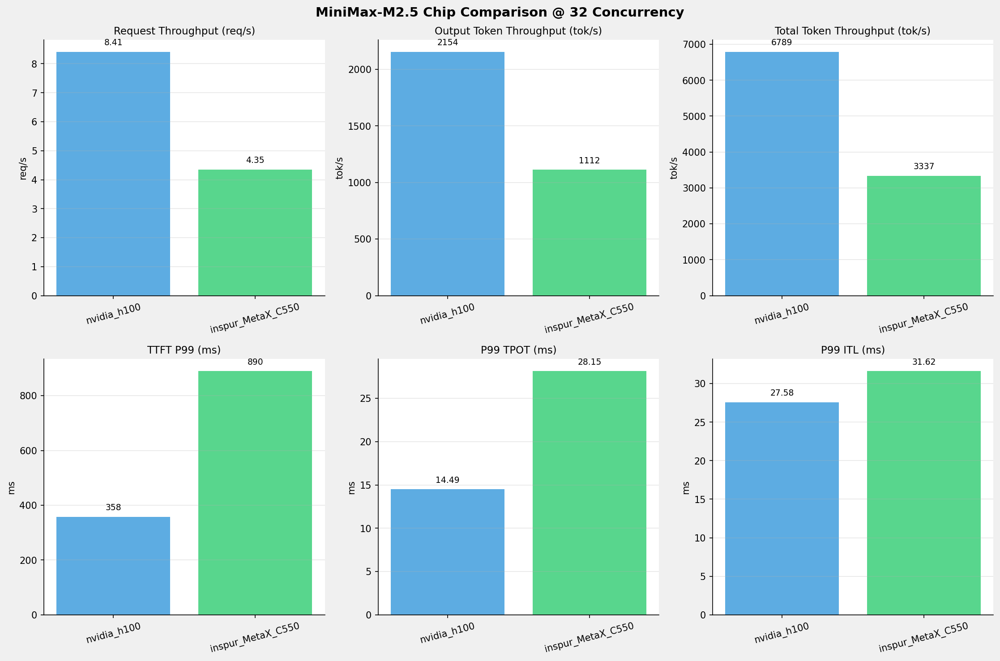
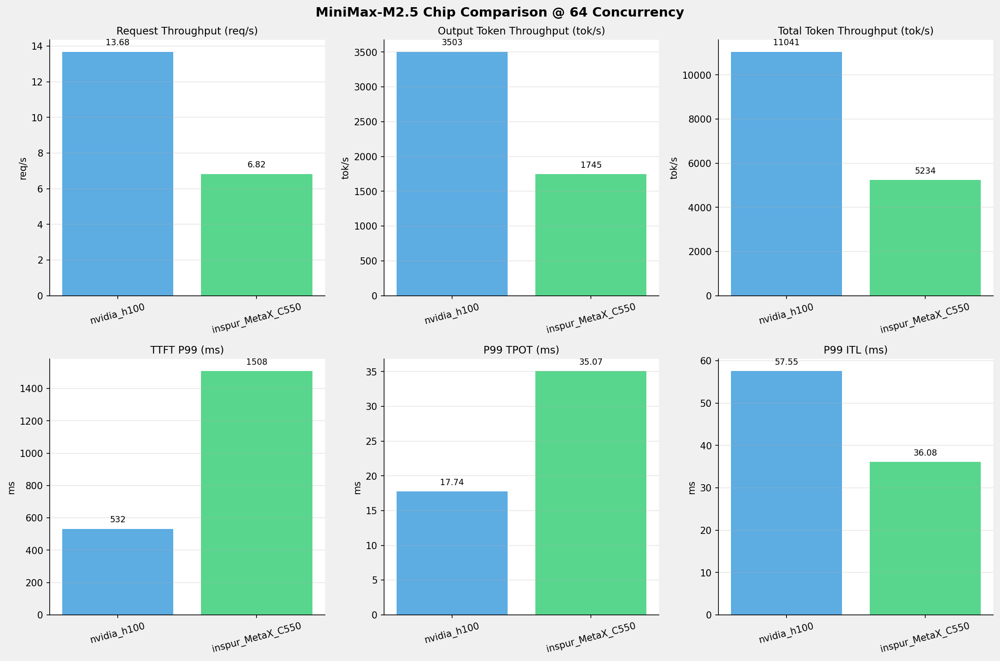
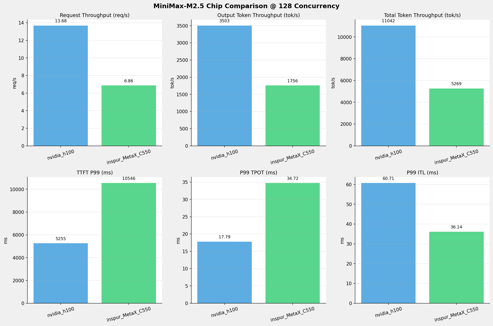
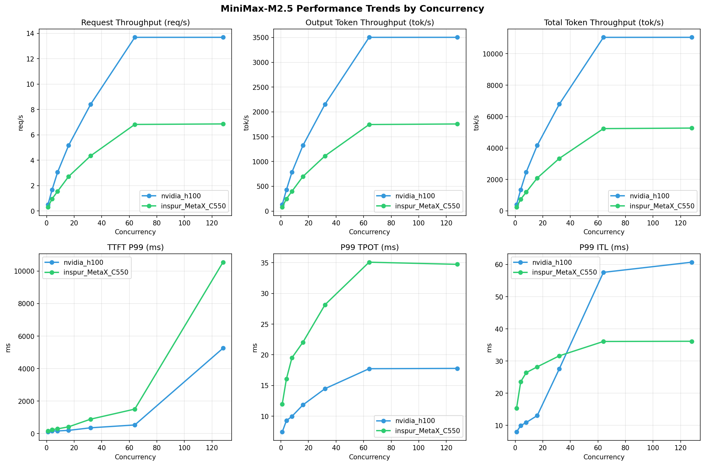

# MiniMax-M2.5模型在不同芯片下的基准测试报告

**测试日期：** 2026-05-19

---

## 测试场景
在固定请求数，输入上下文和输出上下文长度下，使用SGLang基准测试工具对并发数逐级增加场景的性能基准验证。并对比同一模型在不同芯片环境上的性能指标。

**主要采集指标**：

| 指标                  | 单位         | 含义                                 |
|---------------------|------------|------------------------------------|
| TTFT                | ms         | Time To First Token，首 token 延迟     |
| TPOT                | ms/token   | Time Per Output Token，每 token 生成时间 |
| Throughput          | tokens/s   | 系统总吞吐                              |
| QPS                 | requests/s | 请求吞吐                               |

### 📊 测试概览

| 项目            | 配置                                     | 备注  |
|---------------|----------------------------------------|-----|
| **数据集**       | random                                 |     |
| **并发数**       | 1, 4, 8, 16, 32, 64, 128    |     |
| **总请求数**      | 1000                                    |     |
| **请求输入上下文长度** | 512（0.50k）                             |     |
| **请求输出上下文长度** | 256（0.25k）                             |     |
| **被测芯片**      | nvidia_h100, inspur_MetaX_C550 |     |
| **被测模型**      | nvidia_h100 (MiniMax-M2.5), inspur_MetaX_C550 (MiniMax-M2.5-W8A8) |     |

---

### 📊 芯片性能对比柱状图

**1并发**

**4并发**

**8并发**

**16并发**

**32并发**

**64并发**

**128并发**

### 📈 性能趋势对比图 (所有芯片)

---

### 📈 各指标随并发级别性能对比详情

#### 请求吞吐量（Request throughput (req/s)）

| 并发数 | nvidia_h100 | inspur_MetaX_C550 | 差值 | 百分比 |
|-----|----------- | ----------- | ----------- | -----------|
| 1   | **0.50** ⭐ | 0.31 | -0.19 | -38.0% |
| 4   | **1.67** ⭐ | 0.96 | -0.71 | -42.5% |
| 8   | **3.06** ⭐ | 1.55 | -1.51 | -49.3% |
| 16   | **5.17** ⭐ | 2.72 | -2.45 | -47.4% |
| 32   | **8.41** ⭐ | 4.35 | -4.06 | -48.3% |
| 64   | **13.68** ⭐ | 6.82 | -6.86 | -50.1% |
| 128   | **13.68** ⭐ | 6.86 | -6.82 | -49.9% |

#### 输入token吞吐量（Input token throughput (tok/s)）

| 并发数 | nvidia_h100 | inspur_MetaX_C550 | 差值 | 百分比 |
|-----|----------- | ----------- | ----------- | -----------|
| 1   | N/A | 160.70 | N/A | N/A |
| 4   | N/A | 492.20 | N/A | N/A |
| 8   | N/A | 795.96 | N/A | N/A |
| 16   | N/A | 1394.68 | N/A | N/A |
| 32   | N/A | 2224.93 | N/A | N/A |
| 64   | N/A | 3489.58 | N/A | N/A |
| 128   | N/A | 3512.55 | N/A | N/A |

#### 输出token吞吐量（Output token throughput (tok/s)）

| 并发数 | nvidia_h100 | inspur_MetaX_C550 | 差值 | 百分比 |
|-----|----------- | ----------- | ----------- | -----------|
| 1   | **129.25** ⭐ | 80.35 | -48.90 | -37.8% |
| 4   | **426.71** ⭐ | 246.10 | -180.61 | -42.3% |
| 8   | **782.80** ⭐ | 397.98 | -384.82 | -49.2% |
| 16   | **1322.61** ⭐ | 697.34 | -625.27 | -47.3% |
| 32   | **2153.58** ⭐ | 1112.46 | -1041.12 | -48.3% |
| 64   | **3502.52** ⭐ | 1744.79 | -1757.73 | -50.2% |
| 128   | **3502.84** ⭐ | 1756.27 | -1746.57 | -49.9% |

#### 总token吞吐量（Total token throughput (tok/s)）

| 并发数 | nvidia_h100 | inspur_MetaX_C550 | 差值 | 百分比 |
|-----|----------- | ----------- | ----------- | -----------|
| 1   | **407.43** ⭐ | 241.04 | -166.39 | -40.8% |
| 4   | **1345.13** ⭐ | 738.30 | -606.83 | -45.1% |
| 8   | **2467.65** ⭐ | 1193.94 | -1273.71 | -51.6% |
| 16   | **4169.31** ⭐ | 2092.01 | -2077.30 | -49.8% |
| 32   | **6788.82** ⭐ | 3337.39 | -3451.43 | -50.8% |
| 64   | **11041.15** ⭐ | 5234.37 | -5806.78 | -52.6% |
| 128   | **11042.17** ⭐ | 5268.82 | -5773.35 | -52.3% |

#### 首token延迟（P99 TTFT (ms)）

| 并发数 | nvidia_h100 | inspur_MetaX_C550 | 差值 | 百分比 |
|-----|----------- | ----------- | ----------- | -----------|
| 1   | 101.94 | 156.87 | +54.93 | +53.9% |
| 4   | 170.36 | 249.24 | +78.88 | +46.3% |
| 8   | 165.00 | 291.68 | +126.68 | +76.8% |
| 16   | 199.16 | 417.62 | +218.46 | +109.7% |
| 32   | 357.62 | 889.77 | +532.15 | +148.8% |
| 64   | 531.95 | 1507.81 | +975.86 | +183.4% |
| 128   | 5255.30 | 10546.24 | +5290.94 | +100.7% |

#### 每token生成时间（P99 TPOT (ms)）

| 并发数 | nvidia_h100 | inspur_MetaX_C550 | 差值 | 百分比 |
|-----|----------- | ----------- | ----------- | -----------|
| 1   | 7.45 | 11.99 | +4.54 | +60.9% |
| 4   | 9.29 | 16.06 | +6.77 | +72.9% |
| 8   | 9.98 | 19.51 | +9.53 | +95.5% |
| 16   | 11.85 | 22.05 | +10.20 | +86.1% |
| 32   | 14.49 | 28.15 | +13.66 | +94.3% |
| 64   | 17.74 | 35.07 | +17.33 | +97.7% |
| 128   | 17.79 | 34.72 | +16.93 | +95.2% |

#### token间延迟（P99 ITL (ms)）

| 并发数 | nvidia_h100 | inspur_MetaX_C550 | 差值 | 百分比 |
|-----|----------- | ----------- | ----------- | -----------|
| 1   | 7.97 | 15.35 | +7.38 | +92.6% |
| 4   | 9.95 | 23.55 | +13.60 | +136.7% |
| 8   | 10.91 | 26.40 | +15.49 | +142.0% |
| 16   | 13.06 | 28.20 | +15.14 | +115.9% |
| 32   | 27.58 | 31.62 | +4.04 | +14.6% |
| 64   | 57.55 | 36.08 | -21.47 | -37.3% |
| 128   | 60.71 | 36.14 | -24.57 | -40.5% |

### 📈 各并发级别性能对比详情

#### 1 并发

| 指标 | nvidia_h100 | inspur_MetaX_C550 |
|------|----------- | -----------|
| 请求吞吐量（Request throughput (req/s)） | **0.50** ⭐ | 0.31 |
| 输入token吞吐量（Input token throughput (tok/s)） | N/A | 160.70 |
| 输出token吞吐量（Output token throughput (tok/s)） | **129.25** ⭐ | 80.35 |
| 总token吞吐量（Total token throughput (tok/s)） | **407.43** ⭐ | 241.04 |
| 首token延迟（P99 TTFT (ms)） | **101.94** ⭐ | 156.87 |
| 每token生成时间（P99 TPOT (ms)） | **7.45** ⭐ | 11.99 |
| token间延迟（P99 ITL (ms)） | **7.97** ⭐ | 15.35 |

#### 4 并发

| 指标 | nvidia_h100 | inspur_MetaX_C550 |
|------|----------- | -----------|
| 请求吞吐量（Request throughput (req/s)） | **1.67** ⭐ | 0.96 |
| 输入token吞吐量（Input token throughput (tok/s)） | N/A | 492.20 |
| 输出token吞吐量（Output token throughput (tok/s)） | **426.71** ⭐ | 246.10 |
| 总token吞吐量（Total token throughput (tok/s)） | **1345.13** ⭐ | 738.30 |
| 首token延迟（P99 TTFT (ms)） | **170.36** ⭐ | 249.24 |
| 每token生成时间（P99 TPOT (ms)） | **9.29** ⭐ | 16.06 |
| token间延迟（P99 ITL (ms)） | **9.95** ⭐ | 23.55 |

#### 8 并发

| 指标 | nvidia_h100 | inspur_MetaX_C550 |
|------|----------- | -----------|
| 请求吞吐量（Request throughput (req/s)） | **3.06** ⭐ | 1.55 |
| 输入token吞吐量（Input token throughput (tok/s)） | N/A | 795.96 |
| 输出token吞吐量（Output token throughput (tok/s)） | **782.80** ⭐ | 397.98 |
| 总token吞吐量（Total token throughput (tok/s)） | **2467.65** ⭐ | 1193.94 |
| 首token延迟（P99 TTFT (ms)） | **165.00** ⭐ | 291.68 |
| 每token生成时间（P99 TPOT (ms)） | **9.98** ⭐ | 19.51 |
| token间延迟（P99 ITL (ms)） | **10.91** ⭐ | 26.40 |

#### 16 并发

| 指标 | nvidia_h100 | inspur_MetaX_C550 |
|------|----------- | -----------|
| 请求吞吐量（Request throughput (req/s)） | **5.17** ⭐ | 2.72 |
| 输入token吞吐量（Input token throughput (tok/s)） | N/A | 1394.68 |
| 输出token吞吐量（Output token throughput (tok/s)） | **1322.61** ⭐ | 697.34 |
| 总token吞吐量（Total token throughput (tok/s)） | **4169.31** ⭐ | 2092.01 |
| 首token延迟（P99 TTFT (ms)） | **199.16** ⭐ | 417.62 |
| 每token生成时间（P99 TPOT (ms)） | **11.85** ⭐ | 22.05 |
| token间延迟（P99 ITL (ms)） | **13.06** ⭐ | 28.20 |

#### 32 并发

| 指标 | nvidia_h100 | inspur_MetaX_C550 |
|------|----------- | -----------|
| 请求吞吐量（Request throughput (req/s)） | **8.41** ⭐ | 4.35 |
| 输入token吞吐量（Input token throughput (tok/s)） | N/A | 2224.93 |
| 输出token吞吐量（Output token throughput (tok/s)） | **2153.58** ⭐ | 1112.46 |
| 总token吞吐量（Total token throughput (tok/s)） | **6788.82** ⭐ | 3337.39 |
| 首token延迟（P99 TTFT (ms)） | **357.62** ⭐ | 889.77 |
| 每token生成时间（P99 TPOT (ms)） | **14.49** ⭐ | 28.15 |
| token间延迟（P99 ITL (ms)） | **27.58** ⭐ | 31.62 |

#### 64 并发

| 指标 | nvidia_h100 | inspur_MetaX_C550 |
|------|----------- | -----------|
| 请求吞吐量（Request throughput (req/s)） | **13.68** ⭐ | 6.82 |
| 输入token吞吐量（Input token throughput (tok/s)） | N/A | 3489.58 |
| 输出token吞吐量（Output token throughput (tok/s)） | **3502.52** ⭐ | 1744.79 |
| 总token吞吐量（Total token throughput (tok/s)） | **11041.15** ⭐ | 5234.37 |
| 首token延迟（P99 TTFT (ms)） | **531.95** ⭐ | 1507.81 |
| 每token生成时间（P99 TPOT (ms)） | **17.74** ⭐ | 35.07 |
| token间延迟（P99 ITL (ms)） | 57.55 | **36.08** ⭐ |

#### 128 并发

| 指标 | nvidia_h100 | inspur_MetaX_C550 |
|------|----------- | -----------|
| 请求吞吐量（Request throughput (req/s)） | **13.68** ⭐ | 6.86 |
| 输入token吞吐量（Input token throughput (tok/s)） | N/A | 3512.55 |
| 输出token吞吐量（Output token throughput (tok/s)） | **3502.84** ⭐ | 1756.27 |
| 总token吞吐量（Total token throughput (tok/s)） | **11042.17** ⭐ | 5268.82 |
| 首token延迟（P99 TTFT (ms)） | **5255.30** ⭐ | 10546.24 |
| 每token生成时间（P99 TPOT (ms)） | **17.79** ⭐ | 34.72 |
| token间延迟（P99 ITL (ms)） | 60.71 | **36.14** ⭐ |

---

*报告生成时间: 2026-05-19*

