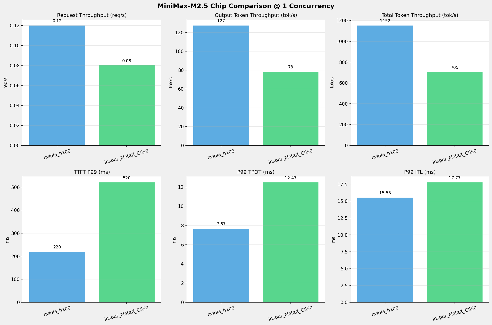
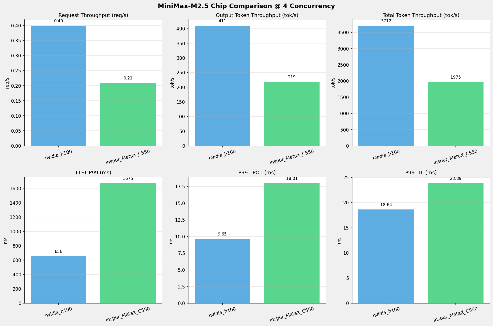
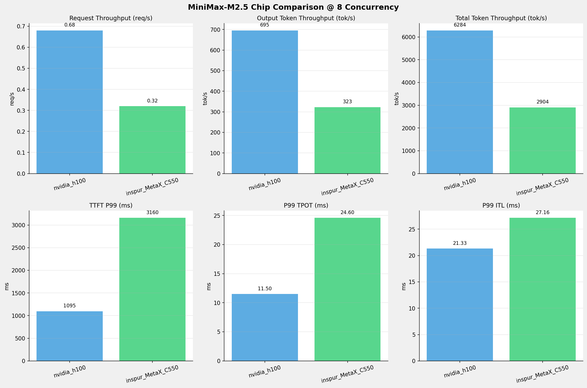
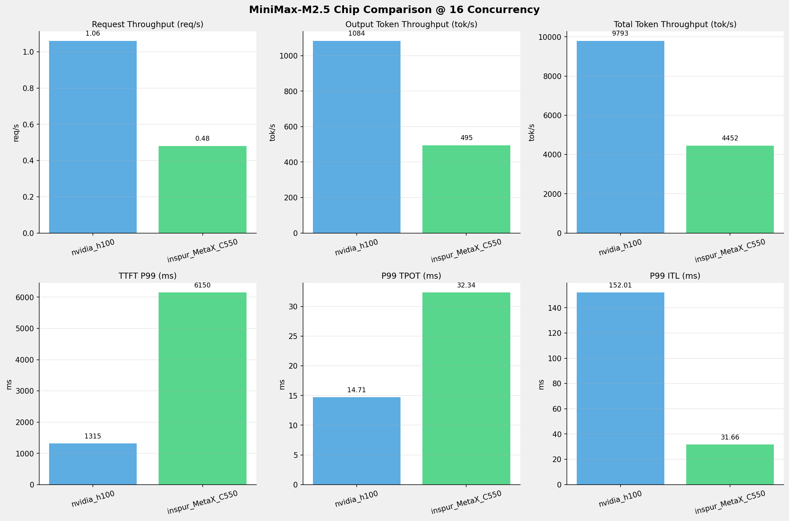
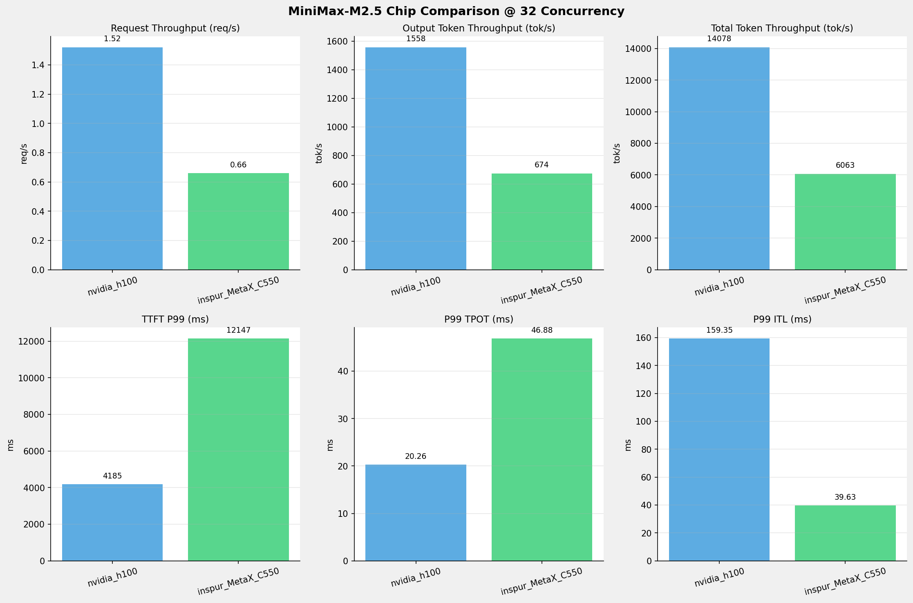
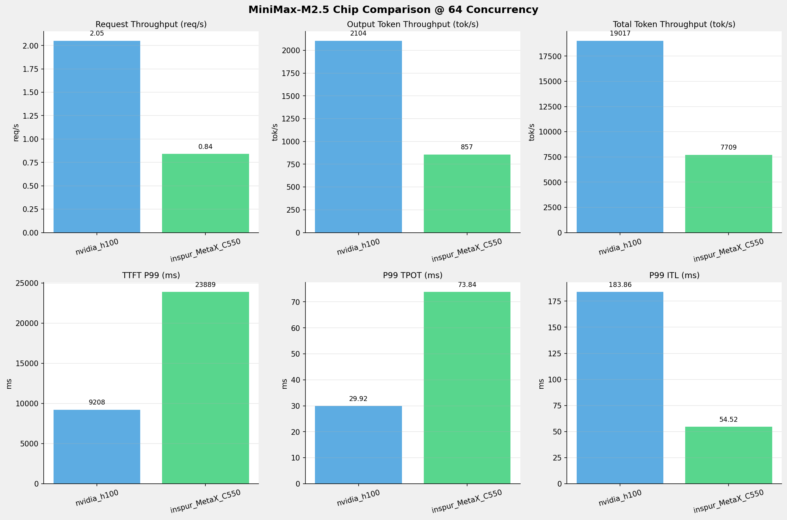
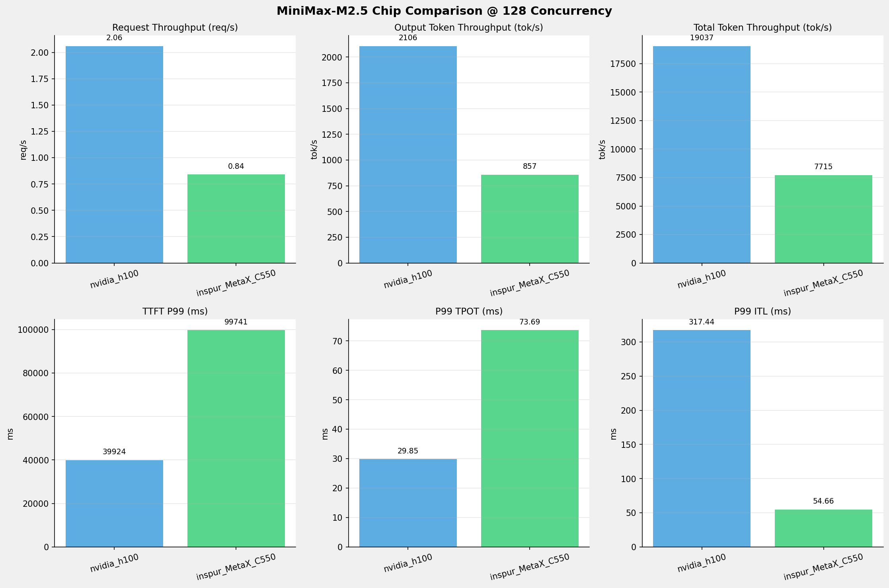
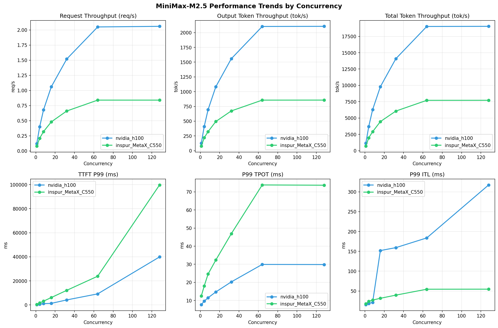

# MiniMax-M2.5模型在不同芯片下的基准测试报告

**测试日期：** 2026-05-19

---

## 测试场景
在固定请求数，输入上下文和输出上下文长度下，使用SGLang基准测试工具对并发数逐级增加场景的性能基准验证。并对比同一模型在不同芯片环境上的性能指标。

**主要采集指标**：

| 指标                  | 单位         | 含义                                 |
|---------------------|------------|------------------------------------|
| TTFT                | ms         | Time To First Token，首 token 延迟     |
| TPOT                | ms/token   | Time Per Output Token，每 token 生成时间 |
| Throughput          | tokens/s   | 系统总吞吐                              |
| QPS                 | requests/s | 请求吞吐                               |

### 📊 测试概览

| 项目            | 配置                                     | 备注  |
|---------------|----------------------------------------|-----|
| **数据集**       | random                                 |     |
| **并发数**       | 1, 4, 8, 16, 32, 64, 128    |     |
| **总请求数**      | 1000                                    |     |
| **请求输入上下文长度** | 8192（8k）                             |     |
| **请求输出上下文长度** | 1024（1k）                             |     |
| **被测芯片**      | nvidia_h100, inspur_MetaX_C550 |     |
| **被测模型**      | nvidia_h100 (MiniMax-M2.5), inspur_MetaX_C550 (MiniMax-M2.5-W8A8) |     |

---

### 📊 芯片性能对比柱状图

**1并发**

**4并发**

**8并发**

**16并发**

**32并发**

**64并发**

**128并发**

### 📈 性能趋势对比图 (所有芯片)

---

### 📈 各指标随并发级别性能对比详情

#### 请求吞吐量（Request throughput (req/s)）

| 并发数 | nvidia_h100 | inspur_MetaX_C550 | 差值 | 百分比 |
|-----|----------- | ----------- | ----------- | -----------|
| 1   | **0.12** ⭐ | 0.08 | -0.04 | -33.3% |
| 4   | **0.40** ⭐ | 0.21 | -0.19 | -47.5% |
| 8   | **0.68** ⭐ | 0.32 | -0.36 | -52.9% |
| 16   | **1.06** ⭐ | 0.48 | -0.58 | -54.7% |
| 32   | **1.52** ⭐ | 0.66 | -0.86 | -56.6% |
| 64   | **2.05** ⭐ | 0.84 | -1.21 | -59.0% |
| 128   | **2.06** ⭐ | 0.84 | -1.22 | -59.2% |

#### 输入token吞吐量（Input token throughput (tok/s)）

| 并发数 | nvidia_h100 | inspur_MetaX_C550 | 差值 | 百分比 |
|-----|----------- | ----------- | ----------- | -----------|
| 1   | N/A | 626.28 | N/A | N/A |
| 4   | N/A | 1755.55 | N/A | N/A |
| 8   | N/A | 2581.38 | N/A | N/A |
| 16   | N/A | 3957.10 | N/A | N/A |
| 32   | N/A | 5389.22 | N/A | N/A |
| 64   | N/A | 6852.15 | N/A | N/A |
| 128   | N/A | 6858.07 | N/A | N/A |

#### 输出token吞吐量（Output token throughput (tok/s)）

| 并发数 | nvidia_h100 | inspur_MetaX_C550 | 差值 | 百分比 |
|-----|----------- | ----------- | ----------- | -----------|
| 1   | **127.41** ⭐ | 78.29 | -49.12 | -38.6% |
| 4   | **410.74** ⭐ | 219.44 | -191.30 | -46.6% |
| 8   | **695.31** ⭐ | 322.67 | -372.64 | -53.6% |
| 16   | **1083.50** ⭐ | 494.64 | -588.86 | -54.3% |
| 32   | **1557.65** ⭐ | 673.65 | -884.00 | -56.8% |
| 64   | **2104.06** ⭐ | 856.52 | -1247.54 | -59.3% |
| 128   | **2106.36** ⭐ | 857.26 | -1249.10 | -59.3% |

#### 总token吞吐量（Total token throughput (tok/s)）

| 并发数 | nvidia_h100 | inspur_MetaX_C550 | 差值 | 百分比 |
|-----|----------- | ----------- | ----------- | -----------|
| 1   | **1151.56** ⭐ | 704.57 | -446.99 | -38.8% |
| 4   | **3712.34** ⭐ | 1975.00 | -1737.34 | -46.8% |
| 8   | **6284.28** ⭐ | 2904.05 | -3380.23 | -53.8% |
| 16   | **9792.79** ⭐ | 4451.74 | -5341.05 | -54.5% |
| 32   | **14078.15** ⭐ | 6062.88 | -8015.27 | -56.9% |
| 64   | **19016.63** ⭐ | 7708.66 | -11307.97 | -59.5% |
| 128   | **19037.48** ⭐ | 7715.33 | -11322.15 | -59.5% |

#### 首token延迟（P99 TTFT (ms)）

| 并发数 | nvidia_h100 | inspur_MetaX_C550 | 差值 | 百分比 |
|-----|----------- | ----------- | ----------- | -----------|
| 1   | 219.81 | 520.17 | +300.36 | +136.6% |
| 4   | 656.13 | 1674.84 | +1018.71 | +155.3% |
| 8   | 1095.11 | 3159.86 | +2064.75 | +188.5% |
| 16   | 1314.68 | 6149.73 | +4835.05 | +367.8% |
| 32   | 4184.75 | 12147.10 | +7962.35 | +190.3% |
| 64   | 9208.08 | 23889.08 | +14681.00 | +159.4% |
| 128   | 39923.84 | 99741.36 | +59817.52 | +149.8% |

#### 每token生成时间（P99 TPOT (ms)）

| 并发数 | nvidia_h100 | inspur_MetaX_C550 | 差值 | 百分比 |
|-----|----------- | ----------- | ----------- | -----------|
| 1   | 7.67 | 12.47 | +4.80 | +62.6% |
| 4   | 9.65 | 18.01 | +8.36 | +86.6% |
| 8   | 11.50 | 24.60 | +13.10 | +113.9% |
| 16   | 14.71 | 32.34 | +17.63 | +119.9% |
| 32   | 20.26 | 46.88 | +26.62 | +131.4% |
| 64   | 29.92 | 73.84 | +43.92 | +146.8% |
| 128   | 29.85 | 73.69 | +43.84 | +146.9% |

#### token间延迟（P99 ITL (ms)）

| 并发数 | nvidia_h100 | inspur_MetaX_C550 | 差值 | 百分比 |
|-----|----------- | ----------- | ----------- | -----------|
| 1   | 15.53 | 17.77 | +2.24 | +14.4% |
| 4   | 18.64 | 23.89 | +5.25 | +28.2% |
| 8   | 21.33 | 27.16 | +5.83 | +27.3% |
| 16   | 152.01 | 31.66 | -120.35 | -79.2% |
| 32   | 159.35 | 39.63 | -119.72 | -75.1% |
| 64   | 183.86 | 54.52 | -129.34 | -70.3% |
| 128   | 317.44 | 54.66 | -262.78 | -82.8% |

### 📈 各并发级别性能对比详情

#### 1 并发

| 指标 | nvidia_h100 | inspur_MetaX_C550 |
|------|----------- | -----------|
| 请求吞吐量（Request throughput (req/s)） | **0.12** ⭐ | 0.08 |
| 输入token吞吐量（Input token throughput (tok/s)） | N/A | 626.28 |
| 输出token吞吐量（Output token throughput (tok/s)） | **127.41** ⭐ | 78.29 |
| 总token吞吐量（Total token throughput (tok/s)） | **1151.56** ⭐ | 704.57 |
| 首token延迟（P99 TTFT (ms)） | **219.81** ⭐ | 520.17 |
| 每token生成时间（P99 TPOT (ms)） | **7.67** ⭐ | 12.47 |
| token间延迟（P99 ITL (ms)） | **15.53** ⭐ | 17.77 |

#### 4 并发

| 指标 | nvidia_h100 | inspur_MetaX_C550 |
|------|----------- | -----------|
| 请求吞吐量（Request throughput (req/s)） | **0.40** ⭐ | 0.21 |
| 输入token吞吐量（Input token throughput (tok/s)） | N/A | 1755.55 |
| 输出token吞吐量（Output token throughput (tok/s)） | **410.74** ⭐ | 219.44 |
| 总token吞吐量（Total token throughput (tok/s)） | **3712.34** ⭐ | 1975.00 |
| 首token延迟（P99 TTFT (ms)） | **656.13** ⭐ | 1674.84 |
| 每token生成时间（P99 TPOT (ms)） | **9.65** ⭐ | 18.01 |
| token间延迟（P99 ITL (ms)） | **18.64** ⭐ | 23.89 |

#### 8 并发

| 指标 | nvidia_h100 | inspur_MetaX_C550 |
|------|----------- | -----------|
| 请求吞吐量（Request throughput (req/s)） | **0.68** ⭐ | 0.32 |
| 输入token吞吐量（Input token throughput (tok/s)） | N/A | 2581.38 |
| 输出token吞吐量（Output token throughput (tok/s)） | **695.31** ⭐ | 322.67 |
| 总token吞吐量（Total token throughput (tok/s)） | **6284.28** ⭐ | 2904.05 |
| 首token延迟（P99 TTFT (ms)） | **1095.11** ⭐ | 3159.86 |
| 每token生成时间（P99 TPOT (ms)） | **11.50** ⭐ | 24.60 |
| token间延迟（P99 ITL (ms)） | **21.33** ⭐ | 27.16 |

#### 16 并发

| 指标 | nvidia_h100 | inspur_MetaX_C550 |
|------|----------- | -----------|
| 请求吞吐量（Request throughput (req/s)） | **1.06** ⭐ | 0.48 |
| 输入token吞吐量（Input token throughput (tok/s)） | N/A | 3957.10 |
| 输出token吞吐量（Output token throughput (tok/s)） | **1083.50** ⭐ | 494.64 |
| 总token吞吐量（Total token throughput (tok/s)） | **9792.79** ⭐ | 4451.74 |
| 首token延迟（P99 TTFT (ms)） | **1314.68** ⭐ | 6149.73 |
| 每token生成时间（P99 TPOT (ms)） | **14.71** ⭐ | 32.34 |
| token间延迟（P99 ITL (ms)） | 152.01 | **31.66** ⭐ |

#### 32 并发

| 指标 | nvidia_h100 | inspur_MetaX_C550 |
|------|----------- | -----------|
| 请求吞吐量（Request throughput (req/s)） | **1.52** ⭐ | 0.66 |
| 输入token吞吐量（Input token throughput (tok/s)） | N/A | 5389.22 |
| 输出token吞吐量（Output token throughput (tok/s)） | **1557.65** ⭐ | 673.65 |
| 总token吞吐量（Total token throughput (tok/s)） | **14078.15** ⭐ | 6062.88 |
| 首token延迟（P99 TTFT (ms)） | **4184.75** ⭐ | 12147.10 |
| 每token生成时间（P99 TPOT (ms)） | **20.26** ⭐ | 46.88 |
| token间延迟（P99 ITL (ms)） | 159.35 | **39.63** ⭐ |

#### 64 并发

| 指标 | nvidia_h100 | inspur_MetaX_C550 |
|------|----------- | -----------|
| 请求吞吐量（Request throughput (req/s)） | **2.05** ⭐ | 0.84 |
| 输入token吞吐量（Input token throughput (tok/s)） | N/A | 6852.15 |
| 输出token吞吐量（Output token throughput (tok/s)） | **2104.06** ⭐ | 856.52 |
| 总token吞吐量（Total token throughput (tok/s)） | **19016.63** ⭐ | 7708.66 |
| 首token延迟（P99 TTFT (ms)） | **9208.08** ⭐ | 23889.08 |
| 每token生成时间（P99 TPOT (ms)） | **29.92** ⭐ | 73.84 |
| token间延迟（P99 ITL (ms)） | 183.86 | **54.52** ⭐ |

#### 128 并发

| 指标 | nvidia_h100 | inspur_MetaX_C550 |
|------|----------- | -----------|
| 请求吞吐量（Request throughput (req/s)） | **2.06** ⭐ | 0.84 |
| 输入token吞吐量（Input token throughput (tok/s)） | N/A | 6858.07 |
| 输出token吞吐量（Output token throughput (tok/s)） | **2106.36** ⭐ | 857.26 |
| 总token吞吐量（Total token throughput (tok/s)） | **19037.48** ⭐ | 7715.33 |
| 首token延迟（P99 TTFT (ms)） | **39923.84** ⭐ | 99741.36 |
| 每token生成时间（P99 TPOT (ms)） | **29.85** ⭐ | 73.69 |
| token间延迟（P99 ITL (ms)） | 317.44 | **54.66** ⭐ |

---

*报告生成时间: 2026-05-19*

