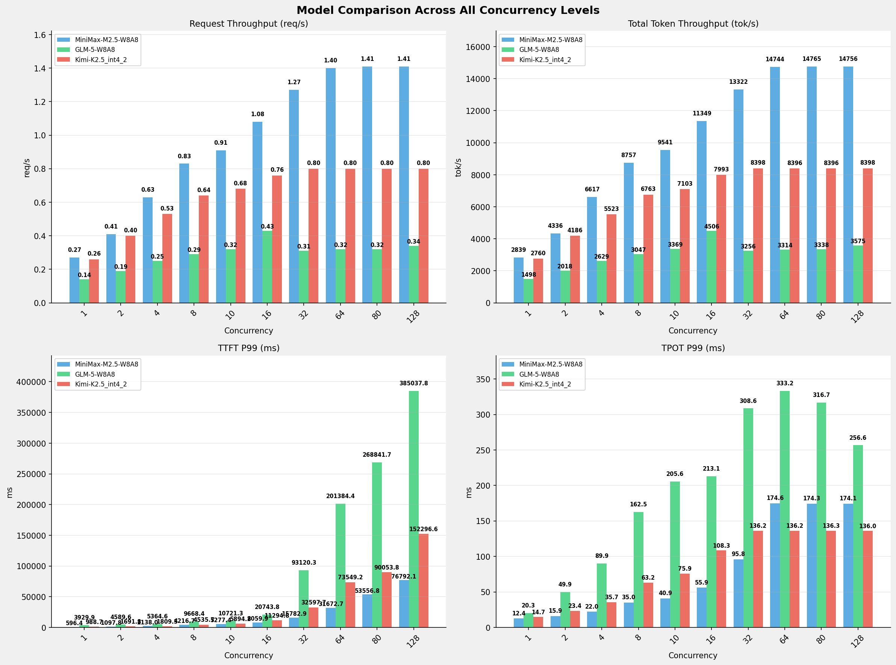

# 多模型性能对比报告 (全并发级别)

**测试日期：** 2026-05-14

**芯片平台：** inspur_metax_c550

**测试套件：** test_01

**Run ID：** 01, 01, 01

**测试配置：** 320-i10240-o256

**并发级别：** 1, 2, 4, 8, 10, 16, 32, 64, 80, 128

**对比模型：** MiniMax-M2.5-W8A8, GLM-5-W8A8, Kimi-K2.5_int4_2

---

## 🤖 芯片和模型配置信息

| 参数名称 | **MiniMax-M2.5-W8A8** | **GLM-5-W8A8** | **Kimi-K2.5_int4_2** |
|----------|----------|----------|----------|
| **max_position_embeddings** | 196608 | 202752 | 262144 |
| **model_name** | MiniMax-M2.5-W8A8 | GLM-5-W8A8 | Kimi-K2.5_int4_2 |
| **model_size** | 215G | 712G | 496G |
| **python_version** | 3.10.10 | 3.10.10 | 3.10.10 |
| **quantization_config** | int8 | int8 | int4 |
| **sglang_version** | 0.5.9+maca3.5.3.204 | 0.5.9+maca3.5.3.204 | 0.5.9+maca3.5.3.204 |
| **temperature** | N/A | N/A | N/A |
| **top_k** | 40 | N/A | N/A |
| **top_p** | 0.95 | N/A | N/A |
| **transformers_version** | 4.57.6 | 5.1.0 | 4.56.2 |

---

## ⚙️ SGLang 启动配置信息

| 参数名称 | **MiniMax-M2.5-W8A8** | **GLM-5-W8A8** | **Kimi-K2.5_int4_2** |
|----------|----------|----------|----------|
| **Attention Backend** | flashinfer | flashinfer | flashinfer |
| **Chunked Prefill Size** | N/A | 8192 | 8192 |
| **Context Length** | 196608 | 202752 | 262144 |
| **Cuda Graph Max Bs** | N/A | 64 | 64 |
| **Disable Radix Cache** | True | True | True |
| **Dp Size** | N/A | 4 | N/A |
| **Max Queued Requests** | None | None | None |
| **Max Running Requests** | 64 | 64 | 64 |
| **Mem Fraction Static** | 0.9 | 0.8 | 0.8 |
| **Model Name** | MiniMax-M2.5-W8A8 | GLM-5-W8A8 | Kimi-K2.5_int4_2 |
| **Nnodes** | 1 | 2 | 2 |
| **Pp Size** | 1 | 1 | 1 |
| **Quantization** | w8a8_int8 | w8a8_int8 | w4a8_int8 |
| **Reasoning Parser** | minimax-append-think | glm45 | kimi_k2 |
| **Tool Call Parser** | minimax-m2 | glm47 | kimi_k2 |
| **Tp Size** | 8 | 16 | 16 |

---

## 📊 模型列表

| 模型名称 | Run ID | 状态 |
|----------|--------|------|
| MiniMax-M2.5-W8A8 | 01 | [OK] |
| GLM-5-W8A8 | 01 | [OK] |
| Kimi-K2.5_int4_2 | 01 | [OK] |

---

## 📊 测试概览

| 项目            | 配置                                     | 备注  |
|---------------|----------------------------------------|-----|
| **数据集**       | random                                 |     |
| **并发数**       | 1, 2, 4, 8, 10, 16, 32, 64, 80, 128    |     |
| **总请求数**      | 320                                    |     |
| **输入输出长度** | (10240, 256) |     |
| **测试套件**     | test_01                           |     |
| **被测芯片**      | inspur_metax_c550 |     |
| **SGLang版本**   | 0.5.9                           |     |

---

## 📊 模型性能对比

---

## 📝 分析小结

- **GLM-5-W8A8** 相比 **MiniMax-M2.5-W8A8** 请求吞吐量平均变化 **-69.8%**
- **Kimi-K2.5_int4_2** 相比 **MiniMax-M2.5-W8A8** 请求吞吐量平均变化 **-32.7%**
- **GLM-5-W8A8** 相比 **MiniMax-M2.5-W8A8** 总token吞吐量平均变化 **-69.8%**
- **Kimi-K2.5_int4_2** 相比 **MiniMax-M2.5-W8A8** 总token吞吐量平均变化 **-32.8%**
- **GLM-5-W8A8** 相比 **MiniMax-M2.5-W8A8** TTFT P99平均增加 **403.7%** (延迟增加)
- **Kimi-K2.5_int4_2** 相比 **MiniMax-M2.5-W8A8** TTFT P99平均增加 **88.1%** (延迟增加)
- **GLM-5-W8A8** 相比 **MiniMax-M2.5-W8A8** TPOT P99平均增加 **144.3%** (延迟增加)
- **Kimi-K2.5_int4_2** 相比 **MiniMax-M2.5-W8A8** TPOT P99平均增加 **8.1%** (延迟增加)

---

## 📊 各并发级别详细对比

### 并发级别: 1

#### 服务基准结果

| 指标 | MiniMax-M2.5-W8A8 (基准) | GLM-5-W8A8 | 差异 | % | Kimi-K2.5_int4_2 | 差异 | % |
|------ | --------------- | --------- | ------- | ------- | --------- | ------- | ------- |
| 成功请求数 | 320 | 320 | 0.00 | 0.0% | 320 | 0.00 | 0.0% |
| 测试持续时间 (s) | 1182.87 | 2242.86 | +1059.99 | +89.6% | 1216.83 | +33.96 | +2.9% |
| 总输入 tokens | 3276800 | 3276800 | 0.00 | 0.0% | 3276800 | 0.00 | 0.0% |
| 总生成 tokens | 81920 | 81920 | 0.00 | 0.0% | 81920 | 0.00 | 0.0% |
| 请求吞吐量 (req/s) | 0.27 | 0.14 | -0.13 | -48.1% | 0.26 | -0.01 | -3.7% |
| 输出 token 吞吐量 (tok/s) | 69.26 | 36.52 | -32.74 | -47.3% | 67.32 | -1.94 | -2.8% |
| 总 token 吞吐量 (tok/s) | 2839.48 | 1497.52 | -1341.96 | -47.3% | 2760.23 | -79.25 | -2.8% |

#### 首Token延迟 (TTFT)

| 指标 | MiniMax-M2.5-W8A8 (基准) | GLM-5-W8A8 | 差异 | % | Kimi-K2.5_int4_2 | 差异 | % |
|------ | --------------- | --------- | ------- | ------- | --------- | ------- | ------- |
| 平均 TTFT (ms) | 530.76 | 3606.89 | +3076.13 | +579.6% | 901.81 | +371.05 | +69.9% |
| P99 TTFT (ms) | 596.38 | 3929.91 | +3333.53 | +559.0% | 988.73 | +392.35 | +65.8% |

#### 每Token生成时间 (TPOT)

| 指标 | MiniMax-M2.5-W8A8 (基准) | GLM-5-W8A8 | 差异 | % | Kimi-K2.5_int4_2 | 差异 | % |
|------ | --------------- | --------- | ------- | ------- | --------- | ------- | ------- |
| 平均 TPOT (ms) | 12.41 | 13.34 | +0.93 | +7.5% | 11.37 | -1.04 | -8.4% |
| P99 TPOT (ms) | 12.44 | 20.28 | +7.84 | +63.0% | 14.65 | +2.21 | +17.8% |

#### Token间延迟 (ITL)

| 指标 | MiniMax-M2.5-W8A8 (基准) | GLM-5-W8A8 | 差异 | % | Kimi-K2.5_int4_2 | 差异 | % |
|------ | --------------- | --------- | ------- | ------- | --------- | ------- | ------- |
| 平均 ITL (ms) | 12.41 | 13.34 | +0.93 | +7.5% | 11.37 | -1.04 | -8.4% |
| P99 ITL (ms) | 14.88 | 25.50 | +10.62 | +71.4% | 22.31 | +7.43 | +49.9% |

#### 端到端延迟 (E2E)

| 指标 | MiniMax-M2.5-W8A8 (基准) | GLM-5-W8A8 | 差异 | % | Kimi-K2.5_int4_2 | 差异 | % |
|------ | --------------- | --------- | ------- | ------- | --------- | ------- | ------- |
| 平均 E2E 延迟 (ms) | 3695.95 | 7008.40 | +3312.45 | +89.6% | 3802.13 | +106.18 | +2.9% |
| P99 E2E 延迟 (ms) | 3762.23 | 9562.98 | +5800.75 | +154.2% | 4792.19 | +1029.96 | +27.4% |

---

### 并发级别: 2

#### 服务基准结果

| 指标 | MiniMax-M2.5-W8A8 (基准) | GLM-5-W8A8 | 差异 | % | Kimi-K2.5_int4_2 | 差异 | % |
|------ | --------------- | --------- | ------- | ------- | --------- | ------- | ------- |
| 成功请求数 | 320 | 320 | 0.00 | 0.0% | 320 | 0.00 | 0.0% |
| 测试持续时间 (s) | 774.60 | 1664.36 | +889.76 | +114.9% | 802.31 | +27.71 | +3.6% |
| 总输入 tokens | 3276800 | 3276800 | 0.00 | 0.0% | 3276800 | 0.00 | 0.0% |
| 总生成 tokens | 81920 | 81920 | 0.00 | 0.0% | 81920 | 0.00 | 0.0% |
| 请求吞吐量 (req/s) | 0.41 | 0.19 | -0.22 | -53.7% | 0.40 | -0.01 | -2.4% |
| 输出 token 吞吐量 (tok/s) | 105.76 | 49.22 | -56.54 | -53.5% | 102.11 | -3.65 | -3.5% |
| 总 token 吞吐量 (tok/s) | 4336.07 | 2018.03 | -2318.04 | -53.5% | 4186.34 | -149.73 | -3.5% |

#### 首Token延迟 (TTFT)

| 指标 | MiniMax-M2.5-W8A8 (基准) | GLM-5-W8A8 | 差异 | % | Kimi-K2.5_int4_2 | 差异 | % |
|------ | --------------- | --------- | ------- | ------- | --------- | ------- | ------- |
| 平均 TTFT (ms) | 939.99 | 3679.49 | +2739.50 | +291.4% | 947.17 | +7.18 | +0.8% |
| P99 TTFT (ms) | 1097.81 | 4589.56 | +3491.75 | +318.1% | 1691.82 | +594.01 | +54.1% |

#### 每Token生成时间 (TPOT)

| 指标 | MiniMax-M2.5-W8A8 (基准) | GLM-5-W8A8 | 差异 | % | Kimi-K2.5_int4_2 | 差异 | % |
|------ | --------------- | --------- | ------- | ------- | --------- | ------- | ------- |
| 平均 TPOT (ms) | 15.30 | 26.33 | +11.03 | +72.1% | 15.93 | +0.63 | +4.1% |
| P99 TPOT (ms) | 15.89 | 49.91 | +34.02 | +214.1% | 23.44 | +7.55 | +47.5% |

#### Token间延迟 (ITL)

| 指标 | MiniMax-M2.5-W8A8 (基准) | GLM-5-W8A8 | 差异 | % | Kimi-K2.5_int4_2 | 差异 | % |
|------ | --------------- | --------- | ------- | ------- | --------- | ------- | ------- |
| 平均 ITL (ms) | 15.30 | 26.33 | +11.03 | +72.1% | 15.93 | +0.63 | +4.1% |
| P99 ITL (ms) | 19.00 | 896.21 | +877.21 | +4616.9% | 25.49 | +6.49 | +34.2% |

#### 端到端延迟 (E2E)

| 指标 | MiniMax-M2.5-W8A8 (基准) | GLM-5-W8A8 | 差异 | % | Kimi-K2.5_int4_2 | 差异 | % |
|------ | --------------- | --------- | ------- | ------- | --------- | ------- | ------- |
| 平均 E2E 延迟 (ms) | 4840.26 | 10393.40 | +5553.14 | +114.7% | 5010.27 | +170.01 | +3.5% |
| P99 E2E 延迟 (ms) | 5648.71 | 16322.43 | +10673.72 | +189.0% | 6899.49 | +1250.78 | +22.1% |

---

### 并发级别: 4

#### 服务基准结果

| 指标 | MiniMax-M2.5-W8A8 (基准) | GLM-5-W8A8 | 差异 | % | Kimi-K2.5_int4_2 | 差异 | % |
|------ | --------------- | --------- | ------- | ------- | --------- | ------- | ------- |
| 成功请求数 | 320 | 320 | 0.00 | 0.0% | 320 | 0.00 | 0.0% |
| 测试持续时间 (s) | 507.55 | 1277.79 | +770.24 | +151.8% | 608.13 | +100.58 | +19.8% |
| 总输入 tokens | 3276800 | 3276800 | 0.00 | 0.0% | 3276800 | 0.00 | 0.0% |
| 总生成 tokens | 81920 | 81920 | 0.00 | 0.0% | 81920 | 0.00 | 0.0% |
| 请求吞吐量 (req/s) | 0.63 | 0.25 | -0.38 | -60.3% | 0.53 | -0.10 | -15.9% |
| 输出 token 吞吐量 (tok/s) | 161.40 | 64.11 | -97.29 | -60.3% | 134.71 | -26.69 | -16.5% |
| 总 token 吞吐量 (tok/s) | 6617.46 | 2628.53 | -3988.93 | -60.3% | 5522.99 | -1094.47 | -16.5% |

#### 首Token延迟 (TTFT)

| 指标 | MiniMax-M2.5-W8A8 (基准) | GLM-5-W8A8 | 差异 | % | Kimi-K2.5_int4_2 | 差异 | % |
|------ | --------------- | --------- | ------- | ------- | --------- | ------- | ------- |
| 平均 TTFT (ms) | 1439.04 | 3860.75 | +2421.71 | +168.3% | 984.34 | -454.70 | -31.6% |
| P99 TTFT (ms) | 2137.97 | 5364.65 | +3226.68 | +150.9% | 1809.49 | -328.48 | -15.4% |

#### 每Token生成时间 (TPOT)

| 指标 | MiniMax-M2.5-W8A8 (基准) | GLM-5-W8A8 | 差异 | % | Kimi-K2.5_int4_2 | 差异 | % |
|------ | --------------- | --------- | ------- | ------- | --------- | ------- | ------- |
| 平均 TPOT (ms) | 19.23 | 47.40 | +28.17 | +146.5% | 25.88 | +6.65 | +34.6% |
| P99 TPOT (ms) | 21.99 | 89.88 | +67.89 | +308.7% | 35.67 | +13.68 | +62.2% |

#### Token间延迟 (ITL)

| 指标 | MiniMax-M2.5-W8A8 (基准) | GLM-5-W8A8 | 差异 | % | Kimi-K2.5_int4_2 | 差异 | % |
|------ | --------------- | --------- | ------- | ------- | --------- | ------- | ------- |
| 平均 ITL (ms) | 19.23 | 47.41 | +28.18 | +146.5% | 25.88 | +6.65 | +34.6% |
| P99 ITL (ms) | 22.33 | 910.14 | +887.81 | +3975.9% | 456.82 | +434.49 | +1945.8% |

#### 端到端延迟 (E2E)

| 指标 | MiniMax-M2.5-W8A8 (基准) | GLM-5-W8A8 | 差异 | % | Kimi-K2.5_int4_2 | 差异 | % |
|------ | --------------- | --------- | ------- | ------- | --------- | ------- | ------- |
| 平均 E2E 延迟 (ms) | 6342.59 | 15948.98 | +9606.39 | +151.5% | 7583.94 | +1241.35 | +19.6% |
| P99 E2E 延迟 (ms) | 7203.11 | 26868.07 | +19664.96 | +273.0% | 10642.44 | +3439.33 | +47.7% |

---

### 并发级别: 8

#### 服务基准结果

| 指标 | MiniMax-M2.5-W8A8 (基准) | GLM-5-W8A8 | 差异 | % | Kimi-K2.5_int4_2 | 差异 | % |
|------ | --------------- | --------- | ------- | ------- | --------- | ------- | ------- |
| 成功请求数 | 320 | 320 | 0.00 | 0.0% | 320 | 0.00 | 0.0% |
| 测试持续时间 (s) | 383.54 | 1102.20 | +718.66 | +187.4% | 496.66 | +113.12 | +29.5% |
| 总输入 tokens | 3276800 | 3276800 | 0.00 | 0.0% | 3276800 | 0.00 | 0.0% |
| 总生成 tokens | 81920 | 81920 | 0.00 | 0.0% | 81920 | 0.00 | 0.0% |
| 请求吞吐量 (req/s) | 0.83 | 0.29 | -0.54 | -65.1% | 0.64 | -0.19 | -22.9% |
| 输出 token 吞吐量 (tok/s) | 213.59 | 74.32 | -139.27 | -65.2% | 164.94 | -48.65 | -22.8% |
| 总 token 吞吐量 (tok/s) | 8757.21 | 3047.29 | -5709.92 | -65.2% | 6762.64 | -1994.57 | -22.8% |

#### 首Token延迟 (TTFT)

| 指标 | MiniMax-M2.5-W8A8 (基准) | GLM-5-W8A8 | 差异 | % | Kimi-K2.5_int4_2 | 差异 | % |
|------ | --------------- | --------- | ------- | ------- | --------- | ------- | ------- |
| 平均 TTFT (ms) | 2430.66 | 4101.49 | +1670.83 | +68.7% | 1101.70 | -1328.96 | -54.7% |
| P99 TTFT (ms) | 4216.68 | 9668.44 | +5451.76 | +129.3% | 4535.68 | +319.00 | +7.6% |

#### 每Token生成时间 (TPOT)

| 指标 | MiniMax-M2.5-W8A8 (基准) | GLM-5-W8A8 | 差异 | % | Kimi-K2.5_int4_2 | 差异 | % |
|------ | --------------- | --------- | ------- | ------- | --------- | ------- | ------- |
| 平均 TPOT (ms) | 28.06 | 91.75 | +63.69 | +227.0% | 44.22 | +16.16 | +57.6% |
| P99 TPOT (ms) | 34.97 | 162.53 | +127.56 | +364.8% | 63.19 | +28.22 | +80.7% |

#### Token间延迟 (ITL)

| 指标 | MiniMax-M2.5-W8A8 (基准) | GLM-5-W8A8 | 差异 | % | Kimi-K2.5_int4_2 | 差异 | % |
|------ | --------------- | --------- | ------- | ------- | --------- | ------- | ------- |
| 平均 ITL (ms) | 28.06 | 91.75 | +63.69 | +227.0% | 44.22 | +16.16 | +57.6% |
| P99 ITL (ms) | 27.01 | 1148.91 | +1121.90 | +4153.6% | 466.65 | +439.64 | +1627.7% |

#### 端到端延迟 (E2E)

| 指标 | MiniMax-M2.5-W8A8 (基准) | GLM-5-W8A8 | 差异 | % | Kimi-K2.5_int4_2 | 差异 | % |
|------ | --------------- | --------- | ------- | ------- | --------- | ------- | ------- |
| 平均 E2E 延迟 (ms) | 9585.27 | 27497.14 | +17911.87 | +186.9% | 12377.05 | +2791.78 | +29.1% |
| P99 E2E 延迟 (ms) | 10451.03 | 45219.70 | +34768.67 | +332.7% | 18033.48 | +7582.45 | +72.6% |

---

### 并发级别: 10

#### 服务基准结果

| 指标 | MiniMax-M2.5-W8A8 (基准) | GLM-5-W8A8 | 差异 | % | Kimi-K2.5_int4_2 | 差异 | % |
|------ | --------------- | --------- | ------- | ------- | --------- | ------- | ------- |
| 成功请求数 | 320 | 320 | 0.00 | 0.0% | 320 | 0.00 | 0.0% |
| 测试持续时间 (s) | 352.04 | 996.94 | +644.90 | +183.2% | 472.83 | +120.79 | +34.3% |
| 总输入 tokens | 3276800 | 3276800 | 0.00 | 0.0% | 3276800 | 0.00 | 0.0% |
| 总生成 tokens | 81920 | 81920 | 0.00 | 0.0% | 81920 | 0.00 | 0.0% |
| 请求吞吐量 (req/s) | 0.91 | 0.32 | -0.59 | -64.8% | 0.68 | -0.23 | -25.3% |
| 输出 token 吞吐量 (tok/s) | 232.70 | 82.17 | -150.53 | -64.7% | 173.25 | -59.45 | -25.5% |
| 总 token 吞吐量 (tok/s) | 9540.82 | 3369.03 | -6171.79 | -64.7% | 7103.40 | -2437.42 | -25.5% |

#### 首Token延迟 (TTFT)

| 指标 | MiniMax-M2.5-W8A8 (基准) | GLM-5-W8A8 | 差异 | % | Kimi-K2.5_int4_2 | 差异 | % |
|------ | --------------- | --------- | ------- | ------- | --------- | ------- | ------- |
| 平均 TTFT (ms) | 2912.32 | 4476.11 | +1563.79 | +53.7% | 1210.21 | -1702.11 | -58.4% |
| P99 TTFT (ms) | 5277.45 | 10721.27 | +5443.82 | +103.2% | 5894.17 | +616.72 | +11.7% |

#### 每Token生成时间 (TPOT)

| 指标 | MiniMax-M2.5-W8A8 (基准) | GLM-5-W8A8 | 差异 | % | Kimi-K2.5_int4_2 | 差异 | % |
|------ | --------------- | --------- | ------- | ------- | --------- | ------- | ------- |
| 平均 TPOT (ms) | 31.71 | 104.40 | +72.69 | +229.2% | 52.91 | +21.20 | +66.9% |
| P99 TPOT (ms) | 40.89 | 205.64 | +164.75 | +402.9% | 75.90 | +35.01 | +85.6% |

#### Token间延迟 (ITL)

| 指标 | MiniMax-M2.5-W8A8 (基准) | GLM-5-W8A8 | 差异 | % | Kimi-K2.5_int4_2 | 差异 | % |
|------ | --------------- | --------- | ------- | ------- | --------- | ------- | ------- |
| 平均 ITL (ms) | 31.71 | 104.40 | +72.69 | +229.2% | 52.91 | +21.20 | +66.9% |
| P99 ITL (ms) | 28.12 | 1156.99 | +1128.87 | +4014.5% | 589.03 | +560.91 | +1994.7% |

#### 端到端延迟 (E2E)

| 指标 | MiniMax-M2.5-W8A8 (基准) | GLM-5-W8A8 | 差异 | % | Kimi-K2.5_int4_2 | 差异 | % |
|------ | --------------- | --------- | ------- | ------- | --------- | ------- | ------- |
| 平均 E2E 延迟 (ms) | 10997.16 | 31097.31 | +20100.15 | +182.8% | 14701.05 | +3703.89 | +33.7% |
| P99 E2E 延迟 (ms) | 11749.96 | 56469.11 | +44719.15 | +380.6% | 20937.21 | +9187.25 | +78.2% |

---

### 并发级别: 16

#### 服务基准结果

| 指标 | MiniMax-M2.5-W8A8 (基准) | GLM-5-W8A8 | 差异 | % | Kimi-K2.5_int4_2 | 差异 | % |
|------ | --------------- | --------- | ------- | ------- | --------- | ------- | ------- |
| 成功请求数 | 320 | 320 | 0.00 | 0.0% | 320 | 0.00 | 0.0% |
| 测试持续时间 (s) | 295.95 | 745.38 | +449.43 | +151.9% | 420.21 | +124.26 | +42.0% |
| 总输入 tokens | 3276800 | 3276800 | 0.00 | 0.0% | 3276800 | 0.00 | 0.0% |
| 总生成 tokens | 81920 | 81920 | 0.00 | 0.0% | 81920 | 0.00 | 0.0% |
| 请求吞吐量 (req/s) | 1.08 | 0.43 | -0.65 | -60.2% | 0.76 | -0.32 | -29.6% |
| 输出 token 吞吐量 (tok/s) | 276.80 | 109.90 | -166.90 | -60.3% | 194.95 | -81.85 | -29.6% |
| 总 token 吞吐量 (tok/s) | 11348.92 | 4506.02 | -6842.90 | -60.3% | 7992.89 | -3356.03 | -29.6% |

#### 首Token延迟 (TTFT)

| 指标 | MiniMax-M2.5-W8A8 (基准) | GLM-5-W8A8 | 差异 | % | Kimi-K2.5_int4_2 | 差异 | % |
|------ | --------------- | --------- | ------- | ------- | --------- | ------- | ------- |
| 平均 TTFT (ms) | 4390.02 | 6795.86 | +2405.84 | +54.8% | 1510.87 | -2879.15 | -65.6% |
| P99 TTFT (ms) | 8059.86 | 20743.80 | +12683.94 | +157.4% | 11294.80 | +3234.94 | +40.1% |

#### 每Token生成时间 (TPOT)

| 指标 | MiniMax-M2.5-W8A8 (基准) | GLM-5-W8A8 | 差异 | % | Kimi-K2.5_int4_2 | 差异 | % |
|------ | --------------- | --------- | ------- | ------- | --------- | ------- | ------- |
| 平均 TPOT (ms) | 40.79 | 119.11 | +78.32 | +192.0% | 75.90 | +35.11 | +86.1% |
| P99 TPOT (ms) | 55.86 | 213.05 | +157.19 | +281.4% | 108.34 | +52.48 | +93.9% |

#### Token间延迟 (ITL)

| 指标 | MiniMax-M2.5-W8A8 (基准) | GLM-5-W8A8 | 差异 | % | Kimi-K2.5_int4_2 | 差异 | % |
|------ | --------------- | --------- | ------- | ------- | --------- | ------- | ------- |
| 平均 ITL (ms) | 40.79 | 119.12 | +78.33 | +192.0% | 75.90 | +35.11 | +86.1% |
| P99 ITL (ms) | 31.26 | 1331.45 | +1300.19 | +4159.3% | 916.82 | +885.56 | +2832.9% |

#### 端到端延迟 (E2E)

| 指标 | MiniMax-M2.5-W8A8 (基准) | GLM-5-W8A8 | 差异 | % | Kimi-K2.5_int4_2 | 差异 | % |
|------ | --------------- | --------- | ------- | ------- | --------- | ------- | ------- |
| 平均 E2E 延迟 (ms) | 14791.53 | 37169.95 | +22378.42 | +151.3% | 20865.09 | +6073.56 | +41.1% |
| P99 E2E 延迟 (ms) | 15601.63 | 63320.77 | +47719.14 | +305.9% | 32461.94 | +16860.31 | +108.1% |

---

### 并发级别: 32

#### 服务基准结果

| 指标 | MiniMax-M2.5-W8A8 (基准) | GLM-5-W8A8 | 差异 | % | Kimi-K2.5_int4_2 | 差异 | % |
|------ | --------------- | --------- | ------- | ------- | --------- | ------- | ------- |
| 成功请求数 | 320 | 320 | 0.00 | 0.0% | 320 | 0.00 | 0.0% |
| 测试持续时间 (s) | 252.12 | 1031.58 | +779.46 | +309.2% | 399.93 | +147.81 | +58.6% |
| 总输入 tokens | 3276800 | 3276800 | 0.00 | 0.0% | 3276800 | 0.00 | 0.0% |
| 总生成 tokens | 81920 | 81920 | 0.00 | 0.0% | 81920 | 0.00 | 0.0% |
| 请求吞吐量 (req/s) | 1.27 | 0.31 | -0.96 | -75.6% | 0.80 | -0.47 | -37.0% |
| 输出 token 吞吐量 (tok/s) | 324.93 | 79.41 | -245.52 | -75.6% | 204.84 | -120.09 | -37.0% |
| 总 token 吞吐量 (tok/s) | 13322.11 | 3255.88 | -10066.23 | -75.6% | 8398.28 | -4923.83 | -37.0% |

#### 首Token延迟 (TTFT)

| 指标 | MiniMax-M2.5-W8A8 (基准) | GLM-5-W8A8 | 差异 | % | Kimi-K2.5_int4_2 | 差异 | % |
|------ | --------------- | --------- | ------- | ------- | --------- | ------- | ------- |
| 平均 TTFT (ms) | 8299.14 | 57259.92 | +48960.78 | +590.0% | 16246.03 | +7946.89 | +95.8% |
| P99 TTFT (ms) | 15782.91 | 93120.34 | +77337.43 | +490.0% | 32597.67 | +16814.76 | +106.5% |

#### 每Token生成时间 (TPOT)

| 指标 | MiniMax-M2.5-W8A8 (基准) | GLM-5-W8A8 | 差异 | % | Kimi-K2.5_int4_2 | 差异 | % |
|------ | --------------- | --------- | ------- | ------- | --------- | ------- | ------- |
| 平均 TPOT (ms) | 66.28 | 172.26 | +105.98 | +159.9% | 90.15 | +23.87 | +36.0% |
| P99 TPOT (ms) | 95.85 | 308.55 | +212.70 | +221.9% | 136.15 | +40.30 | +42.0% |

#### Token间延迟 (ITL)

| 指标 | MiniMax-M2.5-W8A8 (基准) | GLM-5-W8A8 | 差异 | % | Kimi-K2.5_int4_2 | 差异 | % |
|------ | --------------- | --------- | ------- | ------- | --------- | ------- | ------- |
| 平均 ITL (ms) | 66.28 | 172.27 | +105.99 | +159.9% | 90.15 | +23.87 | +36.0% |
| P99 ITL (ms) | 40.69 | 2633.70 | +2593.01 | +6372.6% | 925.38 | +884.69 | +2174.2% |

#### 端到端延迟 (E2E)

| 指标 | MiniMax-M2.5-W8A8 (基准) | GLM-5-W8A8 | 差异 | % | Kimi-K2.5_int4_2 | 差异 | % |
|------ | --------------- | --------- | ------- | ------- | --------- | ------- | ------- |
| 平均 E2E 延迟 (ms) | 25199.37 | 101185.36 | +75985.99 | +301.5% | 39234.36 | +14034.99 | +55.7% |
| P99 E2E 延迟 (ms) | 25712.35 | 155388.38 | +129676.03 | +504.3% | 57351.70 | +31639.35 | +123.1% |

---

### 并发级别: 64

#### 服务基准结果

| 指标 | MiniMax-M2.5-W8A8 (基准) | GLM-5-W8A8 | 差异 | % | Kimi-K2.5_int4_2 | 差异 | % |
|------ | --------------- | --------- | ------- | ------- | --------- | ------- | ------- |
| 成功请求数 | 320 | 320 | 0.00 | 0.0% | 320 | 0.00 | 0.0% |
| 测试持续时间 (s) | 227.80 | 1013.44 | +785.64 | +344.9% | 400.02 | +172.22 | +75.6% |
| 总输入 tokens | 3276800 | 3276800 | 0.00 | 0.0% | 3276800 | 0.00 | 0.0% |
| 总生成 tokens | 81920 | 81920 | 0.00 | 0.0% | 81920 | 0.00 | 0.0% |
| 请求吞吐量 (req/s) | 1.40 | 0.32 | -1.08 | -77.1% | 0.80 | -0.60 | -42.9% |
| 输出 token 吞吐量 (tok/s) | 359.62 | 80.83 | -278.79 | -77.5% | 204.79 | -154.83 | -43.1% |
| 总 token 吞吐量 (tok/s) | 14744.38 | 3314.18 | -11430.20 | -77.5% | 8396.31 | -6348.07 | -43.1% |

#### 首Token延迟 (TTFT)

| 指标 | MiniMax-M2.5-W8A8 (基准) | GLM-5-W8A8 | 差异 | % | Kimi-K2.5_int4_2 | 差异 | % |
|------ | --------------- | --------- | ------- | ------- | --------- | ------- | ------- |
| 平均 TTFT (ms) | 16337.99 | 145239.71 | +128901.72 | +789.0% | 52096.83 | +35758.84 | +218.9% |
| P99 TTFT (ms) | 31672.66 | 201384.39 | +169711.73 | +535.8% | 73549.17 | +41876.51 | +132.2% |

#### 每Token生成时间 (TPOT)

| 指标 | MiniMax-M2.5-W8A8 (基准) | GLM-5-W8A8 | 差异 | % | Kimi-K2.5_int4_2 | 差异 | % |
|------ | --------------- | --------- | ------- | ------- | --------- | ------- | ------- |
| 平均 TPOT (ms) | 114.49 | 170.22 | +55.73 | +48.7% | 90.12 | -24.37 | -21.3% |
| P99 TPOT (ms) | 174.61 | 333.18 | +158.57 | +90.8% | 136.18 | -38.43 | -22.0% |

#### Token间延迟 (ITL)

| 指标 | MiniMax-M2.5-W8A8 (基准) | GLM-5-W8A8 | 差异 | % | Kimi-K2.5_int4_2 | 差异 | % |
|------ | --------------- | --------- | ------- | ------- | --------- | ------- | ------- |
| 平均 ITL (ms) | 114.49 | 170.23 | +55.74 | +48.7% | 90.12 | -24.37 | -21.3% |
| P99 ITL (ms) | 57.22 | 2103.50 | +2046.28 | +3576.2% | 926.00 | +868.78 | +1518.3% |

#### 端到端延迟 (E2E)

| 指标 | MiniMax-M2.5-W8A8 (基准) | GLM-5-W8A8 | 差异 | % | Kimi-K2.5_int4_2 | 差异 | % |
|------ | --------------- | --------- | ------- | ------- | --------- | ------- | ------- |
| 平均 E2E 延迟 (ms) | 45532.01 | 188645.87 | +143113.86 | +314.3% | 75077.66 | +29545.65 | +64.9% |
| P99 E2E 延迟 (ms) | 45922.68 | 263429.41 | +217506.73 | +473.6% | 97818.99 | +51896.31 | +113.0% |

---

### 并发级别: 80

#### 服务基准结果

| 指标 | MiniMax-M2.5-W8A8 (基准) | GLM-5-W8A8 | 差异 | % | Kimi-K2.5_int4_2 | 差异 | % |
|------ | --------------- | --------- | ------- | ------- | --------- | ------- | ------- |
| 成功请求数 | 320 | 320 | 0.00 | 0.0% | 320 | 0.00 | 0.0% |
| 测试持续时间 (s) | 227.47 | 1006.34 | +778.87 | +342.4% | 400.04 | +172.57 | +75.9% |
| 总输入 tokens | 3276800 | 3276800 | 0.00 | 0.0% | 3276800 | 0.00 | 0.0% |
| 总生成 tokens | 81920 | 81920 | 0.00 | 0.0% | 81920 | 0.00 | 0.0% |
| 请求吞吐量 (req/s) | 1.41 | 0.32 | -1.09 | -77.3% | 0.80 | -0.61 | -43.3% |
| 输出 token 吞吐量 (tok/s) | 360.13 | 81.40 | -278.73 | -77.4% | 204.78 | -155.35 | -43.1% |
| 总 token 吞吐量 (tok/s) | 14765.49 | 3337.56 | -11427.93 | -77.4% | 8395.88 | -6369.61 | -43.1% |

#### 首Token延迟 (TTFT)

| 指标 | MiniMax-M2.5-W8A8 (基准) | GLM-5-W8A8 | 差异 | % | Kimi-K2.5_int4_2 | 差异 | % |
|------ | --------------- | --------- | ------- | ------- | --------- | ------- | ------- |
| 平均 TTFT (ms) | 25355.27 | 182957.70 | +157602.43 | +621.6% | 68496.03 | +43140.76 | +170.1% |
| P99 TTFT (ms) | 53556.78 | 268841.72 | +215284.94 | +402.0% | 90053.76 | +36496.98 | +68.1% |

#### 每Token生成时间 (TPOT)

| 指标 | MiniMax-M2.5-W8A8 (基准) | GLM-5-W8A8 | 差异 | % | Kimi-K2.5_int4_2 | 差异 | % |
|------ | --------------- | --------- | ------- | ------- | --------- | ------- | ------- |
| 平均 TPOT (ms) | 114.57 | 170.98 | +56.41 | +49.2% | 90.11 | -24.46 | -21.3% |
| P99 TPOT (ms) | 174.32 | 316.71 | +142.39 | +81.7% | 136.30 | -38.02 | -21.8% |

#### Token间延迟 (ITL)

| 指标 | MiniMax-M2.5-W8A8 (基准) | GLM-5-W8A8 | 差异 | % | Kimi-K2.5_int4_2 | 差异 | % |
|------ | --------------- | --------- | ------- | ------- | --------- | ------- | ------- |
| 平均 ITL (ms) | 114.57 | 170.99 | +56.42 | +49.2% | 90.11 | -24.46 | -21.3% |
| P99 ITL (ms) | 57.32 | 1915.10 | +1857.78 | +3241.1% | 925.37 | +868.05 | +1514.4% |

#### 端到端延迟 (E2E)

| 指标 | MiniMax-M2.5-W8A8 (基准) | GLM-5-W8A8 | 差异 | % | Kimi-K2.5_int4_2 | 差异 | % |
|------ | --------------- | --------- | ------- | ------- | --------- | ------- | ------- |
| 平均 E2E 延迟 (ms) | 54569.52 | 226558.37 | +171988.85 | +315.2% | 91474.37 | +36904.85 | +67.6% |
| P99 E2E 延迟 (ms) | 91533.85 | 328009.41 | +236475.56 | +258.3% | 115386.58 | +23852.73 | +26.1% |

---

### 并发级别: 128

#### 服务基准结果

| 指标 | MiniMax-M2.5-W8A8 (基准) | GLM-5-W8A8 | 差异 | % | Kimi-K2.5_int4_2 | 差异 | % |
|------ | --------------- | --------- | ------- | ------- | --------- | ------- | ------- |
| 成功请求数 | 320 | 320 | 0.00 | 0.0% | 320 | 0.00 | 0.0% |
| 测试持续时间 (s) | 227.62 | 939.57 | +711.95 | +312.8% | 399.94 | +172.32 | +75.7% |
| 总输入 tokens | 3276800 | 3276800 | 0.00 | 0.0% | 3276800 | 0.00 | 0.0% |
| 总生成 tokens | 81920 | 81920 | 0.00 | 0.0% | 81920 | 0.00 | 0.0% |
| 请求吞吐量 (req/s) | 1.41 | 0.34 | -1.07 | -75.9% | 0.80 | -0.61 | -43.3% |
| 输出 token 吞吐量 (tok/s) | 359.90 | 87.19 | -272.71 | -75.8% | 204.83 | -155.07 | -43.1% |
| 总 token 吞吐量 (tok/s) | 14756.01 | 3574.74 | -11181.27 | -75.8% | 8397.97 | -6358.04 | -43.1% |

#### 首Token延迟 (TTFT)

| 指标 | MiniMax-M2.5-W8A8 (基准) | GLM-5-W8A8 | 差异 | % | Kimi-K2.5_int4_2 | 差异 | % |
|------ | --------------- | --------- | ------- | ------- | --------- | ------- | ------- |
| 平均 TTFT (ms) | 52705.95 | 264586.02 | +211880.07 | +402.0% | 111782.93 | +59076.98 | +112.1% |
| P99 TTFT (ms) | 76792.15 | 385037.85 | +308245.70 | +401.4% | 152296.59 | +75504.44 | +98.3% |

#### 每Token生成时间 (TPOT)

| 指标 | MiniMax-M2.5-W8A8 (基准) | GLM-5-W8A8 | 差异 | % | Kimi-K2.5_int4_2 | 差异 | % |
|------ | --------------- | --------- | ------- | ------- | --------- | ------- | ------- |
| 平均 TPOT (ms) | 114.61 | 155.17 | +40.56 | +35.4% | 89.91 | -24.70 | -21.6% |
| P99 TPOT (ms) | 174.13 | 256.62 | +82.49 | +47.4% | 135.98 | -38.15 | -21.9% |

#### Token间延迟 (ITL)

| 指标 | MiniMax-M2.5-W8A8 (基准) | GLM-5-W8A8 | 差异 | % | Kimi-K2.5_int4_2 | 差异 | % |
|------ | --------------- | --------- | ------- | ------- | --------- | ------- | ------- |
| 平均 ITL (ms) | 114.61 | 155.18 | +40.57 | +35.4% | 89.91 | -24.70 | -21.6% |
| P99 ITL (ms) | 57.60 | 2106.33 | +2048.73 | +3556.8% | 924.61 | +867.01 | +1505.2% |

#### 端到端延迟 (E2E)

| 指标 | MiniMax-M2.5-W8A8 (基准) | GLM-5-W8A8 | 差异 | % | Kimi-K2.5_int4_2 | 差异 | % |
|------ | --------------- | --------- | ------- | ------- | --------- | ------- | ------- |
| 平均 E2E 延迟 (ms) | 81932.67 | 304153.90 | +222221.23 | +271.2% | 134708.95 | +52776.28 | +64.4% |
| P99 E2E 延迟 (ms) | 91579.06 | 434512.31 | +342933.25 | +374.5% | 176314.05 | +84734.99 | +92.5% |

---

*报告生成时间: 2026-05-14*

