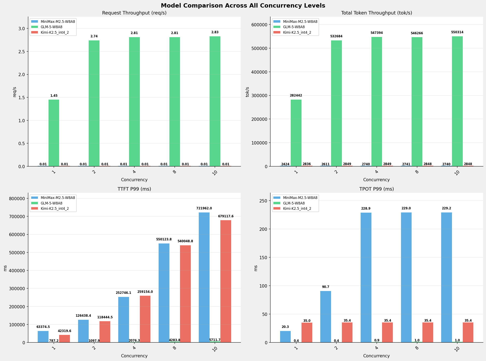

# 多模型性能对比报告 (全并发级别)

**测试日期：** 2026-05-14

**芯片平台：** inspur_metax_c550

**测试套件：** test_02

**Run ID：** 01, 01, 01

**测试配置：** 100-i194560-o1024

**并发级别：** 1, 2, 4, 8, 10

**对比模型：** MiniMax-M2.5-W8A8, GLM-5-W8A8, Kimi-K2.5_int4_2

---

## 🤖 芯片和模型配置信息

| 参数名称 | **MiniMax-M2.5-W8A8** | **GLM-5-W8A8** | **Kimi-K2.5_int4_2** |
|----------|----------|----------|----------|
| **max_position_embeddings** | 196608 | 202752 | 262144 |
| **model_name** | MiniMax-M2.5-W8A8 | GLM-5-W8A8 | Kimi-K2.5_int4_2 |
| **model_size** | 215G | 712G | 496G |
| **python_version** | 3.10.10 | 3.10.10 | 3.10.10 |
| **quantization_config** | int8 | int8 | int4 |
| **sglang_version** | 0.5.9+maca3.5.3.204 | 0.5.9+maca3.5.3.204 | 0.5.9+maca3.5.3.204 |
| **temperature** | N/A | N/A | N/A |
| **top_k** | 40 | N/A | N/A |
| **top_p** | 0.95 | N/A | N/A |
| **transformers_version** | 4.57.6 | 5.1.0 | 4.56.2 |

---

## ⚙️ SGLang 启动配置信息

| 参数名称 | **MiniMax-M2.5-W8A8** | **GLM-5-W8A8** | **Kimi-K2.5_int4_2** |
|----------|----------|----------|----------|
| **Attention Backend** | flashinfer | flashinfer | flashinfer |
| **Chunked Prefill Size** | N/A | 8192 | 8192 |
| **Context Length** | 196608 | 202752 | 262144 |
| **Cuda Graph Max Bs** | N/A | 64 | 64 |
| **Disable Radix Cache** | True | True | True |
| **Dp Size** | N/A | 4 | N/A |
| **Max Queued Requests** | None | None | None |
| **Max Running Requests** | 64 | 64 | 64 |
| **Mem Fraction Static** | 0.9 | 0.8 | 0.8 |
| **Model Name** | MiniMax-M2.5-W8A8 | GLM-5-W8A8 | Kimi-K2.5_int4_2 |
| **Nnodes** | 1 | 2 | 2 |
| **Pp Size** | 1 | 1 | 1 |
| **Quantization** | w8a8_int8 | w8a8_int8 | w4a8_int8 |
| **Reasoning Parser** | minimax-append-think | glm45 | kimi_k2 |
| **Tool Call Parser** | minimax-m2 | glm47 | kimi_k2 |
| **Tp Size** | 8 | 16 | 16 |

---

## 📊 模型列表

| 模型名称 | Run ID | 状态 |
|----------|--------|------|
| MiniMax-M2.5-W8A8 | 01 | [OK] |
| GLM-5-W8A8 | 01 | [OK] |
| Kimi-K2.5_int4_2 | 01 | [OK] |

---

## 📊 测试概览

| 项目            | 配置                                     | 备注  |
|---------------|----------------------------------------|-----|
| **数据集**       | random                                 |     |
| **并发数**       | 1, 2, 4, 8, 10    |     |
| **总请求数**      | 100                                    |     |
| **输入输出长度** | (194560, 1024) |     |
| **测试套件**     | test_02                           |     |
| **被测芯片**      | inspur_metax_c550 |     |
| **SGLang版本**   | 0.5.9                           |     |

---

## 📊 模型性能对比

---

## 📝 分析小结

- **GLM-5-W8A8** 相比 **MiniMax-M2.5-W8A8** 请求吞吐量平均提升 **25180.0%**
- **GLM-5-W8A8** 相比 **MiniMax-M2.5-W8A8** 总token吞吐量平均提升 **18451.4%**
- **Kimi-K2.5_int4_2** 相比 **MiniMax-M2.5-W8A8** 总token吞吐量平均提升 **7.3%**
- **GLM-5-W8A8** 相比 **MiniMax-M2.5-W8A8** TTFT P99平均改善 **99.2%** (延迟降低)
- **Kimi-K2.5_int4_2** 相比 **MiniMax-M2.5-W8A8** TTFT P99平均改善 **4.4%** (延迟降低)
- **GLM-5-W8A8** 相比 **MiniMax-M2.5-W8A8** TPOT P99平均改善 **99.5%** (延迟降低)
- **Kimi-K2.5_int4_2** 相比 **MiniMax-M2.5-W8A8** TPOT P99平均改善 **77.9%** (延迟降低)

---

## 📊 各并发级别详细对比

### 并发级别: 1

#### 服务基准结果

| 指标 | MiniMax-M2.5-W8A8 (基准) | GLM-5-W8A8 | 差异 | % | Kimi-K2.5_int4_2 | 差异 | % |
|------ | --------------- | --------- | ------- | ------- | --------- | ------- | ------- |
| 成功请求数 | 100 | 100 | 0.00 | 0.0% | 100 | 0.00 | 0.0% |
| 测试持续时间 (s) | 8068.18 | 68.90 | -7999.28 | -99.1% | 6896.63 | -1171.55 | -14.5% |
| 总输入 tokens | 19456000 | 19456000 | 0.00 | 0.0% | 19456000 | 0.00 | 0.0% |
| 总生成 tokens | 102400 | 3169 | -99231.00 | -96.9% | 100354 | -2046.00 | -2.0% |
| 请求吞吐量 (req/s) | 0.01 | 1.45 | +1.44 | +14400.0% | 0.01 | 0.00 | 0.0% |
| 输出 token 吞吐量 (tok/s) | 12.69 | 46.00 | +33.31 | +262.5% | 14.55 | +1.86 | +14.7% |
| 总 token 吞吐量 (tok/s) | 2424.14 | 282442.27 | +280018.13 | +11551.2% | 2835.64 | +411.50 | +17.0% |

#### 首Token延迟 (TTFT)

| 指标 | MiniMax-M2.5-W8A8 (基准) | GLM-5-W8A8 | 差异 | % | Kimi-K2.5_int4_2 | 差异 | % |
|------ | --------------- | --------- | ------- | ------- | --------- | ------- | ------- |
| 平均 TTFT (ms) | 60714.60 | 677.01 | -60037.59 | -98.9% | 40645.80 | -20068.80 | -33.1% |
| P99 TTFT (ms) | 63374.54 | 787.19 | -62587.35 | -98.8% | 42319.55 | -21054.99 | -33.2% |

#### 每Token生成时间 (TPOT)

| 指标 | MiniMax-M2.5-W8A8 (基准) | GLM-5-W8A8 | 差异 | % | Kimi-K2.5_int4_2 | 差异 | % |
|------ | --------------- | --------- | ------- | ------- | --------- | ------- | ------- |
| 平均 TPOT (ms) | 19.52 | 0.37 | -19.15 | -98.1% | 28.25 | +8.73 | +44.7% |
| P99 TPOT (ms) | 20.33 | 0.42 | -19.91 | -97.9% | 34.98 | +14.65 | +72.1% |

#### Token间延迟 (ITL)

| 指标 | MiniMax-M2.5-W8A8 (基准) | GLM-5-W8A8 | 差异 | % | Kimi-K2.5_int4_2 | 差异 | % |
|------ | --------------- | --------- | ------- | ------- | --------- | ------- | ------- |
| 平均 ITL (ms) | 20.32 | 0.00 | -20.32 | -100.0% | 28.25 | +7.93 | +39.0% |
| P99 ITL (ms) | 24.42 | 0.00 | -24.42 | -100.0% | 43.56 | +19.14 | +78.4% |

#### 端到端延迟 (E2E)

| 指标 | MiniMax-M2.5-W8A8 (基准) | GLM-5-W8A8 | 差异 | % | Kimi-K2.5_int4_2 | 差异 | % |
|------ | --------------- | --------- | ------- | ------- | --------- | ------- | ------- |
| 平均 E2E 延迟 (ms) | 80681.04 | 688.40 | -79992.64 | -99.1% | 68965.79 | -11715.25 | -14.5% |
| P99 E2E 延迟 (ms) | 84165.35 | 787.19 | -83378.16 | -99.1% | 77217.61 | -6947.74 | -8.3% |

---

### 并发级别: 2

#### 服务基准结果

| 指标 | MiniMax-M2.5-W8A8 (基准) | GLM-5-W8A8 | 差异 | % | Kimi-K2.5_int4_2 | 差异 | % |
|------ | --------------- | --------- | ------- | ------- | --------- | ------- | ------- |
| 成功请求数 | 100 | 100 | 0.00 | 0.0% | 100 | 0.00 | 0.0% |
| 测试持续时间 (s) | 7491.36 | 36.53 | -7454.83 | -99.5% | 6864.89 | -626.47 | -8.4% |
| 总输入 tokens | 19456000 | 19456000 | 0.00 | 0.0% | 19456000 | 0.00 | 0.0% |
| 总生成 tokens | 102400 | 3169 | -99231.00 | -96.9% | 100354 | -2046.00 | -2.0% |
| 请求吞吐量 (req/s) | 0.01 | 2.74 | +2.73 | +27300.0% | 0.01 | 0.00 | 0.0% |
| 输出 token 吞吐量 (tok/s) | 13.67 | 86.75 | +73.08 | +534.6% | 14.62 | +0.95 | +6.9% |
| 总 token 吞吐量 (tok/s) | 2610.79 | 532683.60 | +530072.81 | +20303.2% | 2848.75 | +237.96 | +9.1% |

#### 首Token延迟 (TTFT)

| 指标 | MiniMax-M2.5-W8A8 (基准) | GLM-5-W8A8 | 差异 | % | Kimi-K2.5_int4_2 | 差异 | % |
|------ | --------------- | --------- | ------- | ------- | --------- | ------- | ------- |
| 平均 TTFT (ms) | 91040.24 | 715.72 | -90324.52 | -99.2% | 108264.32 | +17224.08 | +18.9% |
| P99 TTFT (ms) | 126438.40 | 1097.86 | -125340.54 | -99.1% | 118444.54 | -7993.86 | -6.3% |

#### 每Token生成时间 (TPOT)

| 指标 | MiniMax-M2.5-W8A8 (基准) | GLM-5-W8A8 | 差异 | % | Kimi-K2.5_int4_2 | 差异 | % |
|------ | --------------- | --------- | ------- | ------- | --------- | ------- | ------- |
| 平均 TPOT (ms) | 57.46 | 0.36 | -57.10 | -99.4% | 28.27 | -29.19 | -50.8% |
| P99 TPOT (ms) | 90.66 | 0.38 | -90.28 | -99.6% | 35.40 | -55.26 | -61.0% |

#### Token间延迟 (ITL)

| 指标 | MiniMax-M2.5-W8A8 (基准) | GLM-5-W8A8 | 差异 | % | Kimi-K2.5_int4_2 | 差异 | % |
|------ | --------------- | --------- | ------- | ------- | --------- | ------- | ------- |
| 平均 ITL (ms) | 59.84 | 0.00 | -59.84 | -100.0% | 28.27 | -31.57 | -52.8% |
| P99 ITL (ms) | 32.89 | 0.00 | -32.89 | -100.0% | 43.59 | +10.70 | +32.5% |

#### 端到端延迟 (E2E)

| 指标 | MiniMax-M2.5-W8A8 (基准) | GLM-5-W8A8 | 差异 | % | Kimi-K2.5_int4_2 | 差异 | % |
|------ | --------------- | --------- | ------- | ------- | --------- | ------- | ------- |
| 平均 E2E 延迟 (ms) | 149824.72 | 726.67 | -149098.05 | -99.5% | 136610.77 | -13213.95 | -8.8% |
| P99 E2E 延迟 (ms) | 156247.42 | 1097.87 | -155149.55 | -99.3% | 147480.32 | -8767.10 | -5.6% |

---

### 并发级别: 4

#### 服务基准结果

| 指标 | MiniMax-M2.5-W8A8 (基准) | GLM-5-W8A8 | 差异 | % | Kimi-K2.5_int4_2 | 差异 | % |
|------ | --------------- | --------- | ------- | ------- | --------- | ------- | ------- |
| 成功请求数 | 100 | 100 | 0.00 | 0.0% | 100 | 0.00 | 0.0% |
| 测试持续时间 (s) | 7138.91 | 35.55 | -7103.36 | -99.5% | 6865.26 | -273.65 | -3.8% |
| 总输入 tokens | 19456000 | 19456000 | 0.00 | 0.0% | 19456000 | 0.00 | 0.0% |
| 总生成 tokens | 102400 | 3169 | -99231.00 | -96.9% | 100354 | -2046.00 | -2.0% |
| 请求吞吐量 (req/s) | 0.01 | 2.81 | +2.80 | +28000.0% | 0.01 | 0.00 | 0.0% |
| 输出 token 吞吐量 (tok/s) | 14.34 | 89.15 | +74.81 | +521.7% | 14.62 | +0.28 | +2.0% |
| 总 token 吞吐量 (tok/s) | 2739.69 | 547393.69 | +544654.00 | +19880.1% | 2848.60 | +108.91 | +4.0% |

#### 首Token延迟 (TTFT)

| 指标 | MiniMax-M2.5-W8A8 (基准) | GLM-5-W8A8 | 差异 | % | Kimi-K2.5_int4_2 | 差异 | % |
|------ | --------------- | --------- | ------- | ------- | --------- | ------- | ------- |
| 平均 TTFT (ms) | 151789.54 | 1383.44 | -150406.10 | -99.1% | 242126.95 | +90337.41 | +59.5% |
| P99 TTFT (ms) | 252746.14 | 2076.30 | -250669.84 | -99.2% | 259153.98 | +6407.84 | +2.5% |

#### 每Token生成时间 (TPOT)

| 指标 | MiniMax-M2.5-W8A8 (基准) | GLM-5-W8A8 | 差异 | % | Kimi-K2.5_int4_2 | 差异 | % |
|------ | --------------- | --------- | ------- | ------- | --------- | ------- | ------- |
| 平均 TPOT (ms) | 130.75 | 0.77 | -129.98 | -99.4% | 28.29 | -102.46 | -78.4% |
| P99 TPOT (ms) | 228.93 | 0.95 | -227.98 | -99.6% | 35.40 | -193.53 | -84.5% |

#### Token间延迟 (ITL)

| 指标 | MiniMax-M2.5-W8A8 (基准) | GLM-5-W8A8 | 差异 | % | Kimi-K2.5_int4_2 | 差异 | % |
|------ | --------------- | --------- | ------- | ------- | --------- | ------- | ------- |
| 平均 ITL (ms) | 136.17 | 0.00 | -136.17 | -100.0% | 28.29 | -107.88 | -79.2% |
| P99 ITL (ms) | 46.66 | 0.00 | -46.66 | -100.0% | 43.57 | -3.09 | -6.6% |

#### 端到端延迟 (E2E)

| 指标 | MiniMax-M2.5-W8A8 (基准) | GLM-5-W8A8 | 差异 | % | Kimi-K2.5_int4_2 | 差异 | % |
|------ | --------------- | --------- | ------- | ------- | --------- | ------- | ------- |
| 平均 E2E 延迟 (ms) | 285550.39 | 1406.97 | -284143.42 | -99.5% | 270487.20 | -15063.19 | -5.3% |
| P99 E2E 延迟 (ms) | 297902.96 | 2076.31 | -295826.65 | -99.3% | 288560.85 | -9342.11 | -3.1% |

---

### 并发级别: 8

#### 服务基准结果

| 指标 | MiniMax-M2.5-W8A8 (基准) | GLM-5-W8A8 | 差异 | % | Kimi-K2.5_int4_2 | 差异 | % |
|------ | --------------- | --------- | ------- | ------- | --------- | ------- | ------- |
| 成功请求数 | 100 | 100 | 0.00 | 0.0% | 100 | 0.00 | 0.0% |
| 测试持续时间 (s) | 7134.54 | 35.62 | -7098.92 | -99.5% | 6866.22 | -268.32 | -3.8% |
| 总输入 tokens | 19456000 | 19456000 | 0.00 | 0.0% | 19456000 | 0.00 | 0.0% |
| 总生成 tokens | 102400 | 3169 | -99231.00 | -96.9% | 100354 | -2046.00 | -2.0% |
| 请求吞吐量 (req/s) | 0.01 | 2.81 | +2.80 | +28000.0% | 0.01 | 0.00 | 0.0% |
| 输出 token 吞吐量 (tok/s) | 14.35 | 88.96 | +74.61 | +519.9% | 14.62 | +0.27 | +1.9% |
| 总 token 吞吐量 (tok/s) | 2741.37 | 546265.77 | +543524.40 | +19826.7% | 2848.20 | +106.83 | +3.9% |

#### 首Token延迟 (TTFT)

| 指标 | MiniMax-M2.5-W8A8 (基准) | GLM-5-W8A8 | 差异 | % | Kimi-K2.5_int4_2 | 差异 | % |
|------ | --------------- | --------- | ------- | ------- | --------- | ------- | ------- |
| 平均 TTFT (ms) | 425053.85 | 2798.16 | -422255.69 | -99.3% | 501516.70 | +76462.85 | +18.0% |
| P99 TTFT (ms) | 550123.80 | 4283.84 | -545839.96 | -99.2% | 540048.79 | -10075.01 | -1.8% |

#### 每Token生成时间 (TPOT)

| 指标 | MiniMax-M2.5-W8A8 (基准) | GLM-5-W8A8 | 差异 | % | Kimi-K2.5_int4_2 | 差异 | % |
|------ | --------------- | --------- | ------- | ------- | --------- | ------- | ------- |
| 平均 TPOT (ms) | 130.81 | 0.78 | -130.03 | -99.4% | 28.29 | -102.52 | -78.4% |
| P99 TPOT (ms) | 229.02 | 0.98 | -228.04 | -99.6% | 35.42 | -193.60 | -84.5% |

#### Token间延迟 (ITL)

| 指标 | MiniMax-M2.5-W8A8 (基准) | GLM-5-W8A8 | 差异 | % | Kimi-K2.5_int4_2 | 差异 | % |
|------ | --------------- | --------- | ------- | ------- | --------- | ------- | ------- |
| 平均 ITL (ms) | 136.22 | 0.00 | -136.22 | -100.0% | 28.29 | -107.93 | -79.2% |
| P99 ITL (ms) | 46.82 | 0.00 | -46.82 | -100.0% | 43.52 | -3.30 | -7.0% |

#### 端到端延迟 (E2E)

| 指标 | MiniMax-M2.5-W8A8 (基准) | GLM-5-W8A8 | 差异 | % | Kimi-K2.5_int4_2 | 差异 | % |
|------ | --------------- | --------- | ------- | ------- | --------- | ------- | ------- |
| 平均 E2E 延迟 (ms) | 558870.27 | 2821.97 | -556048.30 | -99.5% | 529877.17 | -28993.10 | -5.2% |
| P99 E2E 延迟 (ms) | 595179.12 | 4283.85 | -590895.27 | -99.3% | 570042.23 | -25136.89 | -4.2% |

---

### 并发级别: 10

#### 服务基准结果

| 指标 | MiniMax-M2.5-W8A8 (基准) | GLM-5-W8A8 | 差异 | % | Kimi-K2.5_int4_2 | 差异 | % |
|------ | --------------- | --------- | ------- | ------- | --------- | ------- | ------- |
| 成功请求数 | 100 | 100 | 0.00 | 0.0% | 100 | 0.00 | 0.0% |
| 测试持续时间 (s) | 7139.17 | 35.36 | -7103.81 | -99.5% | 6866.06 | -273.11 | -3.8% |
| 总输入 tokens | 19456000 | 19456000 | 0.00 | 0.0% | 19456000 | 0.00 | 0.0% |
| 总生成 tokens | 102400 | 3169 | -99231.00 | -96.9% | 100354 | -2046.00 | -2.0% |
| 请求吞吐量 (req/s) | 0.01 | 2.83 | +2.82 | +28200.0% | 0.01 | 0.00 | 0.0% |
| 输出 token 吞吐量 (tok/s) | 14.34 | 89.62 | +75.28 | +525.0% | 14.62 | +0.28 | +2.0% |
| 总 token 吞吐量 (tok/s) | 2739.59 | 550313.50 | +547573.91 | +19987.4% | 2848.26 | +108.67 | +4.0% |

#### 首Token延迟 (TTFT)

| 指标 | MiniMax-M2.5-W8A8 (基准) | GLM-5-W8A8 | 差异 | % | Kimi-K2.5_int4_2 | 差异 | % |
|------ | --------------- | --------- | ------- | ------- | --------- | ------- | ------- |
| 平均 TTFT (ms) | 556209.89 | 3472.63 | -552737.26 | -99.4% | 626964.83 | +70754.94 | +12.7% |
| P99 TTFT (ms) | 721962.01 | 5711.66 | -716250.35 | -99.2% | 679117.63 | -42844.38 | -5.9% |

#### 每Token生成时间 (TPOT)

| 指标 | MiniMax-M2.5-W8A8 (基准) | GLM-5-W8A8 | 差异 | % | Kimi-K2.5_int4_2 | 差异 | % |
|------ | --------------- | --------- | ------- | ------- | --------- | ------- | ------- |
| 平均 TPOT (ms) | 130.90 | 0.88 | -130.02 | -99.3% | 28.30 | -102.60 | -78.4% |
| P99 TPOT (ms) | 229.15 | 1.03 | -228.12 | -99.6% | 35.42 | -193.73 | -84.5% |

#### Token间延迟 (ITL)

| 指标 | MiniMax-M2.5-W8A8 (基准) | GLM-5-W8A8 | 差异 | % | Kimi-K2.5_int4_2 | 差异 | % |
|------ | --------------- | --------- | ------- | ------- | --------- | ------- | ------- |
| 平均 ITL (ms) | 136.32 | 0.00 | -136.32 | -100.0% | 28.30 | -108.02 | -79.2% |
| P99 ITL (ms) | 46.84 | 0.00 | -46.84 | -100.0% | 43.59 | -3.25 | -6.9% |

#### 端到端延迟 (E2E)

| 指标 | MiniMax-M2.5-W8A8 (基准) | GLM-5-W8A8 | 差异 | % | Kimi-K2.5_int4_2 | 差异 | % |
|------ | --------------- | --------- | ------- | ------- | --------- | ------- | ------- |
| 平均 E2E 延迟 (ms) | 690123.07 | 3499.53 | -686623.54 | -99.5% | 655336.51 | -34786.56 | -5.0% |
| P99 E2E 延迟 (ms) | 892917.91 | 5711.68 | -887206.23 | -99.4% | 708999.73 | -183918.18 | -20.6% |

---

*报告生成时间: 2026-05-14*

