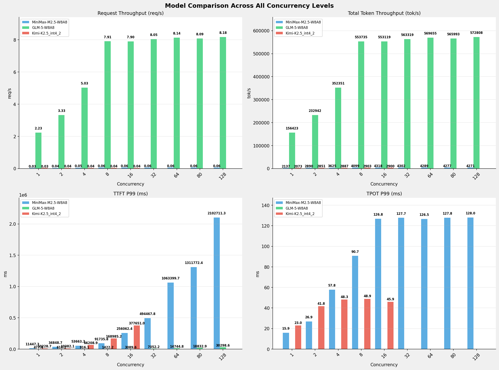

# 多模型性能对比报告 (全并发级别)

**测试日期：** 2026-05-14

**芯片平台：** inspur_metax_c550

**测试套件：** test_04

**Run ID：** 01, 01, 01

**测试配置：** 300-i70000-o1500

**并发级别：** 1, 2, 4, 8, 16, 32, 64, 80, 128

**对比模型：** MiniMax-M2.5-W8A8, GLM-5-W8A8, Kimi-K2.5_int4_2

---

## 🤖 芯片和模型配置信息

| 参数名称 | **MiniMax-M2.5-W8A8** | **GLM-5-W8A8** | **Kimi-K2.5_int4_2** |
|----------|----------|----------|----------|
| **max_position_embeddings** | 196608 | 202752 | 262144 |
| **model_name** | MiniMax-M2.5-W8A8 | GLM-5-W8A8 | Kimi-K2.5_int4_2 |
| **model_size** | 215G | 712G | 496G |
| **python_version** | 3.10.10 | 3.10.10 | 3.10.10 |
| **quantization_config** | int8 | int8 | int4 |
| **sglang_version** | 0.5.9+maca3.5.3.204 | 0.5.9+maca3.5.3.204 | 0.5.9+maca3.5.3.204 |
| **temperature** | N/A | N/A | N/A |
| **top_k** | 40 | N/A | N/A |
| **top_p** | 0.95 | N/A | N/A |
| **transformers_version** | 4.57.6 | 5.1.0 | 4.56.2 |

---

## ⚙️ SGLang 启动配置信息

| 参数名称 | **MiniMax-M2.5-W8A8** | **GLM-5-W8A8** | **Kimi-K2.5_int4_2** |
|----------|----------|----------|----------|
| **Attention Backend** | flashinfer | flashinfer | flashinfer |
| **Chunked Prefill Size** | N/A | 8192 | 8192 |
| **Context Length** | 196608 | 202752 | 262144 |
| **Cuda Graph Max Bs** | N/A | 64 | 64 |
| **Disable Radix Cache** | True | True | True |
| **Dp Size** | N/A | 4 | N/A |
| **Max Queued Requests** | None | None | None |
| **Max Running Requests** | 64 | 64 | 64 |
| **Mem Fraction Static** | 0.9 | 0.8 | 0.8 |
| **Model Name** | MiniMax-M2.5-W8A8 | GLM-5-W8A8 | Kimi-K2.5_int4_2 |
| **Nnodes** | 1 | 2 | 2 |
| **Pp Size** | 1 | 1 | 1 |
| **Quantization** | w8a8_int8 | w8a8_int8 | w4a8_int8 |
| **Reasoning Parser** | minimax-append-think | glm45 | kimi_k2 |
| **Tool Call Parser** | minimax-m2 | glm47 | kimi_k2 |
| **Tp Size** | 8 | 16 | 16 |

---

## 📊 模型列表

| 模型名称 | Run ID | 状态 |
|----------|--------|------|
| MiniMax-M2.5-W8A8 | 01 | [OK] |
| GLM-5-W8A8 | 01 | [OK] |
| Kimi-K2.5_int4_2 | 01 | [OK] |

---

## 📊 测试概览

| 项目            | 配置                                     | 备注  |
|---------------|----------------------------------------|-----|
| **数据集**       | random                                 |     |
| **并发数**       | 1, 2, 4, 8, 16, 32, 64, 80, 128    |     |
| **总请求数**      | 300                                    |     |
| **输入输出长度** | (70000, 1500) |     |
| **测试套件**     | test_04                           |     |
| **被测芯片**      | inspur_metax_c550 |     |
| **SGLang版本**   | 0.5.9                           |     |

---

## 📊 模型性能对比

---

## 📝 分析小结

- **GLM-5-W8A8** 相比 **MiniMax-M2.5-W8A8** 请求吞吐量平均提升 **12162.5%**
- **Kimi-K2.5_int4_2** 相比 **MiniMax-M2.5-W8A8** 请求吞吐量平均变化 **-28.7%**
- **GLM-5-W8A8** 相比 **MiniMax-M2.5-W8A8** 总token吞吐量平均提升 **11945.1%**
- **Kimi-K2.5_int4_2** 相比 **MiniMax-M2.5-W8A8** 总token吞吐量平均变化 **-28.4%**
- **GLM-5-W8A8** 相比 **MiniMax-M2.5-W8A8** TTFT P99平均改善 **98.6%** (延迟降低)
- **Kimi-K2.5_int4_2** 相比 **MiniMax-M2.5-W8A8** TTFT P99平均改善 **79.0%** (延迟降低)
- **GLM-5-W8A8** 无可用数据
- **Kimi-K2.5_int4_2** 相比 **MiniMax-M2.5-W8A8** TPOT P99平均改善 **54.8%** (延迟降低)

---

## 📊 各并发级别详细对比

### 并发级别: 1

#### 服务基准结果

| 指标 | MiniMax-M2.5-W8A8 (基准) | GLM-5-W8A8 | 差异 | % | Kimi-K2.5_int4_2 | 差异 | % |
|------ | --------------- | --------- | ------- | ------- | --------- | ------- | ------- |
| 成功请求数 | 300 | 300 | 0.00 | 0.0% | 300 | 0.00 | 0.0% |
| 测试持续时间 (s) | 10036.82 | 134.25 | -9902.57 | -98.7% | 10347.49 | +310.67 | +3.1% |
| 总输入 tokens | 21000000 | 21000000 | 0.00 | 0.0% | 21000000 | 0.00 | 0.0% |
| 总生成 tokens | 450000 | 300 | -449700.00 | -99.9% | 450000 | 0.00 | 0.0% |
| 请求吞吐量 (req/s) | 0.03 | 2.23 | +2.20 | +7333.3% | 0.03 | 0.00 | 0.0% |
| 输出 token 吞吐量 (tok/s) | 44.83 | 2.23 | -42.60 | -95.0% | 43.49 | -1.34 | -3.0% |
| 总 token 吞吐量 (tok/s) | 2137.13 | 156422.88 | +154285.75 | +7219.3% | 2072.97 | -64.16 | -3.0% |

#### 首Token延迟 (TTFT)

| 指标 | MiniMax-M2.5-W8A8 (基准) | GLM-5-W8A8 | 差异 | % | Kimi-K2.5_int4_2 | 差异 | % |
|------ | --------------- | --------- | ------- | ------- | --------- | ------- | ------- |
| 平均 TTFT (ms) | 9714.72 | 447.15 | -9267.57 | -95.4% | 8832.07 | -882.65 | -9.1% |
| P99 TTFT (ms) | 11447.33 | 477.39 | -10969.94 | -95.8% | 10228.71 | -1218.62 | -10.6% |

#### 每Token生成时间 (TPOT)

| 指标 | MiniMax-M2.5-W8A8 (基准) | GLM-5-W8A8 | 差异 | % | Kimi-K2.5_int4_2 | 差异 | % |
|------ | --------------- | --------- | ------- | ------- | --------- | ------- | ------- |
| 平均 TPOT (ms) | 15.84 | 0.00 | -15.84 | -100.0% | 17.12 | +1.28 | +8.1% |
| P99 TPOT (ms) | 15.86 | 0.00 | -15.86 | -100.0% | 22.96 | +7.10 | +44.8% |

#### Token间延迟 (ITL)

| 指标 | MiniMax-M2.5-W8A8 (基准) | GLM-5-W8A8 | 差异 | % | Kimi-K2.5_int4_2 | 差异 | % |
|------ | --------------- | --------- | ------- | ------- | --------- | ------- | ------- |
| 平均 ITL (ms) | 15.84 | 0.00 | -15.84 | -100.0% | 17.12 | +1.28 | +8.1% |
| P99 ITL (ms) | 19.67 | 0.00 | -19.67 | -100.0% | 30.07 | +10.40 | +52.9% |

#### 端到端延迟 (E2E)

| 指标 | MiniMax-M2.5-W8A8 (基准) | GLM-5-W8A8 | 差异 | % | Kimi-K2.5_int4_2 | 差异 | % |
|------ | --------------- | --------- | ------- | ------- | --------- | ------- | ------- |
| 平均 E2E 延迟 (ms) | 33455.48 | 447.16 | -33008.32 | -98.7% | 34491.10 | +1035.62 | +3.1% |
| P99 E2E 延迟 (ms) | 35227.93 | 477.40 | -34750.53 | -98.6% | 43244.51 | +8016.58 | +22.8% |

---

### 并发级别: 2

#### 服务基准结果

| 指标 | MiniMax-M2.5-W8A8 (基准) | GLM-5-W8A8 | 差异 | % | Kimi-K2.5_int4_2 | 差异 | % |
|------ | --------------- | --------- | ------- | ------- | --------- | ------- | ------- |
| 成功请求数 | 300 | 300 | 0.00 | 0.0% | 300 | 0.00 | 0.0% |
| 测试持续时间 (s) | 7420.87 | 90.15 | -7330.72 | -98.8% | 7524.96 | +104.09 | +1.4% |
| 总输入 tokens | 21000000 | 21000000 | 0.00 | 0.0% | 21000000 | 0.00 | 0.0% |
| 总生成 tokens | 450000 | 300 | -449700.00 | -99.9% | 450000 | 0.00 | 0.0% |
| 请求吞吐量 (req/s) | 0.04 | 3.33 | +3.29 | +8225.0% | 0.04 | 0.00 | 0.0% |
| 输出 token 吞吐量 (tok/s) | 60.64 | 3.33 | -57.31 | -94.5% | 59.80 | -0.84 | -1.4% |
| 总 token 吞吐量 (tok/s) | 2890.50 | 232942.40 | +230051.90 | +7958.9% | 2850.51 | -39.99 | -1.4% |

#### 首Token延迟 (TTFT)

| 指标 | MiniMax-M2.5-W8A8 (基准) | GLM-5-W8A8 | 差异 | % | Kimi-K2.5_int4_2 | 差异 | % |
|------ | --------------- | --------- | ------- | ------- | --------- | ------- | ------- |
| 平均 TTFT (ms) | 14764.48 | 599.56 | -14164.92 | -95.9% | 8843.36 | -5921.12 | -40.1% |
| P99 TTFT (ms) | 34848.72 | 616.19 | -34232.53 | -98.2% | 10382.12 | -24466.60 | -70.2% |

#### 每Token生成时间 (TPOT)

| 指标 | MiniMax-M2.5-W8A8 (基准) | GLM-5-W8A8 | 差异 | % | Kimi-K2.5_int4_2 | 差异 | % |
|------ | --------------- | --------- | ------- | ------- | --------- | ------- | ------- |
| 平均 TPOT (ms) | 23.15 | 0.00 | -23.15 | -100.0% | 27.55 | +4.40 | +19.0% |
| P99 TPOT (ms) | 26.89 | 0.00 | -26.89 | -100.0% | 41.77 | +14.88 | +55.3% |

#### Token间延迟 (ITL)

| 指标 | MiniMax-M2.5-W8A8 (基准) | GLM-5-W8A8 | 差异 | % | Kimi-K2.5_int4_2 | 差异 | % |
|------ | --------------- | --------- | ------- | ------- | --------- | ------- | ------- |
| 平均 ITL (ms) | 23.15 | 0.00 | -23.15 | -100.0% | 27.56 | +4.41 | +19.0% |
| P99 ITL (ms) | 25.32 | 0.00 | -25.32 | -100.0% | 38.62 | +13.30 | +52.5% |

#### 端到端延迟 (E2E)

| 指标 | MiniMax-M2.5-W8A8 (基准) | GLM-5-W8A8 | 差异 | % | Kimi-K2.5_int4_2 | 差异 | % |
|------ | --------------- | --------- | ------- | ------- | --------- | ------- | ------- |
| 平均 E2E 延迟 (ms) | 49470.99 | 599.57 | -48871.42 | -98.8% | 50148.29 | +677.30 | +1.4% |
| P99 E2E 延迟 (ms) | 78147.37 | 616.20 | -77531.17 | -99.2% | 71489.03 | -6658.34 | -8.5% |

---

### 并发级别: 4

#### 服务基准结果

| 指标 | MiniMax-M2.5-W8A8 (基准) | GLM-5-W8A8 | 差异 | % | Kimi-K2.5_int4_2 | 差异 | % |
|------ | --------------- | --------- | ------- | ------- | --------- | ------- | ------- |
| 成功请求数 | 300 | 300 | 0.00 | 0.0% | 300 | 0.00 | 0.0% |
| 测试持续时间 (s) | 5916.84 | 59.60 | -5857.24 | -99.0% | 7429.84 | +1513.00 | +25.6% |
| 总输入 tokens | 21000000 | 21000000 | 0.00 | 0.0% | 21000000 | 0.00 | 0.0% |
| 总生成 tokens | 450000 | 300 | -449700.00 | -99.9% | 450000 | 0.00 | 0.0% |
| 请求吞吐量 (req/s) | 0.05 | 5.03 | +4.98 | +9960.0% | 0.04 | -0.01 | -20.0% |
| 输出 token 吞吐量 (tok/s) | 76.05 | 5.03 | -71.02 | -93.4% | 60.57 | -15.48 | -20.4% |
| 总 token 吞吐量 (tok/s) | 3625.24 | 352351.46 | +348726.22 | +9619.4% | 2887.01 | -738.23 | -20.4% |

#### 首Token延迟 (TTFT)

| 指标 | MiniMax-M2.5-W8A8 (基准) | GLM-5-W8A8 | 差异 | % | Kimi-K2.5_int4_2 | 差异 | % |
|------ | --------------- | --------- | ------- | ------- | --------- | ------- | ------- |
| 平均 TTFT (ms) | 24615.55 | 790.08 | -23825.47 | -96.8% | 54715.01 | +30099.46 | +122.3% |
| P99 TTFT (ms) | 53663.29 | 916.12 | -52747.17 | -98.3% | 66208.88 | +12545.59 | +23.4% |

#### 每Token生成时间 (TPOT)

| 指标 | MiniMax-M2.5-W8A8 (基准) | GLM-5-W8A8 | 差异 | % | Kimi-K2.5_int4_2 | 差异 | % |
|------ | --------------- | --------- | ------- | ------- | --------- | ------- | ------- |
| 平均 TPOT (ms) | 36.21 | 0.00 | -36.21 | -100.0% | 29.38 | -6.83 | -18.9% |
| P99 TPOT (ms) | 57.78 | 0.00 | -57.78 | -100.0% | 48.26 | -9.52 | -16.5% |

#### Token间延迟 (ITL)

| 指标 | MiniMax-M2.5-W8A8 (基准) | GLM-5-W8A8 | 差异 | % | Kimi-K2.5_int4_2 | 差异 | % |
|------ | --------------- | --------- | ------- | ------- | --------- | ------- | ------- |
| 平均 ITL (ms) | 36.21 | 0.00 | -36.21 | -100.0% | 29.38 | -6.83 | -18.9% |
| P99 ITL (ms) | 31.14 | 0.00 | -31.14 | -100.0% | 46.70 | +15.56 | +50.0% |

#### 端到端延迟 (E2E)

| 指标 | MiniMax-M2.5-W8A8 (基准) | GLM-5-W8A8 | 差异 | % | Kimi-K2.5_int4_2 | 差异 | % |
|------ | --------------- | --------- | ------- | ------- | --------- | ------- | ------- |
| 平均 E2E 延迟 (ms) | 78888.00 | 790.09 | -78097.91 | -99.0% | 98755.04 | +19867.04 | +25.2% |
| P99 E2E 延迟 (ms) | 106390.46 | 916.13 | -105474.33 | -99.1% | 130416.24 | +24025.78 | +22.6% |

---

### 并发级别: 8

#### 服务基准结果

| 指标 | MiniMax-M2.5-W8A8 (基准) | GLM-5-W8A8 | 差异 | % | Kimi-K2.5_int4_2 | 差异 | % |
|------ | --------------- | --------- | ------- | ------- | --------- | ------- | ------- |
| 成功请求数 | 300 | 300 | 0.00 | 0.0% | 300 | 0.00 | 0.0% |
| 测试持续时间 (s) | 5233.55 | 37.92 | -5195.63 | -99.3% | 7389.27 | +2155.72 | +41.2% |
| 总输入 tokens | 21000000 | 21000000 | 0.00 | 0.0% | 21000000 | 0.00 | 0.0% |
| 总生成 tokens | 450000 | 300 | -449700.00 | -99.9% | 450000 | 0.00 | 0.0% |
| 请求吞吐量 (req/s) | 0.06 | 7.91 | +7.85 | +13083.3% | 0.04 | -0.02 | -33.3% |
| 输出 token 吞吐量 (tok/s) | 85.98 | 7.91 | -78.07 | -90.8% | 60.90 | -25.08 | -29.2% |
| 总 token 吞吐量 (tok/s) | 4098.56 | 553734.66 | +549636.10 | +13410.5% | 2902.86 | -1195.70 | -29.2% |

#### 首Token延迟 (TTFT)

| 指标 | MiniMax-M2.5-W8A8 (基准) | GLM-5-W8A8 | 差异 | % | Kimi-K2.5_int4_2 | 差异 | % |
|------ | --------------- | --------- | ------- | ------- | --------- | ------- | ------- |
| 平均 TTFT (ms) | 44338.87 | 998.33 | -43340.54 | -97.7% | 150585.56 | +106246.69 | +239.6% |
| P99 TTFT (ms) | 91735.80 | 1422.22 | -90313.58 | -98.4% | 168985.21 | +77249.41 | +84.2% |

#### 每Token生成时间 (TPOT)

| 指标 | MiniMax-M2.5-W8A8 (基准) | GLM-5-W8A8 | 差异 | % | Kimi-K2.5_int4_2 | 差异 | % |
|------ | --------------- | --------- | ------- | ------- | --------- | ------- | ------- |
| 平均 TPOT (ms) | 62.82 | 0.00 | -62.82 | -100.0% | 29.74 | -33.08 | -52.7% |
| P99 TPOT (ms) | 90.68 | 0.00 | -90.68 | -100.0% | 48.93 | -41.75 | -46.0% |

#### Token间延迟 (ITL)

| 指标 | MiniMax-M2.5-W8A8 (基准) | GLM-5-W8A8 | 差异 | % | Kimi-K2.5_int4_2 | 差异 | % |
|------ | --------------- | --------- | ------- | ------- | --------- | ------- | ------- |
| 平均 ITL (ms) | 62.82 | 0.00 | -62.82 | -100.0% | 29.74 | -33.08 | -52.7% |
| P99 ITL (ms) | 43.86 | 0.00 | -43.86 | -100.0% | 46.78 | +2.92 | +6.7% |

#### 端到端延迟 (E2E)

| 指标 | MiniMax-M2.5-W8A8 (基准) | GLM-5-W8A8 | 差异 | % | Kimi-K2.5_int4_2 | 差异 | % |
|------ | --------------- | --------- | ------- | ------- | --------- | ------- | ------- |
| 平均 E2E 延迟 (ms) | 138510.87 | 998.34 | -137512.53 | -99.3% | 195170.98 | +56660.11 | +40.9% |
| P99 E2E 延迟 (ms) | 165851.60 | 1422.23 | -164429.37 | -99.1% | 230348.21 | +64496.61 | +38.9% |

---

### 并发级别: 16

#### 服务基准结果

| 指标 | MiniMax-M2.5-W8A8 (基准) | GLM-5-W8A8 | 差异 | % | Kimi-K2.5_int4_2 | 差异 | % |
|------ | --------------- | --------- | ------- | ------- | --------- | ------- | ------- |
| 成功请求数 | 300 | 300 | 0.00 | 0.0% | 300 | 0.00 | 0.0% |
| 测试持续时间 (s) | 4967.48 | 37.97 | -4929.51 | -99.2% | 7396.17 | +2428.69 | +48.9% |
| 总输入 tokens | 21000000 | 21000000 | 0.00 | 0.0% | 21000000 | 0.00 | 0.0% |
| 总生成 tokens | 450000 | 300 | -449700.00 | -99.9% | 450000 | 0.00 | 0.0% |
| 请求吞吐量 (req/s) | 0.06 | 7.90 | +7.84 | +13066.7% | 0.04 | -0.02 | -33.3% |
| 输出 token 吞吐量 (tok/s) | 90.59 | 7.90 | -82.69 | -91.3% | 60.84 | -29.75 | -32.8% |
| 总 token 吞吐量 (tok/s) | 4318.09 | 553118.65 | +548800.56 | +12709.3% | 2900.15 | -1417.94 | -32.8% |

#### 首Token延迟 (TTFT)

| 指标 | MiniMax-M2.5-W8A8 (基准) | GLM-5-W8A8 | 差异 | % | Kimi-K2.5_int4_2 | 差异 | % |
|------ | --------------- | --------- | ------- | ------- | --------- | ------- | ------- |
| 平均 TTFT (ms) | 129429.07 | 1992.44 | -127436.63 | -98.5% | 341822.97 | +212393.90 | +164.1% |
| P99 TTFT (ms) | 256062.39 | 3089.59 | -252972.80 | -98.8% | 377651.02 | +121588.63 | +47.5% |

#### 每Token生成时间 (TPOT)

| 指标 | MiniMax-M2.5-W8A8 (基准) | GLM-5-W8A8 | 差异 | % | Kimi-K2.5_int4_2 | 差异 | % |
|------ | --------------- | --------- | ------- | ------- | --------- | ------- | ------- |
| 平均 TPOT (ms) | 87.99 | 0.00 | -87.99 | -100.0% | 29.18 | -58.81 | -66.8% |
| P99 TPOT (ms) | 126.76 | 0.00 | -126.76 | -100.0% | 45.91 | -80.85 | -63.8% |

#### Token间延迟 (ITL)

| 指标 | MiniMax-M2.5-W8A8 (基准) | GLM-5-W8A8 | 差异 | % | Kimi-K2.5_int4_2 | 差异 | % |
|------ | --------------- | --------- | ------- | ------- | --------- | ------- | ------- |
| 平均 ITL (ms) | 87.99 | 0.00 | -87.99 | -100.0% | 29.18 | -58.81 | -66.8% |
| P99 ITL (ms) | 56.23 | 0.00 | -56.23 | -100.0% | 46.74 | -9.49 | -16.9% |

#### 端到端延迟 (E2E)

| 指标 | MiniMax-M2.5-W8A8 (基准) | GLM-5-W8A8 | 差异 | % | Kimi-K2.5_int4_2 | 差异 | % |
|------ | --------------- | --------- | ------- | ------- | --------- | ------- | ------- |
| 平均 E2E 延迟 (ms) | 261327.40 | 1992.45 | -259334.95 | -99.2% | 385567.47 | +124240.07 | +47.5% |
| P99 E2E 延迟 (ms) | 405966.76 | 3089.60 | -402877.16 | -99.2% | 427889.53 | +21922.77 | +5.4% |

---

### 并发级别: 32

#### 服务基准结果

| 指标 | MiniMax-M2.5-W8A8 (基准) | GLM-5-W8A8 | 差异 | % | Kimi-K2.5_int4_2 | 差异 | % |
|------ | --------------- | --------- | ------- | ------- | --------- | ------- | ------- |
| 成功请求数 | 300 | 300 | 0.00 | 0.0% | N/A | N/A | N/A |
| 测试持续时间 (s) | 4986.54 | 37.28 | -4949.26 | -99.3% | N/A | N/A | N/A |
| 总输入 tokens | 21000000 | 21000000 | 0.00 | 0.0% | N/A | N/A | N/A |
| 总生成 tokens | 450000 | 300 | -449700.00 | -99.9% | N/A | N/A | N/A |
| 请求吞吐量 (req/s) | 0.06 | 8.05 | +7.99 | +13316.7% | N/A | N/A | N/A |
| 输出 token 吞吐量 (tok/s) | 90.24 | 8.05 | -82.19 | -91.1% | N/A | N/A | N/A |
| 总 token 吞吐量 (tok/s) | 4301.58 | 563319.19 | +559017.61 | +12995.6% | N/A | N/A | N/A |

#### 首Token延迟 (TTFT)

| 指标 | MiniMax-M2.5-W8A8 (基准) | GLM-5-W8A8 | 差异 | % | Kimi-K2.5_int4_2 | 差异 | % |
|------ | --------------- | --------- | ------- | ------- | --------- | ------- | ------- |
| 平均 TTFT (ms) | 378189.16 | 3898.75 | -374290.41 | -99.0% | N/A | N/A | N/A |
| P99 TTFT (ms) | 494467.75 | 7052.25 | -487415.50 | -98.6% | N/A | N/A | N/A |

#### 每Token生成时间 (TPOT)

| 指标 | MiniMax-M2.5-W8A8 (基准) | GLM-5-W8A8 | 差异 | % | Kimi-K2.5_int4_2 | 差异 | % |
|------ | --------------- | --------- | ------- | ------- | --------- | ------- | ------- |
| 平均 TPOT (ms) | 88.90 | 0.00 | -88.90 | -100.0% | N/A | N/A | N/A |
| P99 TPOT (ms) | 127.72 | 0.00 | -127.72 | -100.0% | N/A | N/A | N/A |

#### Token间延迟 (ITL)

| 指标 | MiniMax-M2.5-W8A8 (基准) | GLM-5-W8A8 | 差异 | % | Kimi-K2.5_int4_2 | 差异 | % |
|------ | --------------- | --------- | ------- | ------- | --------- | ------- | ------- |
| 平均 ITL (ms) | 88.90 | 0.00 | -88.90 | -100.0% | N/A | N/A | N/A |
| P99 ITL (ms) | 57.66 | 0.00 | -57.66 | -100.0% | N/A | N/A | N/A |

#### 端到端延迟 (E2E)

| 指标 | MiniMax-M2.5-W8A8 (基准) | GLM-5-W8A8 | 差异 | % | Kimi-K2.5_int4_2 | 差异 | % |
|------ | --------------- | --------- | ------- | ------- | --------- | ------- | ------- |
| 平均 E2E 延迟 (ms) | 511453.47 | 3898.76 | -507554.71 | -99.2% | N/A | N/A | N/A |
| P99 E2E 延迟 (ms) | 617720.72 | 7052.26 | -610668.46 | -98.9% | N/A | N/A | N/A |

---

### 并发级别: 64

#### 服务基准结果

| 指标 | MiniMax-M2.5-W8A8 (基准) | GLM-5-W8A8 | 差异 | % | Kimi-K2.5_int4_2 | 差异 | % |
|------ | --------------- | --------- | ------- | ------- | --------- | ------- | ------- |
| 成功请求数 | 300 | 300 | 0.00 | 0.0% | N/A | N/A | N/A |
| 测试持续时间 (s) | 5001.72 | 36.86 | -4964.86 | -99.3% | N/A | N/A | N/A |
| 总输入 tokens | 21000000 | 21000000 | 0.00 | 0.0% | N/A | N/A | N/A |
| 总生成 tokens | 450000 | 300 | -449700.00 | -99.9% | N/A | N/A | N/A |
| 请求吞吐量 (req/s) | 0.06 | 8.14 | +8.08 | +13466.7% | N/A | N/A | N/A |
| 输出 token 吞吐量 (tok/s) | 89.97 | 8.14 | -81.83 | -91.0% | N/A | N/A | N/A |
| 总 token 吞吐量 (tok/s) | 4288.52 | 569654.96 | +565366.44 | +13183.3% | N/A | N/A | N/A |

#### 首Token延迟 (TTFT)

| 指标 | MiniMax-M2.5-W8A8 (基准) | GLM-5-W8A8 | 差异 | % | Kimi-K2.5_int4_2 | 差异 | % |
|------ | --------------- | --------- | ------- | ------- | --------- | ------- | ------- |
| 平均 TTFT (ms) | 838886.47 | 7755.02 | -831131.45 | -99.1% | N/A | N/A | N/A |
| P99 TTFT (ms) | 1063399.69 | 14744.80 | -1048654.89 | -98.6% | N/A | N/A | N/A |

#### 每Token生成时间 (TPOT)

| 指标 | MiniMax-M2.5-W8A8 (基准) | GLM-5-W8A8 | 差异 | % | Kimi-K2.5_int4_2 | 差异 | % |
|------ | --------------- | --------- | ------- | ------- | --------- | ------- | ------- |
| 平均 TPOT (ms) | 88.35 | 0.00 | -88.35 | -100.0% | N/A | N/A | N/A |
| P99 TPOT (ms) | 126.53 | 0.00 | -126.53 | -100.0% | N/A | N/A | N/A |

#### Token间延迟 (ITL)

| 指标 | MiniMax-M2.5-W8A8 (基准) | GLM-5-W8A8 | 差异 | % | Kimi-K2.5_int4_2 | 差异 | % |
|------ | --------------- | --------- | ------- | ------- | --------- | ------- | ------- |
| 平均 ITL (ms) | 88.35 | 0.00 | -88.35 | -100.0% | N/A | N/A | N/A |
| P99 ITL (ms) | 57.55 | 0.00 | -57.55 | -100.0% | N/A | N/A | N/A |

#### 端到端延迟 (E2E)

| 指标 | MiniMax-M2.5-W8A8 (基准) | GLM-5-W8A8 | 差异 | % | Kimi-K2.5_int4_2 | 差异 | % |
|------ | --------------- | --------- | ------- | ------- | --------- | ------- | ------- |
| 平均 E2E 延迟 (ms) | 971316.36 | 7755.03 | -963561.33 | -99.2% | N/A | N/A | N/A |
| P99 E2E 延迟 (ms) | 1210763.24 | 14744.81 | -1196018.43 | -98.8% | N/A | N/A | N/A |

---

### 并发级别: 80

#### 服务基准结果

| 指标 | MiniMax-M2.5-W8A8 (基准) | GLM-5-W8A8 | 差异 | % | Kimi-K2.5_int4_2 | 差异 | % |
|------ | --------------- | --------- | ------- | ------- | --------- | ------- | ------- |
| 成功请求数 | 300 | 300 | 0.00 | 0.0% | N/A | N/A | N/A |
| 测试持续时间 (s) | 5015.07 | 37.10 | -4977.97 | -99.3% | N/A | N/A | N/A |
| 总输入 tokens | 21000000 | 21000000 | 0.00 | 0.0% | N/A | N/A | N/A |
| 总生成 tokens | 450000 | 300 | -449700.00 | -99.9% | N/A | N/A | N/A |
| 请求吞吐量 (req/s) | 0.06 | 8.09 | +8.03 | +13383.3% | N/A | N/A | N/A |
| 输出 token 吞吐量 (tok/s) | 89.73 | 8.09 | -81.64 | -91.0% | N/A | N/A | N/A |
| 总 token 吞吐量 (tok/s) | 4277.11 | 565993.47 | +561716.36 | +13133.1% | N/A | N/A | N/A |

#### 首Token延迟 (TTFT)

| 指标 | MiniMax-M2.5-W8A8 (基准) | GLM-5-W8A8 | 差异 | % | Kimi-K2.5_int4_2 | 差异 | % |
|------ | --------------- | --------- | ------- | ------- | --------- | ------- | ------- |
| 平均 TTFT (ms) | 1049426.46 | 9741.05 | -1039685.41 | -99.1% | N/A | N/A | N/A |
| P99 TTFT (ms) | 1311772.38 | 18832.87 | -1292939.51 | -98.6% | N/A | N/A | N/A |

#### 每Token生成时间 (TPOT)

| 指标 | MiniMax-M2.5-W8A8 (基准) | GLM-5-W8A8 | 差异 | % | Kimi-K2.5_int4_2 | 差异 | % |
|------ | --------------- | --------- | ------- | ------- | --------- | ------- | ------- |
| 平均 TPOT (ms) | 88.66 | 0.00 | -88.66 | -100.0% | N/A | N/A | N/A |
| P99 TPOT (ms) | 127.80 | 0.00 | -127.80 | -100.0% | N/A | N/A | N/A |

#### Token间延迟 (ITL)

| 指标 | MiniMax-M2.5-W8A8 (基准) | GLM-5-W8A8 | 差异 | % | Kimi-K2.5_int4_2 | 差异 | % |
|------ | --------------- | --------- | ------- | ------- | --------- | ------- | ------- |
| 平均 ITL (ms) | 88.66 | 0.00 | -88.66 | -100.0% | N/A | N/A | N/A |
| P99 ITL (ms) | 57.68 | 0.00 | -57.68 | -100.0% | N/A | N/A | N/A |

#### 端到端延迟 (E2E)

| 指标 | MiniMax-M2.5-W8A8 (基准) | GLM-5-W8A8 | 差异 | % | Kimi-K2.5_int4_2 | 差异 | % |
|------ | --------------- | --------- | ------- | ------- | --------- | ------- | ------- |
| 平均 E2E 延迟 (ms) | 1182334.74 | 9741.06 | -1172593.68 | -99.2% | N/A | N/A | N/A |
| P99 E2E 延迟 (ms) | 1425006.74 | 18832.88 | -1406173.86 | -98.7% | N/A | N/A | N/A |

---

### 并发级别: 128

#### 服务基准结果

| 指标 | MiniMax-M2.5-W8A8 (基准) | GLM-5-W8A8 | 差异 | % | Kimi-K2.5_int4_2 | 差异 | % |
|------ | --------------- | --------- | ------- | ------- | --------- | ------- | ------- |
| 成功请求数 | 300 | 300 | 0.00 | 0.0% | N/A | N/A | N/A |
| 测试持续时间 (s) | 5022.32 | 36.66 | -4985.66 | -99.3% | N/A | N/A | N/A |
| 总输入 tokens | 21000000 | 21000000 | 0.00 | 0.0% | N/A | N/A | N/A |
| 总生成 tokens | 450000 | 300 | -449700.00 | -99.9% | N/A | N/A | N/A |
| 请求吞吐量 (req/s) | 0.06 | 8.18 | +8.12 | +13533.3% | N/A | N/A | N/A |
| 输出 token 吞吐量 (tok/s) | 89.60 | 8.18 | -81.42 | -90.9% | N/A | N/A | N/A |
| 总 token 吞吐量 (tok/s) | 4270.93 | 572808.19 | +568537.26 | +13311.8% | N/A | N/A | N/A |

#### 首Token延迟 (TTFT)

| 指标 | MiniMax-M2.5-W8A8 (基准) | GLM-5-W8A8 | 差异 | % | Kimi-K2.5_int4_2 | 差异 | % |
|------ | --------------- | --------- | ------- | ------- | --------- | ------- | ------- |
| 平均 TTFT (ms) | 1591633.34 | 15416.99 | -1576216.35 | -99.0% | N/A | N/A | N/A |
| P99 TTFT (ms) | 2102711.33 | 30298.62 | -2072412.71 | -98.6% | N/A | N/A | N/A |

#### 每Token生成时间 (TPOT)

| 指标 | MiniMax-M2.5-W8A8 (基准) | GLM-5-W8A8 | 差异 | % | Kimi-K2.5_int4_2 | 差异 | % |
|------ | --------------- | --------- | ------- | ------- | --------- | ------- | ------- |
| 平均 TPOT (ms) | 88.75 | 0.00 | -88.75 | -100.0% | N/A | N/A | N/A |
| P99 TPOT (ms) | 128.04 | 0.00 | -128.04 | -100.0% | N/A | N/A | N/A |

#### Token间延迟 (ITL)

| 指标 | MiniMax-M2.5-W8A8 (基准) | GLM-5-W8A8 | 差异 | % | Kimi-K2.5_int4_2 | 差异 | % |
|------ | --------------- | --------- | ------- | ------- | --------- | ------- | ------- |
| 平均 ITL (ms) | 88.75 | 0.00 | -88.75 | -100.0% | N/A | N/A | N/A |
| P99 ITL (ms) | 57.44 | 0.00 | -57.44 | -100.0% | N/A | N/A | N/A |

#### 端到端延迟 (E2E)

| 指标 | MiniMax-M2.5-W8A8 (基准) | GLM-5-W8A8 | 差异 | % | Kimi-K2.5_int4_2 | 差异 | % |
|------ | --------------- | --------- | ------- | ------- | --------- | ------- | ------- |
| 平均 E2E 延迟 (ms) | 1724674.66 | 15417.00 | -1709257.66 | -99.1% | N/A | N/A | N/A |
| P99 E2E 延迟 (ms) | 2217012.52 | 30298.63 | -2186713.89 | -98.6% | N/A | N/A | N/A |

---

*报告生成时间: 2026-05-14*

