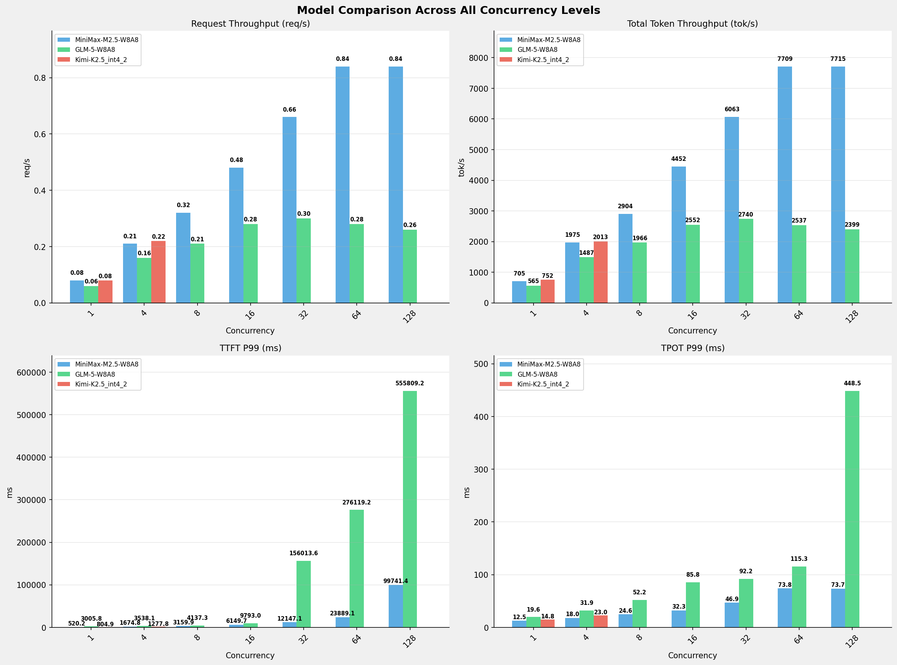

# 多模型性能对比报告 (全并发级别)

**测试日期：** 2026-05-14

**芯片平台：** inspur_metax_c550

**测试套件：** test_05

**Run ID：** 01, 01, 01

**测试配置：** 1000-i8192-o1024

**并发级别：** 1, 4, 8, 16, 32, 64, 128

**对比模型：** MiniMax-M2.5-W8A8, GLM-5-W8A8, Kimi-K2.5_int4_2

---

## 🤖 芯片和模型配置信息

| 参数名称 | **MiniMax-M2.5-W8A8** | **GLM-5-W8A8** | **Kimi-K2.5_int4_2** |
|----------|----------|----------|----------|
| **max_position_embeddings** | 196608 | 202752 | 262144 |
| **model_name** | MiniMax-M2.5-W8A8 | GLM-5-W8A8 | Kimi-K2.5_int4_2 |
| **model_size** | 215G | 712G | 496G |
| **python_version** | 3.10.10 | 3.10.10 | 3.10.10 |
| **quantization_config** | int8 | int8 | int4 |
| **sglang_version** | 0.5.9+maca3.5.3.204 | 0.5.9+maca3.5.3.204 | 0.5.9+maca3.5.3.204 |
| **temperature** | N/A | N/A | N/A |
| **top_k** | 40 | N/A | N/A |
| **top_p** | 0.95 | N/A | N/A |
| **transformers_version** | 4.57.6 | 5.1.0 | 4.56.2 |

---

## ⚙️ SGLang 启动配置信息

| 参数名称 | **MiniMax-M2.5-W8A8** | **GLM-5-W8A8** | **Kimi-K2.5_int4_2** |
|----------|----------|----------|----------|
| **Attention Backend** | flashinfer | flashinfer | flashinfer |
| **Chunked Prefill Size** | N/A | 8192 | 8192 |
| **Context Length** | 196608 | 202752 | 262144 |
| **Cuda Graph Max Bs** | N/A | 64 | 64 |
| **Disable Radix Cache** | True | True | True |
| **Dp Size** | N/A | 4 | N/A |
| **Max Queued Requests** | None | None | None |
| **Max Running Requests** | 64 | 64 | 64 |
| **Mem Fraction Static** | 0.9 | 0.8 | 0.8 |
| **Model Name** | MiniMax-M2.5-W8A8 | GLM-5-W8A8 | Kimi-K2.5_int4_2 |
| **Nnodes** | 1 | 2 | 2 |
| **Pp Size** | 1 | 1 | 1 |
| **Quantization** | w8a8_int8 | w8a8_int8 | w4a8_int8 |
| **Reasoning Parser** | minimax-append-think | glm45 | kimi_k2 |
| **Tool Call Parser** | minimax-m2 | glm47 | kimi_k2 |
| **Tp Size** | 8 | 16 | 16 |

---

## 📊 模型列表

| 模型名称 | Run ID | 状态 |
|----------|--------|------|
| MiniMax-M2.5-W8A8 | 01 | [OK] |
| GLM-5-W8A8 | 01 | [OK] |
| Kimi-K2.5_int4_2 | 01 | [OK] |

---

## 📊 测试概览

| 项目            | 配置                                     | 备注  |
|---------------|----------------------------------------|-----|
| **数据集**       | random                                 |     |
| **并发数**       | 1, 4, 8, 16, 32, 64, 128    |     |
| **总请求数**      | 1000                                    |     |
| **输入输出长度** | (128, 128), (512, 256), (1024, 512), (2048, 1024), (4096, 2048), (8192, 1024) |     |
| **测试套件**     | test_05                           |     |
| **被测芯片**      | inspur_metax_c550 |     |
| **SGLang版本**   | 0.5.9                           |     |

---

## 📊 模型性能对比

---

## 📝 分析小结

- **GLM-5-W8A8** 相比 **MiniMax-M2.5-W8A8** 请求吞吐量平均变化 **-54.8%**
- **Kimi-K2.5_int4_2** 相比 **MiniMax-M2.5-W8A8** 请求吞吐量平均变化 **-69.4%**
- **GLM-5-W8A8** 相比 **MiniMax-M2.5-W8A8** 总token吞吐量平均变化 **-54.8%**
- **Kimi-K2.5_int4_2** 相比 **MiniMax-M2.5-W8A8** 总token吞吐量平均变化 **-69.3%**
- **GLM-5-W8A8** 相比 **MiniMax-M2.5-W8A8** TTFT P99平均增加 **584.7%** (延迟增加)
- **Kimi-K2.5_int4_2** 相比 **MiniMax-M2.5-W8A8** TTFT P99平均改善 **95.1%** (延迟降低)
- **GLM-5-W8A8** 相比 **MiniMax-M2.5-W8A8** TPOT P99平均增加 **200.0%** (延迟增加)
- **Kimi-K2.5_int4_2** 相比 **MiniMax-M2.5-W8A8** TPOT P99平均改善 **53.1%** (延迟降低)

---

## 📊 各并发级别详细对比

### 并发级别: 1

#### 服务基准结果

| 指标 | MiniMax-M2.5-W8A8 (基准) | GLM-5-W8A8 | 差异 | % | Kimi-K2.5_int4_2 | 差异 | % |
|------ | --------------- | --------- | ------- | ------- | --------- | ------- | ------- |
| 成功请求数 | 1000 | 1000 | 0.00 | 0.0% | 1000 | 0.00 | 0.0% |
| 测试持续时间 (s) | 13080.41 | 16308.45 | +3228.04 | +24.7% | 12256.06 | -824.35 | -6.3% |
| 总输入 tokens | 8192000 | 8192000 | 0.00 | 0.0% | 8192000 | 0.00 | 0.0% |
| 总生成 tokens | 1024000 | 1024000 | 0.00 | 0.0% | 1024000 | 0.00 | 0.0% |
| 请求吞吐量 (req/s) | 0.08 | 0.06 | -0.02 | -25.0% | 0.08 | 0.00 | 0.0% |
| 输出 token 吞吐量 (tok/s) | 78.29 | 62.79 | -15.50 | -19.8% | 83.55 | +5.26 | +6.7% |
| 总 token 吞吐量 (tok/s) | 704.57 | 565.11 | -139.46 | -19.8% | 751.95 | +47.38 | +6.7% |

#### 首Token延迟 (TTFT)

| 指标 | MiniMax-M2.5-W8A8 (基准) | GLM-5-W8A8 | 差异 | % | Kimi-K2.5_int4_2 | 差异 | % |
|------ | --------------- | --------- | ------- | ------- | --------- | ------- | ------- |
| 平均 TTFT (ms) | 373.11 | 2701.23 | +2328.12 | +624.0% | 666.43 | +293.32 | +78.6% |
| P99 TTFT (ms) | 520.17 | 3005.83 | +2485.66 | +477.9% | 804.92 | +284.75 | +54.7% |

#### 每Token生成时间 (TPOT)

| 指标 | MiniMax-M2.5-W8A8 (基准) | GLM-5-W8A8 | 差异 | % | Kimi-K2.5_int4_2 | 差异 | % |
|------ | --------------- | --------- | ------- | ------- | --------- | ------- | ------- |
| 平均 TPOT (ms) | 12.42 | 13.30 | +0.88 | +7.1% | 11.33 | -1.09 | -8.8% |
| P99 TPOT (ms) | 12.47 | 19.60 | +7.13 | +57.2% | 14.76 | +2.29 | +18.4% |

#### Token间延迟 (ITL)

| 指标 | MiniMax-M2.5-W8A8 (基准) | GLM-5-W8A8 | 差异 | % | Kimi-K2.5_int4_2 | 差异 | % |
|------ | --------------- | --------- | ------- | ------- | --------- | ------- | ------- |
| 平均 ITL (ms) | 12.42 | 13.30 | +0.88 | +7.1% | 11.33 | -1.09 | -8.8% |
| P99 ITL (ms) | 17.77 | 25.37 | +7.60 | +42.8% | 22.47 | +4.70 | +26.4% |

#### 端到端延迟 (E2E)

| 指标 | MiniMax-M2.5-W8A8 (基准) | GLM-5-W8A8 | 差异 | % | Kimi-K2.5_int4_2 | 差异 | % |
|------ | --------------- | --------- | ------- | ------- | --------- | ------- | ------- |
| 平均 E2E 延迟 (ms) | 13079.88 | 16307.94 | +3228.06 | +24.7% | 12255.59 | -824.29 | -6.3% |
| P99 E2E 延迟 (ms) | 13266.33 | 22758.94 | +9492.61 | +71.6% | 15757.12 | +2490.79 | +18.8% |

---

### 并发级别: 4

#### 服务基准结果

| 指标 | MiniMax-M2.5-W8A8 (基准) | GLM-5-W8A8 | 差异 | % | Kimi-K2.5_int4_2 | 差异 | % |
|------ | --------------- | --------- | ------- | ------- | --------- | ------- | ------- |
| 成功请求数 | 1000 | 1000 | 0.00 | 0.0% | 1000 | 0.00 | 0.0% |
| 测试持续时间 (s) | 4666.34 | 6199.53 | +1533.19 | +32.9% | 4578.51 | -87.83 | -1.9% |
| 总输入 tokens | 8192000 | 8192000 | 0.00 | 0.0% | 8192000 | 0.00 | 0.0% |
| 总生成 tokens | 1024000 | 1024000 | 0.00 | 0.0% | 1024000 | 0.00 | 0.0% |
| 请求吞吐量 (req/s) | 0.21 | 0.16 | -0.05 | -23.8% | 0.22 | +0.01 | +4.8% |
| 输出 token 吞吐量 (tok/s) | 219.44 | 165.17 | -54.27 | -24.7% | 223.65 | +4.21 | +1.9% |
| 总 token 吞吐量 (tok/s) | 1975.00 | 1486.56 | -488.44 | -24.7% | 2012.88 | +37.88 | +1.9% |

#### 首Token延迟 (TTFT)

| 指标 | MiniMax-M2.5-W8A8 (基准) | GLM-5-W8A8 | 差异 | % | Kimi-K2.5_int4_2 | 差异 | % |
|------ | --------------- | --------- | ------- | ------- | --------- | ------- | ------- |
| 平均 TTFT (ms) | 1002.75 | 2754.49 | +1751.74 | +174.7% | 685.95 | -316.80 | -31.6% |
| P99 TTFT (ms) | 1674.84 | 3538.13 | +1863.29 | +111.3% | 1277.80 | -397.04 | -23.7% |

#### 每Token生成时间 (TPOT)

| 指标 | MiniMax-M2.5-W8A8 (基准) | GLM-5-W8A8 | 差异 | % | Kimi-K2.5_int4_2 | 差异 | % |
|------ | --------------- | --------- | ------- | ------- | --------- | ------- | ------- |
| 平均 TPOT (ms) | 17.26 | 21.46 | +4.20 | +24.3% | 17.21 | -0.05 | -0.3% |
| P99 TPOT (ms) | 18.01 | 31.87 | +13.86 | +77.0% | 23.01 | +5.00 | +27.8% |

#### Token间延迟 (ITL)

| 指标 | MiniMax-M2.5-W8A8 (基准) | GLM-5-W8A8 | 差异 | % | Kimi-K2.5_int4_2 | 差异 | % |
|------ | --------------- | --------- | ------- | ------- | --------- | ------- | ------- |
| 平均 ITL (ms) | 17.26 | 21.46 | +4.20 | +24.3% | 17.21 | -0.05 | -0.3% |
| P99 ITL (ms) | 23.89 | 667.28 | +643.39 | +2693.1% | 30.56 | +6.67 | +27.9% |

#### 端到端延迟 (E2E)

| 指标 | MiniMax-M2.5-W8A8 (基准) | GLM-5-W8A8 | 差异 | % | Kimi-K2.5_int4_2 | 差异 | % |
|------ | --------------- | --------- | ------- | ------- | --------- | ------- | ------- |
| 平均 E2E 延迟 (ms) | 18663.66 | 24709.21 | +6045.55 | +32.4% | 18291.10 | -372.56 | -2.0% |
| P99 E2E 延迟 (ms) | 19852.65 | 35540.21 | +15687.56 | +79.0% | 24233.02 | +4380.37 | +22.1% |

---

### 并发级别: 8

#### 服务基准结果

| 指标 | MiniMax-M2.5-W8A8 (基准) | GLM-5-W8A8 | 差异 | % | Kimi-K2.5_int4_2 | 差异 | % |
|------ | --------------- | --------- | ------- | ------- | --------- | ------- | ------- |
| 成功请求数 | 1000 | 1000 | 0.00 | 0.0% | N/A | N/A | N/A |
| 测试持续时间 (s) | 3173.50 | 4687.49 | +1513.99 | +47.7% | N/A | N/A | N/A |
| 总输入 tokens | 8192000 | 8192000 | 0.00 | 0.0% | N/A | N/A | N/A |
| 总生成 tokens | 1024000 | 1024000 | 0.00 | 0.0% | N/A | N/A | N/A |
| 请求吞吐量 (req/s) | 0.32 | 0.21 | -0.11 | -34.4% | N/A | N/A | N/A |
| 输出 token 吞吐量 (tok/s) | 322.67 | 218.45 | -104.22 | -32.3% | N/A | N/A | N/A |
| 总 token 吞吐量 (tok/s) | 2904.05 | 1966.08 | -937.97 | -32.3% | N/A | N/A | N/A |

#### 首Token延迟 (TTFT)

| 指标 | MiniMax-M2.5-W8A8 (基准) | GLM-5-W8A8 | 差异 | % | Kimi-K2.5_int4_2 | 差异 | % |
|------ | --------------- | --------- | ------- | ------- | --------- | ------- | ------- |
| 平均 TTFT (ms) | 1745.96 | 2825.46 | +1079.50 | +61.8% | N/A | N/A | N/A |
| P99 TTFT (ms) | 3159.86 | 4137.29 | +977.43 | +30.9% | N/A | N/A | N/A |

#### 每Token生成时间 (TPOT)

| 指标 | MiniMax-M2.5-W8A8 (基准) | GLM-5-W8A8 | 差异 | % | Kimi-K2.5_int4_2 | 差异 | % |
|------ | --------------- | --------- | ------- | ------- | --------- | ------- | ------- |
| 平均 TPOT (ms) | 23.11 | 33.81 | +10.70 | +46.3% | N/A | N/A | N/A |
| P99 TPOT (ms) | 24.60 | 52.23 | +27.63 | +112.3% | N/A | N/A | N/A |

#### Token间延迟 (ITL)

| 指标 | MiniMax-M2.5-W8A8 (基准) | GLM-5-W8A8 | 差异 | % | Kimi-K2.5_int4_2 | 差异 | % |
|------ | --------------- | --------- | ------- | ------- | --------- | ------- | ------- |
| 平均 ITL (ms) | 23.11 | 33.81 | +10.70 | +46.3% | N/A | N/A | N/A |
| P99 ITL (ms) | 27.16 | 686.41 | +659.25 | +2427.3% | N/A | N/A | N/A |

#### 端到端延迟 (E2E)

| 指标 | MiniMax-M2.5-W8A8 (基准) | GLM-5-W8A8 | 差异 | % | Kimi-K2.5_int4_2 | 差异 | % |
|------ | --------------- | --------- | ------- | ------- | --------- | ------- | ------- |
| 平均 E2E 延迟 (ms) | 25384.99 | 37411.73 | +12026.74 | +47.4% | N/A | N/A | N/A |
| P99 E2E 延迟 (ms) | 26192.83 | 56017.64 | +29824.81 | +113.9% | N/A | N/A | N/A |

---

### 并发级别: 16

#### 服务基准结果

| 指标 | MiniMax-M2.5-W8A8 (基准) | GLM-5-W8A8 | 差异 | % | Kimi-K2.5_int4_2 | 差异 | % |
|------ | --------------- | --------- | ------- | ------- | --------- | ------- | ------- |
| 成功请求数 | 1000 | 1000 | 0.00 | 0.0% | N/A | N/A | N/A |
| 测试持续时间 (s) | 2070.20 | 3611.64 | +1541.44 | +74.5% | N/A | N/A | N/A |
| 总输入 tokens | 8192000 | 8192000 | 0.00 | 0.0% | N/A | N/A | N/A |
| 总生成 tokens | 1024000 | 1024000 | 0.00 | 0.0% | N/A | N/A | N/A |
| 请求吞吐量 (req/s) | 0.48 | 0.28 | -0.20 | -41.7% | N/A | N/A | N/A |
| 输出 token 吞吐量 (tok/s) | 494.64 | 283.53 | -211.11 | -42.7% | N/A | N/A | N/A |
| 总 token 吞吐量 (tok/s) | 4451.74 | 2551.75 | -1899.99 | -42.7% | N/A | N/A | N/A |

#### 首Token延迟 (TTFT)

| 指标 | MiniMax-M2.5-W8A8 (基准) | GLM-5-W8A8 | 差异 | % | Kimi-K2.5_int4_2 | 差异 | % |
|------ | --------------- | --------- | ------- | ------- | --------- | ------- | ------- |
| 平均 TTFT (ms) | 3201.04 | 3089.75 | -111.29 | -3.5% | N/A | N/A | N/A |
| P99 TTFT (ms) | 6149.73 | 9793.00 | +3643.27 | +59.2% | N/A | N/A | N/A |

#### 每Token生成时间 (TPOT)

| 指标 | MiniMax-M2.5-W8A8 (基准) | GLM-5-W8A8 | 差异 | % | Kimi-K2.5_int4_2 | 差异 | % |
|------ | --------------- | --------- | ------- | ------- | --------- | ------- | ------- |
| 平均 TPOT (ms) | 29.04 | 53.21 | +24.17 | +83.2% | N/A | N/A | N/A |
| P99 TPOT (ms) | 32.34 | 85.77 | +53.43 | +165.2% | N/A | N/A | N/A |

#### Token间延迟 (ITL)

| 指标 | MiniMax-M2.5-W8A8 (基准) | GLM-5-W8A8 | 差异 | % | Kimi-K2.5_int4_2 | 差异 | % |
|------ | --------------- | --------- | ------- | ------- | --------- | ------- | ------- |
| 平均 ITL (ms) | 29.04 | 53.21 | +24.17 | +83.2% | N/A | N/A | N/A |
| P99 ITL (ms) | 31.66 | 698.26 | +666.60 | +2105.5% | N/A | N/A | N/A |

#### 端到端延迟 (E2E)

| 指标 | MiniMax-M2.5-W8A8 (基准) | GLM-5-W8A8 | 差异 | % | Kimi-K2.5_int4_2 | 差异 | % |
|------ | --------------- | --------- | ------- | ------- | --------- | ------- | ------- |
| 平均 E2E 延迟 (ms) | 32912.17 | 57519.49 | +24607.32 | +74.8% | N/A | N/A | N/A |
| P99 E2E 延迟 (ms) | 34069.80 | 90410.80 | +56341.00 | +165.4% | N/A | N/A | N/A |

---

### 并发级别: 32

#### 服务基准结果

| 指标 | MiniMax-M2.5-W8A8 (基准) | GLM-5-W8A8 | 差异 | % | Kimi-K2.5_int4_2 | 差异 | % |
|------ | --------------- | --------- | ------- | ------- | --------- | ------- | ------- |
| 成功请求数 | 1000 | 1000 | 0.00 | 0.0% | N/A | N/A | N/A |
| 测试持续时间 (s) | 1520.07 | 3363.94 | +1843.87 | +121.3% | N/A | N/A | N/A |
| 总输入 tokens | 8192000 | 8192000 | 0.00 | 0.0% | N/A | N/A | N/A |
| 总生成 tokens | 1024000 | 1024000 | 0.00 | 0.0% | N/A | N/A | N/A |
| 请求吞吐量 (req/s) | 0.66 | 0.30 | -0.36 | -54.5% | N/A | N/A | N/A |
| 输出 token 吞吐量 (tok/s) | 673.65 | 304.40 | -369.25 | -54.8% | N/A | N/A | N/A |
| 总 token 吞吐量 (tok/s) | 6062.88 | 2739.64 | -3323.24 | -54.8% | N/A | N/A | N/A |

#### 首Token延迟 (TTFT)

| 指标 | MiniMax-M2.5-W8A8 (基准) | GLM-5-W8A8 | 差异 | % | Kimi-K2.5_int4_2 | 差异 | % |
|------ | --------------- | --------- | ------- | ------- | --------- | ------- | ------- |
| 平均 TTFT (ms) | 6122.72 | 50105.92 | +43983.20 | +718.4% | N/A | N/A | N/A |
| P99 TTFT (ms) | 12147.10 | 156013.57 | +143866.47 | +1184.4% | N/A | N/A | N/A |

#### 每Token生成时间 (TPOT)

| 指标 | MiniMax-M2.5-W8A8 (基准) | GLM-5-W8A8 | 差异 | % | Kimi-K2.5_int4_2 | 差异 | % |
|------ | --------------- | --------- | ------- | ------- | --------- | ------- | ------- |
| 平均 TPOT (ms) | 40.95 | 54.06 | +13.11 | +32.0% | N/A | N/A | N/A |
| P99 TPOT (ms) | 46.88 | 92.23 | +45.35 | +96.7% | N/A | N/A | N/A |

#### Token间延迟 (ITL)

| 指标 | MiniMax-M2.5-W8A8 (基准) | GLM-5-W8A8 | 差异 | % | Kimi-K2.5_int4_2 | 差异 | % |
|------ | --------------- | --------- | ------- | ------- | --------- | ------- | ------- |
| 平均 ITL (ms) | 40.95 | 54.06 | +13.11 | +32.0% | N/A | N/A | N/A |
| P99 ITL (ms) | 39.63 | 796.18 | +756.55 | +1909.0% | N/A | N/A | N/A |

#### 端到端延迟 (E2E)

| 指标 | MiniMax-M2.5-W8A8 (基准) | GLM-5-W8A8 | 差异 | % | Kimi-K2.5_int4_2 | 差异 | % |
|------ | --------------- | --------- | ------- | ------- | --------- | ------- | ------- |
| 平均 E2E 延迟 (ms) | 48015.24 | 105405.58 | +57390.34 | +119.5% | N/A | N/A | N/A |
| P99 E2E 延迟 (ms) | 49093.53 | 214729.24 | +165635.71 | +337.4% | N/A | N/A | N/A |

---

### 并发级别: 64

#### 服务基准结果

| 指标 | MiniMax-M2.5-W8A8 (基准) | GLM-5-W8A8 | 差异 | % | Kimi-K2.5_int4_2 | 差异 | % |
|------ | --------------- | --------- | ------- | ------- | --------- | ------- | ------- |
| 成功请求数 | 1000 | 1000 | 0.00 | 0.0% | N/A | N/A | N/A |
| 测试持续时间 (s) | 1195.54 | 3632.99 | +2437.45 | +203.9% | N/A | N/A | N/A |
| 总输入 tokens | 8192000 | 8192000 | 0.00 | 0.0% | N/A | N/A | N/A |
| 总生成 tokens | 1024000 | 1024000 | 0.00 | 0.0% | N/A | N/A | N/A |
| 请求吞吐量 (req/s) | 0.84 | 0.28 | -0.56 | -66.7% | N/A | N/A | N/A |
| 输出 token 吞吐量 (tok/s) | 856.52 | 281.86 | -574.66 | -67.1% | N/A | N/A | N/A |
| 总 token 吞吐量 (tok/s) | 7708.66 | 2536.75 | -5171.91 | -67.1% | N/A | N/A | N/A |

#### 首Token延迟 (TTFT)

| 指标 | MiniMax-M2.5-W8A8 (基准) | GLM-5-W8A8 | 差异 | % | Kimi-K2.5_int4_2 | 差异 | % |
|------ | --------------- | --------- | ------- | ------- | --------- | ------- | ------- |
| 平均 TTFT (ms) | 11914.66 | 162179.11 | +150264.45 | +1261.2% | N/A | N/A | N/A |
| P99 TTFT (ms) | 23889.08 | 276119.17 | +252230.09 | +1055.8% | N/A | N/A | N/A |

#### 每Token生成时间 (TPOT)

| 指标 | MiniMax-M2.5-W8A8 (基准) | GLM-5-W8A8 | 差异 | % | Kimi-K2.5_int4_2 | 差异 | % |
|------ | --------------- | --------- | ------- | ------- | --------- | ------- | ------- |
| 平均 TPOT (ms) | 61.80 | 62.40 | +0.60 | +1.0% | N/A | N/A | N/A |
| P99 TPOT (ms) | 73.84 | 115.35 | +41.51 | +56.2% | N/A | N/A | N/A |

#### Token间延迟 (ITL)

| 指标 | MiniMax-M2.5-W8A8 (基准) | GLM-5-W8A8 | 差异 | % | Kimi-K2.5_int4_2 | 差异 | % |
|------ | --------------- | --------- | ------- | ------- | --------- | ------- | ------- |
| 平均 ITL (ms) | 61.80 | 62.40 | +0.60 | +1.0% | N/A | N/A | N/A |
| P99 ITL (ms) | 54.52 | 786.06 | +731.54 | +1341.8% | N/A | N/A | N/A |

#### 端到端延迟 (E2E)

| 指标 | MiniMax-M2.5-W8A8 (基准) | GLM-5-W8A8 | 差异 | % | Kimi-K2.5_int4_2 | 差异 | % |
|------ | --------------- | --------- | ------- | ------- | --------- | ------- | ------- |
| 平均 E2E 延迟 (ms) | 75139.87 | 226015.89 | +150876.02 | +200.8% | N/A | N/A | N/A |
| P99 E2E 延迟 (ms) | 77092.36 | 353109.31 | +276016.95 | +358.0% | N/A | N/A | N/A |

---

### 并发级别: 128

#### 服务基准结果

| 指标 | MiniMax-M2.5-W8A8 (基准) | GLM-5-W8A8 | 差异 | % | Kimi-K2.5_int4_2 | 差异 | % |
|------ | --------------- | --------- | ------- | ------- | --------- | ------- | ------- |
| 成功请求数 | 1000 | 1000 | 0.00 | 0.0% | N/A | N/A | N/A |
| 测试持续时间 (s) | 1194.51 | 3841.58 | +2647.07 | +221.6% | N/A | N/A | N/A |
| 总输入 tokens | 8192000 | 8192000 | 0.00 | 0.0% | N/A | N/A | N/A |
| 总生成 tokens | 1024000 | 1024000 | 0.00 | 0.0% | N/A | N/A | N/A |
| 请求吞吐量 (req/s) | 0.84 | 0.26 | -0.58 | -69.0% | N/A | N/A | N/A |
| 输出 token 吞吐量 (tok/s) | 857.26 | 266.56 | -590.70 | -68.9% | N/A | N/A | N/A |
| 总 token 吞吐量 (tok/s) | 7715.33 | 2399.02 | -5316.31 | -68.9% | N/A | N/A | N/A |

#### 首Token延迟 (TTFT)

| 指标 | MiniMax-M2.5-W8A8 (基准) | GLM-5-W8A8 | 差异 | % | Kimi-K2.5_int4_2 | 差异 | % |
|------ | --------------- | --------- | ------- | ------- | --------- | ------- | ------- |
| 平均 TTFT (ms) | 82898.14 | 391550.53 | +308652.39 | +372.3% | N/A | N/A | N/A |
| P99 TTFT (ms) | 99741.36 | 555809.23 | +456067.87 | +457.3% | N/A | N/A | N/A |

#### 每Token生成时间 (TPOT)

| 指标 | MiniMax-M2.5-W8A8 (基准) | GLM-5-W8A8 | 差异 | % | Kimi-K2.5_int4_2 | 差异 | % |
|------ | --------------- | --------- | ------- | ------- | --------- | ------- | ------- |
| 平均 TPOT (ms) | 61.77 | 67.96 | +6.19 | +10.0% | N/A | N/A | N/A |
| P99 TPOT (ms) | 73.69 | 448.50 | +374.81 | +508.6% | N/A | N/A | N/A |

#### Token间延迟 (ITL)

| 指标 | MiniMax-M2.5-W8A8 (基准) | GLM-5-W8A8 | 差异 | % | Kimi-K2.5_int4_2 | 差异 | % |
|------ | --------------- | --------- | ------- | ------- | --------- | ------- | ------- |
| 平均 ITL (ms) | 61.77 | 67.96 | +6.19 | +10.0% | N/A | N/A | N/A |
| P99 ITL (ms) | 54.66 | 1354.40 | +1299.74 | +2377.9% | N/A | N/A | N/A |

#### 端到端延迟 (E2E)

| 指标 | MiniMax-M2.5-W8A8 (基准) | GLM-5-W8A8 | 差异 | % | Kimi-K2.5_int4_2 | 差异 | % |
|------ | --------------- | --------- | ------- | ------- | --------- | ------- | ------- |
| 平均 E2E 延迟 (ms) | 146090.88 | 461077.93 | +314987.05 | +215.6% | N/A | N/A | N/A |
| P99 E2E 延迟 (ms) | 153226.10 | 847337.91 | +694111.81 | +453.0% | N/A | N/A | N/A |

---

*报告生成时间: 2026-05-14*

