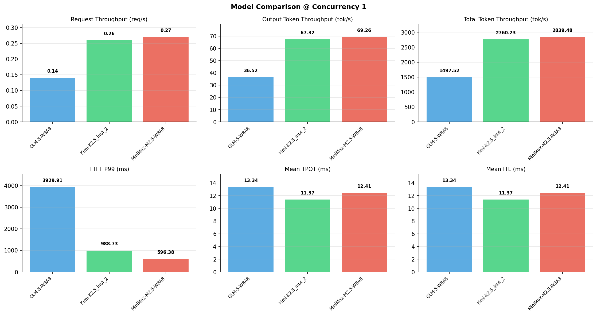

# 多模型性能对比报告

**测试日期：** 2026-05-14

**芯片平台：** inspur_metax_c550

**测试套件：** test_01

**Run ID：** 01, 01, 01

**并发级别：** 1并发

**测试配置：** 320-i10240-o256

---

## 🤖 芯片和模型配置信息

| 参数名称 | **MiniMax-M2.5-W8A8** | **GLM-5-W8A8** | **Kimi-K2.5_int4_2** |
|----------|----------|----------|----------|
| **max_position_embeddings** | 196608 | 202752 | 262144 |
| **model_name** | MiniMax-M2.5-W8A8 | GLM-5-W8A8 | Kimi-K2.5_int4_2 |
| **model_size** | 215G | 712G | 496G |
| **python_version** | 3.10.10 | 3.10.10 | 3.10.10 |
| **quantization_config** | int8 | int8 | int4 |
| **sglang_version** | 0.5.9+maca3.5.3.204 | 0.5.9+maca3.5.3.204 | 0.5.9+maca3.5.3.204 |
| **temperature** | N/A | N/A | N/A |
| **top_k** | 40 | N/A | N/A |
| **top_p** | 0.95 | N/A | N/A |
| **transformers_version** | 4.57.6 | 5.1.0 | 4.56.2 |

---

## ⚙️ SGLang 启动配置信息

| 参数名称 | **MiniMax-M2.5-W8A8** | **GLM-5-W8A8** | **Kimi-K2.5_int4_2** |
|----------|----------|----------|----------|
| **Attention Backend** | flashinfer | flashinfer | flashinfer |
| **Chunked Prefill Size** | N/A | 8192 | 8192 |
| **Context Length** | 196608 | 202752 | 262144 |
| **Cuda Graph Max Bs** | N/A | 64 | 64 |
| **Disable Radix Cache** | True | True | True |
| **Dp Size** | N/A | 4 | N/A |
| **Max Queued Requests** | None | None | None |
| **Max Running Requests** | 64 | 64 | 64 |
| **Mem Fraction Static** | 0.9 | 0.8 | 0.8 |
| **Model Name** | MiniMax-M2.5-W8A8 | GLM-5-W8A8 | Kimi-K2.5_int4_2 |
| **Nnodes** | 1 | 2 | 2 |
| **Pp Size** | 1 | 1 | 1 |
| **Quantization** | w8a8_int8 | w8a8_int8 | w4a8_int8 |
| **Reasoning Parser** | minimax-append-think | glm45 | kimi_k2 |
| **Tool Call Parser** | minimax-m2 | glm47 | kimi_k2 |
| **Tp Size** | 8 | 16 | 16 |

---

## 📊 模型列表

| 模型名称 | Run ID | 状态 |
|----------|--------|------|
| MiniMax-M2.5-W8A8 | 01 | [OK] |
| GLM-5-W8A8 | 01 | [OK] |
| Kimi-K2.5_int4_2 | 01 | [OK] |

---

## 📊 测试概览

| 项目            | 配置                                     | 备注  |
|---------------|----------------------------------------|-----|
| **数据集**       | random                                 |     |
| **并发数**       | 1, 2, 4, 8, 10, 16, 32, 64, 80, 128    |     |
| **总请求数**      | 320                                    |     |
| **输入输出长度** | (10240, 256) |     |
| **测试套件**     | test_01                           |     |
| **被测芯片**      | inspur_metax_c550 |     |
| **SGLang版本**   | 0.5.9                           |     |

---

## 📈 服务基准结果对比

| 指标 | MiniMax-M2.5-W8A8 (基准) | GLM-5-W8A8 | 差异 | % | Kimi-K2.5_int4_2 | 差异 | % |
|------|--------------- | --------- | ------- | ------- | --------- | ------- | -------|
| 成功请求数 | 320 | 320 | 0.00 | 0.0% | 320 | 0.00 | 0.0% |
| 测试持续时间 (s) | 1182.87 | 2242.86 | +1059.99 | +89.6% | 1216.83 | +33.96 | +2.9% |
| 总输入 tokens | 3276800 | 3276800 | 0.00 | 0.0% | 3276800 | 0.00 | 0.0% |
| 总生成 tokens | 81920 | 81920 | 0.00 | 0.0% | 81920 | 0.00 | 0.0% |
| **请求吞吐量 (req/s)** | 0.27 | 0.14 | -0.13 | -48.1% | 0.26 | -0.01 | -3.7% |
| **输出 token 吞吐量 (tok/s)** | 69.26 | 36.52 | -32.74 | -47.3% | 67.32 | -1.94 | -2.8% |
| **总 token 吞吐量 (tok/s)** | 2839.48 | 1497.52 | -1341.96 | -47.3% | 2760.23 | -79.25 | -2.8% |

---

## ⏱️ 首 Token 延迟 (TTFT) 对比

| 指标 | MiniMax-M2.5-W8A8 (基准) | GLM-5-W8A8 | 差异 | % | Kimi-K2.5_int4_2 | 差异 | % |
|------|--------------- | --------- | ------- | ------- | --------- | ------- | -------|
| 平均 TTFT (ms) | 530.76 | 3606.89 | +3076.13 | +579.6% | 901.81 | +371.05 | +69.9% |
| 中位 TTFT (ms) | 525.81 | 3602.74 | +3076.93 | +585.2% | 897.55 | +371.74 | +70.7% |
| P99 TTFT (ms) | 596.38 | 3929.91 | +3333.53 | +559.0% | 988.73 | +392.35 | +65.8% |

---

## ⚡ 每 Token 生成时间 (TPOT) 对比

| 指标 | MiniMax-M2.5-W8A8 (基准) | GLM-5-W8A8 | 差异 | % | Kimi-K2.5_int4_2 | 差异 | % |
|------|--------------- | --------- | ------- | ------- | --------- | ------- | -------|
| 平均 TPOT (ms) | 12.41 | 13.34 | +0.93 | +7.5% | 11.37 | -1.04 | -8.4% |
| 中位 TPOT (ms) | 12.41 | 13.03 | +0.62 | +5.0% | 11.21 | -1.20 | -9.7% |
| P99 TPOT (ms) | 12.44 | 20.28 | +7.84 | +63.0% | 14.65 | +2.21 | +17.8% |

---

## 🔄 Token 间延迟 (ITL) 对比

| 指标 | MiniMax-M2.5-W8A8 (基准) | GLM-5-W8A8 | 差异 | % | Kimi-K2.5_int4_2 | 差异 | % |
|------|--------------- | --------- | ------- | ------- | --------- | ------- | -------|
| 平均 ITL (ms) | 12.41 | 13.34 | +0.93 | +7.5% | 11.37 | -1.04 | -8.4% |
| 中位 ITL (ms) | 12.41 | 12.93 | +0.52 | +4.2% | 10.96 | -1.45 | -11.7% |
| P95 ITL (ms) | 12.45 | 13.33 | +0.88 | +7.1% | 21.84 | +9.39 | +75.4% |
| P99 ITL (ms) | 14.88 | 25.50 | +10.62 | +71.4% | 22.31 | +7.43 | +49.9% |

---

## ⏱️ 端到端延迟 (E2E) 对比

| 指标 | MiniMax-M2.5-W8A8 (基准) | GLM-5-W8A8 | 差异 | % | Kimi-K2.5_int4_2 | 差异 | % |
|------|--------------- | --------- | ------- | ------- | --------- | ------- | -------|
| 平均 E2E 延迟 (ms) | 3695.95 | 7008.40 | +3312.45 | +89.6% | 3802.13 | +106.18 | +2.9% |
| 中位 E2E 延迟 (ms) | 3689.68 | 6926.36 | +3236.68 | +87.7% | 3761.61 | +71.93 | +1.9% |
| P90 E2E 延迟 (ms) | 3698.39 | 7072.51 | +3374.12 | +91.2% | 4051.19 | +352.80 | +9.5% |
| P99 E2E 延迟 (ms) | 3762.23 | 9562.98 | +5800.75 | +154.2% | 4792.19 | +1029.96 | +27.4% |

---

## 📊 模型性能对比

---

## 📝 分析小结

- **请求吞吐量**: MiniMax-M2.5-W8A8 最高，达 0.27 req/s
- **总token吞吐量**: MiniMax-M2.5-W8A8 最高，达 2839 tok/s
- **TTFT P99**: MiniMax-M2.5-W8A8 最优，为 596.38ms
- **TPOT P99**: MiniMax-M2.5-W8A8 最优，为 12.44ms

---

*报告生成时间: 2026-05-14*

