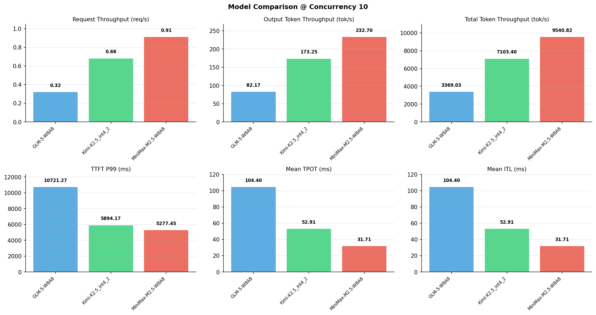

# 多模型性能对比报告

**测试日期：** 2026-05-14

**芯片平台：** inspur_metax_c550

**测试套件：** test_01

**Run ID：** 01, 01, 01

**并发级别：** 10并发

**测试配置：** 320-i10240-o256

---

## 🤖 芯片和模型配置信息

| 参数名称 | **MiniMax-M2.5-W8A8** | **GLM-5-W8A8** | **Kimi-K2.5_int4_2** |
|----------|----------|----------|----------|
| **max_position_embeddings** | 196608 | 202752 | 262144 |
| **model_name** | MiniMax-M2.5-W8A8 | GLM-5-W8A8 | Kimi-K2.5_int4_2 |
| **model_size** | 215G | 712G | 496G |
| **python_version** | 3.10.10 | 3.10.10 | 3.10.10 |
| **quantization_config** | int8 | int8 | int4 |
| **sglang_version** | 0.5.9+maca3.5.3.204 | 0.5.9+maca3.5.3.204 | 0.5.9+maca3.5.3.204 |
| **temperature** | N/A | N/A | N/A |
| **top_k** | 40 | N/A | N/A |
| **top_p** | 0.95 | N/A | N/A |
| **transformers_version** | 4.57.6 | 5.1.0 | 4.56.2 |

---

## ⚙️ SGLang 启动配置信息

| 参数名称 | **MiniMax-M2.5-W8A8** | **GLM-5-W8A8** | **Kimi-K2.5_int4_2** |
|----------|----------|----------|----------|
| **Attention Backend** | flashinfer | flashinfer | flashinfer |
| **Chunked Prefill Size** | N/A | 8192 | 8192 |
| **Context Length** | 196608 | 202752 | 262144 |
| **Cuda Graph Max Bs** | N/A | 64 | 64 |
| **Disable Radix Cache** | True | True | True |
| **Dp Size** | N/A | 4 | N/A |
| **Max Queued Requests** | None | None | None |
| **Max Running Requests** | 64 | 64 | 64 |
| **Mem Fraction Static** | 0.9 | 0.8 | 0.8 |
| **Model Name** | MiniMax-M2.5-W8A8 | GLM-5-W8A8 | Kimi-K2.5_int4_2 |
| **Nnodes** | 1 | 2 | 2 |
| **Pp Size** | 1 | 1 | 1 |
| **Quantization** | w8a8_int8 | w8a8_int8 | w4a8_int8 |
| **Reasoning Parser** | minimax-append-think | glm45 | kimi_k2 |
| **Tool Call Parser** | minimax-m2 | glm47 | kimi_k2 |
| **Tp Size** | 8 | 16 | 16 |

---

## 📊 模型列表

| 模型名称 | Run ID | 状态 |
|----------|--------|------|
| MiniMax-M2.5-W8A8 | 01 | [OK] |
| GLM-5-W8A8 | 01 | [OK] |
| Kimi-K2.5_int4_2 | 01 | [OK] |

---

## 📊 测试概览

| 项目            | 配置                                     | 备注  |
|---------------|----------------------------------------|-----|
| **数据集**       | random                                 |     |
| **并发数**       | 1, 2, 4, 8, 10, 16, 32, 64, 80, 128    |     |
| **总请求数**      | 320                                    |     |
| **输入输出长度** | (10240, 256) |     |
| **测试套件**     | test_01                           |     |
| **被测芯片**      | inspur_metax_c550 |     |
| **SGLang版本**   | 0.5.9                           |     |

---

## 📈 服务基准结果对比

| 指标 | MiniMax-M2.5-W8A8 (基准) | GLM-5-W8A8 | 差异 | % | Kimi-K2.5_int4_2 | 差异 | % |
|------|--------------- | --------- | ------- | ------- | --------- | ------- | -------|
| 成功请求数 | 320 | 320 | 0.00 | 0.0% | 320 | 0.00 | 0.0% |
| 测试持续时间 (s) | 352.04 | 996.94 | +644.90 | +183.2% | 472.83 | +120.79 | +34.3% |
| 总输入 tokens | 3276800 | 3276800 | 0.00 | 0.0% | 3276800 | 0.00 | 0.0% |
| 总生成 tokens | 81920 | 81920 | 0.00 | 0.0% | 81920 | 0.00 | 0.0% |
| **请求吞吐量 (req/s)** | 0.91 | 0.32 | -0.59 | -64.8% | 0.68 | -0.23 | -25.3% |
| **输出 token 吞吐量 (tok/s)** | 232.70 | 82.17 | -150.53 | -64.7% | 173.25 | -59.45 | -25.5% |
| **总 token 吞吐量 (tok/s)** | 9540.82 | 3369.03 | -6171.79 | -64.7% | 7103.40 | -2437.42 | -25.5% |

---

## ⏱️ 首 Token 延迟 (TTFT) 对比

| 指标 | MiniMax-M2.5-W8A8 (基准) | GLM-5-W8A8 | 差异 | % | Kimi-K2.5_int4_2 | 差异 | % |
|------|--------------- | --------- | ------- | ------- | --------- | ------- | -------|
| 平均 TTFT (ms) | 2912.32 | 4476.11 | +1563.79 | +53.7% | 1210.21 | -1702.11 | -58.4% |
| 中位 TTFT (ms) | 3139.02 | 4096.36 | +957.34 | +30.5% | 931.94 | -2207.08 | -70.3% |
| P99 TTFT (ms) | 5277.45 | 10721.27 | +5443.82 | +103.2% | 5894.17 | +616.72 | +11.7% |

---

## ⚡ 每 Token 生成时间 (TPOT) 对比

| 指标 | MiniMax-M2.5-W8A8 (基准) | GLM-5-W8A8 | 差异 | % | Kimi-K2.5_int4_2 | 差异 | % |
|------|--------------- | --------- | ------- | ------- | --------- | ------- | -------|
| 平均 TPOT (ms) | 31.71 | 104.40 | +72.69 | +229.2% | 52.91 | +21.20 | +66.9% |
| 中位 TPOT (ms) | 31.42 | 105.28 | +73.86 | +235.1% | 53.12 | +21.70 | +69.1% |
| P99 TPOT (ms) | 40.89 | 205.64 | +164.75 | +402.9% | 75.90 | +35.01 | +85.6% |

---

## 🔄 Token 间延迟 (ITL) 对比

| 指标 | MiniMax-M2.5-W8A8 (基准) | GLM-5-W8A8 | 差异 | % | Kimi-K2.5_int4_2 | 差异 | % |
|------|--------------- | --------- | ------- | ------- | --------- | ------- | -------|
| 平均 ITL (ms) | 31.71 | 104.40 | +72.69 | +229.2% | 52.91 | +21.20 | +66.9% |
| 中位 ITL (ms) | 23.98 | 17.64 | -6.34 | -26.4% | 22.20 | -1.78 | -7.4% |
| P95 ITL (ms) | 24.42 | 911.33 | +886.91 | +3631.9% | 311.31 | +286.89 | +1174.8% |
| P99 ITL (ms) | 28.12 | 1156.99 | +1128.87 | +4014.5% | 589.03 | +560.91 | +1994.7% |

---

## ⏱️ 端到端延迟 (E2E) 对比

| 指标 | MiniMax-M2.5-W8A8 (基准) | GLM-5-W8A8 | 差异 | % | Kimi-K2.5_int4_2 | 差异 | % |
|------|--------------- | --------- | ------- | ------- | --------- | ------- | -------|
| 平均 E2E 延迟 (ms) | 10997.16 | 31097.31 | +20100.15 | +182.8% | 14701.05 | +3703.89 | +33.7% |
| 中位 E2E 延迟 (ms) | 10946.72 | 31105.24 | +20158.52 | +184.2% | 14562.28 | +3615.56 | +33.0% |
| P90 E2E 延迟 (ms) | 11033.79 | 36980.31 | +25946.52 | +235.2% | 16782.27 | +5748.48 | +52.1% |
| P99 E2E 延迟 (ms) | 11749.96 | 56469.11 | +44719.15 | +380.6% | 20937.21 | +9187.25 | +78.2% |

---

## 📊 模型性能对比

---

## 📝 分析小结

- **请求吞吐量**: MiniMax-M2.5-W8A8 最高，达 0.91 req/s
- **总token吞吐量**: MiniMax-M2.5-W8A8 最高，达 9541 tok/s
- **TTFT P99**: MiniMax-M2.5-W8A8 最优，为 5277.45ms
- **TPOT P99**: MiniMax-M2.5-W8A8 最优，为 40.89ms

---

*报告生成时间: 2026-05-14*

