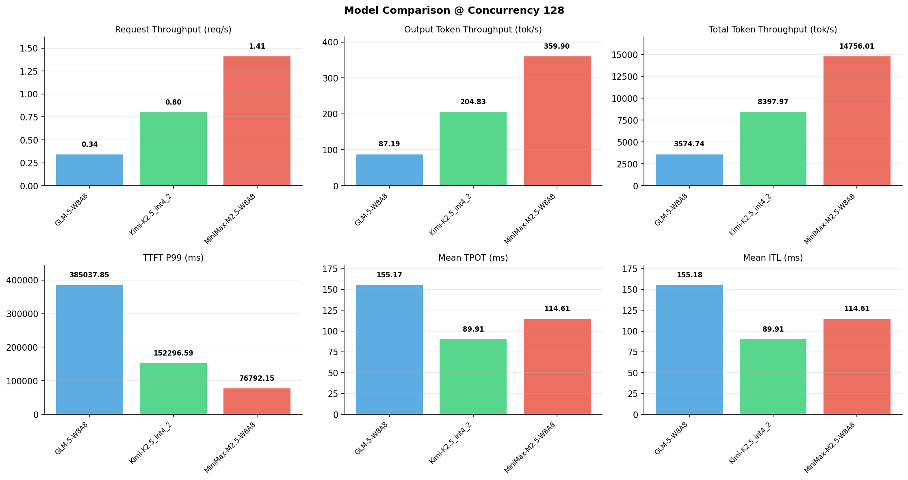

# 多模型性能对比报告

**测试日期：** 2026-05-14

**芯片平台：** inspur_metax_c550

**测试套件：** test_01

**Run ID：** 01, 01, 01

**并发级别：** 128并发

**测试配置：** 320-i10240-o256

---

## 🤖 芯片和模型配置信息

| 参数名称 | **MiniMax-M2.5-W8A8** | **GLM-5-W8A8** | **Kimi-K2.5_int4_2** |
|----------|----------|----------|----------|
| **max_position_embeddings** | 196608 | 202752 | 262144 |
| **model_name** | MiniMax-M2.5-W8A8 | GLM-5-W8A8 | Kimi-K2.5_int4_2 |
| **model_size** | 215G | 712G | 496G |
| **python_version** | 3.10.10 | 3.10.10 | 3.10.10 |
| **quantization_config** | int8 | int8 | int4 |
| **sglang_version** | 0.5.9+maca3.5.3.204 | 0.5.9+maca3.5.3.204 | 0.5.9+maca3.5.3.204 |
| **temperature** | N/A | N/A | N/A |
| **top_k** | 40 | N/A | N/A |
| **top_p** | 0.95 | N/A | N/A |
| **transformers_version** | 4.57.6 | 5.1.0 | 4.56.2 |

---

## ⚙️ SGLang 启动配置信息

| 参数名称 | **MiniMax-M2.5-W8A8** | **GLM-5-W8A8** | **Kimi-K2.5_int4_2** |
|----------|----------|----------|----------|
| **Attention Backend** | flashinfer | flashinfer | flashinfer |
| **Chunked Prefill Size** | N/A | 8192 | 8192 |
| **Context Length** | 196608 | 202752 | 262144 |
| **Cuda Graph Max Bs** | N/A | 64 | 64 |
| **Disable Radix Cache** | True | True | True |
| **Dp Size** | N/A | 4 | N/A |
| **Max Queued Requests** | None | None | None |
| **Max Running Requests** | 64 | 64 | 64 |
| **Mem Fraction Static** | 0.9 | 0.8 | 0.8 |
| **Model Name** | MiniMax-M2.5-W8A8 | GLM-5-W8A8 | Kimi-K2.5_int4_2 |
| **Nnodes** | 1 | 2 | 2 |
| **Pp Size** | 1 | 1 | 1 |
| **Quantization** | w8a8_int8 | w8a8_int8 | w4a8_int8 |
| **Reasoning Parser** | minimax-append-think | glm45 | kimi_k2 |
| **Tool Call Parser** | minimax-m2 | glm47 | kimi_k2 |
| **Tp Size** | 8 | 16 | 16 |

---

## 📊 模型列表

| 模型名称 | Run ID | 状态 |
|----------|--------|------|
| MiniMax-M2.5-W8A8 | 01 | [OK] |
| GLM-5-W8A8 | 01 | [OK] |
| Kimi-K2.5_int4_2 | 01 | [OK] |

---

## 📊 测试概览

| 项目            | 配置                                     | 备注  |
|---------------|----------------------------------------|-----|
| **数据集**       | random                                 |     |
| **并发数**       | 1, 2, 4, 8, 10, 16, 32, 64, 80, 128    |     |
| **总请求数**      | 320                                    |     |
| **输入输出长度** | (10240, 256) |     |
| **测试套件**     | test_01                           |     |
| **被测芯片**      | inspur_metax_c550 |     |
| **SGLang版本**   | 0.5.9                           |     |

---

## 📈 服务基准结果对比

| 指标 | MiniMax-M2.5-W8A8 (基准) | GLM-5-W8A8 | 差异 | % | Kimi-K2.5_int4_2 | 差异 | % |
|------|--------------- | --------- | ------- | ------- | --------- | ------- | -------|
| 成功请求数 | 320 | 320 | 0.00 | 0.0% | 320 | 0.00 | 0.0% |
| 测试持续时间 (s) | 227.62 | 939.57 | +711.95 | +312.8% | 399.94 | +172.32 | +75.7% |
| 总输入 tokens | 3276800 | 3276800 | 0.00 | 0.0% | 3276800 | 0.00 | 0.0% |
| 总生成 tokens | 81920 | 81920 | 0.00 | 0.0% | 81920 | 0.00 | 0.0% |
| **请求吞吐量 (req/s)** | 1.41 | 0.34 | -1.07 | -75.9% | 0.80 | -0.61 | -43.3% |
| **输出 token 吞吐量 (tok/s)** | 359.90 | 87.19 | -272.71 | -75.8% | 204.83 | -155.07 | -43.1% |
| **总 token 吞吐量 (tok/s)** | 14756.01 | 3574.74 | -11181.27 | -75.8% | 8397.97 | -6358.04 | -43.1% |

---

## ⏱️ 首 Token 延迟 (TTFT) 对比

| 指标 | MiniMax-M2.5-W8A8 (基准) | GLM-5-W8A8 | 差异 | % | Kimi-K2.5_int4_2 | 差异 | % |
|------|--------------- | --------- | ------- | ------- | --------- | ------- | -------|
| 平均 TTFT (ms) | 52705.95 | 264586.02 | +211880.07 | +402.0% | 111782.93 | +59076.98 | +112.1% |
| 中位 TTFT (ms) | 57731.42 | 328292.33 | +270560.91 | +468.7% | 133493.89 | +75762.47 | +131.2% |
| P99 TTFT (ms) | 76792.15 | 385037.85 | +308245.70 | +401.4% | 152296.59 | +75504.44 | +98.3% |

---

## ⚡ 每 Token 生成时间 (TPOT) 对比

| 指标 | MiniMax-M2.5-W8A8 (基准) | GLM-5-W8A8 | 差异 | % | Kimi-K2.5_int4_2 | 差异 | % |
|------|--------------- | --------- | ------- | ------- | --------- | ------- | -------|
| 平均 TPOT (ms) | 114.61 | 155.17 | +40.56 | +35.4% | 89.91 | -24.70 | -21.6% |
| 中位 TPOT (ms) | 114.51 | 157.99 | +43.48 | +38.0% | 91.22 | -23.29 | -20.3% |
| P99 TPOT (ms) | 174.13 | 256.62 | +82.49 | +47.4% | 135.98 | -38.15 | -21.9% |

---

## 🔄 Token 间延迟 (ITL) 对比

| 指标 | MiniMax-M2.5-W8A8 (基准) | GLM-5-W8A8 | 差异 | % | Kimi-K2.5_int4_2 | 差异 | % |
|------|--------------- | --------- | ------- | ------- | --------- | ------- | -------|
| 平均 ITL (ms) | 114.61 | 155.18 | +40.57 | +35.4% | 89.91 | -24.70 | -21.6% |
| 中位 ITL (ms) | 54.87 | 18.94 | -35.93 | -65.5% | 29.43 | -25.44 | -46.4% |
| P95 ITL (ms) | 56.25 | 926.95 | +870.70 | +1547.9% | 461.77 | +405.52 | +720.9% |
| P99 ITL (ms) | 57.60 | 2106.33 | +2048.73 | +3556.8% | 924.61 | +867.01 | +1505.2% |

---

## ⏱️ 端到端延迟 (E2E) 对比

| 指标 | MiniMax-M2.5-W8A8 (基准) | GLM-5-W8A8 | 差异 | % | Kimi-K2.5_int4_2 | 差异 | % |
|------|--------------- | --------- | ------- | ------- | --------- | ------- | -------|
| 平均 E2E 延迟 (ms) | 81932.67 | 304153.90 | +222221.23 | +271.2% | 134708.95 | +52776.28 | +64.4% |
| 中位 E2E 延迟 (ms) | 90773.20 | 367519.69 | +276746.49 | +304.9% | 155597.31 | +64824.11 | +71.4% |
| P90 E2E 延迟 (ms) | 91565.32 | 415240.42 | +323675.10 | +353.5% | 162139.46 | +70574.14 | +77.1% |
| P99 E2E 延迟 (ms) | 91579.06 | 434512.31 | +342933.25 | +374.5% | 176314.05 | +84734.99 | +92.5% |

---

## 📊 模型性能对比

---

## 📝 分析小结

- **请求吞吐量**: MiniMax-M2.5-W8A8 最高，达 1.41 req/s
- **总token吞吐量**: MiniMax-M2.5-W8A8 最高，达 14756 tok/s
- **TTFT P99**: MiniMax-M2.5-W8A8 最优，为 76792.15ms
- **TPOT P99**: Kimi-K2.5_int4_2 最优，为 135.98ms

---

*报告生成时间: 2026-05-14*

