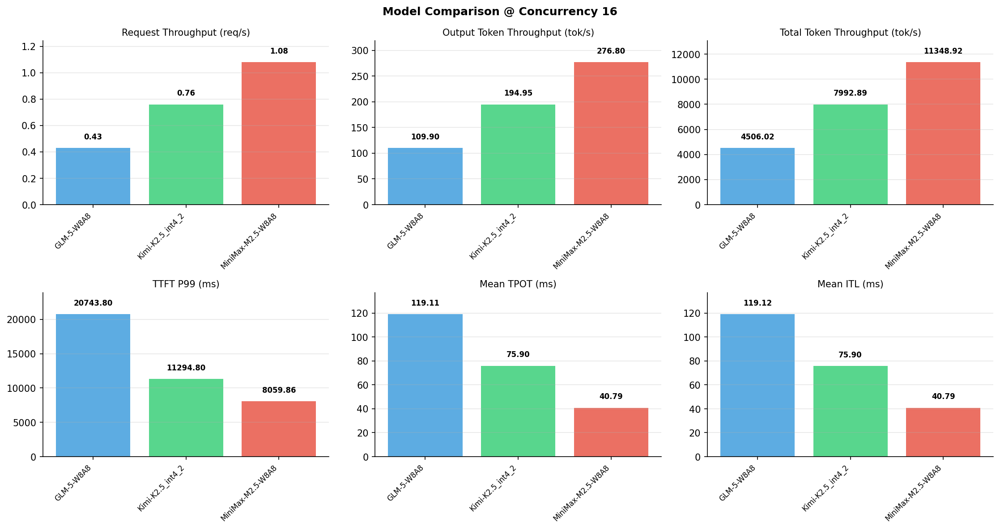

# 多模型性能对比报告

**测试日期：** 2026-05-14

**芯片平台：** inspur_metax_c550

**测试套件：** test_01

**Run ID：** 01, 01, 01

**并发级别：** 16并发

**测试配置：** 320-i10240-o256

---

## 🤖 芯片和模型配置信息

| 参数名称 | **MiniMax-M2.5-W8A8** | **GLM-5-W8A8** | **Kimi-K2.5_int4_2** |
|----------|----------|----------|----------|
| **max_position_embeddings** | 196608 | 202752 | 262144 |
| **model_name** | MiniMax-M2.5-W8A8 | GLM-5-W8A8 | Kimi-K2.5_int4_2 |
| **model_size** | 215G | 712G | 496G |
| **python_version** | 3.10.10 | 3.10.10 | 3.10.10 |
| **quantization_config** | int8 | int8 | int4 |
| **sglang_version** | 0.5.9+maca3.5.3.204 | 0.5.9+maca3.5.3.204 | 0.5.9+maca3.5.3.204 |
| **temperature** | N/A | N/A | N/A |
| **top_k** | 40 | N/A | N/A |
| **top_p** | 0.95 | N/A | N/A |
| **transformers_version** | 4.57.6 | 5.1.0 | 4.56.2 |

---

## ⚙️ SGLang 启动配置信息

| 参数名称 | **MiniMax-M2.5-W8A8** | **GLM-5-W8A8** | **Kimi-K2.5_int4_2** |
|----------|----------|----------|----------|
| **Attention Backend** | flashinfer | flashinfer | flashinfer |
| **Chunked Prefill Size** | N/A | 8192 | 8192 |
| **Context Length** | 196608 | 202752 | 262144 |
| **Cuda Graph Max Bs** | N/A | 64 | 64 |
| **Disable Radix Cache** | True | True | True |
| **Dp Size** | N/A | 4 | N/A |
| **Max Queued Requests** | None | None | None |
| **Max Running Requests** | 64 | 64 | 64 |
| **Mem Fraction Static** | 0.9 | 0.8 | 0.8 |
| **Model Name** | MiniMax-M2.5-W8A8 | GLM-5-W8A8 | Kimi-K2.5_int4_2 |
| **Nnodes** | 1 | 2 | 2 |
| **Pp Size** | 1 | 1 | 1 |
| **Quantization** | w8a8_int8 | w8a8_int8 | w4a8_int8 |
| **Reasoning Parser** | minimax-append-think | glm45 | kimi_k2 |
| **Tool Call Parser** | minimax-m2 | glm47 | kimi_k2 |
| **Tp Size** | 8 | 16 | 16 |

---

## 📊 模型列表

| 模型名称 | Run ID | 状态 |
|----------|--------|------|
| MiniMax-M2.5-W8A8 | 01 | [OK] |
| GLM-5-W8A8 | 01 | [OK] |
| Kimi-K2.5_int4_2 | 01 | [OK] |

---

## 📊 测试概览

| 项目            | 配置                                     | 备注  |
|---------------|----------------------------------------|-----|
| **数据集**       | random                                 |     |
| **并发数**       | 1, 2, 4, 8, 10, 16, 32, 64, 80, 128    |     |
| **总请求数**      | 320                                    |     |
| **输入输出长度** | (10240, 256) |     |
| **测试套件**     | test_01                           |     |
| **被测芯片**      | inspur_metax_c550 |     |
| **SGLang版本**   | 0.5.9                           |     |

---

## 📈 服务基准结果对比

| 指标 | MiniMax-M2.5-W8A8 (基准) | GLM-5-W8A8 | 差异 | % | Kimi-K2.5_int4_2 | 差异 | % |
|------|--------------- | --------- | ------- | ------- | --------- | ------- | -------|
| 成功请求数 | 320 | 320 | 0.00 | 0.0% | 320 | 0.00 | 0.0% |
| 测试持续时间 (s) | 295.95 | 745.38 | +449.43 | +151.9% | 420.21 | +124.26 | +42.0% |
| 总输入 tokens | 3276800 | 3276800 | 0.00 | 0.0% | 3276800 | 0.00 | 0.0% |
| 总生成 tokens | 81920 | 81920 | 0.00 | 0.0% | 81920 | 0.00 | 0.0% |
| **请求吞吐量 (req/s)** | 1.08 | 0.43 | -0.65 | -60.2% | 0.76 | -0.32 | -29.6% |
| **输出 token 吞吐量 (tok/s)** | 276.80 | 109.90 | -166.90 | -60.3% | 194.95 | -81.85 | -29.6% |
| **总 token 吞吐量 (tok/s)** | 11348.92 | 4506.02 | -6842.90 | -60.3% | 7992.89 | -3356.03 | -29.6% |

---

## ⏱️ 首 Token 延迟 (TTFT) 对比

| 指标 | MiniMax-M2.5-W8A8 (基准) | GLM-5-W8A8 | 差异 | % | Kimi-K2.5_int4_2 | 差异 | % |
|------|--------------- | --------- | ------- | ------- | --------- | ------- | -------|
| 平均 TTFT (ms) | 4390.02 | 6795.86 | +2405.84 | +54.8% | 1510.87 | -2879.15 | -65.6% |
| 中位 TTFT (ms) | 4664.48 | 4863.36 | +198.88 | +4.3% | 938.35 | -3726.13 | -79.9% |
| P99 TTFT (ms) | 8059.86 | 20743.80 | +12683.94 | +157.4% | 11294.80 | +3234.94 | +40.1% |

---

## ⚡ 每 Token 生成时间 (TPOT) 对比

| 指标 | MiniMax-M2.5-W8A8 (基准) | GLM-5-W8A8 | 差异 | % | Kimi-K2.5_int4_2 | 差异 | % |
|------|--------------- | --------- | ------- | ------- | --------- | ------- | -------|
| 平均 TPOT (ms) | 40.79 | 119.11 | +78.32 | +192.0% | 75.90 | +35.11 | +86.1% |
| 中位 TPOT (ms) | 41.53 | 120.53 | +79.00 | +190.2% | 76.02 | +34.49 | +83.0% |
| P99 TPOT (ms) | 55.86 | 213.05 | +157.19 | +281.4% | 108.34 | +52.48 | +93.9% |

---

## 🔄 Token 间延迟 (ITL) 对比

| 指标 | MiniMax-M2.5-W8A8 (基准) | GLM-5-W8A8 | 差异 | % | Kimi-K2.5_int4_2 | 差异 | % |
|------|--------------- | --------- | ------- | ------- | --------- | ------- | -------|
| 平均 ITL (ms) | 40.79 | 119.12 | +78.33 | +192.0% | 75.90 | +35.11 | +86.1% |
| 中位 ITL (ms) | 27.32 | 18.91 | -8.41 | -30.8% | 26.39 | -0.93 | -3.4% |
| P95 ITL (ms) | 28.03 | 1035.01 | +1006.98 | +3592.5% | 463.73 | +435.70 | +1554.4% |
| P99 ITL (ms) | 31.26 | 1331.45 | +1300.19 | +4159.3% | 916.82 | +885.56 | +2832.9% |

---

## ⏱️ 端到端延迟 (E2E) 对比

| 指标 | MiniMax-M2.5-W8A8 (基准) | GLM-5-W8A8 | 差异 | % | Kimi-K2.5_int4_2 | 差异 | % |
|------|--------------- | --------- | ------- | ------- | --------- | ------- | -------|
| 平均 E2E 延迟 (ms) | 14791.53 | 37169.95 | +22378.42 | +151.3% | 20865.09 | +6073.56 | +41.1% |
| 中位 E2E 延迟 (ms) | 14625.87 | 36593.75 | +21967.88 | +150.2% | 20764.98 | +6139.11 | +42.0% |
| P90 E2E 延迟 (ms) | 15167.57 | 45041.12 | +29873.55 | +197.0% | 24045.24 | +8877.67 | +58.5% |
| P99 E2E 延迟 (ms) | 15601.63 | 63320.77 | +47719.14 | +305.9% | 32461.94 | +16860.31 | +108.1% |

---

## 📊 模型性能对比

---

## 📝 分析小结

- **请求吞吐量**: MiniMax-M2.5-W8A8 最高，达 1.08 req/s
- **总token吞吐量**: MiniMax-M2.5-W8A8 最高，达 11349 tok/s
- **TTFT P99**: MiniMax-M2.5-W8A8 最优，为 8059.86ms
- **TPOT P99**: MiniMax-M2.5-W8A8 最优，为 55.86ms

---

*报告生成时间: 2026-05-14*

