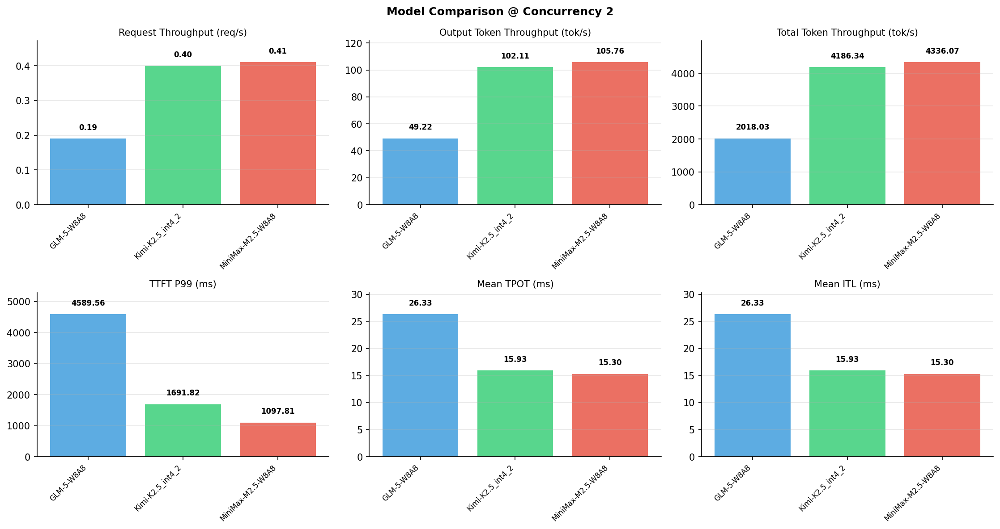

# 多模型性能对比报告

**测试日期：** 2026-05-14

**芯片平台：** inspur_metax_c550

**测试套件：** test_01

**Run ID：** 01, 01, 01

**并发级别：** 2并发

**测试配置：** 320-i10240-o256

---

## 🤖 芯片和模型配置信息

| 参数名称 | **MiniMax-M2.5-W8A8** | **GLM-5-W8A8** | **Kimi-K2.5_int4_2** |
|----------|----------|----------|----------|
| **max_position_embeddings** | 196608 | 202752 | 262144 |
| **model_name** | MiniMax-M2.5-W8A8 | GLM-5-W8A8 | Kimi-K2.5_int4_2 |
| **model_size** | 215G | 712G | 496G |
| **python_version** | 3.10.10 | 3.10.10 | 3.10.10 |
| **quantization_config** | int8 | int8 | int4 |
| **sglang_version** | 0.5.9+maca3.5.3.204 | 0.5.9+maca3.5.3.204 | 0.5.9+maca3.5.3.204 |
| **temperature** | N/A | N/A | N/A |
| **top_k** | 40 | N/A | N/A |
| **top_p** | 0.95 | N/A | N/A |
| **transformers_version** | 4.57.6 | 5.1.0 | 4.56.2 |

---

## ⚙️ SGLang 启动配置信息

| 参数名称 | **MiniMax-M2.5-W8A8** | **GLM-5-W8A8** | **Kimi-K2.5_int4_2** |
|----------|----------|----------|----------|
| **Attention Backend** | flashinfer | flashinfer | flashinfer |
| **Chunked Prefill Size** | N/A | 8192 | 8192 |
| **Context Length** | 196608 | 202752 | 262144 |
| **Cuda Graph Max Bs** | N/A | 64 | 64 |
| **Disable Radix Cache** | True | True | True |
| **Dp Size** | N/A | 4 | N/A |
| **Max Queued Requests** | None | None | None |
| **Max Running Requests** | 64 | 64 | 64 |
| **Mem Fraction Static** | 0.9 | 0.8 | 0.8 |
| **Model Name** | MiniMax-M2.5-W8A8 | GLM-5-W8A8 | Kimi-K2.5_int4_2 |
| **Nnodes** | 1 | 2 | 2 |
| **Pp Size** | 1 | 1 | 1 |
| **Quantization** | w8a8_int8 | w8a8_int8 | w4a8_int8 |
| **Reasoning Parser** | minimax-append-think | glm45 | kimi_k2 |
| **Tool Call Parser** | minimax-m2 | glm47 | kimi_k2 |
| **Tp Size** | 8 | 16 | 16 |

---

## 📊 模型列表

| 模型名称 | Run ID | 状态 |
|----------|--------|------|
| MiniMax-M2.5-W8A8 | 01 | [OK] |
| GLM-5-W8A8 | 01 | [OK] |
| Kimi-K2.5_int4_2 | 01 | [OK] |

---

## 📊 测试概览

| 项目            | 配置                                     | 备注  |
|---------------|----------------------------------------|-----|
| **数据集**       | random                                 |     |
| **并发数**       | 1, 2, 4, 8, 10, 16, 32, 64, 80, 128    |     |
| **总请求数**      | 320                                    |     |
| **输入输出长度** | (10240, 256) |     |
| **测试套件**     | test_01                           |     |
| **被测芯片**      | inspur_metax_c550 |     |
| **SGLang版本**   | 0.5.9                           |     |

---

## 📈 服务基准结果对比

| 指标 | MiniMax-M2.5-W8A8 (基准) | GLM-5-W8A8 | 差异 | % | Kimi-K2.5_int4_2 | 差异 | % |
|------|--------------- | --------- | ------- | ------- | --------- | ------- | -------|
| 成功请求数 | 320 | 320 | 0.00 | 0.0% | 320 | 0.00 | 0.0% |
| 测试持续时间 (s) | 774.60 | 1664.36 | +889.76 | +114.9% | 802.31 | +27.71 | +3.6% |
| 总输入 tokens | 3276800 | 3276800 | 0.00 | 0.0% | 3276800 | 0.00 | 0.0% |
| 总生成 tokens | 81920 | 81920 | 0.00 | 0.0% | 81920 | 0.00 | 0.0% |
| **请求吞吐量 (req/s)** | 0.41 | 0.19 | -0.22 | -53.7% | 0.40 | -0.01 | -2.4% |
| **输出 token 吞吐量 (tok/s)** | 105.76 | 49.22 | -56.54 | -53.5% | 102.11 | -3.65 | -3.5% |
| **总 token 吞吐量 (tok/s)** | 4336.07 | 2018.03 | -2318.04 | -53.5% | 4186.34 | -149.73 | -3.5% |

---

## ⏱️ 首 Token 延迟 (TTFT) 对比

| 指标 | MiniMax-M2.5-W8A8 (基准) | GLM-5-W8A8 | 差异 | % | Kimi-K2.5_int4_2 | 差异 | % |
|------|--------------- | --------- | ------- | ------- | --------- | ------- | -------|
| 平均 TTFT (ms) | 939.99 | 3679.49 | +2739.50 | +291.4% | 947.17 | +7.18 | +0.8% |
| 中位 TTFT (ms) | 943.00 | 3616.86 | +2673.86 | +283.5% | 913.63 | -29.37 | -3.1% |
| P99 TTFT (ms) | 1097.81 | 4589.56 | +3491.75 | +318.1% | 1691.82 | +594.01 | +54.1% |

---

## ⚡ 每 Token 生成时间 (TPOT) 对比

| 指标 | MiniMax-M2.5-W8A8 (基准) | GLM-5-W8A8 | 差异 | % | Kimi-K2.5_int4_2 | 差异 | % |
|------|--------------- | --------- | ------- | ------- | --------- | ------- | -------|
| 平均 TPOT (ms) | 15.30 | 26.33 | +11.03 | +72.1% | 15.93 | +0.63 | +4.1% |
| 中位 TPOT (ms) | 15.44 | 27.18 | +11.74 | +76.0% | 15.85 | +0.41 | +2.7% |
| P99 TPOT (ms) | 15.89 | 49.91 | +34.02 | +214.1% | 23.44 | +7.55 | +47.5% |

---

## 🔄 Token 间延迟 (ITL) 对比

| 指标 | MiniMax-M2.5-W8A8 (基准) | GLM-5-W8A8 | 差异 | % | Kimi-K2.5_int4_2 | 差异 | % |
|------|--------------- | --------- | ------- | ------- | --------- | ------- | -------|
| 平均 ITL (ms) | 15.30 | 26.33 | +11.03 | +72.1% | 15.93 | +0.63 | +4.1% |
| 中位 ITL (ms) | 14.99 | 13.16 | -1.83 | -12.2% | 12.21 | -2.78 | -18.5% |
| P95 ITL (ms) | 15.05 | 17.19 | +2.14 | +14.2% | 24.44 | +9.39 | +62.4% |
| P99 ITL (ms) | 19.00 | 896.21 | +877.21 | +4616.9% | 25.49 | +6.49 | +34.2% |

---

## ⏱️ 端到端延迟 (E2E) 对比

| 指标 | MiniMax-M2.5-W8A8 (基准) | GLM-5-W8A8 | 差异 | % | Kimi-K2.5_int4_2 | 差异 | % |
|------|--------------- | --------- | ------- | ------- | --------- | ------- | -------|
| 平均 E2E 延迟 (ms) | 4840.26 | 10393.40 | +5553.14 | +114.7% | 5010.27 | +170.01 | +3.5% |
| 中位 E2E 延迟 (ms) | 4825.04 | 10536.89 | +5711.85 | +118.4% | 4963.62 | +138.58 | +2.9% |
| P90 E2E 延迟 (ms) | 4836.77 | 10801.95 | +5965.18 | +123.3% | 5395.86 | +559.09 | +11.6% |
| P99 E2E 延迟 (ms) | 5648.71 | 16322.43 | +10673.72 | +189.0% | 6899.49 | +1250.78 | +22.1% |

---

## 📊 模型性能对比

---

## 📝 分析小结

- **请求吞吐量**: MiniMax-M2.5-W8A8 最高，达 0.41 req/s
- **总token吞吐量**: MiniMax-M2.5-W8A8 最高，达 4336 tok/s
- **TTFT P99**: MiniMax-M2.5-W8A8 最优，为 1097.81ms
- **TPOT P99**: MiniMax-M2.5-W8A8 最优，为 15.89ms

---

*报告生成时间: 2026-05-14*

