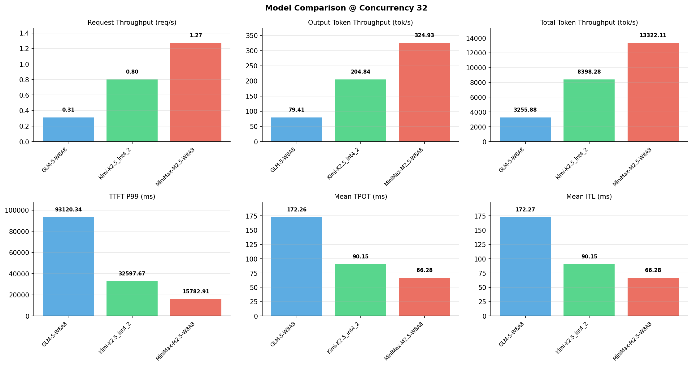

# 多模型性能对比报告

**测试日期：** 2026-05-14

**芯片平台：** inspur_metax_c550

**测试套件：** test_01

**Run ID：** 01, 01, 01

**并发级别：** 32并发

**测试配置：** 320-i10240-o256

---

## 🤖 芯片和模型配置信息

| 参数名称 | **MiniMax-M2.5-W8A8** | **GLM-5-W8A8** | **Kimi-K2.5_int4_2** |
|----------|----------|----------|----------|
| **max_position_embeddings** | 196608 | 202752 | 262144 |
| **model_name** | MiniMax-M2.5-W8A8 | GLM-5-W8A8 | Kimi-K2.5_int4_2 |
| **model_size** | 215G | 712G | 496G |
| **python_version** | 3.10.10 | 3.10.10 | 3.10.10 |
| **quantization_config** | int8 | int8 | int4 |
| **sglang_version** | 0.5.9+maca3.5.3.204 | 0.5.9+maca3.5.3.204 | 0.5.9+maca3.5.3.204 |
| **temperature** | N/A | N/A | N/A |
| **top_k** | 40 | N/A | N/A |
| **top_p** | 0.95 | N/A | N/A |
| **transformers_version** | 4.57.6 | 5.1.0 | 4.56.2 |

---

## ⚙️ SGLang 启动配置信息

| 参数名称 | **MiniMax-M2.5-W8A8** | **GLM-5-W8A8** | **Kimi-K2.5_int4_2** |
|----------|----------|----------|----------|
| **Attention Backend** | flashinfer | flashinfer | flashinfer |
| **Chunked Prefill Size** | N/A | 8192 | 8192 |
| **Context Length** | 196608 | 202752 | 262144 |
| **Cuda Graph Max Bs** | N/A | 64 | 64 |
| **Disable Radix Cache** | True | True | True |
| **Dp Size** | N/A | 4 | N/A |
| **Max Queued Requests** | None | None | None |
| **Max Running Requests** | 64 | 64 | 64 |
| **Mem Fraction Static** | 0.9 | 0.8 | 0.8 |
| **Model Name** | MiniMax-M2.5-W8A8 | GLM-5-W8A8 | Kimi-K2.5_int4_2 |
| **Nnodes** | 1 | 2 | 2 |
| **Pp Size** | 1 | 1 | 1 |
| **Quantization** | w8a8_int8 | w8a8_int8 | w4a8_int8 |
| **Reasoning Parser** | minimax-append-think | glm45 | kimi_k2 |
| **Tool Call Parser** | minimax-m2 | glm47 | kimi_k2 |
| **Tp Size** | 8 | 16 | 16 |

---

## 📊 模型列表

| 模型名称 | Run ID | 状态 |
|----------|--------|------|
| MiniMax-M2.5-W8A8 | 01 | [OK] |
| GLM-5-W8A8 | 01 | [OK] |
| Kimi-K2.5_int4_2 | 01 | [OK] |

---

## 📊 测试概览

| 项目            | 配置                                     | 备注  |
|---------------|----------------------------------------|-----|
| **数据集**       | random                                 |     |
| **并发数**       | 1, 2, 4, 8, 10, 16, 32, 64, 80, 128    |     |
| **总请求数**      | 320                                    |     |
| **输入输出长度** | (10240, 256) |     |
| **测试套件**     | test_01                           |     |
| **被测芯片**      | inspur_metax_c550 |     |
| **SGLang版本**   | 0.5.9                           |     |

---

## 📈 服务基准结果对比

| 指标 | MiniMax-M2.5-W8A8 (基准) | GLM-5-W8A8 | 差异 | % | Kimi-K2.5_int4_2 | 差异 | % |
|------|--------------- | --------- | ------- | ------- | --------- | ------- | -------|
| 成功请求数 | 320 | 320 | 0.00 | 0.0% | 320 | 0.00 | 0.0% |
| 测试持续时间 (s) | 252.12 | 1031.58 | +779.46 | +309.2% | 399.93 | +147.81 | +58.6% |
| 总输入 tokens | 3276800 | 3276800 | 0.00 | 0.0% | 3276800 | 0.00 | 0.0% |
| 总生成 tokens | 81920 | 81920 | 0.00 | 0.0% | 81920 | 0.00 | 0.0% |
| **请求吞吐量 (req/s)** | 1.27 | 0.31 | -0.96 | -75.6% | 0.80 | -0.47 | -37.0% |
| **输出 token 吞吐量 (tok/s)** | 324.93 | 79.41 | -245.52 | -75.6% | 204.84 | -120.09 | -37.0% |
| **总 token 吞吐量 (tok/s)** | 13322.11 | 3255.88 | -10066.23 | -75.6% | 8398.28 | -4923.83 | -37.0% |

---

## ⏱️ 首 Token 延迟 (TTFT) 对比

| 指标 | MiniMax-M2.5-W8A8 (基准) | GLM-5-W8A8 | 差异 | % | Kimi-K2.5_int4_2 | 差异 | % |
|------|--------------- | --------- | ------- | ------- | --------- | ------- | -------|
| 平均 TTFT (ms) | 8299.14 | 57259.92 | +48960.78 | +590.0% | 16246.03 | +7946.89 | +95.8% |
| 中位 TTFT (ms) | 8487.17 | 59284.08 | +50796.91 | +598.5% | 16328.37 | +7841.20 | +92.4% |
| P99 TTFT (ms) | 15782.91 | 93120.34 | +77337.43 | +490.0% | 32597.67 | +16814.76 | +106.5% |

---

## ⚡ 每 Token 生成时间 (TPOT) 对比

| 指标 | MiniMax-M2.5-W8A8 (基准) | GLM-5-W8A8 | 差异 | % | Kimi-K2.5_int4_2 | 差异 | % |
|------|--------------- | --------- | ------- | ------- | --------- | ------- | -------|
| 平均 TPOT (ms) | 66.28 | 172.26 | +105.98 | +159.9% | 90.15 | +23.87 | +36.0% |
| 中位 TPOT (ms) | 66.06 | 186.66 | +120.60 | +182.6% | 91.35 | +25.29 | +38.3% |
| P99 TPOT (ms) | 95.85 | 308.55 | +212.70 | +221.9% | 136.15 | +40.30 | +42.0% |

---

## 🔄 Token 间延迟 (ITL) 对比

| 指标 | MiniMax-M2.5-W8A8 (基准) | GLM-5-W8A8 | 差异 | % | Kimi-K2.5_int4_2 | 差异 | % |
|------|--------------- | --------- | ------- | ------- | --------- | ------- | -------|
| 平均 ITL (ms) | 66.28 | 172.27 | +105.99 | +159.9% | 90.15 | +23.87 | +36.0% |
| 中位 ITL (ms) | 37.48 | 18.94 | -18.54 | -49.5% | 29.39 | -8.09 | -21.6% |
| P95 ITL (ms) | 38.18 | 920.94 | +882.76 | +2312.1% | 462.06 | +423.88 | +1110.2% |
| P99 ITL (ms) | 40.69 | 2633.70 | +2593.01 | +6372.6% | 925.38 | +884.69 | +2174.2% |

---

## ⏱️ 端到端延迟 (E2E) 对比

| 指标 | MiniMax-M2.5-W8A8 (基准) | GLM-5-W8A8 | 差异 | % | Kimi-K2.5_int4_2 | 差异 | % |
|------|--------------- | --------- | ------- | ------- | --------- | ------- | -------|
| 平均 E2E 延迟 (ms) | 25199.37 | 101185.36 | +75985.99 | +301.5% | 39234.36 | +14034.99 | +55.7% |
| 中位 E2E 延迟 (ms) | 25171.17 | 106428.80 | +81257.63 | +322.8% | 39301.61 | +14130.44 | +56.1% |
| P90 E2E 延迟 (ms) | 25685.91 | 130915.84 | +105229.93 | +409.7% | 44779.99 | +19094.08 | +74.3% |
| P99 E2E 延迟 (ms) | 25712.35 | 155388.38 | +129676.03 | +504.3% | 57351.70 | +31639.35 | +123.1% |

---

## 📊 模型性能对比

---

## 📝 分析小结

- **请求吞吐量**: MiniMax-M2.5-W8A8 最高，达 1.27 req/s
- **总token吞吐量**: MiniMax-M2.5-W8A8 最高，达 13322 tok/s
- **TTFT P99**: MiniMax-M2.5-W8A8 最优，为 15782.91ms
- **TPOT P99**: MiniMax-M2.5-W8A8 最优，为 95.85ms

---

*报告生成时间: 2026-05-14*

