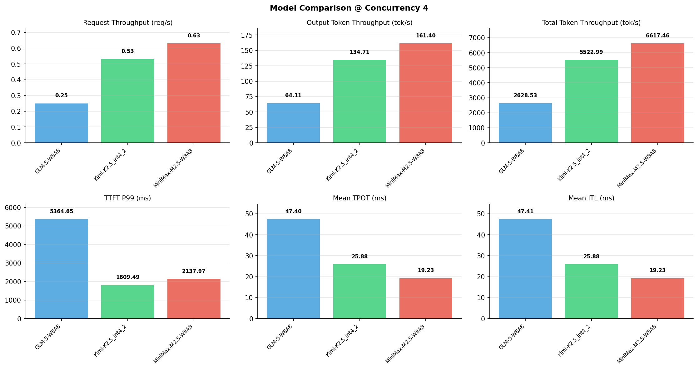

# 多模型性能对比报告

**测试日期：** 2026-05-14

**芯片平台：** inspur_metax_c550

**测试套件：** test_01

**Run ID：** 01, 01, 01

**并发级别：** 4并发

**测试配置：** 320-i10240-o256

---

## 🤖 芯片和模型配置信息

| 参数名称 | **MiniMax-M2.5-W8A8** | **GLM-5-W8A8** | **Kimi-K2.5_int4_2** |
|----------|----------|----------|----------|
| **max_position_embeddings** | 196608 | 202752 | 262144 |
| **model_name** | MiniMax-M2.5-W8A8 | GLM-5-W8A8 | Kimi-K2.5_int4_2 |
| **model_size** | 215G | 712G | 496G |
| **python_version** | 3.10.10 | 3.10.10 | 3.10.10 |
| **quantization_config** | int8 | int8 | int4 |
| **sglang_version** | 0.5.9+maca3.5.3.204 | 0.5.9+maca3.5.3.204 | 0.5.9+maca3.5.3.204 |
| **temperature** | N/A | N/A | N/A |
| **top_k** | 40 | N/A | N/A |
| **top_p** | 0.95 | N/A | N/A |
| **transformers_version** | 4.57.6 | 5.1.0 | 4.56.2 |

---

## ⚙️ SGLang 启动配置信息

| 参数名称 | **MiniMax-M2.5-W8A8** | **GLM-5-W8A8** | **Kimi-K2.5_int4_2** |
|----------|----------|----------|----------|
| **Attention Backend** | flashinfer | flashinfer | flashinfer |
| **Chunked Prefill Size** | N/A | 8192 | 8192 |
| **Context Length** | 196608 | 202752 | 262144 |
| **Cuda Graph Max Bs** | N/A | 64 | 64 |
| **Disable Radix Cache** | True | True | True |
| **Dp Size** | N/A | 4 | N/A |
| **Max Queued Requests** | None | None | None |
| **Max Running Requests** | 64 | 64 | 64 |
| **Mem Fraction Static** | 0.9 | 0.8 | 0.8 |
| **Model Name** | MiniMax-M2.5-W8A8 | GLM-5-W8A8 | Kimi-K2.5_int4_2 |
| **Nnodes** | 1 | 2 | 2 |
| **Pp Size** | 1 | 1 | 1 |
| **Quantization** | w8a8_int8 | w8a8_int8 | w4a8_int8 |
| **Reasoning Parser** | minimax-append-think | glm45 | kimi_k2 |
| **Tool Call Parser** | minimax-m2 | glm47 | kimi_k2 |
| **Tp Size** | 8 | 16 | 16 |

---

## 📊 模型列表

| 模型名称 | Run ID | 状态 |
|----------|--------|------|
| MiniMax-M2.5-W8A8 | 01 | [OK] |
| GLM-5-W8A8 | 01 | [OK] |
| Kimi-K2.5_int4_2 | 01 | [OK] |

---

## 📊 测试概览

| 项目            | 配置                                     | 备注  |
|---------------|----------------------------------------|-----|
| **数据集**       | random                                 |     |
| **并发数**       | 1, 2, 4, 8, 10, 16, 32, 64, 80, 128    |     |
| **总请求数**      | 320                                    |     |
| **输入输出长度** | (10240, 256) |     |
| **测试套件**     | test_01                           |     |
| **被测芯片**      | inspur_metax_c550 |     |
| **SGLang版本**   | 0.5.9                           |     |

---

## 📈 服务基准结果对比

| 指标 | MiniMax-M2.5-W8A8 (基准) | GLM-5-W8A8 | 差异 | % | Kimi-K2.5_int4_2 | 差异 | % |
|------|--------------- | --------- | ------- | ------- | --------- | ------- | -------|
| 成功请求数 | 320 | 320 | 0.00 | 0.0% | 320 | 0.00 | 0.0% |
| 测试持续时间 (s) | 507.55 | 1277.79 | +770.24 | +151.8% | 608.13 | +100.58 | +19.8% |
| 总输入 tokens | 3276800 | 3276800 | 0.00 | 0.0% | 3276800 | 0.00 | 0.0% |
| 总生成 tokens | 81920 | 81920 | 0.00 | 0.0% | 81920 | 0.00 | 0.0% |
| **请求吞吐量 (req/s)** | 0.63 | 0.25 | -0.38 | -60.3% | 0.53 | -0.10 | -15.9% |
| **输出 token 吞吐量 (tok/s)** | 161.40 | 64.11 | -97.29 | -60.3% | 134.71 | -26.69 | -16.5% |
| **总 token 吞吐量 (tok/s)** | 6617.46 | 2628.53 | -3988.93 | -60.3% | 5522.99 | -1094.47 | -16.5% |

---

## ⏱️ 首 Token 延迟 (TTFT) 对比

| 指标 | MiniMax-M2.5-W8A8 (基准) | GLM-5-W8A8 | 差异 | % | Kimi-K2.5_int4_2 | 差异 | % |
|------|--------------- | --------- | ------- | ------- | --------- | ------- | -------|
| 平均 TTFT (ms) | 1439.04 | 3860.75 | +2421.71 | +168.3% | 984.34 | -454.70 | -31.6% |
| 中位 TTFT (ms) | 1627.92 | 3630.53 | +2002.61 | +123.0% | 913.12 | -714.80 | -43.9% |
| P99 TTFT (ms) | 2137.97 | 5364.65 | +3226.68 | +150.9% | 1809.49 | -328.48 | -15.4% |

---

## ⚡ 每 Token 生成时间 (TPOT) 对比

| 指标 | MiniMax-M2.5-W8A8 (基准) | GLM-5-W8A8 | 差异 | % | Kimi-K2.5_int4_2 | 差异 | % |
|------|--------------- | --------- | ------- | ------- | --------- | ------- | -------|
| 平均 TPOT (ms) | 19.23 | 47.40 | +28.17 | +146.5% | 25.88 | +6.65 | +34.6% |
| 中位 TPOT (ms) | 19.66 | 45.10 | +25.44 | +129.4% | 25.85 | +6.19 | +31.5% |
| P99 TPOT (ms) | 21.99 | 89.88 | +67.89 | +308.7% | 35.67 | +13.68 | +62.2% |

---

## 🔄 Token 间延迟 (ITL) 对比

| 指标 | MiniMax-M2.5-W8A8 (基准) | GLM-5-W8A8 | 差异 | % | Kimi-K2.5_int4_2 | 差异 | % |
|------|--------------- | --------- | ------- | ------- | --------- | ------- | -------|
| 平均 ITL (ms) | 19.23 | 47.41 | +28.18 | +146.5% | 25.88 | +6.65 | +34.6% |
| 中位 ITL (ms) | 17.17 | 13.37 | -3.80 | -22.1% | 15.34 | -1.83 | -10.7% |
| P95 ITL (ms) | 17.40 | 19.34 | +1.94 | +11.1% | 30.88 | +13.48 | +77.5% |
| P99 ITL (ms) | 22.33 | 910.14 | +887.81 | +3975.9% | 456.82 | +434.49 | +1945.8% |

---

## ⏱️ 端到端延迟 (E2E) 对比

| 指标 | MiniMax-M2.5-W8A8 (基准) | GLM-5-W8A8 | 差异 | % | Kimi-K2.5_int4_2 | 差异 | % |
|------|--------------- | --------- | ------- | ------- | --------- | ------- | -------|
| 平均 E2E 延迟 (ms) | 6342.59 | 15948.98 | +9606.39 | +151.5% | 7583.94 | +1241.35 | +19.6% |
| 中位 E2E 延迟 (ms) | 6311.83 | 15193.08 | +8881.25 | +140.7% | 7516.79 | +1204.96 | +19.1% |
| P90 E2E 延迟 (ms) | 6350.06 | 17969.51 | +11619.45 | +183.0% | 8580.77 | +2230.71 | +35.1% |
| P99 E2E 延迟 (ms) | 7203.11 | 26868.07 | +19664.96 | +273.0% | 10642.44 | +3439.33 | +47.7% |

---

## 📊 模型性能对比

---

## 📝 分析小结

- **请求吞吐量**: MiniMax-M2.5-W8A8 最高，达 0.63 req/s
- **总token吞吐量**: MiniMax-M2.5-W8A8 最高，达 6617 tok/s
- **TTFT P99**: Kimi-K2.5_int4_2 最优，为 1809.49ms
- **TPOT P99**: MiniMax-M2.5-W8A8 最优，为 21.99ms

---

*报告生成时间: 2026-05-14*

