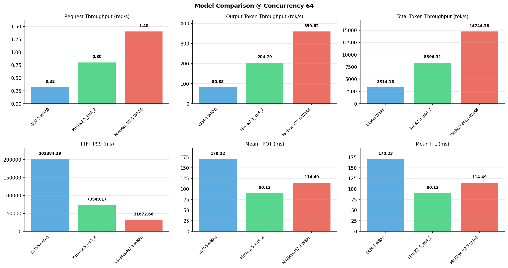

# 多模型性能对比报告

**测试日期：** 2026-05-14

**芯片平台：** inspur_metax_c550

**测试套件：** test_01

**Run ID：** 01, 01, 01

**并发级别：** 64并发

**测试配置：** 320-i10240-o256

---

## 🤖 芯片和模型配置信息

| 参数名称 | **MiniMax-M2.5-W8A8** | **GLM-5-W8A8** | **Kimi-K2.5_int4_2** |
|----------|----------|----------|----------|
| **max_position_embeddings** | 196608 | 202752 | 262144 |
| **model_name** | MiniMax-M2.5-W8A8 | GLM-5-W8A8 | Kimi-K2.5_int4_2 |
| **model_size** | 215G | 712G | 496G |
| **python_version** | 3.10.10 | 3.10.10 | 3.10.10 |
| **quantization_config** | int8 | int8 | int4 |
| **sglang_version** | 0.5.9+maca3.5.3.204 | 0.5.9+maca3.5.3.204 | 0.5.9+maca3.5.3.204 |
| **temperature** | N/A | N/A | N/A |
| **top_k** | 40 | N/A | N/A |
| **top_p** | 0.95 | N/A | N/A |
| **transformers_version** | 4.57.6 | 5.1.0 | 4.56.2 |

---

## ⚙️ SGLang 启动配置信息

| 参数名称 | **MiniMax-M2.5-W8A8** | **GLM-5-W8A8** | **Kimi-K2.5_int4_2** |
|----------|----------|----------|----------|
| **Attention Backend** | flashinfer | flashinfer | flashinfer |
| **Chunked Prefill Size** | N/A | 8192 | 8192 |
| **Context Length** | 196608 | 202752 | 262144 |
| **Cuda Graph Max Bs** | N/A | 64 | 64 |
| **Disable Radix Cache** | True | True | True |
| **Dp Size** | N/A | 4 | N/A |
| **Max Queued Requests** | None | None | None |
| **Max Running Requests** | 64 | 64 | 64 |
| **Mem Fraction Static** | 0.9 | 0.8 | 0.8 |
| **Model Name** | MiniMax-M2.5-W8A8 | GLM-5-W8A8 | Kimi-K2.5_int4_2 |
| **Nnodes** | 1 | 2 | 2 |
| **Pp Size** | 1 | 1 | 1 |
| **Quantization** | w8a8_int8 | w8a8_int8 | w4a8_int8 |
| **Reasoning Parser** | minimax-append-think | glm45 | kimi_k2 |
| **Tool Call Parser** | minimax-m2 | glm47 | kimi_k2 |
| **Tp Size** | 8 | 16 | 16 |

---

## 📊 模型列表

| 模型名称 | Run ID | 状态 |
|----------|--------|------|
| MiniMax-M2.5-W8A8 | 01 | [OK] |
| GLM-5-W8A8 | 01 | [OK] |
| Kimi-K2.5_int4_2 | 01 | [OK] |

---

## 📊 测试概览

| 项目            | 配置                                     | 备注  |
|---------------|----------------------------------------|-----|
| **数据集**       | random                                 |     |
| **并发数**       | 1, 2, 4, 8, 10, 16, 32, 64, 80, 128    |     |
| **总请求数**      | 320                                    |     |
| **输入输出长度** | (10240, 256) |     |
| **测试套件**     | test_01                           |     |
| **被测芯片**      | inspur_metax_c550 |     |
| **SGLang版本**   | 0.5.9                           |     |

---

## 📈 服务基准结果对比

| 指标 | MiniMax-M2.5-W8A8 (基准) | GLM-5-W8A8 | 差异 | % | Kimi-K2.5_int4_2 | 差异 | % |
|------|--------------- | --------- | ------- | ------- | --------- | ------- | -------|
| 成功请求数 | 320 | 320 | 0.00 | 0.0% | 320 | 0.00 | 0.0% |
| 测试持续时间 (s) | 227.80 | 1013.44 | +785.64 | +344.9% | 400.02 | +172.22 | +75.6% |
| 总输入 tokens | 3276800 | 3276800 | 0.00 | 0.0% | 3276800 | 0.00 | 0.0% |
| 总生成 tokens | 81920 | 81920 | 0.00 | 0.0% | 81920 | 0.00 | 0.0% |
| **请求吞吐量 (req/s)** | 1.40 | 0.32 | -1.08 | -77.1% | 0.80 | -0.60 | -42.9% |
| **输出 token 吞吐量 (tok/s)** | 359.62 | 80.83 | -278.79 | -77.5% | 204.79 | -154.83 | -43.1% |
| **总 token 吞吐量 (tok/s)** | 14744.38 | 3314.18 | -11430.20 | -77.5% | 8396.31 | -6348.07 | -43.1% |

---

## ⏱️ 首 Token 延迟 (TTFT) 对比

| 指标 | MiniMax-M2.5-W8A8 (基准) | GLM-5-W8A8 | 差异 | % | Kimi-K2.5_int4_2 | 差异 | % |
|------|--------------- | --------- | ------- | ------- | --------- | ------- | -------|
| 平均 TTFT (ms) | 16337.99 | 145239.71 | +128901.72 | +789.0% | 52096.83 | +35758.84 | +218.9% |
| 中位 TTFT (ms) | 16436.43 | 161034.99 | +144598.56 | +879.7% | 55427.05 | +38990.62 | +237.2% |
| P99 TTFT (ms) | 31672.66 | 201384.39 | +169711.73 | +535.8% | 73549.17 | +41876.51 | +132.2% |

---

## ⚡ 每 Token 生成时间 (TPOT) 对比

| 指标 | MiniMax-M2.5-W8A8 (基准) | GLM-5-W8A8 | 差异 | % | Kimi-K2.5_int4_2 | 差异 | % |
|------|--------------- | --------- | ------- | ------- | --------- | ------- | -------|
| 平均 TPOT (ms) | 114.49 | 170.22 | +55.73 | +48.7% | 90.12 | -24.37 | -21.3% |
| 中位 TPOT (ms) | 114.32 | 177.38 | +63.06 | +55.2% | 91.46 | -22.86 | -20.0% |
| P99 TPOT (ms) | 174.61 | 333.18 | +158.57 | +90.8% | 136.18 | -38.43 | -22.0% |

---

## 🔄 Token 间延迟 (ITL) 对比

| 指标 | MiniMax-M2.5-W8A8 (基准) | GLM-5-W8A8 | 差异 | % | Kimi-K2.5_int4_2 | 差异 | % |
|------|--------------- | --------- | ------- | ------- | --------- | ------- | -------|
| 平均 ITL (ms) | 114.49 | 170.23 | +55.74 | +48.7% | 90.12 | -24.37 | -21.3% |
| 中位 ITL (ms) | 54.66 | 18.96 | -35.70 | -65.3% | 29.40 | -25.26 | -46.2% |
| P95 ITL (ms) | 56.15 | 919.57 | +863.42 | +1537.7% | 461.76 | +405.61 | +722.4% |
| P99 ITL (ms) | 57.22 | 2103.50 | +2046.28 | +3576.2% | 926.00 | +868.78 | +1518.3% |

---

## ⏱️ 端到端延迟 (E2E) 对比

| 指标 | MiniMax-M2.5-W8A8 (基准) | GLM-5-W8A8 | 差异 | % | Kimi-K2.5_int4_2 | 差异 | % |
|------|--------------- | --------- | ------- | ------- | --------- | ------- | -------|
| 平均 E2E 延迟 (ms) | 45532.01 | 188645.87 | +143113.86 | +314.3% | 75077.66 | +29545.65 | +64.9% |
| 中位 E2E 延迟 (ms) | 45649.83 | 207505.30 | +161855.47 | +354.6% | 78490.29 | +32840.46 | +71.9% |
| P90 E2E 延迟 (ms) | 45911.58 | 237037.20 | +191125.62 | +416.3% | 83766.79 | +37855.21 | +82.5% |
| P99 E2E 延迟 (ms) | 45922.68 | 263429.41 | +217506.73 | +473.6% | 97818.99 | +51896.31 | +113.0% |

---

## 📊 模型性能对比

---

## 📝 分析小结

- **请求吞吐量**: MiniMax-M2.5-W8A8 最高，达 1.40 req/s
- **总token吞吐量**: MiniMax-M2.5-W8A8 最高，达 14744 tok/s
- **TTFT P99**: MiniMax-M2.5-W8A8 最优，为 31672.66ms
- **TPOT P99**: Kimi-K2.5_int4_2 最优，为 136.18ms

---

*报告生成时间: 2026-05-14*

