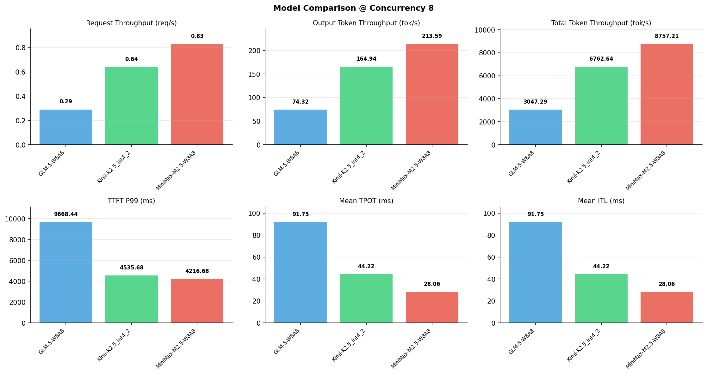

# 多模型性能对比报告

**测试日期：** 2026-05-14

**芯片平台：** inspur_metax_c550

**测试套件：** test_01

**Run ID：** 01, 01, 01

**并发级别：** 8并发

**测试配置：** 320-i10240-o256

---

## 🤖 芯片和模型配置信息

| 参数名称 | **MiniMax-M2.5-W8A8** | **GLM-5-W8A8** | **Kimi-K2.5_int4_2** |
|----------|----------|----------|----------|
| **max_position_embeddings** | 196608 | 202752 | 262144 |
| **model_name** | MiniMax-M2.5-W8A8 | GLM-5-W8A8 | Kimi-K2.5_int4_2 |
| **model_size** | 215G | 712G | 496G |
| **python_version** | 3.10.10 | 3.10.10 | 3.10.10 |
| **quantization_config** | int8 | int8 | int4 |
| **sglang_version** | 0.5.9+maca3.5.3.204 | 0.5.9+maca3.5.3.204 | 0.5.9+maca3.5.3.204 |
| **temperature** | N/A | N/A | N/A |
| **top_k** | 40 | N/A | N/A |
| **top_p** | 0.95 | N/A | N/A |
| **transformers_version** | 4.57.6 | 5.1.0 | 4.56.2 |

---

## ⚙️ SGLang 启动配置信息

| 参数名称 | **MiniMax-M2.5-W8A8** | **GLM-5-W8A8** | **Kimi-K2.5_int4_2** |
|----------|----------|----------|----------|
| **Attention Backend** | flashinfer | flashinfer | flashinfer |
| **Chunked Prefill Size** | N/A | 8192 | 8192 |
| **Context Length** | 196608 | 202752 | 262144 |
| **Cuda Graph Max Bs** | N/A | 64 | 64 |
| **Disable Radix Cache** | True | True | True |
| **Dp Size** | N/A | 4 | N/A |
| **Max Queued Requests** | None | None | None |
| **Max Running Requests** | 64 | 64 | 64 |
| **Mem Fraction Static** | 0.9 | 0.8 | 0.8 |
| **Model Name** | MiniMax-M2.5-W8A8 | GLM-5-W8A8 | Kimi-K2.5_int4_2 |
| **Nnodes** | 1 | 2 | 2 |
| **Pp Size** | 1 | 1 | 1 |
| **Quantization** | w8a8_int8 | w8a8_int8 | w4a8_int8 |
| **Reasoning Parser** | minimax-append-think | glm45 | kimi_k2 |
| **Tool Call Parser** | minimax-m2 | glm47 | kimi_k2 |
| **Tp Size** | 8 | 16 | 16 |

---

## 📊 模型列表

| 模型名称 | Run ID | 状态 |
|----------|--------|------|
| MiniMax-M2.5-W8A8 | 01 | [OK] |
| GLM-5-W8A8 | 01 | [OK] |
| Kimi-K2.5_int4_2 | 01 | [OK] |

---

## 📊 测试概览

| 项目            | 配置                                     | 备注  |
|---------------|----------------------------------------|-----|
| **数据集**       | random                                 |     |
| **并发数**       | 1, 2, 4, 8, 10, 16, 32, 64, 80, 128    |     |
| **总请求数**      | 320                                    |     |
| **输入输出长度** | (10240, 256) |     |
| **测试套件**     | test_01                           |     |
| **被测芯片**      | inspur_metax_c550 |     |
| **SGLang版本**   | 0.5.9                           |     |

---

## 📈 服务基准结果对比

| 指标 | MiniMax-M2.5-W8A8 (基准) | GLM-5-W8A8 | 差异 | % | Kimi-K2.5_int4_2 | 差异 | % |
|------|--------------- | --------- | ------- | ------- | --------- | ------- | -------|
| 成功请求数 | 320 | 320 | 0.00 | 0.0% | 320 | 0.00 | 0.0% |
| 测试持续时间 (s) | 383.54 | 1102.20 | +718.66 | +187.4% | 496.66 | +113.12 | +29.5% |
| 总输入 tokens | 3276800 | 3276800 | 0.00 | 0.0% | 3276800 | 0.00 | 0.0% |
| 总生成 tokens | 81920 | 81920 | 0.00 | 0.0% | 81920 | 0.00 | 0.0% |
| **请求吞吐量 (req/s)** | 0.83 | 0.29 | -0.54 | -65.1% | 0.64 | -0.19 | -22.9% |
| **输出 token 吞吐量 (tok/s)** | 213.59 | 74.32 | -139.27 | -65.2% | 164.94 | -48.65 | -22.8% |
| **总 token 吞吐量 (tok/s)** | 8757.21 | 3047.29 | -5709.92 | -65.2% | 6762.64 | -1994.57 | -22.8% |

---

## ⏱️ 首 Token 延迟 (TTFT) 对比

| 指标 | MiniMax-M2.5-W8A8 (基准) | GLM-5-W8A8 | 差异 | % | Kimi-K2.5_int4_2 | 差异 | % |
|------|--------------- | --------- | ------- | ------- | --------- | ------- | -------|
| 平均 TTFT (ms) | 2430.66 | 4101.49 | +1670.83 | +68.7% | 1101.70 | -1328.96 | -54.7% |
| 中位 TTFT (ms) | 2749.83 | 3651.05 | +901.22 | +32.8% | 923.95 | -1825.88 | -66.4% |
| P99 TTFT (ms) | 4216.68 | 9668.44 | +5451.76 | +129.3% | 4535.68 | +319.00 | +7.6% |

---

## ⚡ 每 Token 生成时间 (TPOT) 对比

| 指标 | MiniMax-M2.5-W8A8 (基准) | GLM-5-W8A8 | 差异 | % | Kimi-K2.5_int4_2 | 差异 | % |
|------|--------------- | --------- | ------- | ------- | --------- | ------- | -------|
| 平均 TPOT (ms) | 28.06 | 91.75 | +63.69 | +227.0% | 44.22 | +16.16 | +57.6% |
| 中位 TPOT (ms) | 27.90 | 92.20 | +64.30 | +230.5% | 44.36 | +16.46 | +59.0% |
| P99 TPOT (ms) | 34.97 | 162.53 | +127.56 | +364.8% | 63.19 | +28.22 | +80.7% |

---

## 🔄 Token 间延迟 (ITL) 对比

| 指标 | MiniMax-M2.5-W8A8 (基准) | GLM-5-W8A8 | 差异 | % | Kimi-K2.5_int4_2 | 差异 | % |
|------|--------------- | --------- | ------- | ------- | --------- | ------- | -------|
| 平均 ITL (ms) | 28.06 | 91.75 | +63.69 | +227.0% | 44.22 | +16.16 | +57.6% |
| 中位 ITL (ms) | 22.26 | 15.98 | -6.28 | -28.2% | 20.06 | -2.20 | -9.9% |
| P95 ITL (ms) | 22.84 | 906.35 | +883.51 | +3868.3% | 41.68 | +18.84 | +82.5% |
| P99 ITL (ms) | 27.01 | 1148.91 | +1121.90 | +4153.6% | 466.65 | +439.64 | +1627.7% |

---

## ⏱️ 端到端延迟 (E2E) 对比

| 指标 | MiniMax-M2.5-W8A8 (基准) | GLM-5-W8A8 | 差异 | % | Kimi-K2.5_int4_2 | 差异 | % |
|------|--------------- | --------- | ------- | ------- | --------- | ------- | -------|
| 平均 E2E 延迟 (ms) | 9585.27 | 27497.14 | +17911.87 | +186.9% | 12377.05 | +2791.78 | +29.1% |
| 中位 E2E 延迟 (ms) | 9513.92 | 27210.99 | +17697.07 | +186.0% | 12279.29 | +2765.37 | +29.1% |
| P90 E2E 延迟 (ms) | 9720.24 | 30236.75 | +20516.51 | +211.1% | 13819.57 | +4099.33 | +42.2% |
| P99 E2E 延迟 (ms) | 10451.03 | 45219.70 | +34768.67 | +332.7% | 18033.48 | +7582.45 | +72.6% |

---

## 📊 模型性能对比

---

## 📝 分析小结

- **请求吞吐量**: MiniMax-M2.5-W8A8 最高，达 0.83 req/s
- **总token吞吐量**: MiniMax-M2.5-W8A8 最高，达 8757 tok/s
- **TTFT P99**: MiniMax-M2.5-W8A8 最优，为 4216.68ms
- **TPOT P99**: MiniMax-M2.5-W8A8 最优，为 34.97ms

---

*报告生成时间: 2026-05-14*

