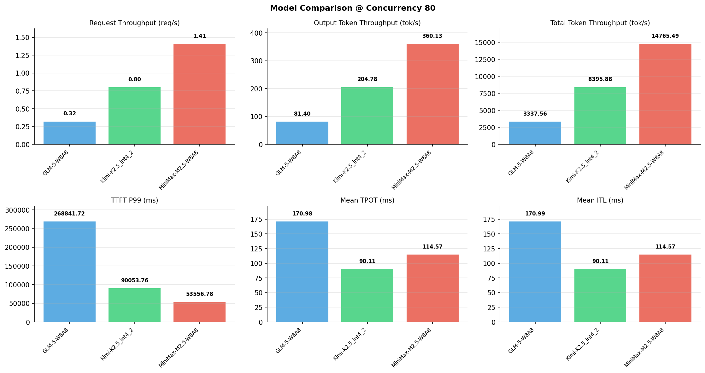

# 多模型性能对比报告

**测试日期：** 2026-05-14

**芯片平台：** inspur_metax_c550

**测试套件：** test_01

**Run ID：** 01, 01, 01

**并发级别：** 80并发

**测试配置：** 320-i10240-o256

---

## 🤖 芯片和模型配置信息

| 参数名称 | **MiniMax-M2.5-W8A8** | **GLM-5-W8A8** | **Kimi-K2.5_int4_2** |
|----------|----------|----------|----------|
| **max_position_embeddings** | 196608 | 202752 | 262144 |
| **model_name** | MiniMax-M2.5-W8A8 | GLM-5-W8A8 | Kimi-K2.5_int4_2 |
| **model_size** | 215G | 712G | 496G |
| **python_version** | 3.10.10 | 3.10.10 | 3.10.10 |
| **quantization_config** | int8 | int8 | int4 |
| **sglang_version** | 0.5.9+maca3.5.3.204 | 0.5.9+maca3.5.3.204 | 0.5.9+maca3.5.3.204 |
| **temperature** | N/A | N/A | N/A |
| **top_k** | 40 | N/A | N/A |
| **top_p** | 0.95 | N/A | N/A |
| **transformers_version** | 4.57.6 | 5.1.0 | 4.56.2 |

---

## ⚙️ SGLang 启动配置信息

| 参数名称 | **MiniMax-M2.5-W8A8** | **GLM-5-W8A8** | **Kimi-K2.5_int4_2** |
|----------|----------|----------|----------|
| **Attention Backend** | flashinfer | flashinfer | flashinfer |
| **Chunked Prefill Size** | N/A | 8192 | 8192 |
| **Context Length** | 196608 | 202752 | 262144 |
| **Cuda Graph Max Bs** | N/A | 64 | 64 |
| **Disable Radix Cache** | True | True | True |
| **Dp Size** | N/A | 4 | N/A |
| **Max Queued Requests** | None | None | None |
| **Max Running Requests** | 64 | 64 | 64 |
| **Mem Fraction Static** | 0.9 | 0.8 | 0.8 |
| **Model Name** | MiniMax-M2.5-W8A8 | GLM-5-W8A8 | Kimi-K2.5_int4_2 |
| **Nnodes** | 1 | 2 | 2 |
| **Pp Size** | 1 | 1 | 1 |
| **Quantization** | w8a8_int8 | w8a8_int8 | w4a8_int8 |
| **Reasoning Parser** | minimax-append-think | glm45 | kimi_k2 |
| **Tool Call Parser** | minimax-m2 | glm47 | kimi_k2 |
| **Tp Size** | 8 | 16 | 16 |

---

## 📊 模型列表

| 模型名称 | Run ID | 状态 |
|----------|--------|------|
| MiniMax-M2.5-W8A8 | 01 | [OK] |
| GLM-5-W8A8 | 01 | [OK] |
| Kimi-K2.5_int4_2 | 01 | [OK] |

---

## 📊 测试概览

| 项目            | 配置                                     | 备注  |
|---------------|----------------------------------------|-----|
| **数据集**       | random                                 |     |
| **并发数**       | 1, 2, 4, 8, 10, 16, 32, 64, 80, 128    |     |
| **总请求数**      | 320                                    |     |
| **输入输出长度** | (10240, 256) |     |
| **测试套件**     | test_01                           |     |
| **被测芯片**      | inspur_metax_c550 |     |
| **SGLang版本**   | 0.5.9                           |     |

---

## 📈 服务基准结果对比

| 指标 | MiniMax-M2.5-W8A8 (基准) | GLM-5-W8A8 | 差异 | % | Kimi-K2.5_int4_2 | 差异 | % |
|------|--------------- | --------- | ------- | ------- | --------- | ------- | -------|
| 成功请求数 | 320 | 320 | 0.00 | 0.0% | 320 | 0.00 | 0.0% |
| 测试持续时间 (s) | 227.47 | 1006.34 | +778.87 | +342.4% | 400.04 | +172.57 | +75.9% |
| 总输入 tokens | 3276800 | 3276800 | 0.00 | 0.0% | 3276800 | 0.00 | 0.0% |
| 总生成 tokens | 81920 | 81920 | 0.00 | 0.0% | 81920 | 0.00 | 0.0% |
| **请求吞吐量 (req/s)** | 1.41 | 0.32 | -1.09 | -77.3% | 0.80 | -0.61 | -43.3% |
| **输出 token 吞吐量 (tok/s)** | 360.13 | 81.40 | -278.73 | -77.4% | 204.78 | -155.35 | -43.1% |
| **总 token 吞吐量 (tok/s)** | 14765.49 | 3337.56 | -11427.93 | -77.4% | 8395.88 | -6369.61 | -43.1% |

---

## ⏱️ 首 Token 延迟 (TTFT) 对比

| 指标 | MiniMax-M2.5-W8A8 (基准) | GLM-5-W8A8 | 差异 | % | Kimi-K2.5_int4_2 | 差异 | % |
|------|--------------- | --------- | ------- | ------- | --------- | ------- | -------|
| 平均 TTFT (ms) | 25355.27 | 182957.70 | +157602.43 | +621.6% | 68496.03 | +43140.76 | +170.1% |
| 中位 TTFT (ms) | 22485.04 | 198816.67 | +176331.63 | +784.2% | 75456.51 | +52971.47 | +235.6% |
| P99 TTFT (ms) | 53556.78 | 268841.72 | +215284.94 | +402.0% | 90053.76 | +36496.98 | +68.1% |

---

## ⚡ 每 Token 生成时间 (TPOT) 对比

| 指标 | MiniMax-M2.5-W8A8 (基准) | GLM-5-W8A8 | 差异 | % | Kimi-K2.5_int4_2 | 差异 | % |
|------|--------------- | --------- | ------- | ------- | --------- | ------- | -------|
| 平均 TPOT (ms) | 114.57 | 170.98 | +56.41 | +49.2% | 90.11 | -24.46 | -21.3% |
| 中位 TPOT (ms) | 114.40 | 169.97 | +55.57 | +48.6% | 91.35 | -23.05 | -20.1% |
| P99 TPOT (ms) | 174.32 | 316.71 | +142.39 | +81.7% | 136.30 | -38.02 | -21.8% |

---

## 🔄 Token 间延迟 (ITL) 对比

| 指标 | MiniMax-M2.5-W8A8 (基准) | GLM-5-W8A8 | 差异 | % | Kimi-K2.5_int4_2 | 差异 | % |
|------|--------------- | --------- | ------- | ------- | --------- | ------- | -------|
| 平均 ITL (ms) | 114.57 | 170.99 | +56.42 | +49.2% | 90.11 | -24.46 | -21.3% |
| 中位 ITL (ms) | 54.79 | 18.95 | -35.84 | -65.4% | 29.46 | -25.33 | -46.2% |
| P95 ITL (ms) | 55.94 | 920.39 | +864.45 | +1545.3% | 461.88 | +405.94 | +725.7% |
| P99 ITL (ms) | 57.32 | 1915.10 | +1857.78 | +3241.1% | 925.37 | +868.05 | +1514.4% |

---

## ⏱️ 端到端延迟 (E2E) 对比

| 指标 | MiniMax-M2.5-W8A8 (基准) | GLM-5-W8A8 | 差异 | % | Kimi-K2.5_int4_2 | 差异 | % |
|------|--------------- | --------- | ------- | ------- | --------- | ------- | -------|
| 平均 E2E 延迟 (ms) | 54569.52 | 226558.37 | +171988.85 | +315.2% | 91474.37 | +36904.85 | +67.6% |
| 中位 E2E 延迟 (ms) | 45667.55 | 243196.58 | +197529.03 | +432.5% | 98187.46 | +52519.91 | +115.0% |
| P90 E2E 延迟 (ms) | 90712.83 | 302403.79 | +211690.96 | +233.4% | 103364.93 | +12652.10 | +13.9% |
| P99 E2E 延迟 (ms) | 91533.85 | 328009.41 | +236475.56 | +258.3% | 115386.58 | +23852.73 | +26.1% |

---

## 📊 模型性能对比

---

## 📝 分析小结

- **请求吞吐量**: MiniMax-M2.5-W8A8 最高，达 1.41 req/s
- **总token吞吐量**: MiniMax-M2.5-W8A8 最高，达 14765 tok/s
- **TTFT P99**: MiniMax-M2.5-W8A8 最优，为 53556.78ms
- **TPOT P99**: Kimi-K2.5_int4_2 最优，为 136.30ms

---

*报告生成时间: 2026-05-14*

