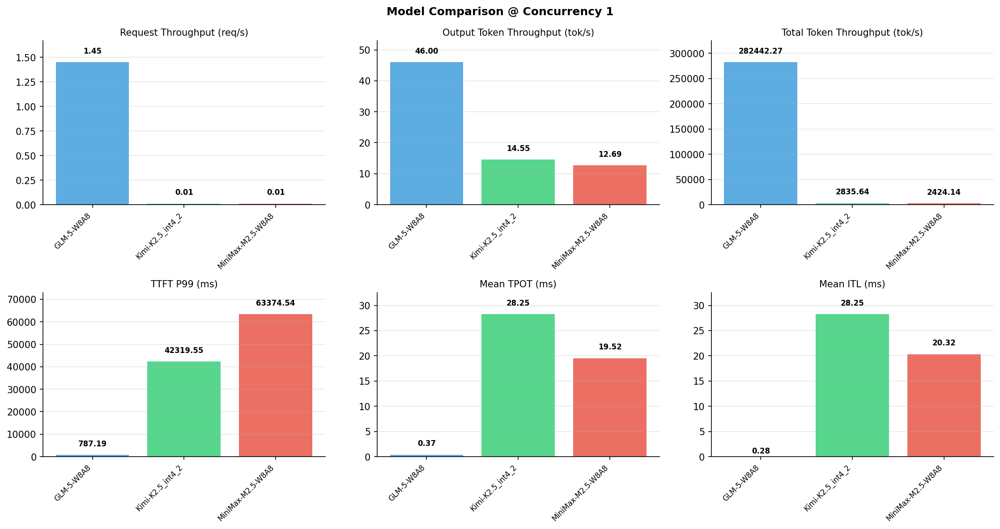

# 多模型性能对比报告

**测试日期：** 2026-05-14

**芯片平台：** inspur_metax_c550

**测试套件：** test_02

**Run ID：** 01, 01, 01

**并发级别：** 1并发

**测试配置：** 100-i194560-o1024

---

## 🤖 芯片和模型配置信息

| 参数名称 | **MiniMax-M2.5-W8A8** | **GLM-5-W8A8** | **Kimi-K2.5_int4_2** |
|----------|----------|----------|----------|
| **max_position_embeddings** | 196608 | 202752 | 262144 |
| **model_name** | MiniMax-M2.5-W8A8 | GLM-5-W8A8 | Kimi-K2.5_int4_2 |
| **model_size** | 215G | 712G | 496G |
| **python_version** | 3.10.10 | 3.10.10 | 3.10.10 |
| **quantization_config** | int8 | int8 | int4 |
| **sglang_version** | 0.5.9+maca3.5.3.204 | 0.5.9+maca3.5.3.204 | 0.5.9+maca3.5.3.204 |
| **temperature** | N/A | N/A | N/A |
| **top_k** | 40 | N/A | N/A |
| **top_p** | 0.95 | N/A | N/A |
| **transformers_version** | 4.57.6 | 5.1.0 | 4.56.2 |

---

## ⚙️ SGLang 启动配置信息

| 参数名称 | **MiniMax-M2.5-W8A8** | **GLM-5-W8A8** | **Kimi-K2.5_int4_2** |
|----------|----------|----------|----------|
| **Attention Backend** | flashinfer | flashinfer | flashinfer |
| **Chunked Prefill Size** | N/A | 8192 | 8192 |
| **Context Length** | 196608 | 202752 | 262144 |
| **Cuda Graph Max Bs** | N/A | 64 | 64 |
| **Disable Radix Cache** | True | True | True |
| **Dp Size** | N/A | 4 | N/A |
| **Max Queued Requests** | None | None | None |
| **Max Running Requests** | 64 | 64 | 64 |
| **Mem Fraction Static** | 0.9 | 0.8 | 0.8 |
| **Model Name** | MiniMax-M2.5-W8A8 | GLM-5-W8A8 | Kimi-K2.5_int4_2 |
| **Nnodes** | 1 | 2 | 2 |
| **Pp Size** | 1 | 1 | 1 |
| **Quantization** | w8a8_int8 | w8a8_int8 | w4a8_int8 |
| **Reasoning Parser** | minimax-append-think | glm45 | kimi_k2 |
| **Tool Call Parser** | minimax-m2 | glm47 | kimi_k2 |
| **Tp Size** | 8 | 16 | 16 |

---

## 📊 模型列表

| 模型名称 | Run ID | 状态 |
|----------|--------|------|
| MiniMax-M2.5-W8A8 | 01 | [OK] |
| GLM-5-W8A8 | 01 | [OK] |
| Kimi-K2.5_int4_2 | 01 | [OK] |

---

## 📊 测试概览

| 项目            | 配置                                     | 备注  |
|---------------|----------------------------------------|-----|
| **数据集**       | random                                 |     |
| **并发数**       | 1, 2, 4, 8, 10    |     |
| **总请求数**      | 100                                    |     |
| **输入输出长度** | (194560, 1024) |     |
| **测试套件**     | test_02                           |     |
| **被测芯片**      | inspur_metax_c550 |     |
| **SGLang版本**   | 0.5.9                           |     |

---

## 📈 服务基准结果对比

| 指标 | MiniMax-M2.5-W8A8 (基准) | GLM-5-W8A8 | 差异 | % | Kimi-K2.5_int4_2 | 差异 | % |
|------|--------------- | --------- | ------- | ------- | --------- | ------- | -------|
| 成功请求数 | 100 | 100 | 0.00 | 0.0% | 100 | 0.00 | 0.0% |
| 测试持续时间 (s) | 8068.18 | 68.90 | -7999.28 | -99.1% | 6896.63 | -1171.55 | -14.5% |
| 总输入 tokens | 19456000 | 19456000 | 0.00 | 0.0% | 19456000 | 0.00 | 0.0% |
| 总生成 tokens | 102400 | 3169 | -99231.00 | -96.9% | 100354 | -2046.00 | -2.0% |
| **请求吞吐量 (req/s)** | 0.01 | 1.45 | +1.44 | +14400.0% | 0.01 | 0.00 | 0.0% |
| **输出 token 吞吐量 (tok/s)** | 12.69 | 46.00 | +33.31 | +262.5% | 14.55 | +1.86 | +14.7% |
| **总 token 吞吐量 (tok/s)** | 2424.14 | 282442.27 | +280018.13 | +11551.2% | 2835.64 | +411.50 | +17.0% |

---

## ⏱️ 首 Token 延迟 (TTFT) 对比

| 指标 | MiniMax-M2.5-W8A8 (基准) | GLM-5-W8A8 | 差异 | % | Kimi-K2.5_int4_2 | 差异 | % |
|------|--------------- | --------- | ------- | ------- | --------- | ------- | -------|
| 平均 TTFT (ms) | 60714.60 | 677.01 | -60037.59 | -98.9% | 40645.80 | -20068.80 | -33.1% |
| 中位 TTFT (ms) | 63251.29 | 697.18 | -62554.11 | -98.9% | 41415.82 | -21835.47 | -34.5% |
| P99 TTFT (ms) | 63374.54 | 787.19 | -62587.35 | -98.8% | 42319.55 | -21054.99 | -33.2% |

---

## ⚡ 每 Token 生成时间 (TPOT) 对比

| 指标 | MiniMax-M2.5-W8A8 (基准) | GLM-5-W8A8 | 差异 | % | Kimi-K2.5_int4_2 | 差异 | % |
|------|--------------- | --------- | ------- | ------- | --------- | ------- | -------|
| 平均 TPOT (ms) | 19.52 | 0.37 | -19.15 | -98.1% | 28.25 | +8.73 | +44.7% |
| 中位 TPOT (ms) | 20.32 | 0.37 | -19.95 | -98.2% | 28.21 | +7.89 | +38.8% |
| P99 TPOT (ms) | 20.33 | 0.42 | -19.91 | -97.9% | 34.98 | +14.65 | +72.1% |

---

## 🔄 Token 间延迟 (ITL) 对比

| 指标 | MiniMax-M2.5-W8A8 (基准) | GLM-5-W8A8 | 差异 | % | Kimi-K2.5_int4_2 | 差异 | % |
|------|--------------- | --------- | ------- | ------- | --------- | ------- | -------|
| 平均 ITL (ms) | 20.32 | 0.00 | -20.32 | -100.0% | 28.25 | +7.93 | +39.0% |
| 中位 ITL (ms) | 20.32 | 0.00 | -20.32 | -100.0% | 21.48 | +1.16 | +5.7% |
| P95 ITL (ms) | 20.36 | 0.00 | -20.36 | -100.0% | 42.95 | +22.59 | +111.0% |
| P99 ITL (ms) | 24.42 | 0.00 | -24.42 | -100.0% | 43.56 | +19.14 | +78.4% |

---

## ⏱️ 端到端延迟 (E2E) 对比

| 指标 | MiniMax-M2.5-W8A8 (基准) | GLM-5-W8A8 | 差异 | % | Kimi-K2.5_int4_2 | 差异 | % |
|------|--------------- | --------- | ------- | ------- | --------- | ------- | -------|
| 平均 E2E 延迟 (ms) | 80681.04 | 688.40 | -79992.64 | -99.1% | 68965.79 | -11715.25 | -14.5% |
| 中位 E2E 延迟 (ms) | 84034.37 | 697.19 | -83337.18 | -99.2% | 70244.75 | -13789.62 | -16.4% |
| P90 E2E 延迟 (ms) | 84131.89 | 753.32 | -83378.57 | -99.1% | 72878.42 | -11253.47 | -13.4% |
| P99 E2E 延迟 (ms) | 84165.35 | 787.19 | -83378.16 | -99.1% | 77217.61 | -6947.74 | -8.3% |

---

## 📊 模型性能对比

---

## 📝 分析小结

- **请求吞吐量**: GLM-5-W8A8 最高，达 1.45 req/s
- **总token吞吐量**: GLM-5-W8A8 最高，达 282442 tok/s
- **TTFT P99**: GLM-5-W8A8 最优，为 787.19ms
- **TPOT P99**: GLM-5-W8A8 最优，为 0.42ms

---

*报告生成时间: 2026-05-14*

