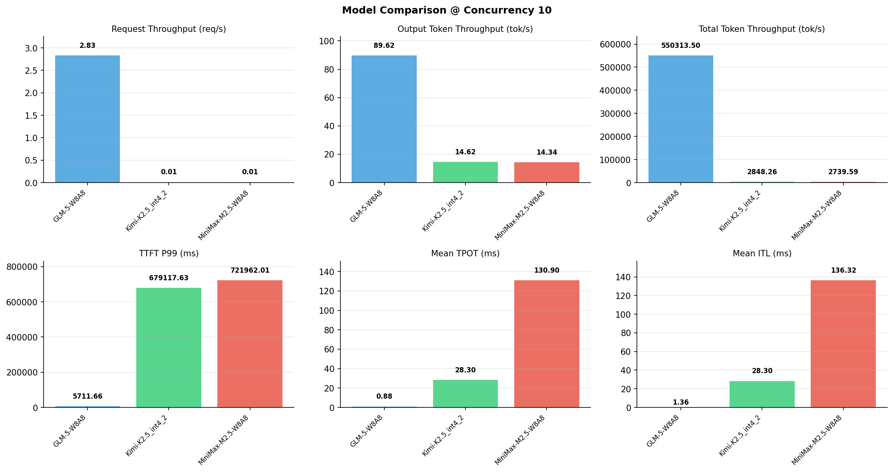

# 多模型性能对比报告

**测试日期：** 2026-05-14

**芯片平台：** inspur_metax_c550

**测试套件：** test_02

**Run ID：** 01, 01, 01

**并发级别：** 10并发

**测试配置：** 100-i194560-o1024

---

## 🤖 芯片和模型配置信息

| 参数名称 | **MiniMax-M2.5-W8A8** | **GLM-5-W8A8** | **Kimi-K2.5_int4_2** |
|----------|----------|----------|----------|
| **max_position_embeddings** | 196608 | 202752 | 262144 |
| **model_name** | MiniMax-M2.5-W8A8 | GLM-5-W8A8 | Kimi-K2.5_int4_2 |
| **model_size** | 215G | 712G | 496G |
| **python_version** | 3.10.10 | 3.10.10 | 3.10.10 |
| **quantization_config** | int8 | int8 | int4 |
| **sglang_version** | 0.5.9+maca3.5.3.204 | 0.5.9+maca3.5.3.204 | 0.5.9+maca3.5.3.204 |
| **temperature** | N/A | N/A | N/A |
| **top_k** | 40 | N/A | N/A |
| **top_p** | 0.95 | N/A | N/A |
| **transformers_version** | 4.57.6 | 5.1.0 | 4.56.2 |

---

## ⚙️ SGLang 启动配置信息

| 参数名称 | **MiniMax-M2.5-W8A8** | **GLM-5-W8A8** | **Kimi-K2.5_int4_2** |
|----------|----------|----------|----------|
| **Attention Backend** | flashinfer | flashinfer | flashinfer |
| **Chunked Prefill Size** | N/A | 8192 | 8192 |
| **Context Length** | 196608 | 202752 | 262144 |
| **Cuda Graph Max Bs** | N/A | 64 | 64 |
| **Disable Radix Cache** | True | True | True |
| **Dp Size** | N/A | 4 | N/A |
| **Max Queued Requests** | None | None | None |
| **Max Running Requests** | 64 | 64 | 64 |
| **Mem Fraction Static** | 0.9 | 0.8 | 0.8 |
| **Model Name** | MiniMax-M2.5-W8A8 | GLM-5-W8A8 | Kimi-K2.5_int4_2 |
| **Nnodes** | 1 | 2 | 2 |
| **Pp Size** | 1 | 1 | 1 |
| **Quantization** | w8a8_int8 | w8a8_int8 | w4a8_int8 |
| **Reasoning Parser** | minimax-append-think | glm45 | kimi_k2 |
| **Tool Call Parser** | minimax-m2 | glm47 | kimi_k2 |
| **Tp Size** | 8 | 16 | 16 |

---

## 📊 模型列表

| 模型名称 | Run ID | 状态 |
|----------|--------|------|
| MiniMax-M2.5-W8A8 | 01 | [OK] |
| GLM-5-W8A8 | 01 | [OK] |
| Kimi-K2.5_int4_2 | 01 | [OK] |

---

## 📊 测试概览

| 项目            | 配置                                     | 备注  |
|---------------|----------------------------------------|-----|
| **数据集**       | random                                 |     |
| **并发数**       | 1, 2, 4, 8, 10    |     |
| **总请求数**      | 100                                    |     |
| **输入输出长度** | (194560, 1024) |     |
| **测试套件**     | test_02                           |     |
| **被测芯片**      | inspur_metax_c550 |     |
| **SGLang版本**   | 0.5.9                           |     |

---

## 📈 服务基准结果对比

| 指标 | MiniMax-M2.5-W8A8 (基准) | GLM-5-W8A8 | 差异 | % | Kimi-K2.5_int4_2 | 差异 | % |
|------|--------------- | --------- | ------- | ------- | --------- | ------- | -------|
| 成功请求数 | 100 | 100 | 0.00 | 0.0% | 100 | 0.00 | 0.0% |
| 测试持续时间 (s) | 7139.17 | 35.36 | -7103.81 | -99.5% | 6866.06 | -273.11 | -3.8% |
| 总输入 tokens | 19456000 | 19456000 | 0.00 | 0.0% | 19456000 | 0.00 | 0.0% |
| 总生成 tokens | 102400 | 3169 | -99231.00 | -96.9% | 100354 | -2046.00 | -2.0% |
| **请求吞吐量 (req/s)** | 0.01 | 2.83 | +2.82 | +28200.0% | 0.01 | 0.00 | 0.0% |
| **输出 token 吞吐量 (tok/s)** | 14.34 | 89.62 | +75.28 | +525.0% | 14.62 | +0.28 | +2.0% |
| **总 token 吞吐量 (tok/s)** | 2739.59 | 550313.50 | +547573.91 | +19987.4% | 2848.26 | +108.67 | +4.0% |

---

## ⏱️ 首 Token 延迟 (TTFT) 对比

| 指标 | MiniMax-M2.5-W8A8 (基准) | GLM-5-W8A8 | 差异 | % | Kimi-K2.5_int4_2 | 差异 | % |
|------|--------------- | --------- | ------- | ------- | --------- | ------- | -------|
| 平均 TTFT (ms) | 556209.89 | 3472.63 | -552737.26 | -99.4% | 626964.83 | +70754.94 | +12.7% |
| 中位 TTFT (ms) | 550150.31 | 3492.02 | -546658.29 | -99.4% | 669938.13 | +119787.82 | +21.8% |
| P99 TTFT (ms) | 721962.01 | 5711.66 | -716250.35 | -99.2% | 679117.63 | -42844.38 | -5.9% |

---

## ⚡ 每 Token 生成时间 (TPOT) 对比

| 指标 | MiniMax-M2.5-W8A8 (基准) | GLM-5-W8A8 | 差异 | % | Kimi-K2.5_int4_2 | 差异 | % |
|------|--------------- | --------- | ------- | ------- | --------- | ------- | -------|
| 平均 TPOT (ms) | 130.90 | 0.88 | -130.02 | -99.3% | 28.30 | -102.60 | -78.4% |
| 中位 TPOT (ms) | 105.41 | 0.94 | -104.47 | -99.1% | 28.27 | -77.14 | -73.2% |
| P99 TPOT (ms) | 229.15 | 1.03 | -228.12 | -99.6% | 35.42 | -193.73 | -84.5% |

---

## 🔄 Token 间延迟 (ITL) 对比

| 指标 | MiniMax-M2.5-W8A8 (基准) | GLM-5-W8A8 | 差异 | % | Kimi-K2.5_int4_2 | 差异 | % |
|------|--------------- | --------- | ------- | ------- | --------- | ------- | -------|
| 平均 ITL (ms) | 136.32 | 0.00 | -136.32 | -100.0% | 28.30 | -108.02 | -79.2% |
| 中位 ITL (ms) | 43.98 | 0.00 | -43.98 | -100.0% | 21.51 | -22.47 | -51.1% |
| P95 ITL (ms) | 44.25 | 0.00 | -44.25 | -100.0% | 43.00 | -1.25 | -2.8% |
| P99 ITL (ms) | 46.84 | 0.00 | -46.84 | -100.0% | 43.59 | -3.25 | -6.9% |

---

## ⏱️ 端到端延迟 (E2E) 对比

| 指标 | MiniMax-M2.5-W8A8 (基准) | GLM-5-W8A8 | 差异 | % | Kimi-K2.5_int4_2 | 差异 | % |
|------|--------------- | --------- | ------- | ------- | --------- | ------- | -------|
| 平均 E2E 延迟 (ms) | 690123.07 | 3499.53 | -686623.54 | -99.5% | 655336.51 | -34786.56 | -5.0% |
| 中位 E2E 延迟 (ms) | 595287.20 | 3492.02 | -591795.18 | -99.4% | 697480.02 | +102192.82 | +17.2% |
| P90 E2E 延迟 (ms) | 892727.67 | 4114.64 | -888613.03 | -99.5% | 704392.97 | -188334.70 | -21.1% |
| P99 E2E 延迟 (ms) | 892917.91 | 5711.68 | -887206.23 | -99.4% | 708999.73 | -183918.18 | -20.6% |

---

## 📊 模型性能对比

---

## 📝 分析小结

- **请求吞吐量**: GLM-5-W8A8 最高，达 2.83 req/s
- **总token吞吐量**: GLM-5-W8A8 最高，达 550314 tok/s
- **TTFT P99**: GLM-5-W8A8 最优，为 5711.66ms
- **TPOT P99**: GLM-5-W8A8 最优，为 1.03ms

---

*报告生成时间: 2026-05-14*

