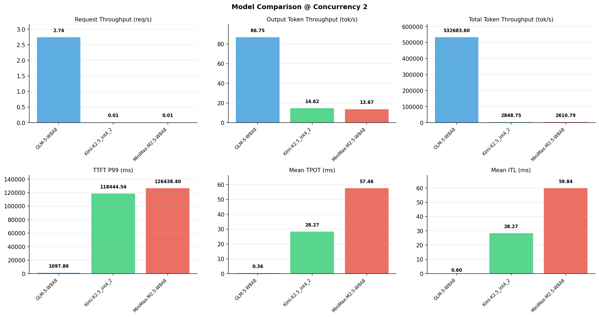

# 多模型性能对比报告

**测试日期：** 2026-05-14

**芯片平台：** inspur_metax_c550

**测试套件：** test_02

**Run ID：** 01, 01, 01

**并发级别：** 2并发

**测试配置：** 100-i194560-o1024

---

## 🤖 芯片和模型配置信息

| 参数名称 | **MiniMax-M2.5-W8A8** | **GLM-5-W8A8** | **Kimi-K2.5_int4_2** |
|----------|----------|----------|----------|
| **max_position_embeddings** | 196608 | 202752 | 262144 |
| **model_name** | MiniMax-M2.5-W8A8 | GLM-5-W8A8 | Kimi-K2.5_int4_2 |
| **model_size** | 215G | 712G | 496G |
| **python_version** | 3.10.10 | 3.10.10 | 3.10.10 |
| **quantization_config** | int8 | int8 | int4 |
| **sglang_version** | 0.5.9+maca3.5.3.204 | 0.5.9+maca3.5.3.204 | 0.5.9+maca3.5.3.204 |
| **temperature** | N/A | N/A | N/A |
| **top_k** | 40 | N/A | N/A |
| **top_p** | 0.95 | N/A | N/A |
| **transformers_version** | 4.57.6 | 5.1.0 | 4.56.2 |

---

## ⚙️ SGLang 启动配置信息

| 参数名称 | **MiniMax-M2.5-W8A8** | **GLM-5-W8A8** | **Kimi-K2.5_int4_2** |
|----------|----------|----------|----------|
| **Attention Backend** | flashinfer | flashinfer | flashinfer |
| **Chunked Prefill Size** | N/A | 8192 | 8192 |
| **Context Length** | 196608 | 202752 | 262144 |
| **Cuda Graph Max Bs** | N/A | 64 | 64 |
| **Disable Radix Cache** | True | True | True |
| **Dp Size** | N/A | 4 | N/A |
| **Max Queued Requests** | None | None | None |
| **Max Running Requests** | 64 | 64 | 64 |
| **Mem Fraction Static** | 0.9 | 0.8 | 0.8 |
| **Model Name** | MiniMax-M2.5-W8A8 | GLM-5-W8A8 | Kimi-K2.5_int4_2 |
| **Nnodes** | 1 | 2 | 2 |
| **Pp Size** | 1 | 1 | 1 |
| **Quantization** | w8a8_int8 | w8a8_int8 | w4a8_int8 |
| **Reasoning Parser** | minimax-append-think | glm45 | kimi_k2 |
| **Tool Call Parser** | minimax-m2 | glm47 | kimi_k2 |
| **Tp Size** | 8 | 16 | 16 |

---

## 📊 模型列表

| 模型名称 | Run ID | 状态 |
|----------|--------|------|
| MiniMax-M2.5-W8A8 | 01 | [OK] |
| GLM-5-W8A8 | 01 | [OK] |
| Kimi-K2.5_int4_2 | 01 | [OK] |

---

## 📊 测试概览

| 项目            | 配置                                     | 备注  |
|---------------|----------------------------------------|-----|
| **数据集**       | random                                 |     |
| **并发数**       | 1, 2, 4, 8, 10    |     |
| **总请求数**      | 100                                    |     |
| **输入输出长度** | (194560, 1024) |     |
| **测试套件**     | test_02                           |     |
| **被测芯片**      | inspur_metax_c550 |     |
| **SGLang版本**   | 0.5.9                           |     |

---

## 📈 服务基准结果对比

| 指标 | MiniMax-M2.5-W8A8 (基准) | GLM-5-W8A8 | 差异 | % | Kimi-K2.5_int4_2 | 差异 | % |
|------|--------------- | --------- | ------- | ------- | --------- | ------- | -------|
| 成功请求数 | 100 | 100 | 0.00 | 0.0% | 100 | 0.00 | 0.0% |
| 测试持续时间 (s) | 7491.36 | 36.53 | -7454.83 | -99.5% | 6864.89 | -626.47 | -8.4% |
| 总输入 tokens | 19456000 | 19456000 | 0.00 | 0.0% | 19456000 | 0.00 | 0.0% |
| 总生成 tokens | 102400 | 3169 | -99231.00 | -96.9% | 100354 | -2046.00 | -2.0% |
| **请求吞吐量 (req/s)** | 0.01 | 2.74 | +2.73 | +27300.0% | 0.01 | 0.00 | 0.0% |
| **输出 token 吞吐量 (tok/s)** | 13.67 | 86.75 | +73.08 | +534.6% | 14.62 | +0.95 | +6.9% |
| **总 token 吞吐量 (tok/s)** | 2610.79 | 532683.60 | +530072.81 | +20303.2% | 2848.75 | +237.96 | +9.1% |

---

## ⏱️ 首 Token 延迟 (TTFT) 对比

| 指标 | MiniMax-M2.5-W8A8 (基准) | GLM-5-W8A8 | 差异 | % | Kimi-K2.5_int4_2 | 差异 | % |
|------|--------------- | --------- | ------- | ------- | --------- | ------- | -------|
| 平均 TTFT (ms) | 91040.24 | 715.72 | -90324.52 | -99.2% | 108264.32 | +17224.08 | +18.9% |
| 中位 TTFT (ms) | 63633.21 | 719.90 | -62913.31 | -98.9% | 110985.42 | +47352.21 | +74.4% |
| P99 TTFT (ms) | 126438.40 | 1097.86 | -125340.54 | -99.1% | 118444.54 | -7993.86 | -6.3% |

---

## ⚡ 每 Token 生成时间 (TPOT) 对比

| 指标 | MiniMax-M2.5-W8A8 (基准) | GLM-5-W8A8 | 差异 | % | Kimi-K2.5_int4_2 | 差异 | % |
|------|--------------- | --------- | ------- | ------- | --------- | ------- | -------|
| 平均 TPOT (ms) | 57.46 | 0.36 | -57.10 | -99.4% | 28.27 | -29.19 | -50.8% |
| 中位 TPOT (ms) | 29.20 | 0.37 | -28.83 | -98.7% | 28.24 | -0.96 | -3.3% |
| P99 TPOT (ms) | 90.66 | 0.38 | -90.28 | -99.6% | 35.40 | -55.26 | -61.0% |

---

## 🔄 Token 间延迟 (ITL) 对比

| 指标 | MiniMax-M2.5-W8A8 (基准) | GLM-5-W8A8 | 差异 | % | Kimi-K2.5_int4_2 | 差异 | % |
|------|--------------- | --------- | ------- | ------- | --------- | ------- | -------|
| 平均 ITL (ms) | 59.84 | 0.00 | -59.84 | -100.0% | 28.27 | -31.57 | -52.8% |
| 中位 ITL (ms) | 29.14 | 0.00 | -29.14 | -100.0% | 21.49 | -7.65 | -26.3% |
| P95 ITL (ms) | 29.24 | 0.00 | -29.24 | -100.0% | 42.96 | +13.72 | +46.9% |
| P99 ITL (ms) | 32.89 | 0.00 | -32.89 | -100.0% | 43.59 | +10.70 | +32.5% |

---

## ⏱️ 端到端延迟 (E2E) 对比

| 指标 | MiniMax-M2.5-W8A8 (基准) | GLM-5-W8A8 | 差异 | % | Kimi-K2.5_int4_2 | 差异 | % |
|------|--------------- | --------- | ------- | ------- | --------- | ------- | -------|
| 平均 E2E 延迟 (ms) | 149824.72 | 726.67 | -149098.05 | -99.5% | 136610.77 | -13213.95 | -8.8% |
| 中位 E2E 延迟 (ms) | 156079.30 | 719.91 | -155359.39 | -99.5% | 139815.23 | -16264.07 | -10.4% |
| P90 E2E 延迟 (ms) | 156219.53 | 802.03 | -155417.50 | -99.5% | 143957.19 | -12262.34 | -7.8% |
| P99 E2E 延迟 (ms) | 156247.42 | 1097.87 | -155149.55 | -99.3% | 147480.32 | -8767.10 | -5.6% |

---

## 📊 模型性能对比

---

## 📝 分析小结

- **请求吞吐量**: GLM-5-W8A8 最高，达 2.74 req/s
- **总token吞吐量**: GLM-5-W8A8 最高，达 532684 tok/s
- **TTFT P99**: GLM-5-W8A8 最优，为 1097.86ms
- **TPOT P99**: GLM-5-W8A8 最优，为 0.38ms

---

*报告生成时间: 2026-05-14*

