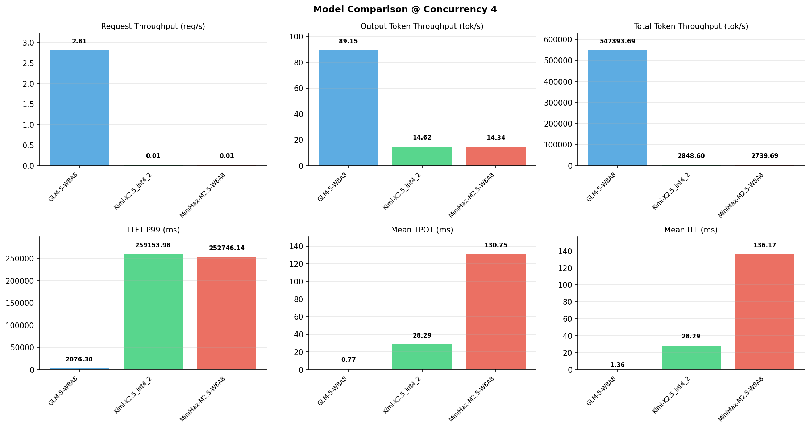

# 多模型性能对比报告

**测试日期：** 2026-05-14

**芯片平台：** inspur_metax_c550

**测试套件：** test_02

**Run ID：** 01, 01, 01

**并发级别：** 4并发

**测试配置：** 100-i194560-o1024

---

## 🤖 芯片和模型配置信息

| 参数名称 | **MiniMax-M2.5-W8A8** | **GLM-5-W8A8** | **Kimi-K2.5_int4_2** |
|----------|----------|----------|----------|
| **max_position_embeddings** | 196608 | 202752 | 262144 |
| **model_name** | MiniMax-M2.5-W8A8 | GLM-5-W8A8 | Kimi-K2.5_int4_2 |
| **model_size** | 215G | 712G | 496G |
| **python_version** | 3.10.10 | 3.10.10 | 3.10.10 |
| **quantization_config** | int8 | int8 | int4 |
| **sglang_version** | 0.5.9+maca3.5.3.204 | 0.5.9+maca3.5.3.204 | 0.5.9+maca3.5.3.204 |
| **temperature** | N/A | N/A | N/A |
| **top_k** | 40 | N/A | N/A |
| **top_p** | 0.95 | N/A | N/A |
| **transformers_version** | 4.57.6 | 5.1.0 | 4.56.2 |

---

## ⚙️ SGLang 启动配置信息

| 参数名称 | **MiniMax-M2.5-W8A8** | **GLM-5-W8A8** | **Kimi-K2.5_int4_2** |
|----------|----------|----------|----------|
| **Attention Backend** | flashinfer | flashinfer | flashinfer |
| **Chunked Prefill Size** | N/A | 8192 | 8192 |
| **Context Length** | 196608 | 202752 | 262144 |
| **Cuda Graph Max Bs** | N/A | 64 | 64 |
| **Disable Radix Cache** | True | True | True |
| **Dp Size** | N/A | 4 | N/A |
| **Max Queued Requests** | None | None | None |
| **Max Running Requests** | 64 | 64 | 64 |
| **Mem Fraction Static** | 0.9 | 0.8 | 0.8 |
| **Model Name** | MiniMax-M2.5-W8A8 | GLM-5-W8A8 | Kimi-K2.5_int4_2 |
| **Nnodes** | 1 | 2 | 2 |
| **Pp Size** | 1 | 1 | 1 |
| **Quantization** | w8a8_int8 | w8a8_int8 | w4a8_int8 |
| **Reasoning Parser** | minimax-append-think | glm45 | kimi_k2 |
| **Tool Call Parser** | minimax-m2 | glm47 | kimi_k2 |
| **Tp Size** | 8 | 16 | 16 |

---

## 📊 模型列表

| 模型名称 | Run ID | 状态 |
|----------|--------|------|
| MiniMax-M2.5-W8A8 | 01 | [OK] |
| GLM-5-W8A8 | 01 | [OK] |
| Kimi-K2.5_int4_2 | 01 | [OK] |

---

## 📊 测试概览

| 项目            | 配置                                     | 备注  |
|---------------|----------------------------------------|-----|
| **数据集**       | random                                 |     |
| **并发数**       | 1, 2, 4, 8, 10    |     |
| **总请求数**      | 100                                    |     |
| **输入输出长度** | (194560, 1024) |     |
| **测试套件**     | test_02                           |     |
| **被测芯片**      | inspur_metax_c550 |     |
| **SGLang版本**   | 0.5.9                           |     |

---

## 📈 服务基准结果对比

| 指标 | MiniMax-M2.5-W8A8 (基准) | GLM-5-W8A8 | 差异 | % | Kimi-K2.5_int4_2 | 差异 | % |
|------|--------------- | --------- | ------- | ------- | --------- | ------- | -------|
| 成功请求数 | 100 | 100 | 0.00 | 0.0% | 100 | 0.00 | 0.0% |
| 测试持续时间 (s) | 7138.91 | 35.55 | -7103.36 | -99.5% | 6865.26 | -273.65 | -3.8% |
| 总输入 tokens | 19456000 | 19456000 | 0.00 | 0.0% | 19456000 | 0.00 | 0.0% |
| 总生成 tokens | 102400 | 3169 | -99231.00 | -96.9% | 100354 | -2046.00 | -2.0% |
| **请求吞吐量 (req/s)** | 0.01 | 2.81 | +2.80 | +28000.0% | 0.01 | 0.00 | 0.0% |
| **输出 token 吞吐量 (tok/s)** | 14.34 | 89.15 | +74.81 | +521.7% | 14.62 | +0.28 | +2.0% |
| **总 token 吞吐量 (tok/s)** | 2739.69 | 547393.69 | +544654.00 | +19880.1% | 2848.60 | +108.91 | +4.0% |

---

## ⏱️ 首 Token 延迟 (TTFT) 对比

| 指标 | MiniMax-M2.5-W8A8 (基准) | GLM-5-W8A8 | 差异 | % | Kimi-K2.5_int4_2 | 差异 | % |
|------|--------------- | --------- | ------- | ------- | --------- | ------- | -------|
| 平均 TTFT (ms) | 151789.54 | 1383.44 | -150406.10 | -99.1% | 242126.95 | +90337.41 | +59.5% |
| 中位 TTFT (ms) | 126783.24 | 1406.92 | -125376.32 | -98.9% | 250863.44 | +124080.20 | +97.9% |
| P99 TTFT (ms) | 252746.14 | 2076.30 | -250669.84 | -99.2% | 259153.98 | +6407.84 | +2.5% |

---

## ⚡ 每 Token 生成时间 (TPOT) 对比

| 指标 | MiniMax-M2.5-W8A8 (基准) | GLM-5-W8A8 | 差异 | % | Kimi-K2.5_int4_2 | 差异 | % |
|------|--------------- | --------- | ------- | ------- | --------- | ------- | -------|
| 平均 TPOT (ms) | 130.75 | 0.77 | -129.98 | -99.4% | 28.29 | -102.46 | -78.4% |
| 中位 TPOT (ms) | 105.27 | 0.68 | -104.59 | -99.4% | 28.26 | -77.01 | -73.2% |
| P99 TPOT (ms) | 228.93 | 0.95 | -227.98 | -99.6% | 35.40 | -193.53 | -84.5% |

---

## 🔄 Token 间延迟 (ITL) 对比

| 指标 | MiniMax-M2.5-W8A8 (基准) | GLM-5-W8A8 | 差异 | % | Kimi-K2.5_int4_2 | 差异 | % |
|------|--------------- | --------- | ------- | ------- | --------- | ------- | -------|
| 平均 ITL (ms) | 136.17 | 0.00 | -136.17 | -100.0% | 28.29 | -107.88 | -79.2% |
| 中位 ITL (ms) | 43.91 | 0.00 | -43.91 | -100.0% | 21.50 | -22.41 | -51.0% |
| P95 ITL (ms) | 44.19 | 0.00 | -44.19 | -100.0% | 42.98 | -1.21 | -2.7% |
| P99 ITL (ms) | 46.66 | 0.00 | -46.66 | -100.0% | 43.57 | -3.09 | -6.6% |

---

## ⏱️ 端到端延迟 (E2E) 对比

| 指标 | MiniMax-M2.5-W8A8 (基准) | GLM-5-W8A8 | 差异 | % | Kimi-K2.5_int4_2 | 差异 | % |
|------|--------------- | --------- | ------- | ------- | --------- | ------- | -------|
| 平均 E2E 延迟 (ms) | 285550.39 | 1406.97 | -284143.42 | -99.5% | 270487.20 | -15063.19 | -5.3% |
| 中位 E2E 延迟 (ms) | 297529.83 | 1406.93 | -296122.90 | -99.5% | 280307.16 | -17222.67 | -5.8% |
| P90 E2E 延迟 (ms) | 297678.91 | 1733.43 | -295945.48 | -99.4% | 285963.73 | -11715.18 | -3.9% |
| P99 E2E 延迟 (ms) | 297902.96 | 2076.31 | -295826.65 | -99.3% | 288560.85 | -9342.11 | -3.1% |

---

## 📊 模型性能对比

---

## 📝 分析小结

- **请求吞吐量**: GLM-5-W8A8 最高，达 2.81 req/s
- **总token吞吐量**: GLM-5-W8A8 最高，达 547394 tok/s
- **TTFT P99**: GLM-5-W8A8 最优，为 2076.30ms
- **TPOT P99**: GLM-5-W8A8 最优，为 0.95ms

---

*报告生成时间: 2026-05-14*

