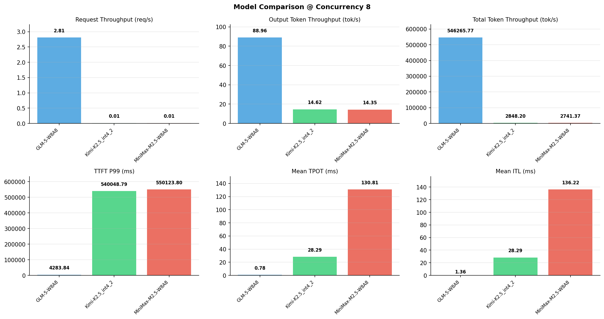

# 多模型性能对比报告

**测试日期：** 2026-05-14

**芯片平台：** inspur_metax_c550

**测试套件：** test_02

**Run ID：** 01, 01, 01

**并发级别：** 8并发

**测试配置：** 100-i194560-o1024

---

## 🤖 芯片和模型配置信息

| 参数名称 | **MiniMax-M2.5-W8A8** | **GLM-5-W8A8** | **Kimi-K2.5_int4_2** |
|----------|----------|----------|----------|
| **max_position_embeddings** | 196608 | 202752 | 262144 |
| **model_name** | MiniMax-M2.5-W8A8 | GLM-5-W8A8 | Kimi-K2.5_int4_2 |
| **model_size** | 215G | 712G | 496G |
| **python_version** | 3.10.10 | 3.10.10 | 3.10.10 |
| **quantization_config** | int8 | int8 | int4 |
| **sglang_version** | 0.5.9+maca3.5.3.204 | 0.5.9+maca3.5.3.204 | 0.5.9+maca3.5.3.204 |
| **temperature** | N/A | N/A | N/A |
| **top_k** | 40 | N/A | N/A |
| **top_p** | 0.95 | N/A | N/A |
| **transformers_version** | 4.57.6 | 5.1.0 | 4.56.2 |

---

## ⚙️ SGLang 启动配置信息

| 参数名称 | **MiniMax-M2.5-W8A8** | **GLM-5-W8A8** | **Kimi-K2.5_int4_2** |
|----------|----------|----------|----------|
| **Attention Backend** | flashinfer | flashinfer | flashinfer |
| **Chunked Prefill Size** | N/A | 8192 | 8192 |
| **Context Length** | 196608 | 202752 | 262144 |
| **Cuda Graph Max Bs** | N/A | 64 | 64 |
| **Disable Radix Cache** | True | True | True |
| **Dp Size** | N/A | 4 | N/A |
| **Max Queued Requests** | None | None | None |
| **Max Running Requests** | 64 | 64 | 64 |
| **Mem Fraction Static** | 0.9 | 0.8 | 0.8 |
| **Model Name** | MiniMax-M2.5-W8A8 | GLM-5-W8A8 | Kimi-K2.5_int4_2 |
| **Nnodes** | 1 | 2 | 2 |
| **Pp Size** | 1 | 1 | 1 |
| **Quantization** | w8a8_int8 | w8a8_int8 | w4a8_int8 |
| **Reasoning Parser** | minimax-append-think | glm45 | kimi_k2 |
| **Tool Call Parser** | minimax-m2 | glm47 | kimi_k2 |
| **Tp Size** | 8 | 16 | 16 |

---

## 📊 模型列表

| 模型名称 | Run ID | 状态 |
|----------|--------|------|
| MiniMax-M2.5-W8A8 | 01 | [OK] |
| GLM-5-W8A8 | 01 | [OK] |
| Kimi-K2.5_int4_2 | 01 | [OK] |

---

## 📊 测试概览

| 项目            | 配置                                     | 备注  |
|---------------|----------------------------------------|-----|
| **数据集**       | random                                 |     |
| **并发数**       | 1, 2, 4, 8, 10    |     |
| **总请求数**      | 100                                    |     |
| **输入输出长度** | (194560, 1024) |     |
| **测试套件**     | test_02                           |     |
| **被测芯片**      | inspur_metax_c550 |     |
| **SGLang版本**   | 0.5.9                           |     |

---

## 📈 服务基准结果对比

| 指标 | MiniMax-M2.5-W8A8 (基准) | GLM-5-W8A8 | 差异 | % | Kimi-K2.5_int4_2 | 差异 | % |
|------|--------------- | --------- | ------- | ------- | --------- | ------- | -------|
| 成功请求数 | 100 | 100 | 0.00 | 0.0% | 100 | 0.00 | 0.0% |
| 测试持续时间 (s) | 7134.54 | 35.62 | -7098.92 | -99.5% | 6866.22 | -268.32 | -3.8% |
| 总输入 tokens | 19456000 | 19456000 | 0.00 | 0.0% | 19456000 | 0.00 | 0.0% |
| 总生成 tokens | 102400 | 3169 | -99231.00 | -96.9% | 100354 | -2046.00 | -2.0% |
| **请求吞吐量 (req/s)** | 0.01 | 2.81 | +2.80 | +28000.0% | 0.01 | 0.00 | 0.0% |
| **输出 token 吞吐量 (tok/s)** | 14.35 | 88.96 | +74.61 | +519.9% | 14.62 | +0.27 | +1.9% |
| **总 token 吞吐量 (tok/s)** | 2741.37 | 546265.77 | +543524.40 | +19826.7% | 2848.20 | +106.83 | +3.9% |

---

## ⏱️ 首 Token 延迟 (TTFT) 对比

| 指标 | MiniMax-M2.5-W8A8 (基准) | GLM-5-W8A8 | 差异 | % | Kimi-K2.5_int4_2 | 差异 | % |
|------|--------------- | --------- | ------- | ------- | --------- | ------- | -------|
| 平均 TTFT (ms) | 425053.85 | 2798.16 | -422255.69 | -99.3% | 501516.70 | +76462.85 | +18.0% |
| 中位 TTFT (ms) | 423822.71 | 2848.49 | -420974.22 | -99.3% | 530794.21 | +106971.50 | +25.2% |
| P99 TTFT (ms) | 550123.80 | 4283.84 | -545839.96 | -99.2% | 540048.79 | -10075.01 | -1.8% |

---

## ⚡ 每 Token 生成时间 (TPOT) 对比

| 指标 | MiniMax-M2.5-W8A8 (基准) | GLM-5-W8A8 | 差异 | % | Kimi-K2.5_int4_2 | 差异 | % |
|------|--------------- | --------- | ------- | ------- | --------- | ------- | -------|
| 平均 TPOT (ms) | 130.81 | 0.78 | -130.03 | -99.4% | 28.29 | -102.52 | -78.4% |
| 中位 TPOT (ms) | 105.27 | 0.67 | -104.60 | -99.4% | 28.27 | -77.00 | -73.1% |
| P99 TPOT (ms) | 229.02 | 0.98 | -228.04 | -99.6% | 35.42 | -193.60 | -84.5% |

---

## 🔄 Token 间延迟 (ITL) 对比

| 指标 | MiniMax-M2.5-W8A8 (基准) | GLM-5-W8A8 | 差异 | % | Kimi-K2.5_int4_2 | 差异 | % |
|------|--------------- | --------- | ------- | ------- | --------- | ------- | -------|
| 平均 ITL (ms) | 136.22 | 0.00 | -136.22 | -100.0% | 28.29 | -107.93 | -79.2% |
| 中位 ITL (ms) | 43.95 | 0.00 | -43.95 | -100.0% | 21.51 | -22.44 | -51.1% |
| P95 ITL (ms) | 44.20 | 0.00 | -44.20 | -100.0% | 42.99 | -1.21 | -2.7% |
| P99 ITL (ms) | 46.82 | 0.00 | -46.82 | -100.0% | 43.52 | -3.30 | -7.0% |

---

## ⏱️ 端到端延迟 (E2E) 对比

| 指标 | MiniMax-M2.5-W8A8 (基准) | GLM-5-W8A8 | 差异 | % | Kimi-K2.5_int4_2 | 差异 | % |
|------|--------------- | --------- | ------- | ------- | --------- | ------- | -------|
| 平均 E2E 延迟 (ms) | 558870.27 | 2821.97 | -556048.30 | -99.5% | 529877.17 | -28993.10 | -5.2% |
| 中位 E2E 延迟 (ms) | 594599.95 | 2848.50 | -591751.45 | -99.5% | 559497.09 | -35102.86 | -5.9% |
| P90 E2E 延迟 (ms) | 594851.66 | 3177.04 | -591674.62 | -99.5% | 565469.57 | -29382.09 | -4.9% |
| P99 E2E 延迟 (ms) | 595179.12 | 4283.85 | -590895.27 | -99.3% | 570042.23 | -25136.89 | -4.2% |

---

## 📊 模型性能对比

---

## 📝 分析小结

- **请求吞吐量**: GLM-5-W8A8 最高，达 2.81 req/s
- **总token吞吐量**: GLM-5-W8A8 最高，达 546266 tok/s
- **TTFT P99**: GLM-5-W8A8 最优，为 4283.84ms
- **TPOT P99**: GLM-5-W8A8 最优，为 0.98ms

---

*报告生成时间: 2026-05-14*

