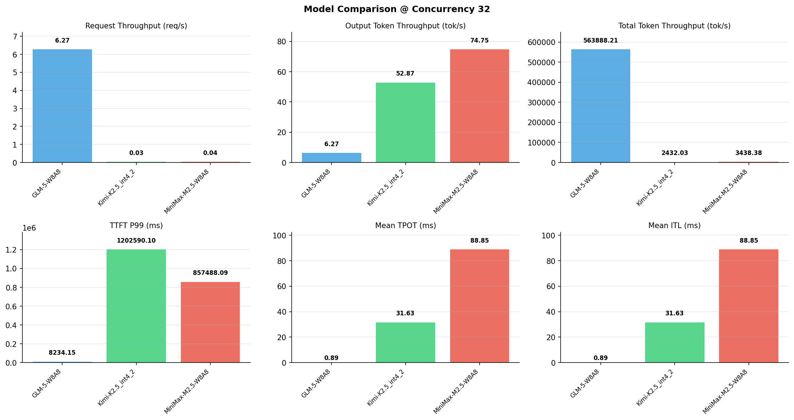

# 多模型性能对比报告

**测试日期：** 2026-05-14

**芯片平台：** inspur_metax_c550

**测试套件：** test_03

**Run ID：** 01, 01, 01

**并发级别：** 32并发

**测试配置：** 1000-i90000-o2000

---

## 🤖 芯片和模型配置信息

| 参数名称 | **MiniMax-M2.5-W8A8** | **GLM-5-W8A8** | **Kimi-K2.5_int4_2** |
|----------|----------|----------|----------|
| **max_position_embeddings** | 196608 | 202752 | 262144 |
| **model_name** | MiniMax-M2.5-W8A8 | GLM-5-W8A8 | Kimi-K2.5_int4_2 |
| **model_size** | 215G | 712G | 496G |
| **python_version** | 3.10.10 | 3.10.10 | 3.10.10 |
| **quantization_config** | int8 | int8 | int4 |
| **sglang_version** | 0.5.9+maca3.5.3.204 | 0.5.9+maca3.5.3.204 | 0.5.9+maca3.5.3.204 |
| **temperature** | N/A | N/A | N/A |
| **top_k** | 40 | N/A | N/A |
| **top_p** | 0.95 | N/A | N/A |
| **transformers_version** | 4.57.6 | 5.1.0 | 4.56.2 |

---

## ⚙️ SGLang 启动配置信息

| 参数名称 | **MiniMax-M2.5-W8A8** | **GLM-5-W8A8** | **Kimi-K2.5_int4_2** |
|----------|----------|----------|----------|
| **Attention Backend** | flashinfer | flashinfer | flashinfer |
| **Chunked Prefill Size** | N/A | 8192 | 8192 |
| **Context Length** | 196608 | 202752 | 262144 |
| **Cuda Graph Max Bs** | N/A | 64 | 64 |
| **Disable Radix Cache** | True | True | True |
| **Dp Size** | N/A | 4 | N/A |
| **Max Queued Requests** | None | None | None |
| **Max Running Requests** | 64 | 64 | 64 |
| **Mem Fraction Static** | 0.9 | 0.8 | 0.8 |
| **Model Name** | MiniMax-M2.5-W8A8 | GLM-5-W8A8 | Kimi-K2.5_int4_2 |
| **Nnodes** | 1 | 2 | 2 |
| **Pp Size** | 1 | 1 | 1 |
| **Quantization** | w8a8_int8 | w8a8_int8 | w4a8_int8 |
| **Reasoning Parser** | minimax-append-think | glm45 | kimi_k2 |
| **Tool Call Parser** | minimax-m2 | glm47 | kimi_k2 |
| **Tp Size** | 8 | 16 | 16 |

---

## 📊 模型列表

| 模型名称 | Run ID | 状态 |
|----------|--------|------|
| MiniMax-M2.5-W8A8 | 01 | [OK] |
| GLM-5-W8A8 | 01 | [OK] |
| Kimi-K2.5_int4_2 | 01 | [OK] |

---

## 📊 测试概览

| 项目            | 配置                                     | 备注  |
|---------------|----------------------------------------|-----|
| **数据集**       | random                                 |     |
| **并发数**       | 32, 64    |     |
| **总请求数**      | 1000                                    |     |
| **输入输出长度** | (90000, 2000) |     |
| **测试套件**     | test_03                           |     |
| **被测芯片**      | inspur_metax_c550 |     |
| **SGLang版本**   | 0.5.9                           |     |

---

## 📈 服务基准结果对比

| 指标 | MiniMax-M2.5-W8A8 (基准) | GLM-5-W8A8 | 差异 | % | Kimi-K2.5_int4_2 | 差异 | % |
|------|--------------- | --------- | ------- | ------- | --------- | ------- | -------|
| 成功请求数 | 1000 | 1000 | 0.00 | 0.0% | 1000 | 0.00 | 0.0% |
| 测试持续时间 (s) | 26756.76 | 159.61 | -26597.15 | -99.4% | 37828.41 | +11071.65 | +41.4% |
| 总输入 tokens | 90000000 | 90000000 | 0.00 | 0.0% | 90000000 | 0.00 | 0.0% |
| 总生成 tokens | 2000000 | 1000 | -1999000.00 | -100.0% | 2000000 | 0.00 | 0.0% |
| **请求吞吐量 (req/s)** | 0.04 | 6.27 | +6.23 | +15575.0% | 0.03 | -0.01 | -25.0% |
| **输出 token 吞吐量 (tok/s)** | 74.75 | 6.27 | -68.48 | -91.6% | 52.87 | -21.88 | -29.3% |
| **总 token 吞吐量 (tok/s)** | 3438.38 | 563888.21 | +560449.83 | +16299.8% | 2432.03 | -1006.35 | -29.3% |

---

## ⏱️ 首 Token 延迟 (TTFT) 对比

| 指标 | MiniMax-M2.5-W8A8 (基准) | GLM-5-W8A8 | 差异 | % | Kimi-K2.5_int4_2 | 差异 | % |
|------|--------------- | --------- | ------- | ------- | --------- | ------- | -------|
| 平均 TTFT (ms) | 668545.83 | 5088.27 | -663457.56 | -99.2% | 1129290.87 | +460745.04 | +68.9% |
| 中位 TTFT (ms) | 650829.87 | 5093.20 | -645736.67 | -99.2% | 1145005.00 | +494175.13 | +75.9% |
| P99 TTFT (ms) | 857488.09 | 8234.15 | -849253.94 | -99.0% | 1202590.10 | +345102.01 | +40.2% |

---

## ⚡ 每 Token 生成时间 (TPOT) 对比

| 指标 | MiniMax-M2.5-W8A8 (基准) | GLM-5-W8A8 | 差异 | % | Kimi-K2.5_int4_2 | 差异 | % |
|------|--------------- | --------- | ------- | ------- | --------- | ------- | -------|
| 平均 TPOT (ms) | 88.85 | 0.00 | -88.85 | -100.0% | 31.63 | -57.22 | -64.4% |
| 中位 TPOT (ms) | 86.29 | 0.00 | -86.29 | -100.0% | 31.35 | -54.94 | -63.7% |
| P99 TPOT (ms) | 124.93 | 0.00 | -124.93 | -100.0% | 47.41 | -77.52 | -62.1% |

---

## 🔄 Token 间延迟 (ITL) 对比

| 指标 | MiniMax-M2.5-W8A8 (基准) | GLM-5-W8A8 | 差异 | % | Kimi-K2.5_int4_2 | 差异 | % |
|------|--------------- | --------- | ------- | ------- | --------- | ------- | -------|
| 平均 ITL (ms) | 88.85 | 0.00 | -88.85 | -100.0% | 31.63 | -57.22 | -64.4% |
| 中位 ITL (ms) | 55.20 | 0.00 | -55.20 | -100.0% | 21.03 | -34.17 | -61.9% |
| P95 ITL (ms) | 56.30 | 0.00 | -56.30 | -100.0% | 42.14 | -14.16 | -25.2% |
| P99 ITL (ms) | 58.30 | 0.00 | -58.30 | -100.0% | 42.99 | -15.31 | -26.3% |

---

## ⏱️ 端到端延迟 (E2E) 对比

| 指标 | MiniMax-M2.5-W8A8 (基准) | GLM-5-W8A8 | 差异 | % | Kimi-K2.5_int4_2 | 差异 | % |
|------|--------------- | --------- | ------- | ------- | --------- | ------- | -------|
| 平均 E2E 延迟 (ms) | 846163.95 | 5088.28 | -841075.67 | -99.4% | 1192521.83 | +346357.88 | +40.9% |
| 中位 E2E 延迟 (ms) | 793186.54 | 5093.21 | -788093.33 | -99.4% | 1208254.90 | +415068.36 | +52.3% |
| P90 E2E 延迟 (ms) | 1056601.94 | 5501.08 | -1051100.86 | -99.5% | 1232412.36 | +175810.42 | +16.6% |
| P99 E2E 延迟 (ms) | 1081494.77 | 8234.16 | -1073260.61 | -99.2% | 1268376.33 | +186881.56 | +17.3% |

---

## 📊 模型性能对比

---

## 📝 分析小结

- **请求吞吐量**: GLM-5-W8A8 最高，达 6.27 req/s
- **总token吞吐量**: GLM-5-W8A8 最高，达 563888 tok/s
- **TTFT P99**: GLM-5-W8A8 最优，为 8234.15ms
- **TPOT P99**: GLM-5-W8A8 最优，为 0.00ms

---

*报告生成时间: 2026-05-14*

