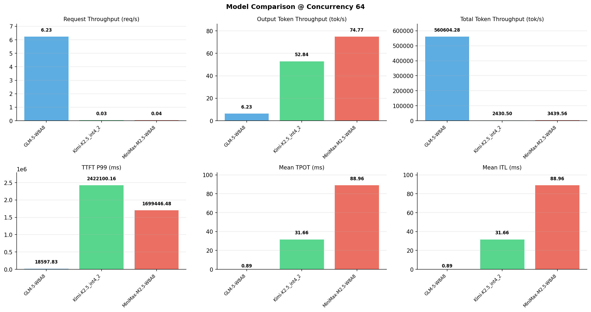

# 多模型性能对比报告

**测试日期：** 2026-05-14

**芯片平台：** inspur_metax_c550

**测试套件：** test_03

**Run ID：** 01, 01, 01

**并发级别：** 64并发

**测试配置：** 1000-i90000-o2000

---

## 🤖 芯片和模型配置信息

| 参数名称 | **MiniMax-M2.5-W8A8** | **GLM-5-W8A8** | **Kimi-K2.5_int4_2** |
|----------|----------|----------|----------|
| **max_position_embeddings** | 196608 | 202752 | 262144 |
| **model_name** | MiniMax-M2.5-W8A8 | GLM-5-W8A8 | Kimi-K2.5_int4_2 |
| **model_size** | 215G | 712G | 496G |
| **python_version** | 3.10.10 | 3.10.10 | 3.10.10 |
| **quantization_config** | int8 | int8 | int4 |
| **sglang_version** | 0.5.9+maca3.5.3.204 | 0.5.9+maca3.5.3.204 | 0.5.9+maca3.5.3.204 |
| **temperature** | N/A | N/A | N/A |
| **top_k** | 40 | N/A | N/A |
| **top_p** | 0.95 | N/A | N/A |
| **transformers_version** | 4.57.6 | 5.1.0 | 4.56.2 |

---

## ⚙️ SGLang 启动配置信息

| 参数名称 | **MiniMax-M2.5-W8A8** | **GLM-5-W8A8** | **Kimi-K2.5_int4_2** |
|----------|----------|----------|----------|
| **Attention Backend** | flashinfer | flashinfer | flashinfer |
| **Chunked Prefill Size** | N/A | 8192 | 8192 |
| **Context Length** | 196608 | 202752 | 262144 |
| **Cuda Graph Max Bs** | N/A | 64 | 64 |
| **Disable Radix Cache** | True | True | True |
| **Dp Size** | N/A | 4 | N/A |
| **Max Queued Requests** | None | None | None |
| **Max Running Requests** | 64 | 64 | 64 |
| **Mem Fraction Static** | 0.9 | 0.8 | 0.8 |
| **Model Name** | MiniMax-M2.5-W8A8 | GLM-5-W8A8 | Kimi-K2.5_int4_2 |
| **Nnodes** | 1 | 2 | 2 |
| **Pp Size** | 1 | 1 | 1 |
| **Quantization** | w8a8_int8 | w8a8_int8 | w4a8_int8 |
| **Reasoning Parser** | minimax-append-think | glm45 | kimi_k2 |
| **Tool Call Parser** | minimax-m2 | glm47 | kimi_k2 |
| **Tp Size** | 8 | 16 | 16 |

---

## 📊 模型列表

| 模型名称 | Run ID | 状态 |
|----------|--------|------|
| MiniMax-M2.5-W8A8 | 01 | [OK] |
| GLM-5-W8A8 | 01 | [OK] |
| Kimi-K2.5_int4_2 | 01 | [OK] |

---

## 📊 测试概览

| 项目            | 配置                                     | 备注  |
|---------------|----------------------------------------|-----|
| **数据集**       | random                                 |     |
| **并发数**       | 32, 64    |     |
| **总请求数**      | 1000                                    |     |
| **输入输出长度** | (90000, 2000) |     |
| **测试套件**     | test_03                           |     |
| **被测芯片**      | inspur_metax_c550 |     |
| **SGLang版本**   | 0.5.9                           |     |

---

## 📈 服务基准结果对比

| 指标 | MiniMax-M2.5-W8A8 (基准) | GLM-5-W8A8 | 差异 | % | Kimi-K2.5_int4_2 | 差异 | % |
|------|--------------- | --------- | ------- | ------- | --------- | ------- | -------|
| 成功请求数 | 1000 | 1000 | 0.00 | 0.0% | 1000 | 0.00 | 0.0% |
| 测试持续时间 (s) | 26747.60 | 160.54 | -26587.06 | -99.4% | 37852.28 | +11104.68 | +41.5% |
| 总输入 tokens | 90000000 | 90000000 | 0.00 | 0.0% | 90000000 | 0.00 | 0.0% |
| 总生成 tokens | 2000000 | 1000 | -1999000.00 | -100.0% | 2000000 | 0.00 | 0.0% |
| **请求吞吐量 (req/s)** | 0.04 | 6.23 | +6.19 | +15475.0% | 0.03 | -0.01 | -25.0% |
| **输出 token 吞吐量 (tok/s)** | 74.77 | 6.23 | -68.54 | -91.7% | 52.84 | -21.93 | -29.3% |
| **总 token 吞吐量 (tok/s)** | 3439.56 | 560604.28 | +557164.72 | +16198.7% | 2430.50 | -1009.06 | -29.3% |

---

## ⏱️ 首 Token 延迟 (TTFT) 对比

| 指标 | MiniMax-M2.5-W8A8 (基准) | GLM-5-W8A8 | 差异 | % | Kimi-K2.5_int4_2 | 差异 | % |
|------|--------------- | --------- | ------- | ------- | --------- | ------- | -------|
| 平均 TTFT (ms) | 1487255.15 | 10243.29 | -1477011.86 | -99.3% | 2284903.96 | +797648.81 | +53.6% |
| 中位 TTFT (ms) | 1485885.19 | 10246.50 | -1475638.69 | -99.3% | 2355764.75 | +869879.56 | +58.5% |
| P99 TTFT (ms) | 1699446.48 | 18597.83 | -1680848.65 | -98.9% | 2422100.16 | +722653.68 | +42.5% |

---

## ⚡ 每 Token 生成时间 (TPOT) 对比

| 指标 | MiniMax-M2.5-W8A8 (基准) | GLM-5-W8A8 | 差异 | % | Kimi-K2.5_int4_2 | 差异 | % |
|------|--------------- | --------- | ------- | ------- | --------- | ------- | -------|
| 平均 TPOT (ms) | 88.96 | 0.00 | -88.96 | -100.0% | 31.66 | -57.30 | -64.4% |
| 中位 TPOT (ms) | 86.30 | 0.00 | -86.30 | -100.0% | 31.40 | -54.90 | -63.6% |
| P99 TPOT (ms) | 124.97 | 0.00 | -124.97 | -100.0% | 46.53 | -78.44 | -62.8% |

---

## 🔄 Token 间延迟 (ITL) 对比

| 指标 | MiniMax-M2.5-W8A8 (基准) | GLM-5-W8A8 | 差异 | % | Kimi-K2.5_int4_2 | 差异 | % |
|------|--------------- | --------- | ------- | ------- | --------- | ------- | -------|
| 平均 ITL (ms) | 88.96 | 0.00 | -88.96 | -100.0% | 31.66 | -57.30 | -64.4% |
| 中位 ITL (ms) | 55.18 | 0.00 | -55.18 | -100.0% | 21.06 | -34.12 | -61.8% |
| P95 ITL (ms) | 56.15 | 0.00 | -56.15 | -100.0% | 42.19 | -13.96 | -24.9% |
| P99 ITL (ms) | 58.25 | 0.00 | -58.25 | -100.0% | 43.10 | -15.15 | -26.0% |

---

## ⏱️ 端到端延迟 (E2E) 对比

| 指标 | MiniMax-M2.5-W8A8 (基准) | GLM-5-W8A8 | 差异 | % | Kimi-K2.5_int4_2 | 差异 | % |
|------|--------------- | --------- | ------- | ------- | --------- | ------- | -------|
| 平均 E2E 延迟 (ms) | 1665095.54 | 10243.30 | -1654852.24 | -99.4% | 2348201.18 | +683105.64 | +41.0% |
| 中位 E2E 延迟 (ms) | 1609326.90 | 10246.51 | -1599080.39 | -99.4% | 2418139.26 | +808812.36 | +50.3% |
| P90 E2E 延迟 (ms) | 1855025.08 | 10713.14 | -1844311.94 | -99.4% | 2453542.71 | +598517.63 | +32.3% |
| P99 E2E 延迟 (ms) | 1875852.49 | 18597.84 | -1857254.65 | -99.0% | 2489275.83 | +613423.34 | +32.7% |

---

## 📊 模型性能对比

---

## 📝 分析小结

- **请求吞吐量**: GLM-5-W8A8 最高，达 6.23 req/s
- **总token吞吐量**: GLM-5-W8A8 最高，达 560604 tok/s
- **TTFT P99**: GLM-5-W8A8 最优，为 18597.83ms
- **TPOT P99**: GLM-5-W8A8 最优，为 0.00ms

---

*报告生成时间: 2026-05-14*

