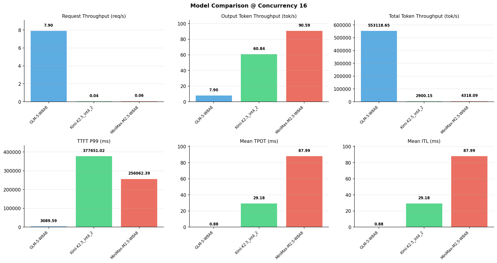

# 多模型性能对比报告

**测试日期：** 2026-05-14

**芯片平台：** inspur_metax_c550

**测试套件：** test_04

**Run ID：** 01, 01, 01

**并发级别：** 16并发

**测试配置：** 300-i70000-o1500

---

## 🤖 芯片和模型配置信息

| 参数名称 | **MiniMax-M2.5-W8A8** | **GLM-5-W8A8** | **Kimi-K2.5_int4_2** |
|----------|----------|----------|----------|
| **max_position_embeddings** | 196608 | 202752 | 262144 |
| **model_name** | MiniMax-M2.5-W8A8 | GLM-5-W8A8 | Kimi-K2.5_int4_2 |
| **model_size** | 215G | 712G | 496G |
| **python_version** | 3.10.10 | 3.10.10 | 3.10.10 |
| **quantization_config** | int8 | int8 | int4 |
| **sglang_version** | 0.5.9+maca3.5.3.204 | 0.5.9+maca3.5.3.204 | 0.5.9+maca3.5.3.204 |
| **temperature** | N/A | N/A | N/A |
| **top_k** | 40 | N/A | N/A |
| **top_p** | 0.95 | N/A | N/A |
| **transformers_version** | 4.57.6 | 5.1.0 | 4.56.2 |

---

## ⚙️ SGLang 启动配置信息

| 参数名称 | **MiniMax-M2.5-W8A8** | **GLM-5-W8A8** | **Kimi-K2.5_int4_2** |
|----------|----------|----------|----------|
| **Attention Backend** | flashinfer | flashinfer | flashinfer |
| **Chunked Prefill Size** | N/A | 8192 | 8192 |
| **Context Length** | 196608 | 202752 | 262144 |
| **Cuda Graph Max Bs** | N/A | 64 | 64 |
| **Disable Radix Cache** | True | True | True |
| **Dp Size** | N/A | 4 | N/A |
| **Max Queued Requests** | None | None | None |
| **Max Running Requests** | 64 | 64 | 64 |
| **Mem Fraction Static** | 0.9 | 0.8 | 0.8 |
| **Model Name** | MiniMax-M2.5-W8A8 | GLM-5-W8A8 | Kimi-K2.5_int4_2 |
| **Nnodes** | 1 | 2 | 2 |
| **Pp Size** | 1 | 1 | 1 |
| **Quantization** | w8a8_int8 | w8a8_int8 | w4a8_int8 |
| **Reasoning Parser** | minimax-append-think | glm45 | kimi_k2 |
| **Tool Call Parser** | minimax-m2 | glm47 | kimi_k2 |
| **Tp Size** | 8 | 16 | 16 |

---

## 📊 模型列表

| 模型名称 | Run ID | 状态 |
|----------|--------|------|
| MiniMax-M2.5-W8A8 | 01 | [OK] |
| GLM-5-W8A8 | 01 | [OK] |
| Kimi-K2.5_int4_2 | 01 | [OK] |

---

## 📊 测试概览

| 项目            | 配置                                     | 备注  |
|---------------|----------------------------------------|-----|
| **数据集**       | random                                 |     |
| **并发数**       | 1, 2, 4, 8, 16, 32, 64, 80, 128    |     |
| **总请求数**      | 300                                    |     |
| **输入输出长度** | (70000, 1500) |     |
| **测试套件**     | test_04                           |     |
| **被测芯片**      | inspur_metax_c550 |     |
| **SGLang版本**   | 0.5.9                           |     |

---

## 📈 服务基准结果对比

| 指标 | MiniMax-M2.5-W8A8 (基准) | GLM-5-W8A8 | 差异 | % | Kimi-K2.5_int4_2 | 差异 | % |
|------|--------------- | --------- | ------- | ------- | --------- | ------- | -------|
| 成功请求数 | 300 | 300 | 0.00 | 0.0% | 300 | 0.00 | 0.0% |
| 测试持续时间 (s) | 4967.48 | 37.97 | -4929.51 | -99.2% | 7396.17 | +2428.69 | +48.9% |
| 总输入 tokens | 21000000 | 21000000 | 0.00 | 0.0% | 21000000 | 0.00 | 0.0% |
| 总生成 tokens | 450000 | 300 | -449700.00 | -99.9% | 450000 | 0.00 | 0.0% |
| **请求吞吐量 (req/s)** | 0.06 | 7.90 | +7.84 | +13066.7% | 0.04 | -0.02 | -33.3% |
| **输出 token 吞吐量 (tok/s)** | 90.59 | 7.90 | -82.69 | -91.3% | 60.84 | -29.75 | -32.8% |
| **总 token 吞吐量 (tok/s)** | 4318.09 | 553118.65 | +548800.56 | +12709.3% | 2900.15 | -1417.94 | -32.8% |

---

## ⏱️ 首 Token 延迟 (TTFT) 对比

| 指标 | MiniMax-M2.5-W8A8 (基准) | GLM-5-W8A8 | 差异 | % | Kimi-K2.5_int4_2 | 差异 | % |
|------|--------------- | --------- | ------- | ------- | --------- | ------- | -------|
| 平均 TTFT (ms) | 129429.07 | 1992.44 | -127436.63 | -98.5% | 341822.97 | +212393.90 | +164.1% |
| 中位 TTFT (ms) | 105763.75 | 2003.09 | -103760.66 | -98.1% | 352394.72 | +246630.97 | +233.2% |
| P99 TTFT (ms) | 256062.39 | 3089.59 | -252972.80 | -98.8% | 377651.02 | +121588.63 | +47.5% |

---

## ⚡ 每 Token 生成时间 (TPOT) 对比

| 指标 | MiniMax-M2.5-W8A8 (基准) | GLM-5-W8A8 | 差异 | % | Kimi-K2.5_int4_2 | 差异 | % |
|------|--------------- | --------- | ------- | ------- | --------- | ------- | -------|
| 平均 TPOT (ms) | 87.99 | 0.00 | -87.99 | -100.0% | 29.18 | -58.81 | -66.8% |
| 中位 TPOT (ms) | 86.79 | 0.00 | -86.79 | -100.0% | 28.09 | -58.70 | -67.6% |
| P99 TPOT (ms) | 126.76 | 0.00 | -126.76 | -100.0% | 45.91 | -80.85 | -63.8% |

---

## 🔄 Token 间延迟 (ITL) 对比

| 指标 | MiniMax-M2.5-W8A8 (基准) | GLM-5-W8A8 | 差异 | % | Kimi-K2.5_int4_2 | 差异 | % |
|------|--------------- | --------- | ------- | ------- | --------- | ------- | -------|
| 平均 ITL (ms) | 87.99 | 0.00 | -87.99 | -100.0% | 29.18 | -58.81 | -66.8% |
| 中位 ITL (ms) | 53.12 | 0.00 | -53.12 | -100.0% | 18.95 | -34.17 | -64.3% |
| P95 ITL (ms) | 54.87 | 0.00 | -54.87 | -100.0% | 38.03 | -16.84 | -30.7% |
| P99 ITL (ms) | 56.23 | 0.00 | -56.23 | -100.0% | 46.74 | -9.49 | -16.9% |

---

## ⏱️ 端到端延迟 (E2E) 对比

| 指标 | MiniMax-M2.5-W8A8 (基准) | GLM-5-W8A8 | 差异 | % | Kimi-K2.5_int4_2 | 差异 | % |
|------|--------------- | --------- | ------- | ------- | --------- | ------- | -------|
| 平均 E2E 延迟 (ms) | 261327.40 | 1992.45 | -259334.95 | -99.2% | 385567.47 | +124240.07 | +47.5% |
| 中位 E2E 延迟 (ms) | 195537.68 | 2003.10 | -193534.58 | -99.0% | 394462.60 | +198924.92 | +101.7% |
| P90 E2E 延迟 (ms) | 393952.01 | 2291.29 | -391660.72 | -99.4% | 414741.15 | +20789.14 | +5.3% |
| P99 E2E 延迟 (ms) | 405966.76 | 3089.60 | -402877.16 | -99.2% | 427889.53 | +21922.77 | +5.4% |

---

## 📊 模型性能对比

---

## 📝 分析小结

- **请求吞吐量**: GLM-5-W8A8 最高，达 7.90 req/s
- **总token吞吐量**: GLM-5-W8A8 最高，达 553119 tok/s
- **TTFT P99**: GLM-5-W8A8 最优，为 3089.59ms
- **TPOT P99**: GLM-5-W8A8 最优，为 0.00ms

---

*报告生成时间: 2026-05-14*

