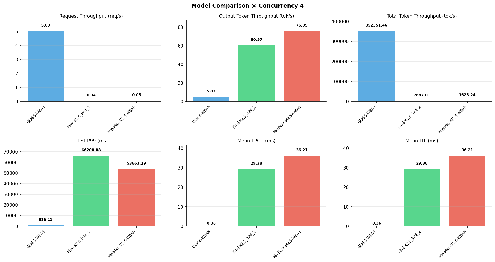

# 多模型性能对比报告

**测试日期：** 2026-05-14

**芯片平台：** inspur_metax_c550

**测试套件：** test_04

**Run ID：** 01, 01, 01

**并发级别：** 4并发

**测试配置：** 300-i70000-o1500

---

## 🤖 芯片和模型配置信息

| 参数名称 | **MiniMax-M2.5-W8A8** | **GLM-5-W8A8** | **Kimi-K2.5_int4_2** |
|----------|----------|----------|----------|
| **max_position_embeddings** | 196608 | 202752 | 262144 |
| **model_name** | MiniMax-M2.5-W8A8 | GLM-5-W8A8 | Kimi-K2.5_int4_2 |
| **model_size** | 215G | 712G | 496G |
| **python_version** | 3.10.10 | 3.10.10 | 3.10.10 |
| **quantization_config** | int8 | int8 | int4 |
| **sglang_version** | 0.5.9+maca3.5.3.204 | 0.5.9+maca3.5.3.204 | 0.5.9+maca3.5.3.204 |
| **temperature** | N/A | N/A | N/A |
| **top_k** | 40 | N/A | N/A |
| **top_p** | 0.95 | N/A | N/A |
| **transformers_version** | 4.57.6 | 5.1.0 | 4.56.2 |

---

## ⚙️ SGLang 启动配置信息

| 参数名称 | **MiniMax-M2.5-W8A8** | **GLM-5-W8A8** | **Kimi-K2.5_int4_2** |
|----------|----------|----------|----------|
| **Attention Backend** | flashinfer | flashinfer | flashinfer |
| **Chunked Prefill Size** | N/A | 8192 | 8192 |
| **Context Length** | 196608 | 202752 | 262144 |
| **Cuda Graph Max Bs** | N/A | 64 | 64 |
| **Disable Radix Cache** | True | True | True |
| **Dp Size** | N/A | 4 | N/A |
| **Max Queued Requests** | None | None | None |
| **Max Running Requests** | 64 | 64 | 64 |
| **Mem Fraction Static** | 0.9 | 0.8 | 0.8 |
| **Model Name** | MiniMax-M2.5-W8A8 | GLM-5-W8A8 | Kimi-K2.5_int4_2 |
| **Nnodes** | 1 | 2 | 2 |
| **Pp Size** | 1 | 1 | 1 |
| **Quantization** | w8a8_int8 | w8a8_int8 | w4a8_int8 |
| **Reasoning Parser** | minimax-append-think | glm45 | kimi_k2 |
| **Tool Call Parser** | minimax-m2 | glm47 | kimi_k2 |
| **Tp Size** | 8 | 16 | 16 |

---

## 📊 模型列表

| 模型名称 | Run ID | 状态 |
|----------|--------|------|
| MiniMax-M2.5-W8A8 | 01 | [OK] |
| GLM-5-W8A8 | 01 | [OK] |
| Kimi-K2.5_int4_2 | 01 | [OK] |

---

## 📊 测试概览

| 项目            | 配置                                     | 备注  |
|---------------|----------------------------------------|-----|
| **数据集**       | random                                 |     |
| **并发数**       | 1, 2, 4, 8, 16, 32, 64, 80, 128    |     |
| **总请求数**      | 300                                    |     |
| **输入输出长度** | (70000, 1500) |     |
| **测试套件**     | test_04                           |     |
| **被测芯片**      | inspur_metax_c550 |     |
| **SGLang版本**   | 0.5.9                           |     |

---

## 📈 服务基准结果对比

| 指标 | MiniMax-M2.5-W8A8 (基准) | GLM-5-W8A8 | 差异 | % | Kimi-K2.5_int4_2 | 差异 | % |
|------|--------------- | --------- | ------- | ------- | --------- | ------- | -------|
| 成功请求数 | 300 | 300 | 0.00 | 0.0% | 300 | 0.00 | 0.0% |
| 测试持续时间 (s) | 5916.84 | 59.60 | -5857.24 | -99.0% | 7429.84 | +1513.00 | +25.6% |
| 总输入 tokens | 21000000 | 21000000 | 0.00 | 0.0% | 21000000 | 0.00 | 0.0% |
| 总生成 tokens | 450000 | 300 | -449700.00 | -99.9% | 450000 | 0.00 | 0.0% |
| **请求吞吐量 (req/s)** | 0.05 | 5.03 | +4.98 | +9960.0% | 0.04 | -0.01 | -20.0% |
| **输出 token 吞吐量 (tok/s)** | 76.05 | 5.03 | -71.02 | -93.4% | 60.57 | -15.48 | -20.4% |
| **总 token 吞吐量 (tok/s)** | 3625.24 | 352351.46 | +348726.22 | +9619.4% | 2887.01 | -738.23 | -20.4% |

---

## ⏱️ 首 Token 延迟 (TTFT) 对比

| 指标 | MiniMax-M2.5-W8A8 (基准) | GLM-5-W8A8 | 差异 | % | Kimi-K2.5_int4_2 | 差异 | % |
|------|--------------- | --------- | ------- | ------- | --------- | ------- | -------|
| 平均 TTFT (ms) | 24615.55 | 790.08 | -23825.47 | -96.8% | 54715.01 | +30099.46 | +122.3% |
| 中位 TTFT (ms) | 25064.39 | 884.00 | -24180.39 | -96.5% | 57637.65 | +32573.26 | +130.0% |
| P99 TTFT (ms) | 53663.29 | 916.12 | -52747.17 | -98.3% | 66208.88 | +12545.59 | +23.4% |

---

## ⚡ 每 Token 生成时间 (TPOT) 对比

| 指标 | MiniMax-M2.5-W8A8 (基准) | GLM-5-W8A8 | 差异 | % | Kimi-K2.5_int4_2 | 差异 | % |
|------|--------------- | --------- | ------- | ------- | --------- | ------- | -------|
| 平均 TPOT (ms) | 36.21 | 0.00 | -36.21 | -100.0% | 29.38 | -6.83 | -18.9% |
| 中位 TPOT (ms) | 36.57 | 0.00 | -36.57 | -100.0% | 28.10 | -8.47 | -23.2% |
| P99 TPOT (ms) | 57.78 | 0.00 | -57.78 | -100.0% | 48.26 | -9.52 | -16.5% |

---

## 🔄 Token 间延迟 (ITL) 对比

| 指标 | MiniMax-M2.5-W8A8 (基准) | GLM-5-W8A8 | 差异 | % | Kimi-K2.5_int4_2 | 差异 | % |
|------|--------------- | --------- | ------- | ------- | --------- | ------- | -------|
| 平均 ITL (ms) | 36.21 | 0.00 | -36.21 | -100.0% | 29.38 | -6.83 | -18.9% |
| 中位 ITL (ms) | 26.43 | 0.00 | -26.43 | -100.0% | 18.94 | -7.49 | -28.3% |
| P95 ITL (ms) | 28.58 | 0.00 | -28.58 | -100.0% | 38.00 | +9.42 | +33.0% |
| P99 ITL (ms) | 31.14 | 0.00 | -31.14 | -100.0% | 46.70 | +15.56 | +50.0% |

---

## ⏱️ 端到端延迟 (E2E) 对比

| 指标 | MiniMax-M2.5-W8A8 (基准) | GLM-5-W8A8 | 差异 | % | Kimi-K2.5_int4_2 | 差异 | % |
|------|--------------- | --------- | ------- | ------- | --------- | ------- | -------|
| 平均 E2E 延迟 (ms) | 78888.00 | 790.09 | -78097.91 | -99.0% | 98755.04 | +19867.04 | +25.2% |
| 中位 E2E 延迟 (ms) | 78106.08 | 884.00 | -77222.08 | -98.9% | 99434.98 | +21328.90 | +27.3% |
| P90 E2E 延迟 (ms) | 78252.23 | 898.47 | -77353.76 | -98.9% | 113029.22 | +34776.99 | +44.4% |
| P99 E2E 延迟 (ms) | 106390.46 | 916.13 | -105474.33 | -99.1% | 130416.24 | +24025.78 | +22.6% |

---

## 📊 模型性能对比

---

## 📝 分析小结

- **请求吞吐量**: GLM-5-W8A8 最高，达 5.03 req/s
- **总token吞吐量**: GLM-5-W8A8 最高，达 352351 tok/s
- **TTFT P99**: GLM-5-W8A8 最优，为 916.12ms
- **TPOT P99**: GLM-5-W8A8 最优，为 0.00ms

---

*报告生成时间: 2026-05-14*

