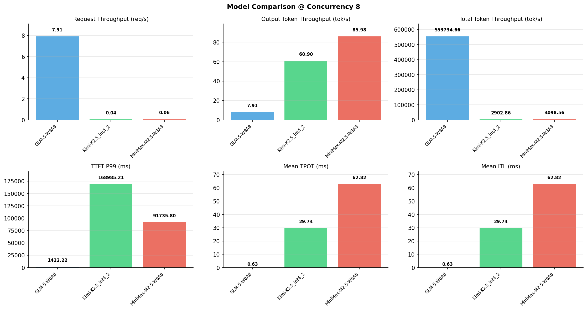

# 多模型性能对比报告

**测试日期：** 2026-05-14

**芯片平台：** inspur_metax_c550

**测试套件：** test_04

**Run ID：** 01, 01, 01

**并发级别：** 8并发

**测试配置：** 300-i70000-o1500

---

## 🤖 芯片和模型配置信息

| 参数名称 | **MiniMax-M2.5-W8A8** | **GLM-5-W8A8** | **Kimi-K2.5_int4_2** |
|----------|----------|----------|----------|
| **max_position_embeddings** | 196608 | 202752 | 262144 |
| **model_name** | MiniMax-M2.5-W8A8 | GLM-5-W8A8 | Kimi-K2.5_int4_2 |
| **model_size** | 215G | 712G | 496G |
| **python_version** | 3.10.10 | 3.10.10 | 3.10.10 |
| **quantization_config** | int8 | int8 | int4 |
| **sglang_version** | 0.5.9+maca3.5.3.204 | 0.5.9+maca3.5.3.204 | 0.5.9+maca3.5.3.204 |
| **temperature** | N/A | N/A | N/A |
| **top_k** | 40 | N/A | N/A |
| **top_p** | 0.95 | N/A | N/A |
| **transformers_version** | 4.57.6 | 5.1.0 | 4.56.2 |

---

## ⚙️ SGLang 启动配置信息

| 参数名称 | **MiniMax-M2.5-W8A8** | **GLM-5-W8A8** | **Kimi-K2.5_int4_2** |
|----------|----------|----------|----------|
| **Attention Backend** | flashinfer | flashinfer | flashinfer |
| **Chunked Prefill Size** | N/A | 8192 | 8192 |
| **Context Length** | 196608 | 202752 | 262144 |
| **Cuda Graph Max Bs** | N/A | 64 | 64 |
| **Disable Radix Cache** | True | True | True |
| **Dp Size** | N/A | 4 | N/A |
| **Max Queued Requests** | None | None | None |
| **Max Running Requests** | 64 | 64 | 64 |
| **Mem Fraction Static** | 0.9 | 0.8 | 0.8 |
| **Model Name** | MiniMax-M2.5-W8A8 | GLM-5-W8A8 | Kimi-K2.5_int4_2 |
| **Nnodes** | 1 | 2 | 2 |
| **Pp Size** | 1 | 1 | 1 |
| **Quantization** | w8a8_int8 | w8a8_int8 | w4a8_int8 |
| **Reasoning Parser** | minimax-append-think | glm45 | kimi_k2 |
| **Tool Call Parser** | minimax-m2 | glm47 | kimi_k2 |
| **Tp Size** | 8 | 16 | 16 |

---

## 📊 模型列表

| 模型名称 | Run ID | 状态 |
|----------|--------|------|
| MiniMax-M2.5-W8A8 | 01 | [OK] |
| GLM-5-W8A8 | 01 | [OK] |
| Kimi-K2.5_int4_2 | 01 | [OK] |

---

## 📊 测试概览

| 项目            | 配置                                     | 备注  |
|---------------|----------------------------------------|-----|
| **数据集**       | random                                 |     |
| **并发数**       | 1, 2, 4, 8, 16, 32, 64, 80, 128    |     |
| **总请求数**      | 300                                    |     |
| **输入输出长度** | (70000, 1500) |     |
| **测试套件**     | test_04                           |     |
| **被测芯片**      | inspur_metax_c550 |     |
| **SGLang版本**   | 0.5.9                           |     |

---

## 📈 服务基准结果对比

| 指标 | MiniMax-M2.5-W8A8 (基准) | GLM-5-W8A8 | 差异 | % | Kimi-K2.5_int4_2 | 差异 | % |
|------|--------------- | --------- | ------- | ------- | --------- | ------- | -------|
| 成功请求数 | 300 | 300 | 0.00 | 0.0% | 300 | 0.00 | 0.0% |
| 测试持续时间 (s) | 5233.55 | 37.92 | -5195.63 | -99.3% | 7389.27 | +2155.72 | +41.2% |
| 总输入 tokens | 21000000 | 21000000 | 0.00 | 0.0% | 21000000 | 0.00 | 0.0% |
| 总生成 tokens | 450000 | 300 | -449700.00 | -99.9% | 450000 | 0.00 | 0.0% |
| **请求吞吐量 (req/s)** | 0.06 | 7.91 | +7.85 | +13083.3% | 0.04 | -0.02 | -33.3% |
| **输出 token 吞吐量 (tok/s)** | 85.98 | 7.91 | -78.07 | -90.8% | 60.90 | -25.08 | -29.2% |
| **总 token 吞吐量 (tok/s)** | 4098.56 | 553734.66 | +549636.10 | +13410.5% | 2902.86 | -1195.70 | -29.2% |

---

## ⏱️ 首 Token 延迟 (TTFT) 对比

| 指标 | MiniMax-M2.5-W8A8 (基准) | GLM-5-W8A8 | 差异 | % | Kimi-K2.5_int4_2 | 差异 | % |
|------|--------------- | --------- | ------- | ------- | --------- | ------- | -------|
| 平均 TTFT (ms) | 44338.87 | 998.33 | -43340.54 | -97.7% | 150585.56 | +106246.69 | +239.6% |
| 中位 TTFT (ms) | 47812.06 | 996.36 | -46815.70 | -97.9% | 155333.08 | +107521.02 | +224.9% |
| P99 TTFT (ms) | 91735.80 | 1422.22 | -90313.58 | -98.4% | 168985.21 | +77249.41 | +84.2% |

---

## ⚡ 每 Token 生成时间 (TPOT) 对比

| 指标 | MiniMax-M2.5-W8A8 (基准) | GLM-5-W8A8 | 差异 | % | Kimi-K2.5_int4_2 | 差异 | % |
|------|--------------- | --------- | ------- | ------- | --------- | ------- | -------|
| 平均 TPOT (ms) | 62.82 | 0.00 | -62.82 | -100.0% | 29.74 | -33.08 | -52.7% |
| 中位 TPOT (ms) | 60.84 | 0.00 | -60.84 | -100.0% | 28.38 | -32.46 | -53.4% |
| P99 TPOT (ms) | 90.68 | 0.00 | -90.68 | -100.0% | 48.93 | -41.75 | -46.0% |

---

## 🔄 Token 间延迟 (ITL) 对比

| 指标 | MiniMax-M2.5-W8A8 (基准) | GLM-5-W8A8 | 差异 | % | Kimi-K2.5_int4_2 | 差异 | % |
|------|--------------- | --------- | ------- | ------- | --------- | ------- | -------|
| 平均 ITL (ms) | 62.82 | 0.00 | -62.82 | -100.0% | 29.74 | -33.08 | -52.7% |
| 中位 ITL (ms) | 40.52 | 0.00 | -40.52 | -100.0% | 18.95 | -21.57 | -53.2% |
| P95 ITL (ms) | 43.06 | 0.00 | -43.06 | -100.0% | 38.07 | -4.99 | -11.6% |
| P99 ITL (ms) | 43.86 | 0.00 | -43.86 | -100.0% | 46.78 | +2.92 | +6.7% |

---

## ⏱️ 端到端延迟 (E2E) 对比

| 指标 | MiniMax-M2.5-W8A8 (基准) | GLM-5-W8A8 | 差异 | % | Kimi-K2.5_int4_2 | 差异 | % |
|------|--------------- | --------- | ------- | ------- | --------- | ------- | -------|
| 平均 E2E 延迟 (ms) | 138510.87 | 998.34 | -137512.53 | -99.3% | 195170.98 | +56660.11 | +40.9% |
| 中位 E2E 延迟 (ms) | 137678.98 | 996.37 | -136682.61 | -99.3% | 197754.49 | +60075.51 | +43.6% |
| P90 E2E 延迟 (ms) | 140438.10 | 1229.48 | -139208.62 | -99.1% | 213205.98 | +72767.88 | +51.8% |
| P99 E2E 延迟 (ms) | 165851.60 | 1422.23 | -164429.37 | -99.1% | 230348.21 | +64496.61 | +38.9% |

---

## 📊 模型性能对比

---

## 📝 分析小结

- **请求吞吐量**: GLM-5-W8A8 最高，达 7.91 req/s
- **总token吞吐量**: GLM-5-W8A8 最高，达 553735 tok/s
- **TTFT P99**: GLM-5-W8A8 最优，为 1422.22ms
- **TPOT P99**: GLM-5-W8A8 最优，为 0.00ms

---

*报告生成时间: 2026-05-14*

