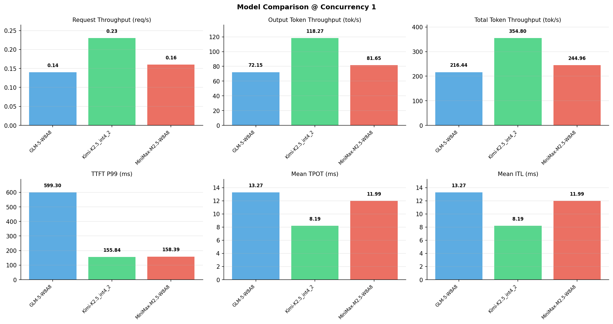

# 多模型性能对比报告

**测试日期：** 2026-05-14

**芯片平台：** inspur_metax_c550

**测试套件：** test_05

**Run ID：** 01, 01, 01

**并发级别：** 1并发

**测试配置：** 1000-i1024-o512

---

## 🤖 芯片和模型配置信息

| 参数名称 | **MiniMax-M2.5-W8A8** | **GLM-5-W8A8** | **Kimi-K2.5_int4_2** |
|----------|----------|----------|----------|
| **max_position_embeddings** | 196608 | 202752 | 262144 |
| **model_name** | MiniMax-M2.5-W8A8 | GLM-5-W8A8 | Kimi-K2.5_int4_2 |
| **model_size** | 215G | 712G | 496G |
| **python_version** | 3.10.10 | 3.10.10 | 3.10.10 |
| **quantization_config** | int8 | int8 | int4 |
| **sglang_version** | 0.5.9+maca3.5.3.204 | 0.5.9+maca3.5.3.204 | 0.5.9+maca3.5.3.204 |
| **temperature** | N/A | N/A | N/A |
| **top_k** | 40 | N/A | N/A |
| **top_p** | 0.95 | N/A | N/A |
| **transformers_version** | 4.57.6 | 5.1.0 | 4.56.2 |

---

## ⚙️ SGLang 启动配置信息

| 参数名称 | **MiniMax-M2.5-W8A8** | **GLM-5-W8A8** | **Kimi-K2.5_int4_2** |
|----------|----------|----------|----------|
| **Attention Backend** | flashinfer | flashinfer | flashinfer |
| **Chunked Prefill Size** | N/A | 8192 | 8192 |
| **Context Length** | 196608 | 202752 | 262144 |
| **Cuda Graph Max Bs** | N/A | 64 | 64 |
| **Disable Radix Cache** | True | True | True |
| **Dp Size** | N/A | 4 | N/A |
| **Max Queued Requests** | None | None | None |
| **Max Running Requests** | 64 | 64 | 64 |
| **Mem Fraction Static** | 0.9 | 0.8 | 0.8 |
| **Model Name** | MiniMax-M2.5-W8A8 | GLM-5-W8A8 | Kimi-K2.5_int4_2 |
| **Nnodes** | 1 | 2 | 2 |
| **Pp Size** | 1 | 1 | 1 |
| **Quantization** | w8a8_int8 | w8a8_int8 | w4a8_int8 |
| **Reasoning Parser** | minimax-append-think | glm45 | kimi_k2 |
| **Tool Call Parser** | minimax-m2 | glm47 | kimi_k2 |
| **Tp Size** | 8 | 16 | 16 |

---

## 📊 模型列表

| 模型名称 | Run ID | 状态 |
|----------|--------|------|
| MiniMax-M2.5-W8A8 | 01 | [OK] |
| GLM-5-W8A8 | 01 | [OK] |
| Kimi-K2.5_int4_2 | 01 | [OK] |

---

## 📊 测试概览

| 项目            | 配置                                     | 备注  |
|---------------|----------------------------------------|-----|
| **数据集**       | random                                 |     |
| **并发数**       | 1, 4, 8, 16, 32, 64, 128    |     |
| **总请求数**      | 1000                                    |     |
| **输入输出长度** | (128, 128), (512, 256), (1024, 512), (2048, 1024), (4096, 2048), (8192, 1024) |     |
| **测试套件**     | test_05                           |     |
| **被测芯片**      | inspur_metax_c550 |     |
| **SGLang版本**   | 0.5.9                           |     |

---

## 📈 服务基准结果对比

| 指标 | MiniMax-M2.5-W8A8 (基准) | GLM-5-W8A8 | 差异 | % | Kimi-K2.5_int4_2 | 差异 | % |
|------|--------------- | --------- | ------- | ------- | --------- | ------- | -------|
| 成功请求数 | 1000 | 1000 | 0.00 | 0.0% | 1000 | 0.00 | 0.0% |
| 测试持续时间 (s) | 6270.34 | 7096.80 | +826.46 | +13.2% | 4329.25 | -1941.09 | -31.0% |
| 总输入 tokens | 1024000 | 1024000 | 0.00 | 0.0% | 1024000 | 0.00 | 0.0% |
| 总生成 tokens | 512000 | 512000 | 0.00 | 0.0% | 512000 | 0.00 | 0.0% |
| **请求吞吐量 (req/s)** | 0.16 | 0.14 | -0.02 | -12.5% | 0.23 | +0.07 | +43.8% |
| **输出 token 吞吐量 (tok/s)** | 81.65 | 72.15 | -9.50 | -11.6% | 118.27 | +36.62 | +44.8% |
| **总 token 吞吐量 (tok/s)** | 244.96 | 216.44 | -28.52 | -11.6% | 354.80 | +109.84 | +44.8% |

---

## ⏱️ 首 Token 延迟 (TTFT) 对比

| 指标 | MiniMax-M2.5-W8A8 (基准) | GLM-5-W8A8 | 差异 | % | Kimi-K2.5_int4_2 | 差异 | % |
|------|--------------- | --------- | ------- | ------- | --------- | ------- | -------|
| 平均 TTFT (ms) | 143.03 | 314.78 | +171.75 | +120.1% | 141.83 | -1.20 | -0.8% |
| 中位 TTFT (ms) | 144.53 | 303.95 | +159.42 | +110.3% | 141.72 | -2.81 | -1.9% |
| P99 TTFT (ms) | 158.39 | 599.30 | +440.91 | +278.4% | 155.84 | -2.55 | -1.6% |

---

## ⚡ 每 Token 生成时间 (TPOT) 对比

| 指标 | MiniMax-M2.5-W8A8 (基准) | GLM-5-W8A8 | 差异 | % | Kimi-K2.5_int4_2 | 差异 | % |
|------|--------------- | --------- | ------- | ------- | --------- | ------- | -------|
| 平均 TPOT (ms) | 11.99 | 13.27 | +1.28 | +10.7% | 8.19 | -3.80 | -31.7% |
| 中位 TPOT (ms) | 11.98 | 12.67 | +0.69 | +5.8% | 7.94 | -4.04 | -33.7% |
| P99 TPOT (ms) | 12.03 | 19.57 | +7.54 | +62.7% | 11.70 | -0.33 | -2.7% |

---

## 🔄 Token 间延迟 (ITL) 对比

| 指标 | MiniMax-M2.5-W8A8 (基准) | GLM-5-W8A8 | 差异 | % | Kimi-K2.5_int4_2 | 差异 | % |
|------|--------------- | --------- | ------- | ------- | --------- | ------- | -------|
| 平均 ITL (ms) | 11.99 | 13.27 | +1.28 | +10.7% | 8.19 | -3.80 | -31.7% |
| 中位 ITL (ms) | 11.98 | 12.51 | +0.53 | +4.4% | 6.86 | -5.12 | -42.7% |
| P95 ITL (ms) | 12.02 | 16.67 | +4.65 | +38.7% | 20.33 | +8.31 | +69.1% |
| P99 ITL (ms) | 17.67 | 25.19 | +7.52 | +42.6% | 20.94 | +3.27 | +18.5% |

---

## ⏱️ 端到端延迟 (E2E) 对比

| 指标 | MiniMax-M2.5-W8A8 (基准) | GLM-5-W8A8 | 差异 | % | Kimi-K2.5_int4_2 | 差异 | % |
|------|--------------- | --------- | ------- | ------- | --------- | ------- | -------|
| 平均 E2E 延迟 (ms) | 6269.82 | 7096.32 | +826.50 | +13.2% | 4328.83 | -1940.99 | -31.0% |
| 中位 E2E 延迟 (ms) | 6269.74 | 6790.83 | +521.09 | +8.3% | 4193.81 | -2075.93 | -33.1% |
| P90 E2E 延迟 (ms) | 6283.40 | 8155.77 | +1872.37 | +29.8% | 5034.54 | -1248.86 | -19.9% |
| P99 E2E 延迟 (ms) | 6297.77 | 10354.78 | +4057.01 | +64.4% | 6112.44 | -185.33 | -2.9% |

---

## 📊 模型性能对比

---

## 📝 分析小结

- **请求吞吐量**: Kimi-K2.5_int4_2 最高，达 0.23 req/s
- **总token吞吐量**: Kimi-K2.5_int4_2 最高，达 355 tok/s
- **TTFT P99**: Kimi-K2.5_int4_2 最优，为 155.84ms
- **TPOT P99**: Kimi-K2.5_int4_2 最优，为 11.70ms

---

*报告生成时间: 2026-05-14*

