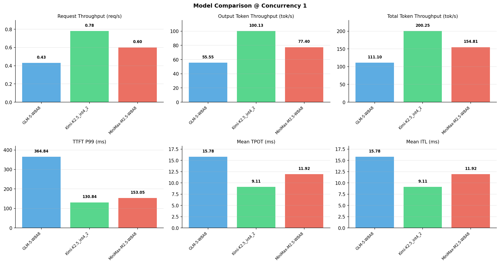

# 多模型性能对比报告

**测试日期：** 2026-05-14

**芯片平台：** inspur_metax_c550

**测试套件：** test_05

**Run ID：** 01, 01, 01

**并发级别：** 1并发

**测试配置：** 1000-i128-o128

---

## 🤖 芯片和模型配置信息

| 参数名称 | **MiniMax-M2.5-W8A8** | **GLM-5-W8A8** | **Kimi-K2.5_int4_2** |
|----------|----------|----------|----------|
| **max_position_embeddings** | 196608 | 202752 | 262144 |
| **model_name** | MiniMax-M2.5-W8A8 | GLM-5-W8A8 | Kimi-K2.5_int4_2 |
| **model_size** | 215G | 712G | 496G |
| **python_version** | 3.10.10 | 3.10.10 | 3.10.10 |
| **quantization_config** | int8 | int8 | int4 |
| **sglang_version** | 0.5.9+maca3.5.3.204 | 0.5.9+maca3.5.3.204 | 0.5.9+maca3.5.3.204 |
| **temperature** | N/A | N/A | N/A |
| **top_k** | 40 | N/A | N/A |
| **top_p** | 0.95 | N/A | N/A |
| **transformers_version** | 4.57.6 | 5.1.0 | 4.56.2 |

---

## ⚙️ SGLang 启动配置信息

| 参数名称 | **MiniMax-M2.5-W8A8** | **GLM-5-W8A8** | **Kimi-K2.5_int4_2** |
|----------|----------|----------|----------|
| **Attention Backend** | flashinfer | flashinfer | flashinfer |
| **Chunked Prefill Size** | N/A | 8192 | 8192 |
| **Context Length** | 196608 | 202752 | 262144 |
| **Cuda Graph Max Bs** | N/A | 64 | 64 |
| **Disable Radix Cache** | True | True | True |
| **Dp Size** | N/A | 4 | N/A |
| **Max Queued Requests** | None | None | None |
| **Max Running Requests** | 64 | 64 | 64 |
| **Mem Fraction Static** | 0.9 | 0.8 | 0.8 |
| **Model Name** | MiniMax-M2.5-W8A8 | GLM-5-W8A8 | Kimi-K2.5_int4_2 |
| **Nnodes** | 1 | 2 | 2 |
| **Pp Size** | 1 | 1 | 1 |
| **Quantization** | w8a8_int8 | w8a8_int8 | w4a8_int8 |
| **Reasoning Parser** | minimax-append-think | glm45 | kimi_k2 |
| **Tool Call Parser** | minimax-m2 | glm47 | kimi_k2 |
| **Tp Size** | 8 | 16 | 16 |

---

## 📊 模型列表

| 模型名称 | Run ID | 状态 |
|----------|--------|------|
| MiniMax-M2.5-W8A8 | 01 | [OK] |
| GLM-5-W8A8 | 01 | [OK] |
| Kimi-K2.5_int4_2 | 01 | [OK] |

---

## 📊 测试概览

| 项目            | 配置                                     | 备注  |
|---------------|----------------------------------------|-----|
| **数据集**       | random                                 |     |
| **并发数**       | 1, 4, 8, 16, 32, 64, 128    |     |
| **总请求数**      | 1000                                    |     |
| **输入输出长度** | (128, 128), (512, 256), (1024, 512), (2048, 1024), (4096, 2048), (8192, 1024) |     |
| **测试套件**     | test_05                           |     |
| **被测芯片**      | inspur_metax_c550 |     |
| **SGLang版本**   | 0.5.9                           |     |

---

## 📈 服务基准结果对比

| 指标 | MiniMax-M2.5-W8A8 (基准) | GLM-5-W8A8 | 差异 | % | Kimi-K2.5_int4_2 | 差异 | % |
|------|--------------- | --------- | ------- | ------- | --------- | ------- | -------|
| 成功请求数 | 1000 | 1000 | 0.00 | 0.0% | 1000 | 0.00 | 0.0% |
| 测试持续时间 (s) | 1653.66 | 2304.21 | +650.55 | +39.3% | 1278.39 | -375.27 | -22.7% |
| 总输入 tokens | 128000 | 128000 | 0.00 | 0.0% | 128000 | 0.00 | 0.0% |
| 总生成 tokens | 128000 | 128000 | 0.00 | 0.0% | 128000 | 0.00 | 0.0% |
| **请求吞吐量 (req/s)** | 0.60 | 0.43 | -0.17 | -28.3% | 0.78 | +0.18 | +30.0% |
| **输出 token 吞吐量 (tok/s)** | 77.40 | 55.55 | -21.85 | -28.2% | 100.13 | +22.73 | +29.4% |
| **总 token 吞吐量 (tok/s)** | 154.81 | 111.10 | -43.71 | -28.2% | 200.25 | +45.44 | +29.4% |

---

## ⏱️ 首 Token 延迟 (TTFT) 对比

| 指标 | MiniMax-M2.5-W8A8 (基准) | GLM-5-W8A8 | 差异 | % | Kimi-K2.5_int4_2 | 差异 | % |
|------|--------------- | --------- | ------- | ------- | --------- | ------- | -------|
| 平均 TTFT (ms) | 139.21 | 299.72 | +160.51 | +115.3% | 121.04 | -18.17 | -13.1% |
| 中位 TTFT (ms) | 140.98 | 296.60 | +155.62 | +110.4% | 120.34 | -20.64 | -14.6% |
| P99 TTFT (ms) | 153.05 | 364.84 | +211.79 | +138.4% | 130.84 | -22.21 | -14.5% |

---

## ⚡ 每 Token 生成时间 (TPOT) 对比

| 指标 | MiniMax-M2.5-W8A8 (基准) | GLM-5-W8A8 | 差异 | % | Kimi-K2.5_int4_2 | 差异 | % |
|------|--------------- | --------- | ------- | ------- | --------- | ------- | -------|
| 平均 TPOT (ms) | 11.92 | 15.78 | +3.86 | +32.4% | 9.11 | -2.81 | -23.6% |
| 中位 TPOT (ms) | 11.92 | 15.58 | +3.66 | +30.7% | 9.03 | -2.89 | -24.2% |
| P99 TPOT (ms) | 11.97 | 22.97 | +11.00 | +91.9% | 12.66 | +0.69 | +5.8% |

---

## 🔄 Token 间延迟 (ITL) 对比

| 指标 | MiniMax-M2.5-W8A8 (基准) | GLM-5-W8A8 | 差异 | % | Kimi-K2.5_int4_2 | 差异 | % |
|------|--------------- | --------- | ------- | ------- | --------- | ------- | -------|
| 平均 ITL (ms) | 11.92 | 15.78 | +3.86 | +32.4% | 9.11 | -2.81 | -23.6% |
| 中位 ITL (ms) | 11.91 | 12.45 | +0.54 | +4.5% | 6.67 | -5.24 | -44.0% |
| P95 ITL (ms) | 11.97 | 25.00 | +13.03 | +108.9% | 19.87 | +7.90 | +66.0% |
| P99 ITL (ms) | 15.08 | 49.68 | +34.60 | +229.4% | 20.36 | +5.28 | +35.0% |

---

## ⏱️ 端到端延迟 (E2E) 对比

| 指标 | MiniMax-M2.5-W8A8 (基准) | GLM-5-W8A8 | 差异 | % | Kimi-K2.5_int4_2 | 差异 | % |
|------|--------------- | --------- | ------- | ------- | --------- | ------- | -------|
| 平均 E2E 延迟 (ms) | 1653.19 | 2303.79 | +650.60 | +39.4% | 1278.05 | -375.14 | -22.7% |
| 中位 E2E 延迟 (ms) | 1655.06 | 2275.29 | +620.23 | +37.5% | 1265.57 | -389.49 | -23.5% |
| P90 E2E 延迟 (ms) | 1661.82 | 2820.30 | +1158.48 | +69.7% | 1508.27 | -153.55 | -9.2% |
| P99 E2E 延迟 (ms) | 1668.17 | 3218.19 | +1550.02 | +92.9% | 1728.61 | +60.44 | +3.6% |

---

## 📊 模型性能对比

---

## 📝 分析小结

- **请求吞吐量**: Kimi-K2.5_int4_2 最高，达 0.78 req/s
- **总token吞吐量**: Kimi-K2.5_int4_2 最高，达 200 tok/s
- **TTFT P99**: Kimi-K2.5_int4_2 最优，为 130.84ms
- **TPOT P99**: MiniMax-M2.5-W8A8 最优，为 11.97ms

---

*报告生成时间: 2026-05-14*

