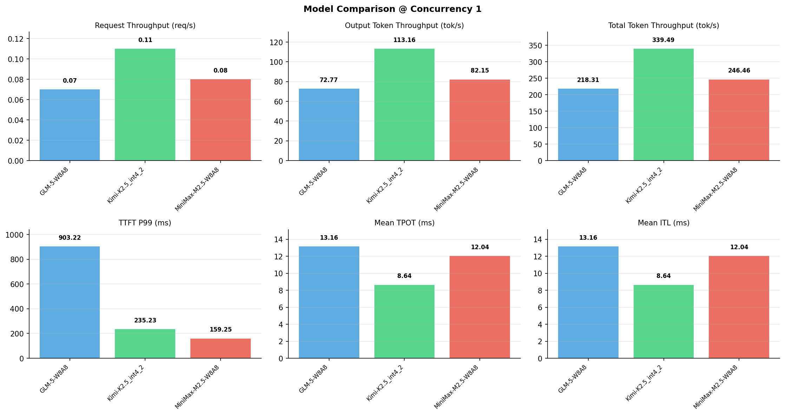

# 多模型性能对比报告

**测试日期：** 2026-05-14

**芯片平台：** inspur_metax_c550

**测试套件：** test_05

**Run ID：** 01, 01, 01

**并发级别：** 1并发

**测试配置：** 1000-i2048-o1024

---

## 🤖 芯片和模型配置信息

| 参数名称 | **MiniMax-M2.5-W8A8** | **GLM-5-W8A8** | **Kimi-K2.5_int4_2** |
|----------|----------|----------|----------|
| **max_position_embeddings** | 196608 | 202752 | 262144 |
| **model_name** | MiniMax-M2.5-W8A8 | GLM-5-W8A8 | Kimi-K2.5_int4_2 |
| **model_size** | 215G | 712G | 496G |
| **python_version** | 3.10.10 | 3.10.10 | 3.10.10 |
| **quantization_config** | int8 | int8 | int4 |
| **sglang_version** | 0.5.9+maca3.5.3.204 | 0.5.9+maca3.5.3.204 | 0.5.9+maca3.5.3.204 |
| **temperature** | N/A | N/A | N/A |
| **top_k** | 40 | N/A | N/A |
| **top_p** | 0.95 | N/A | N/A |
| **transformers_version** | 4.57.6 | 5.1.0 | 4.56.2 |

---

## ⚙️ SGLang 启动配置信息

| 参数名称 | **MiniMax-M2.5-W8A8** | **GLM-5-W8A8** | **Kimi-K2.5_int4_2** |
|----------|----------|----------|----------|
| **Attention Backend** | flashinfer | flashinfer | flashinfer |
| **Chunked Prefill Size** | N/A | 8192 | 8192 |
| **Context Length** | 196608 | 202752 | 262144 |
| **Cuda Graph Max Bs** | N/A | 64 | 64 |
| **Disable Radix Cache** | True | True | True |
| **Dp Size** | N/A | 4 | N/A |
| **Max Queued Requests** | None | None | None |
| **Max Running Requests** | 64 | 64 | 64 |
| **Mem Fraction Static** | 0.9 | 0.8 | 0.8 |
| **Model Name** | MiniMax-M2.5-W8A8 | GLM-5-W8A8 | Kimi-K2.5_int4_2 |
| **Nnodes** | 1 | 2 | 2 |
| **Pp Size** | 1 | 1 | 1 |
| **Quantization** | w8a8_int8 | w8a8_int8 | w4a8_int8 |
| **Reasoning Parser** | minimax-append-think | glm45 | kimi_k2 |
| **Tool Call Parser** | minimax-m2 | glm47 | kimi_k2 |
| **Tp Size** | 8 | 16 | 16 |

---

## 📊 模型列表

| 模型名称 | Run ID | 状态 |
|----------|--------|------|
| MiniMax-M2.5-W8A8 | 01 | [OK] |
| GLM-5-W8A8 | 01 | [OK] |
| Kimi-K2.5_int4_2 | 01 | [OK] |

---

## 📊 测试概览

| 项目            | 配置                                     | 备注  |
|---------------|----------------------------------------|-----|
| **数据集**       | random                                 |     |
| **并发数**       | 1, 4, 8, 16, 32, 64, 128    |     |
| **总请求数**      | 1000                                    |     |
| **输入输出长度** | (128, 128), (512, 256), (1024, 512), (2048, 1024), (4096, 2048), (8192, 1024) |     |
| **测试套件**     | test_05                           |     |
| **被测芯片**      | inspur_metax_c550 |     |
| **SGLang版本**   | 0.5.9                           |     |

---

## 📈 服务基准结果对比

| 指标 | MiniMax-M2.5-W8A8 (基准) | GLM-5-W8A8 | 差异 | % | Kimi-K2.5_int4_2 | 差异 | % |
|------|--------------- | --------- | ------- | ------- | --------- | ------- | -------|
| 成功请求数 | 1000 | 1000 | 0.00 | 0.0% | 1000 | 0.00 | 0.0% |
| 测试持续时间 (s) | 12464.41 | 14071.92 | +1607.51 | +12.9% | 9048.87 | -3415.54 | -27.4% |
| 总输入 tokens | 2048000 | 2048000 | 0.00 | 0.0% | 2048000 | 0.00 | 0.0% |
| 总生成 tokens | 1024000 | 1024000 | 0.00 | 0.0% | 1024000 | 0.00 | 0.0% |
| **请求吞吐量 (req/s)** | 0.08 | 0.07 | -0.01 | -12.5% | 0.11 | +0.03 | +37.5% |
| **输出 token 吞吐量 (tok/s)** | 82.15 | 72.77 | -9.38 | -11.4% | 113.16 | +31.01 | +37.7% |
| **总 token 吞吐量 (tok/s)** | 246.46 | 218.31 | -28.15 | -11.4% | 339.49 | +93.03 | +37.7% |

---

## ⏱️ 首 Token 延迟 (TTFT) 对比

| 指标 | MiniMax-M2.5-W8A8 (基准) | GLM-5-W8A8 | 差异 | % | Kimi-K2.5_int4_2 | 差异 | % |
|------|--------------- | --------- | ------- | ------- | --------- | ------- | -------|
| 平均 TTFT (ms) | 141.97 | 613.02 | +471.05 | +331.8% | 210.37 | +68.40 | +48.2% |
| 中位 TTFT (ms) | 139.80 | 600.05 | +460.25 | +329.2% | 208.99 | +69.19 | +49.5% |
| P99 TTFT (ms) | 159.25 | 903.22 | +743.97 | +467.2% | 235.23 | +75.98 | +47.7% |

---

## ⚡ 每 Token 生成时间 (TPOT) 对比

| 指标 | MiniMax-M2.5-W8A8 (基准) | GLM-5-W8A8 | 差异 | % | Kimi-K2.5_int4_2 | 差异 | % |
|------|--------------- | --------- | ------- | ------- | --------- | ------- | -------|
| 平均 TPOT (ms) | 12.04 | 13.16 | +1.12 | +9.3% | 8.64 | -3.40 | -28.2% |
| 中位 TPOT (ms) | 12.04 | 12.77 | +0.73 | +6.1% | 8.48 | -3.56 | -29.6% |
| P99 TPOT (ms) | 12.08 | 19.35 | +7.27 | +60.2% | 11.64 | -0.44 | -3.6% |

---

## 🔄 Token 间延迟 (ITL) 对比

| 指标 | MiniMax-M2.5-W8A8 (基准) | GLM-5-W8A8 | 差异 | % | Kimi-K2.5_int4_2 | 差异 | % |
|------|--------------- | --------- | ------- | ------- | --------- | ------- | -------|
| 平均 ITL (ms) | 12.04 | 13.16 | +1.12 | +9.3% | 8.64 | -3.40 | -28.2% |
| 中位 ITL (ms) | 12.04 | 12.67 | +0.63 | +5.2% | 7.06 | -4.98 | -41.4% |
| P95 ITL (ms) | 12.09 | 16.60 | +4.51 | +37.3% | 20.79 | +8.70 | +72.0% |
| P99 ITL (ms) | 16.73 | 25.27 | +8.54 | +51.0% | 21.45 | +4.72 | +28.2% |

---

## ⏱️ 端到端延迟 (E2E) 对比

| 指标 | MiniMax-M2.5-W8A8 (基准) | GLM-5-W8A8 | 差异 | % | Kimi-K2.5_int4_2 | 差异 | % |
|------|--------------- | --------- | ------- | ------- | --------- | ------- | -------|
| 平均 E2E 延迟 (ms) | 12463.90 | 14071.42 | +1607.52 | +12.9% | 9048.39 | -3415.51 | -27.4% |
| 中位 E2E 延迟 (ms) | 12462.96 | 13676.13 | +1213.17 | +9.7% | 8885.54 | -3577.42 | -28.7% |
| P90 E2E 延迟 (ms) | 12476.90 | 14678.11 | +2201.21 | +17.6% | 10199.12 | -2277.78 | -18.3% |
| P99 E2E 延迟 (ms) | 12500.49 | 20455.70 | +7955.21 | +63.6% | 12116.83 | -383.66 | -3.1% |

---

## 📊 模型性能对比

---

## 📝 分析小结

- **请求吞吐量**: Kimi-K2.5_int4_2 最高，达 0.11 req/s
- **总token吞吐量**: Kimi-K2.5_int4_2 最高，达 339 tok/s
- **TTFT P99**: MiniMax-M2.5-W8A8 最优，为 159.25ms
- **TPOT P99**: Kimi-K2.5_int4_2 最优，为 11.64ms

---

*报告生成时间: 2026-05-14*

