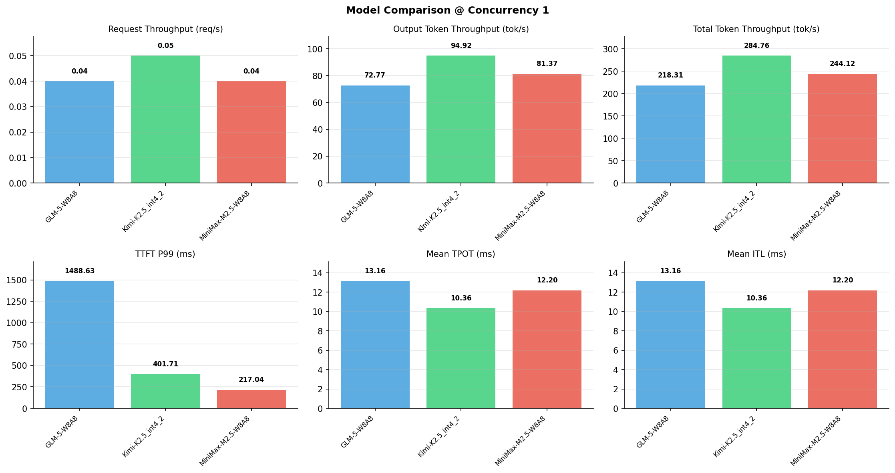

# 多模型性能对比报告

**测试日期：** 2026-05-14

**芯片平台：** inspur_metax_c550

**测试套件：** test_05

**Run ID：** 01, 01, 01

**并发级别：** 1并发

**测试配置：** 1000-i4096-o2048

---

## 🤖 芯片和模型配置信息

| 参数名称 | **MiniMax-M2.5-W8A8** | **GLM-5-W8A8** | **Kimi-K2.5_int4_2** |
|----------|----------|----------|----------|
| **max_position_embeddings** | 196608 | 202752 | 262144 |
| **model_name** | MiniMax-M2.5-W8A8 | GLM-5-W8A8 | Kimi-K2.5_int4_2 |
| **model_size** | 215G | 712G | 496G |
| **python_version** | 3.10.10 | 3.10.10 | 3.10.10 |
| **quantization_config** | int8 | int8 | int4 |
| **sglang_version** | 0.5.9+maca3.5.3.204 | 0.5.9+maca3.5.3.204 | 0.5.9+maca3.5.3.204 |
| **temperature** | N/A | N/A | N/A |
| **top_k** | 40 | N/A | N/A |
| **top_p** | 0.95 | N/A | N/A |
| **transformers_version** | 4.57.6 | 5.1.0 | 4.56.2 |

---

## ⚙️ SGLang 启动配置信息

| 参数名称 | **MiniMax-M2.5-W8A8** | **GLM-5-W8A8** | **Kimi-K2.5_int4_2** |
|----------|----------|----------|----------|
| **Attention Backend** | flashinfer | flashinfer | flashinfer |
| **Chunked Prefill Size** | N/A | 8192 | 8192 |
| **Context Length** | 196608 | 202752 | 262144 |
| **Cuda Graph Max Bs** | N/A | 64 | 64 |
| **Disable Radix Cache** | True | True | True |
| **Dp Size** | N/A | 4 | N/A |
| **Max Queued Requests** | None | None | None |
| **Max Running Requests** | 64 | 64 | 64 |
| **Mem Fraction Static** | 0.9 | 0.8 | 0.8 |
| **Model Name** | MiniMax-M2.5-W8A8 | GLM-5-W8A8 | Kimi-K2.5_int4_2 |
| **Nnodes** | 1 | 2 | 2 |
| **Pp Size** | 1 | 1 | 1 |
| **Quantization** | w8a8_int8 | w8a8_int8 | w4a8_int8 |
| **Reasoning Parser** | minimax-append-think | glm45 | kimi_k2 |
| **Tool Call Parser** | minimax-m2 | glm47 | kimi_k2 |
| **Tp Size** | 8 | 16 | 16 |

---

## 📊 模型列表

| 模型名称 | Run ID | 状态 |
|----------|--------|------|
| MiniMax-M2.5-W8A8 | 01 | [OK] |
| GLM-5-W8A8 | 01 | [OK] |
| Kimi-K2.5_int4_2 | 01 | [OK] |

---

## 📊 测试概览

| 项目            | 配置                                     | 备注  |
|---------------|----------------------------------------|-----|
| **数据集**       | random                                 |     |
| **并发数**       | 1, 4, 8, 16, 32, 64, 128    |     |
| **总请求数**      | 1000                                    |     |
| **输入输出长度** | (128, 128), (512, 256), (1024, 512), (2048, 1024), (4096, 2048), (8192, 1024) |     |
| **测试套件**     | test_05                           |     |
| **被测芯片**      | inspur_metax_c550 |     |
| **SGLang版本**   | 0.5.9                           |     |

---

## 📈 服务基准结果对比

| 指标 | MiniMax-M2.5-W8A8 (基准) | GLM-5-W8A8 | 差异 | % | Kimi-K2.5_int4_2 | 差异 | % |
|------|--------------- | --------- | ------- | ------- | --------- | ------- | -------|
| 成功请求数 | 1000 | 1000 | 0.00 | 0.0% | 1000 | 0.00 | 0.0% |
| 测试持续时间 (s) | 25167.85 | 28143.09 | +2975.24 | +11.8% | 21576.19 | -3591.66 | -14.3% |
| 总输入 tokens | 4096000 | 4096000 | 0.00 | 0.0% | 4096000 | 0.00 | 0.0% |
| 总生成 tokens | 2048000 | 2048000 | 0.00 | 0.0% | 2048000 | 0.00 | 0.0% |
| **请求吞吐量 (req/s)** | 0.04 | 0.04 | 0.00 | 0.0% | 0.05 | +0.01 | +25.0% |
| **输出 token 吞吐量 (tok/s)** | 81.37 | 72.77 | -8.60 | -10.6% | 94.92 | +13.55 | +16.7% |
| **总 token 吞吐量 (tok/s)** | 244.12 | 218.31 | -25.81 | -10.6% | 284.76 | +40.64 | +16.6% |

---

## ⏱️ 首 Token 延迟 (TTFT) 对比

| 指标 | MiniMax-M2.5-W8A8 (基准) | GLM-5-W8A8 | 差异 | % | Kimi-K2.5_int4_2 | 差异 | % |
|------|--------------- | --------- | ------- | ------- | --------- | ------- | -------|
| 平均 TTFT (ms) | 197.31 | 1212.01 | +1014.70 | +514.3% | 364.62 | +167.31 | +84.8% |
| 中位 TTFT (ms) | 195.03 | 1196.93 | +1001.90 | +513.7% | 362.94 | +167.91 | +86.1% |
| P99 TTFT (ms) | 217.04 | 1488.63 | +1271.59 | +585.9% | 401.71 | +184.67 | +85.1% |

---

## ⚡ 每 Token 生成时间 (TPOT) 对比

| 指标 | MiniMax-M2.5-W8A8 (基准) | GLM-5-W8A8 | 差异 | % | Kimi-K2.5_int4_2 | 差异 | % |
|------|--------------- | --------- | ------- | ------- | --------- | ------- | -------|
| 平均 TPOT (ms) | 12.20 | 13.16 | +0.96 | +7.9% | 10.36 | -1.84 | -15.1% |
| 中位 TPOT (ms) | 12.20 | 12.87 | +0.67 | +5.5% | 10.32 | -1.88 | -15.4% |
| P99 TPOT (ms) | 12.22 | 18.84 | +6.62 | +54.2% | 13.40 | +1.18 | +9.7% |

---

## 🔄 Token 间延迟 (ITL) 对比

| 指标 | MiniMax-M2.5-W8A8 (基准) | GLM-5-W8A8 | 差异 | % | Kimi-K2.5_int4_2 | 差异 | % |
|------|--------------- | --------- | ------- | ------- | --------- | ------- | -------|
| 平均 ITL (ms) | 12.20 | 13.16 | +0.96 | +7.9% | 10.36 | -1.84 | -15.1% |
| 中位 ITL (ms) | 12.19 | 12.79 | +0.60 | +4.9% | 10.72 | -1.47 | -12.1% |
| P95 ITL (ms) | 12.27 | 13.20 | +0.93 | +7.6% | 21.42 | +9.15 | +74.6% |
| P99 ITL (ms) | 16.26 | 25.26 | +9.00 | +55.4% | 22.05 | +5.79 | +35.6% |

---

## ⏱️ 端到端延迟 (E2E) 对比

| 指标 | MiniMax-M2.5-W8A8 (基准) | GLM-5-W8A8 | 差异 | % | Kimi-K2.5_int4_2 | 差异 | % |
|------|--------------- | --------- | ------- | ------- | --------- | ------- | -------|
| 平均 E2E 延迟 (ms) | 25167.30 | 28142.54 | +2975.24 | +11.8% | 21575.70 | -3591.60 | -14.3% |
| 中位 E2E 延迟 (ms) | 25161.12 | 27550.02 | +2388.90 | +9.5% | 21482.70 | -3678.42 | -14.6% |
| P90 E2E 延迟 (ms) | 25183.96 | 28518.36 | +3334.40 | +13.2% | 23380.75 | -1803.21 | -7.2% |
| P99 E2E 延迟 (ms) | 25223.10 | 39765.39 | +14542.29 | +57.7% | 27783.46 | +2560.36 | +10.2% |

---

## 📊 模型性能对比

---

## 📝 分析小结

- **请求吞吐量**: Kimi-K2.5_int4_2 最高，达 0.05 req/s
- **总token吞吐量**: Kimi-K2.5_int4_2 最高，达 285 tok/s
- **TTFT P99**: MiniMax-M2.5-W8A8 最优，为 217.04ms
- **TPOT P99**: MiniMax-M2.5-W8A8 最优，为 12.22ms

---

*报告生成时间: 2026-05-14*

