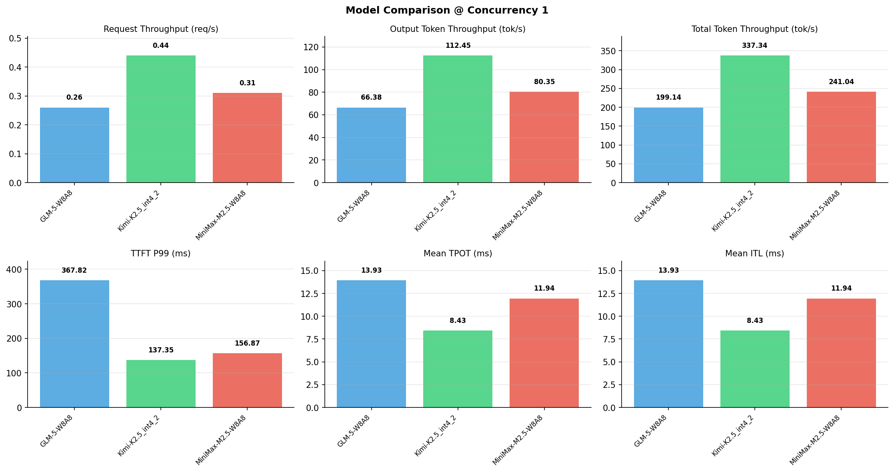

# 多模型性能对比报告

**测试日期：** 2026-05-14

**芯片平台：** inspur_metax_c550

**测试套件：** test_05

**Run ID：** 01, 01, 01

**并发级别：** 1并发

**测试配置：** 1000-i512-o256

---

## 🤖 芯片和模型配置信息

| 参数名称 | **MiniMax-M2.5-W8A8** | **GLM-5-W8A8** | **Kimi-K2.5_int4_2** |
|----------|----------|----------|----------|
| **max_position_embeddings** | 196608 | 202752 | 262144 |
| **model_name** | MiniMax-M2.5-W8A8 | GLM-5-W8A8 | Kimi-K2.5_int4_2 |
| **model_size** | 215G | 712G | 496G |
| **python_version** | 3.10.10 | 3.10.10 | 3.10.10 |
| **quantization_config** | int8 | int8 | int4 |
| **sglang_version** | 0.5.9+maca3.5.3.204 | 0.5.9+maca3.5.3.204 | 0.5.9+maca3.5.3.204 |
| **temperature** | N/A | N/A | N/A |
| **top_k** | 40 | N/A | N/A |
| **top_p** | 0.95 | N/A | N/A |
| **transformers_version** | 4.57.6 | 5.1.0 | 4.56.2 |

---

## ⚙️ SGLang 启动配置信息

| 参数名称 | **MiniMax-M2.5-W8A8** | **GLM-5-W8A8** | **Kimi-K2.5_int4_2** |
|----------|----------|----------|----------|
| **Attention Backend** | flashinfer | flashinfer | flashinfer |
| **Chunked Prefill Size** | N/A | 8192 | 8192 |
| **Context Length** | 196608 | 202752 | 262144 |
| **Cuda Graph Max Bs** | N/A | 64 | 64 |
| **Disable Radix Cache** | True | True | True |
| **Dp Size** | N/A | 4 | N/A |
| **Max Queued Requests** | None | None | None |
| **Max Running Requests** | 64 | 64 | 64 |
| **Mem Fraction Static** | 0.9 | 0.8 | 0.8 |
| **Model Name** | MiniMax-M2.5-W8A8 | GLM-5-W8A8 | Kimi-K2.5_int4_2 |
| **Nnodes** | 1 | 2 | 2 |
| **Pp Size** | 1 | 1 | 1 |
| **Quantization** | w8a8_int8 | w8a8_int8 | w4a8_int8 |
| **Reasoning Parser** | minimax-append-think | glm45 | kimi_k2 |
| **Tool Call Parser** | minimax-m2 | glm47 | kimi_k2 |
| **Tp Size** | 8 | 16 | 16 |

---

## 📊 模型列表

| 模型名称 | Run ID | 状态 |
|----------|--------|------|
| MiniMax-M2.5-W8A8 | 01 | [OK] |
| GLM-5-W8A8 | 01 | [OK] |
| Kimi-K2.5_int4_2 | 01 | [OK] |

---

## 📊 测试概览

| 项目            | 配置                                     | 备注  |
|---------------|----------------------------------------|-----|
| **数据集**       | random                                 |     |
| **并发数**       | 1, 4, 8, 16, 32, 64, 128    |     |
| **总请求数**      | 1000                                    |     |
| **输入输出长度** | (128, 128), (512, 256), (1024, 512), (2048, 1024), (4096, 2048), (8192, 1024) |     |
| **测试套件**     | test_05                           |     |
| **被测芯片**      | inspur_metax_c550 |     |
| **SGLang版本**   | 0.5.9                           |     |

---

## 📈 服务基准结果对比

| 指标 | MiniMax-M2.5-W8A8 (基准) | GLM-5-W8A8 | 差异 | % | Kimi-K2.5_int4_2 | 差异 | % |
|------|--------------- | --------- | ------- | ------- | --------- | ------- | -------|
| 成功请求数 | 1000 | 1000 | 0.00 | 0.0% | 1000 | 0.00 | 0.0% |
| 测试持续时间 (s) | 3186.16 | 3856.58 | +670.42 | +21.0% | 2276.62 | -909.54 | -28.5% |
| 总输入 tokens | 512000 | 512000 | 0.00 | 0.0% | 512000 | 0.00 | 0.0% |
| 总生成 tokens | 256000 | 256000 | 0.00 | 0.0% | 256000 | 0.00 | 0.0% |
| **请求吞吐量 (req/s)** | 0.31 | 0.26 | -0.05 | -16.1% | 0.44 | +0.13 | +41.9% |
| **输出 token 吞吐量 (tok/s)** | 80.35 | 66.38 | -13.97 | -17.4% | 112.45 | +32.10 | +40.0% |
| **总 token 吞吐量 (tok/s)** | 241.04 | 199.14 | -41.90 | -17.4% | 337.34 | +96.30 | +40.0% |

---

## ⏱️ 首 Token 延迟 (TTFT) 对比

| 指标 | MiniMax-M2.5-W8A8 (基准) | GLM-5-W8A8 | 差异 | % | Kimi-K2.5_int4_2 | 差异 | % |
|------|--------------- | --------- | ------- | ------- | --------- | ------- | -------|
| 平均 TTFT (ms) | 141.95 | 304.26 | +162.31 | +114.3% | 125.51 | -16.44 | -11.6% |
| 中位 TTFT (ms) | 143.63 | 301.12 | +157.49 | +109.6% | 124.52 | -19.11 | -13.3% |
| P99 TTFT (ms) | 156.87 | 367.82 | +210.95 | +134.5% | 137.35 | -19.52 | -12.4% |

---

## ⚡ 每 Token 生成时间 (TPOT) 对比

| 指标 | MiniMax-M2.5-W8A8 (基准) | GLM-5-W8A8 | 差异 | % | Kimi-K2.5_int4_2 | 差异 | % |
|------|--------------- | --------- | ------- | ------- | --------- | ------- | -------|
| 平均 TPOT (ms) | 11.94 | 13.93 | +1.99 | +16.7% | 8.43 | -3.51 | -29.4% |
| 中位 TPOT (ms) | 11.93 | 12.79 | +0.86 | +7.2% | 8.17 | -3.76 | -31.5% |
| P99 TPOT (ms) | 11.99 | 21.32 | +9.33 | +77.8% | 11.69 | -0.30 | -2.5% |

---

## 🔄 Token 间延迟 (ITL) 对比

| 指标 | MiniMax-M2.5-W8A8 (基准) | GLM-5-W8A8 | 差异 | % | Kimi-K2.5_int4_2 | 差异 | % |
|------|--------------- | --------- | ------- | ------- | --------- | ------- | -------|
| 平均 ITL (ms) | 11.94 | 13.93 | +1.99 | +16.7% | 8.43 | -3.51 | -29.4% |
| 中位 ITL (ms) | 11.93 | 12.45 | +0.52 | +4.4% | 6.76 | -5.17 | -43.3% |
| P95 ITL (ms) | 11.97 | 24.62 | +12.65 | +105.7% | 20.07 | +8.10 | +67.7% |
| P99 ITL (ms) | 15.35 | 49.34 | +33.99 | +221.4% | 20.63 | +5.28 | +34.4% |

---

## ⏱️ 端到端延迟 (E2E) 对比

| 指标 | MiniMax-M2.5-W8A8 (基准) | GLM-5-W8A8 | 差异 | % | Kimi-K2.5_int4_2 | 差异 | % |
|------|--------------- | --------- | ------- | ------- | --------- | ------- | -------|
| 平均 E2E 延迟 (ms) | 3185.64 | 3856.13 | +670.49 | +21.0% | 2276.25 | -909.39 | -28.5% |
| 中位 E2E 延迟 (ms) | 3187.40 | 3567.09 | +379.69 | +11.9% | 2208.50 | -978.90 | -30.7% |
| P90 E2E 延迟 (ms) | 3195.56 | 4763.90 | +1568.34 | +49.1% | 2709.86 | -485.70 | -15.2% |
| P99 E2E 延迟 (ms) | 3205.85 | 5735.08 | +2529.23 | +78.9% | 3105.53 | -100.32 | -3.1% |

---

## 📊 模型性能对比

---

## 📝 分析小结

- **请求吞吐量**: Kimi-K2.5_int4_2 最高，达 0.44 req/s
- **总token吞吐量**: Kimi-K2.5_int4_2 最高，达 337 tok/s
- **TTFT P99**: Kimi-K2.5_int4_2 最优，为 137.35ms
- **TPOT P99**: Kimi-K2.5_int4_2 最优，为 11.69ms

---

*报告生成时间: 2026-05-14*

