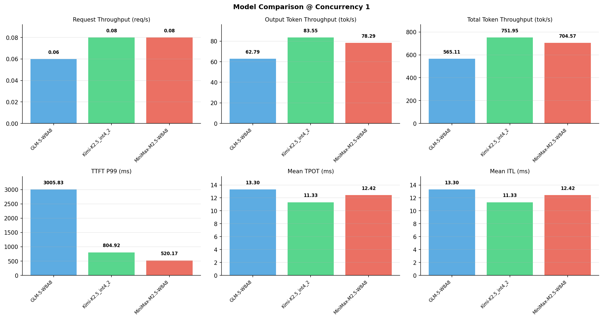

# 多模型性能对比报告

**测试日期：** 2026-05-14

**芯片平台：** inspur_metax_c550

**测试套件：** test_05

**Run ID：** 01, 01, 01

**并发级别：** 1并发

**测试配置：** 1000-i8192-o1024

---

## 🤖 芯片和模型配置信息

| 参数名称 | **MiniMax-M2.5-W8A8** | **GLM-5-W8A8** | **Kimi-K2.5_int4_2** |
|----------|----------|----------|----------|
| **max_position_embeddings** | 196608 | 202752 | 262144 |
| **model_name** | MiniMax-M2.5-W8A8 | GLM-5-W8A8 | Kimi-K2.5_int4_2 |
| **model_size** | 215G | 712G | 496G |
| **python_version** | 3.10.10 | 3.10.10 | 3.10.10 |
| **quantization_config** | int8 | int8 | int4 |
| **sglang_version** | 0.5.9+maca3.5.3.204 | 0.5.9+maca3.5.3.204 | 0.5.9+maca3.5.3.204 |
| **temperature** | N/A | N/A | N/A |
| **top_k** | 40 | N/A | N/A |
| **top_p** | 0.95 | N/A | N/A |
| **transformers_version** | 4.57.6 | 5.1.0 | 4.56.2 |

---

## ⚙️ SGLang 启动配置信息

| 参数名称 | **MiniMax-M2.5-W8A8** | **GLM-5-W8A8** | **Kimi-K2.5_int4_2** |
|----------|----------|----------|----------|
| **Attention Backend** | flashinfer | flashinfer | flashinfer |
| **Chunked Prefill Size** | N/A | 8192 | 8192 |
| **Context Length** | 196608 | 202752 | 262144 |
| **Cuda Graph Max Bs** | N/A | 64 | 64 |
| **Disable Radix Cache** | True | True | True |
| **Dp Size** | N/A | 4 | N/A |
| **Max Queued Requests** | None | None | None |
| **Max Running Requests** | 64 | 64 | 64 |
| **Mem Fraction Static** | 0.9 | 0.8 | 0.8 |
| **Model Name** | MiniMax-M2.5-W8A8 | GLM-5-W8A8 | Kimi-K2.5_int4_2 |
| **Nnodes** | 1 | 2 | 2 |
| **Pp Size** | 1 | 1 | 1 |
| **Quantization** | w8a8_int8 | w8a8_int8 | w4a8_int8 |
| **Reasoning Parser** | minimax-append-think | glm45 | kimi_k2 |
| **Tool Call Parser** | minimax-m2 | glm47 | kimi_k2 |
| **Tp Size** | 8 | 16 | 16 |

---

## 📊 模型列表

| 模型名称 | Run ID | 状态 |
|----------|--------|------|
| MiniMax-M2.5-W8A8 | 01 | [OK] |
| GLM-5-W8A8 | 01 | [OK] |
| Kimi-K2.5_int4_2 | 01 | [OK] |

---

## 📊 测试概览

| 项目            | 配置                                     | 备注  |
|---------------|----------------------------------------|-----|
| **数据集**       | random                                 |     |
| **并发数**       | 1, 4, 8, 16, 32, 64, 128    |     |
| **总请求数**      | 1000                                    |     |
| **输入输出长度** | (128, 128), (512, 256), (1024, 512), (2048, 1024), (4096, 2048), (8192, 1024) |     |
| **测试套件**     | test_05                           |     |
| **被测芯片**      | inspur_metax_c550 |     |
| **SGLang版本**   | 0.5.9                           |     |

---

## 📈 服务基准结果对比

| 指标 | MiniMax-M2.5-W8A8 (基准) | GLM-5-W8A8 | 差异 | % | Kimi-K2.5_int4_2 | 差异 | % |
|------|--------------- | --------- | ------- | ------- | --------- | ------- | -------|
| 成功请求数 | 1000 | 1000 | 0.00 | 0.0% | 1000 | 0.00 | 0.0% |
| 测试持续时间 (s) | 13080.41 | 16308.45 | +3228.04 | +24.7% | 12256.06 | -824.35 | -6.3% |
| 总输入 tokens | 8192000 | 8192000 | 0.00 | 0.0% | 8192000 | 0.00 | 0.0% |
| 总生成 tokens | 1024000 | 1024000 | 0.00 | 0.0% | 1024000 | 0.00 | 0.0% |
| **请求吞吐量 (req/s)** | 0.08 | 0.06 | -0.02 | -25.0% | 0.08 | 0.00 | 0.0% |
| **输出 token 吞吐量 (tok/s)** | 78.29 | 62.79 | -15.50 | -19.8% | 83.55 | +5.26 | +6.7% |
| **总 token 吞吐量 (tok/s)** | 704.57 | 565.11 | -139.46 | -19.8% | 751.95 | +47.38 | +6.7% |

---

## ⏱️ 首 Token 延迟 (TTFT) 对比

| 指标 | MiniMax-M2.5-W8A8 (基准) | GLM-5-W8A8 | 差异 | % | Kimi-K2.5_int4_2 | 差异 | % |
|------|--------------- | --------- | ------- | ------- | --------- | ------- | -------|
| 平均 TTFT (ms) | 373.11 | 2701.23 | +2328.12 | +624.0% | 666.43 | +293.32 | +78.6% |
| 中位 TTFT (ms) | 366.87 | 2695.02 | +2328.15 | +634.6% | 659.33 | +292.46 | +79.7% |
| P99 TTFT (ms) | 520.17 | 3005.83 | +2485.66 | +477.9% | 804.92 | +284.75 | +54.7% |

---

## ⚡ 每 Token 生成时间 (TPOT) 对比

| 指标 | MiniMax-M2.5-W8A8 (基准) | GLM-5-W8A8 | 差异 | % | Kimi-K2.5_int4_2 | 差异 | % |
|------|--------------- | --------- | ------- | ------- | --------- | ------- | -------|
| 平均 TPOT (ms) | 12.42 | 13.30 | +0.88 | +7.1% | 11.33 | -1.09 | -8.8% |
| 中位 TPOT (ms) | 12.42 | 13.05 | +0.63 | +5.1% | 11.30 | -1.12 | -9.0% |
| P99 TPOT (ms) | 12.47 | 19.60 | +7.13 | +57.2% | 14.76 | +2.29 | +18.4% |

---

## 🔄 Token 间延迟 (ITL) 对比

| 指标 | MiniMax-M2.5-W8A8 (基准) | GLM-5-W8A8 | 差异 | % | Kimi-K2.5_int4_2 | 差异 | % |
|------|--------------- | --------- | ------- | ------- | --------- | ------- | -------|
| 平均 ITL (ms) | 12.42 | 13.30 | +0.88 | +7.1% | 11.33 | -1.09 | -8.8% |
| 中位 ITL (ms) | 12.41 | 12.96 | +0.55 | +4.4% | 10.97 | -1.44 | -11.6% |
| P95 ITL (ms) | 12.47 | 13.29 | +0.82 | +6.6% | 21.86 | +9.39 | +75.3% |
| P99 ITL (ms) | 17.77 | 25.37 | +7.60 | +42.8% | 22.47 | +4.70 | +26.4% |

---

## ⏱️ 端到端延迟 (E2E) 对比

| 指标 | MiniMax-M2.5-W8A8 (基准) | GLM-5-W8A8 | 差异 | % | Kimi-K2.5_int4_2 | 差异 | % |
|------|--------------- | --------- | ------- | ------- | --------- | ------- | -------|
| 平均 E2E 延迟 (ms) | 13079.88 | 16307.94 | +3228.06 | +24.7% | 12255.59 | -824.29 | -6.3% |
| 中位 E2E 延迟 (ms) | 13069.40 | 16042.62 | +2973.22 | +22.7% | 12221.52 | -847.88 | -6.5% |
| P90 E2E 延迟 (ms) | 13087.52 | 16403.42 | +3315.90 | +25.3% | 13232.93 | +145.41 | +1.1% |
| P99 E2E 延迟 (ms) | 13266.33 | 22758.94 | +9492.61 | +71.6% | 15757.12 | +2490.79 | +18.8% |

---

## 📊 模型性能对比

---

## 📝 分析小结

- **请求吞吐量**: MiniMax-M2.5-W8A8 最高，达 0.08 req/s
- **总token吞吐量**: Kimi-K2.5_int4_2 最高，达 752 tok/s
- **TTFT P99**: MiniMax-M2.5-W8A8 最优，为 520.17ms
- **TPOT P99**: MiniMax-M2.5-W8A8 最优，为 12.47ms

---

*报告生成时间: 2026-05-14*

