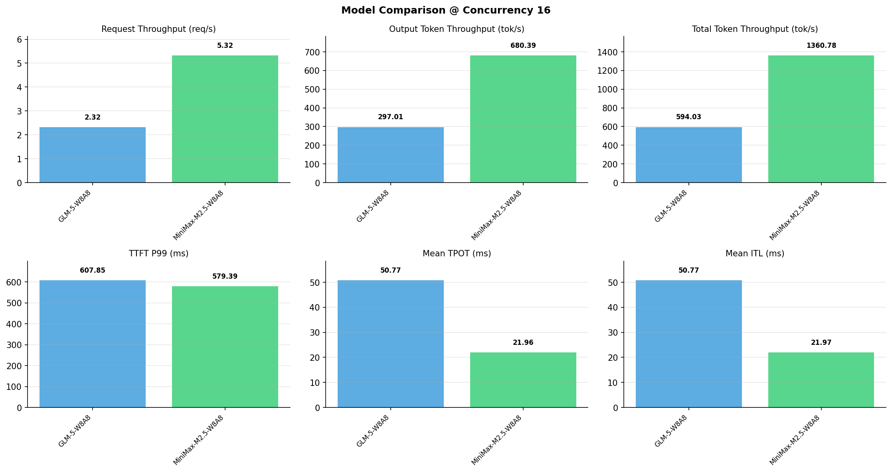

# 多模型性能对比报告

**测试日期：** 2026-05-14

**芯片平台：** inspur_metax_c550

**测试套件：** test_05

**Run ID：** 01, 01, 01

**并发级别：** 16并发

**测试配置：** 1000-i128-o128

---

## 🤖 芯片和模型配置信息

| 参数名称 | **MiniMax-M2.5-W8A8** | **GLM-5-W8A8** |
|----------|----------|----------|
| **max_position_embeddings** | 196608 | 202752 |
| **model_name** | MiniMax-M2.5-W8A8 | GLM-5-W8A8 |
| **model_size** | 215G | 712G |
| **python_version** | 3.10.10 | 3.10.10 |
| **quantization_config** | int8 | int8 |
| **sglang_version** | 0.5.9+maca3.5.3.204 | 0.5.9+maca3.5.3.204 |
| **temperature** | N/A | N/A |
| **top_k** | 40 | N/A |
| **top_p** | 0.95 | N/A |
| **transformers_version** | 4.57.6 | 5.1.0 |

---

## ⚙️ SGLang 启动配置信息

| 参数名称 | **MiniMax-M2.5-W8A8** | **GLM-5-W8A8** |
|----------|----------|----------|
| **Attention Backend** | flashinfer | flashinfer |
| **Chunked Prefill Size** | N/A | 8192 |
| **Context Length** | 196608 | 202752 |
| **Cuda Graph Max Bs** | N/A | 64 |
| **Disable Radix Cache** | True | True |
| **Dp Size** | N/A | 4 |
| **Max Queued Requests** | None | None |
| **Max Running Requests** | 64 | 64 |
| **Mem Fraction Static** | 0.9 | 0.8 |
| **Model Name** | MiniMax-M2.5-W8A8 | GLM-5-W8A8 |
| **Nnodes** | 1 | 2 |
| **Pp Size** | 1 | 1 |
| **Quantization** | w8a8_int8 | w8a8_int8 |
| **Reasoning Parser** | minimax-append-think | glm45 |
| **Tool Call Parser** | minimax-m2 | glm47 |
| **Tp Size** | 8 | 16 |

---

## 📊 模型列表

| 模型名称 | Run ID | 状态 |
|----------|--------|------|
| MiniMax-M2.5-W8A8 | 01 | [OK] |
| GLM-5-W8A8 | 01 | [OK] |

---

## 📊 测试概览

| 项目            | 配置                                     | 备注  |
|---------------|----------------------------------------|-----|
| **数据集**       | random                                 |     |
| **并发数**       | 1, 4, 8, 16, 32, 64, 128    |     |
| **总请求数**      | 1000                                    |     |
| **输入输出长度** | (128, 128), (512, 256), (1024, 512), (2048, 1024), (4096, 2048), (8192, 1024) |     |
| **测试套件**     | test_05                           |     |
| **被测芯片**      | inspur_metax_c550 |     |
| **SGLang版本**   | 0.5.9                           |     |

---

## 📈 服务基准结果对比

| 指标 | MiniMax-M2.5-W8A8 (基准) | GLM-5-W8A8 | 差异 | % |
|------|--------------- | --------- | ------- | -------|
| 成功请求数 | 1000 | 1000 | 0.00 | 0.0% |
| 测试持续时间 (s) | 188.13 | 430.96 | +242.83 | +129.1% |
| 总输入 tokens | 128000 | 128000 | 0.00 | 0.0% |
| 总生成 tokens | 128000 | 128000 | 0.00 | 0.0% |
| **请求吞吐量 (req/s)** | 5.32 | 2.32 | -3.00 | -56.4% |
| **输出 token 吞吐量 (tok/s)** | 680.39 | 297.01 | -383.38 | -56.3% |
| **总 token 吞吐量 (tok/s)** | 1360.78 | 594.03 | -766.75 | -56.3% |

---

## ⏱️ 首 Token 延迟 (TTFT) 对比

| 指标 | MiniMax-M2.5-W8A8 (基准) | GLM-5-W8A8 | 差异 | % |
|------|--------------- | --------- | ------- | -------|
| 平均 TTFT (ms) | 196.13 | 420.48 | +224.35 | +114.4% |
| 中位 TTFT (ms) | 160.13 | 367.90 | +207.77 | +129.8% |
| P99 TTFT (ms) | 579.39 | 607.85 | +28.46 | +4.9% |

---

## ⚡ 每 Token 生成时间 (TPOT) 对比

| 指标 | MiniMax-M2.5-W8A8 (基准) | GLM-5-W8A8 | 差异 | % |
|------|--------------- | --------- | ------- | -------|
| 平均 TPOT (ms) | 21.96 | 50.77 | +28.81 | +131.2% |
| 中位 TPOT (ms) | 21.79 | 49.86 | +28.07 | +128.8% |
| P99 TPOT (ms) | 23.01 | 77.50 | +54.49 | +236.8% |

---

## 🔄 Token 间延迟 (ITL) 对比

| 指标 | MiniMax-M2.5-W8A8 (基准) | GLM-5-W8A8 | 差异 | % |
|------|--------------- | --------- | ------- | -------|
| 平均 ITL (ms) | 21.97 | 50.77 | +28.80 | +131.1% |
| 中位 ITL (ms) | 21.68 | 18.84 | -2.84 | -13.1% |
| P95 ITL (ms) | 22.13 | 167.64 | +145.51 | +657.5% |
| P99 ITL (ms) | 28.35 | 333.47 | +305.12 | +1076.3% |

---

## ⏱️ 端到端延迟 (E2E) 对比

| 指标 | MiniMax-M2.5-W8A8 (基准) | GLM-5-W8A8 | 差异 | % |
|------|--------------- | --------- | ------- | -------|
| 平均 E2E 延迟 (ms) | 2985.68 | 6867.78 | +3882.10 | +130.0% |
| 中位 E2E 延迟 (ms) | 3011.09 | 6753.63 | +3742.54 | +124.3% |
| P90 E2E 延迟 (ms) | 3058.57 | 8856.31 | +5797.74 | +189.6% |
| P99 E2E 延迟 (ms) | 3443.64 | 10241.29 | +6797.65 | +197.4% |

---

## 📊 模型性能对比

---

## 📝 分析小结

- **请求吞吐量**: MiniMax-M2.5-W8A8 最高，达 5.32 req/s
- **总token吞吐量**: MiniMax-M2.5-W8A8 最高，达 1361 tok/s
- **TTFT P99**: MiniMax-M2.5-W8A8 最优，为 579.39ms
- **TPOT P99**: MiniMax-M2.5-W8A8 最优，为 23.01ms

---

*报告生成时间: 2026-05-14*

