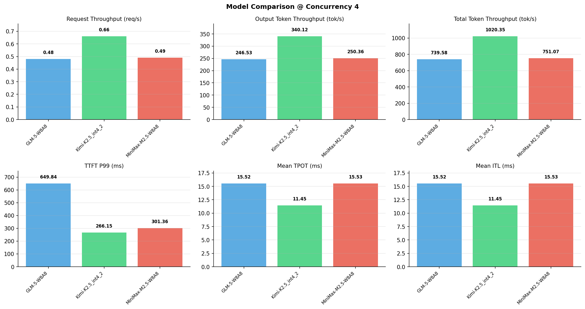

# 多模型性能对比报告

**测试日期：** 2026-05-14

**芯片平台：** inspur_metax_c550

**测试套件：** test_05

**Run ID：** 01, 01, 01

**并发级别：** 4并发

**测试配置：** 1000-i1024-o512

---

## 🤖 芯片和模型配置信息

| 参数名称 | **MiniMax-M2.5-W8A8** | **GLM-5-W8A8** | **Kimi-K2.5_int4_2** |
|----------|----------|----------|----------|
| **max_position_embeddings** | 196608 | 202752 | 262144 |
| **model_name** | MiniMax-M2.5-W8A8 | GLM-5-W8A8 | Kimi-K2.5_int4_2 |
| **model_size** | 215G | 712G | 496G |
| **python_version** | 3.10.10 | 3.10.10 | 3.10.10 |
| **quantization_config** | int8 | int8 | int4 |
| **sglang_version** | 0.5.9+maca3.5.3.204 | 0.5.9+maca3.5.3.204 | 0.5.9+maca3.5.3.204 |
| **temperature** | N/A | N/A | N/A |
| **top_k** | 40 | N/A | N/A |
| **top_p** | 0.95 | N/A | N/A |
| **transformers_version** | 4.57.6 | 5.1.0 | 4.56.2 |

---

## ⚙️ SGLang 启动配置信息

| 参数名称 | **MiniMax-M2.5-W8A8** | **GLM-5-W8A8** | **Kimi-K2.5_int4_2** |
|----------|----------|----------|----------|
| **Attention Backend** | flashinfer | flashinfer | flashinfer |
| **Chunked Prefill Size** | N/A | 8192 | 8192 |
| **Context Length** | 196608 | 202752 | 262144 |
| **Cuda Graph Max Bs** | N/A | 64 | 64 |
| **Disable Radix Cache** | True | True | True |
| **Dp Size** | N/A | 4 | N/A |
| **Max Queued Requests** | None | None | None |
| **Max Running Requests** | 64 | 64 | 64 |
| **Mem Fraction Static** | 0.9 | 0.8 | 0.8 |
| **Model Name** | MiniMax-M2.5-W8A8 | GLM-5-W8A8 | Kimi-K2.5_int4_2 |
| **Nnodes** | 1 | 2 | 2 |
| **Pp Size** | 1 | 1 | 1 |
| **Quantization** | w8a8_int8 | w8a8_int8 | w4a8_int8 |
| **Reasoning Parser** | minimax-append-think | glm45 | kimi_k2 |
| **Tool Call Parser** | minimax-m2 | glm47 | kimi_k2 |
| **Tp Size** | 8 | 16 | 16 |

---

## 📊 模型列表

| 模型名称 | Run ID | 状态 |
|----------|--------|------|
| MiniMax-M2.5-W8A8 | 01 | [OK] |
| GLM-5-W8A8 | 01 | [OK] |
| Kimi-K2.5_int4_2 | 01 | [OK] |

---

## 📊 测试概览

| 项目            | 配置                                     | 备注  |
|---------------|----------------------------------------|-----|
| **数据集**       | random                                 |     |
| **并发数**       | 1, 4, 8, 16, 32, 64, 128    |     |
| **总请求数**      | 1000                                    |     |
| **输入输出长度** | (128, 128), (512, 256), (1024, 512), (2048, 1024), (4096, 2048), (8192, 1024) |     |
| **测试套件**     | test_05                           |     |
| **被测芯片**      | inspur_metax_c550 |     |
| **SGLang版本**   | 0.5.9                           |     |

---

## 📈 服务基准结果对比

| 指标 | MiniMax-M2.5-W8A8 (基准) | GLM-5-W8A8 | 差异 | % | Kimi-K2.5_int4_2 | 差异 | % |
|------|--------------- | --------- | ------- | ------- | --------- | ------- | -------|
| 成功请求数 | 1000 | 1000 | 0.00 | 0.0% | 1000 | 0.00 | 0.0% |
| 测试持续时间 (s) | 2045.08 | 2076.87 | +31.79 | +1.6% | 1505.37 | -539.71 | -26.4% |
| 总输入 tokens | 1024000 | 1024000 | 0.00 | 0.0% | 1024000 | 0.00 | 0.0% |
| 总生成 tokens | 512000 | 512000 | 0.00 | 0.0% | 512000 | 0.00 | 0.0% |
| **请求吞吐量 (req/s)** | 0.49 | 0.48 | -0.01 | -2.0% | 0.66 | +0.17 | +34.7% |
| **输出 token 吞吐量 (tok/s)** | 250.36 | 246.53 | -3.83 | -1.5% | 340.12 | +89.76 | +35.9% |
| **总 token 吞吐量 (tok/s)** | 751.07 | 739.58 | -11.49 | -1.5% | 1020.35 | +269.28 | +35.9% |

---

## ⏱️ 首 Token 延迟 (TTFT) 对比

| 指标 | MiniMax-M2.5-W8A8 (基准) | GLM-5-W8A8 | 差异 | % | Kimi-K2.5_int4_2 | 差异 | % |
|------|--------------- | --------- | ------- | ------- | --------- | ------- | -------|
| 平均 TTFT (ms) | 241.51 | 364.32 | +122.81 | +50.9% | 162.77 | -78.74 | -32.6% |
| 中位 TTFT (ms) | 262.69 | 348.09 | +85.40 | +32.5% | 160.15 | -102.54 | -39.0% |
| P99 TTFT (ms) | 301.36 | 649.84 | +348.48 | +115.6% | 266.15 | -35.21 | -11.7% |

---

## ⚡ 每 Token 生成时间 (TPOT) 对比

| 指标 | MiniMax-M2.5-W8A8 (基准) | GLM-5-W8A8 | 差异 | % | Kimi-K2.5_int4_2 | 差异 | % |
|------|--------------- | --------- | ------- | ------- | --------- | ------- | -------|
| 平均 TPOT (ms) | 15.53 | 15.52 | -0.01 | -0.1% | 11.45 | -4.08 | -26.3% |
| 中位 TPOT (ms) | 15.54 | 14.79 | -0.75 | -4.8% | 11.08 | -4.46 | -28.7% |
| P99 TPOT (ms) | 15.64 | 24.15 | +8.51 | +54.4% | 16.66 | +1.02 | +6.5% |

---

## 🔄 Token 间延迟 (ITL) 对比

| 指标 | MiniMax-M2.5-W8A8 (基准) | GLM-5-W8A8 | 差异 | % | Kimi-K2.5_int4_2 | 差异 | % |
|------|--------------- | --------- | ------- | ------- | --------- | ------- | -------|
| 平均 ITL (ms) | 15.53 | 15.52 | -0.01 | -0.1% | 11.45 | -4.08 | -26.3% |
| 中位 ITL (ms) | 15.52 | 12.82 | -2.70 | -17.4% | 8.95 | -6.57 | -42.3% |
| P95 ITL (ms) | 15.64 | 25.37 | +9.73 | +62.2% | 26.63 | +10.99 | +70.3% |
| P99 ITL (ms) | 21.83 | 87.38 | +65.55 | +300.3% | 54.12 | +32.29 | +147.9% |

---

## ⏱️ 端到端延迟 (E2E) 对比

| 指标 | MiniMax-M2.5-W8A8 (基准) | GLM-5-W8A8 | 差异 | % | Kimi-K2.5_int4_2 | 差异 | % |
|------|--------------- | --------- | ------- | ------- | --------- | ------- | -------|
| 平均 E2E 延迟 (ms) | 8179.01 | 8295.56 | +116.55 | +1.4% | 6014.56 | -2164.45 | -26.5% |
| 中位 E2E 延迟 (ms) | 8196.33 | 7917.77 | -278.56 | -3.4% | 5824.36 | -2371.97 | -28.9% |
| P90 E2E 延迟 (ms) | 8239.48 | 9646.40 | +1406.92 | +17.1% | 7015.45 | -1224.03 | -14.9% |
| P99 E2E 延迟 (ms) | 8271.90 | 12750.03 | +4478.13 | +54.1% | 8665.63 | +393.73 | +4.8% |

---

## 📊 模型性能对比

---

## 📝 分析小结

- **请求吞吐量**: Kimi-K2.5_int4_2 最高，达 0.66 req/s
- **总token吞吐量**: Kimi-K2.5_int4_2 最高，达 1020 tok/s
- **TTFT P99**: Kimi-K2.5_int4_2 最优，为 266.15ms
- **TPOT P99**: MiniMax-M2.5-W8A8 最优，为 15.64ms

---

*报告生成时间: 2026-05-14*

