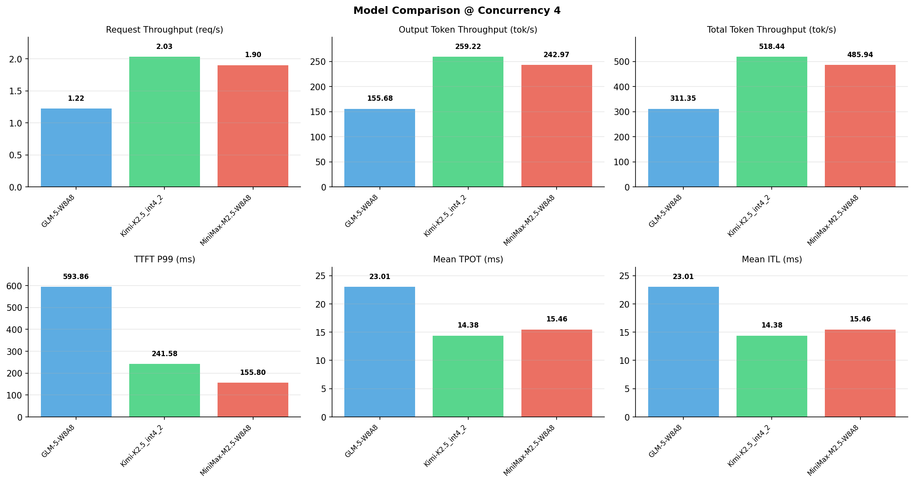

# 多模型性能对比报告

**测试日期：** 2026-05-14

**芯片平台：** inspur_metax_c550

**测试套件：** test_05

**Run ID：** 01, 01, 01

**并发级别：** 4并发

**测试配置：** 1000-i128-o128

---

## 🤖 芯片和模型配置信息

| 参数名称 | **MiniMax-M2.5-W8A8** | **GLM-5-W8A8** | **Kimi-K2.5_int4_2** |
|----------|----------|----------|----------|
| **max_position_embeddings** | 196608 | 202752 | 262144 |
| **model_name** | MiniMax-M2.5-W8A8 | GLM-5-W8A8 | Kimi-K2.5_int4_2 |
| **model_size** | 215G | 712G | 496G |
| **python_version** | 3.10.10 | 3.10.10 | 3.10.10 |
| **quantization_config** | int8 | int8 | int4 |
| **sglang_version** | 0.5.9+maca3.5.3.204 | 0.5.9+maca3.5.3.204 | 0.5.9+maca3.5.3.204 |
| **temperature** | N/A | N/A | N/A |
| **top_k** | 40 | N/A | N/A |
| **top_p** | 0.95 | N/A | N/A |
| **transformers_version** | 4.57.6 | 5.1.0 | 4.56.2 |

---

## ⚙️ SGLang 启动配置信息

| 参数名称 | **MiniMax-M2.5-W8A8** | **GLM-5-W8A8** | **Kimi-K2.5_int4_2** |
|----------|----------|----------|----------|
| **Attention Backend** | flashinfer | flashinfer | flashinfer |
| **Chunked Prefill Size** | N/A | 8192 | 8192 |
| **Context Length** | 196608 | 202752 | 262144 |
| **Cuda Graph Max Bs** | N/A | 64 | 64 |
| **Disable Radix Cache** | True | True | True |
| **Dp Size** | N/A | 4 | N/A |
| **Max Queued Requests** | None | None | None |
| **Max Running Requests** | 64 | 64 | 64 |
| **Mem Fraction Static** | 0.9 | 0.8 | 0.8 |
| **Model Name** | MiniMax-M2.5-W8A8 | GLM-5-W8A8 | Kimi-K2.5_int4_2 |
| **Nnodes** | 1 | 2 | 2 |
| **Pp Size** | 1 | 1 | 1 |
| **Quantization** | w8a8_int8 | w8a8_int8 | w4a8_int8 |
| **Reasoning Parser** | minimax-append-think | glm45 | kimi_k2 |
| **Tool Call Parser** | minimax-m2 | glm47 | kimi_k2 |
| **Tp Size** | 8 | 16 | 16 |

---

## 📊 模型列表

| 模型名称 | Run ID | 状态 |
|----------|--------|------|
| MiniMax-M2.5-W8A8 | 01 | [OK] |
| GLM-5-W8A8 | 01 | [OK] |
| Kimi-K2.5_int4_2 | 01 | [OK] |

---

## 📊 测试概览

| 项目            | 配置                                     | 备注  |
|---------------|----------------------------------------|-----|
| **数据集**       | random                                 |     |
| **并发数**       | 1, 4, 8, 16, 32, 64, 128    |     |
| **总请求数**      | 1000                                    |     |
| **输入输出长度** | (128, 128), (512, 256), (1024, 512), (2048, 1024), (4096, 2048), (8192, 1024) |     |
| **测试套件**     | test_05                           |     |
| **被测芯片**      | inspur_metax_c550 |     |
| **SGLang版本**   | 0.5.9                           |     |

---

## 📈 服务基准结果对比

| 指标 | MiniMax-M2.5-W8A8 (基准) | GLM-5-W8A8 | 差异 | % | Kimi-K2.5_int4_2 | 差异 | % |
|------|--------------- | --------- | ------- | ------- | --------- | ------- | -------|
| 成功请求数 | 1000 | 1000 | 0.00 | 0.0% | 1000 | 0.00 | 0.0% |
| 测试持续时间 (s) | 526.81 | 822.21 | +295.40 | +56.1% | 493.79 | -33.02 | -6.3% |
| 总输入 tokens | 128000 | 128000 | 0.00 | 0.0% | 128000 | 0.00 | 0.0% |
| 总生成 tokens | 128000 | 128000 | 0.00 | 0.0% | 128000 | 0.00 | 0.0% |
| **请求吞吐量 (req/s)** | 1.90 | 1.22 | -0.68 | -35.8% | 2.03 | +0.13 | +6.8% |
| **输出 token 吞吐量 (tok/s)** | 242.97 | 155.68 | -87.29 | -35.9% | 259.22 | +16.25 | +6.7% |
| **总 token 吞吐量 (tok/s)** | 485.94 | 311.35 | -174.59 | -35.9% | 518.44 | +32.50 | +6.7% |

---

## ⏱️ 首 Token 延迟 (TTFT) 对比

| 指标 | MiniMax-M2.5-W8A8 (基准) | GLM-5-W8A8 | 差异 | % | Kimi-K2.5_int4_2 | 差异 | % |
|------|--------------- | --------- | ------- | ------- | --------- | ------- | -------|
| 平均 TTFT (ms) | 142.27 | 362.92 | +220.65 | +155.1% | 146.39 | +4.12 | +2.9% |
| 中位 TTFT (ms) | 143.51 | 345.87 | +202.36 | +141.0% | 141.43 | -2.08 | -1.4% |
| P99 TTFT (ms) | 155.80 | 593.86 | +438.06 | +281.2% | 241.58 | +85.78 | +55.1% |

---

## ⚡ 每 Token 生成时间 (TPOT) 对比

| 指标 | MiniMax-M2.5-W8A8 (基准) | GLM-5-W8A8 | 差异 | % | Kimi-K2.5_int4_2 | 差异 | % |
|------|--------------- | --------- | ------- | ------- | --------- | ------- | -------|
| 平均 TPOT (ms) | 15.46 | 23.01 | +7.55 | +48.8% | 14.38 | -1.08 | -7.0% |
| 中位 TPOT (ms) | 15.47 | 22.24 | +6.77 | +43.8% | 14.22 | -1.25 | -8.1% |
| P99 TPOT (ms) | 15.55 | 35.14 | +19.59 | +126.0% | 20.92 | +5.37 | +34.5% |

---

## 🔄 Token 间延迟 (ITL) 对比

| 指标 | MiniMax-M2.5-W8A8 (基准) | GLM-5-W8A8 | 差异 | % | Kimi-K2.5_int4_2 | 差异 | % |
|------|--------------- | --------- | ------- | ------- | --------- | ------- | -------|
| 平均 ITL (ms) | 15.46 | 23.01 | +7.55 | +48.8% | 14.38 | -1.08 | -7.0% |
| 中位 ITL (ms) | 15.46 | 12.81 | -2.65 | -17.1% | 8.61 | -6.85 | -44.3% |
| P95 ITL (ms) | 15.57 | 86.38 | +70.81 | +454.8% | 26.83 | +11.26 | +72.3% |
| P99 ITL (ms) | 21.82 | 169.85 | +148.03 | +678.4% | 72.67 | +50.85 | +233.0% |

---

## ⏱️ 端到端延迟 (E2E) 对比

| 指标 | MiniMax-M2.5-W8A8 (基准) | GLM-5-W8A8 | 差异 | % | Kimi-K2.5_int4_2 | 差异 | % |
|------|--------------- | --------- | ------- | ------- | --------- | ------- | -------|
| 平均 E2E 延迟 (ms) | 2106.04 | 3284.59 | +1178.55 | +56.0% | 1972.48 | -133.56 | -6.3% |
| 中位 E2E 延迟 (ms) | 2107.10 | 3189.86 | +1082.76 | +51.4% | 1951.31 | -155.79 | -7.4% |
| P90 E2E 延迟 (ms) | 2117.16 | 4174.70 | +2057.54 | +97.2% | 2350.68 | +233.52 | +11.0% |
| P99 E2E 延迟 (ms) | 2123.84 | 4804.11 | +2680.27 | +126.2% | 2795.72 | +671.88 | +31.6% |

---

## 📊 模型性能对比

---

## 📝 分析小结

- **请求吞吐量**: Kimi-K2.5_int4_2 最高，达 2.03 req/s
- **总token吞吐量**: Kimi-K2.5_int4_2 最高，达 518 tok/s
- **TTFT P99**: MiniMax-M2.5-W8A8 最优，为 155.80ms
- **TPOT P99**: MiniMax-M2.5-W8A8 最优，为 15.55ms

---

*报告生成时间: 2026-05-14*

