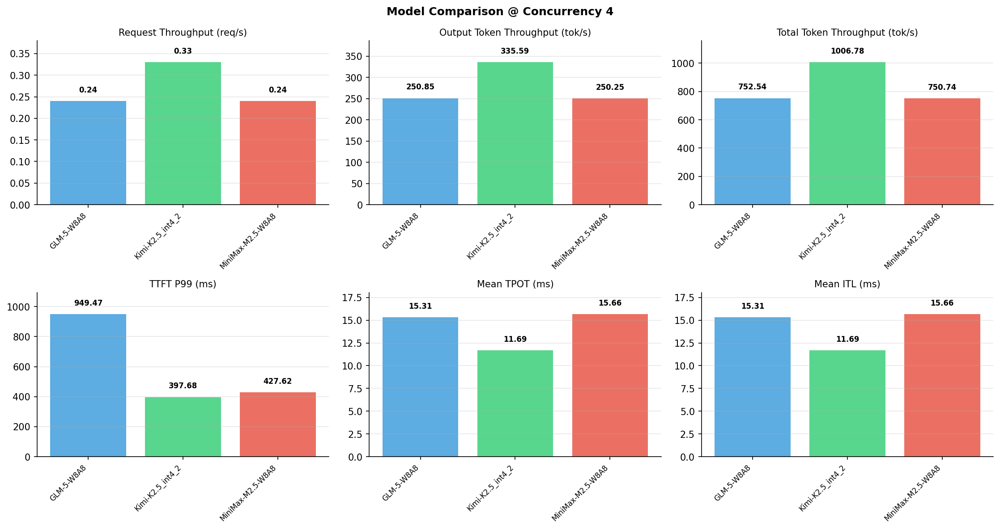

# 多模型性能对比报告

**测试日期：** 2026-05-14

**芯片平台：** inspur_metax_c550

**测试套件：** test_05

**Run ID：** 01, 01, 01

**并发级别：** 4并发

**测试配置：** 1000-i2048-o1024

---

## 🤖 芯片和模型配置信息

| 参数名称 | **MiniMax-M2.5-W8A8** | **GLM-5-W8A8** | **Kimi-K2.5_int4_2** |
|----------|----------|----------|----------|
| **max_position_embeddings** | 196608 | 202752 | 262144 |
| **model_name** | MiniMax-M2.5-W8A8 | GLM-5-W8A8 | Kimi-K2.5_int4_2 |
| **model_size** | 215G | 712G | 496G |
| **python_version** | 3.10.10 | 3.10.10 | 3.10.10 |
| **quantization_config** | int8 | int8 | int4 |
| **sglang_version** | 0.5.9+maca3.5.3.204 | 0.5.9+maca3.5.3.204 | 0.5.9+maca3.5.3.204 |
| **temperature** | N/A | N/A | N/A |
| **top_k** | 40 | N/A | N/A |
| **top_p** | 0.95 | N/A | N/A |
| **transformers_version** | 4.57.6 | 5.1.0 | 4.56.2 |

---

## ⚙️ SGLang 启动配置信息

| 参数名称 | **MiniMax-M2.5-W8A8** | **GLM-5-W8A8** | **Kimi-K2.5_int4_2** |
|----------|----------|----------|----------|
| **Attention Backend** | flashinfer | flashinfer | flashinfer |
| **Chunked Prefill Size** | N/A | 8192 | 8192 |
| **Context Length** | 196608 | 202752 | 262144 |
| **Cuda Graph Max Bs** | N/A | 64 | 64 |
| **Disable Radix Cache** | True | True | True |
| **Dp Size** | N/A | 4 | N/A |
| **Max Queued Requests** | None | None | None |
| **Max Running Requests** | 64 | 64 | 64 |
| **Mem Fraction Static** | 0.9 | 0.8 | 0.8 |
| **Model Name** | MiniMax-M2.5-W8A8 | GLM-5-W8A8 | Kimi-K2.5_int4_2 |
| **Nnodes** | 1 | 2 | 2 |
| **Pp Size** | 1 | 1 | 1 |
| **Quantization** | w8a8_int8 | w8a8_int8 | w4a8_int8 |
| **Reasoning Parser** | minimax-append-think | glm45 | kimi_k2 |
| **Tool Call Parser** | minimax-m2 | glm47 | kimi_k2 |
| **Tp Size** | 8 | 16 | 16 |

---

## 📊 模型列表

| 模型名称 | Run ID | 状态 |
|----------|--------|------|
| MiniMax-M2.5-W8A8 | 01 | [OK] |
| GLM-5-W8A8 | 01 | [OK] |
| Kimi-K2.5_int4_2 | 01 | [OK] |

---

## 📊 测试概览

| 项目            | 配置                                     | 备注  |
|---------------|----------------------------------------|-----|
| **数据集**       | random                                 |     |
| **并发数**       | 1, 4, 8, 16, 32, 64, 128    |     |
| **总请求数**      | 1000                                    |     |
| **输入输出长度** | (128, 128), (512, 256), (1024, 512), (2048, 1024), (4096, 2048), (8192, 1024) |     |
| **测试套件**     | test_05                           |     |
| **被测芯片**      | inspur_metax_c550 |     |
| **SGLang版本**   | 0.5.9                           |     |

---

## 📈 服务基准结果对比

| 指标 | MiniMax-M2.5-W8A8 (基准) | GLM-5-W8A8 | 差异 | % | Kimi-K2.5_int4_2 | 差异 | % |
|------|--------------- | --------- | ------- | ------- | --------- | ------- | -------|
| 成功请求数 | 1000 | 1000 | 0.00 | 0.0% | 1000 | 0.00 | 0.0% |
| 测试持续时间 (s) | 4091.94 | 4082.16 | -9.78 | -0.2% | 3051.32 | -1040.62 | -25.4% |
| 总输入 tokens | 2048000 | 2048000 | 0.00 | 0.0% | 2048000 | 0.00 | 0.0% |
| 总生成 tokens | 1024000 | 1024000 | 0.00 | 0.0% | 1024000 | 0.00 | 0.0% |
| **请求吞吐量 (req/s)** | 0.24 | 0.24 | 0.00 | 0.0% | 0.33 | +0.09 | +37.5% |
| **输出 token 吞吐量 (tok/s)** | 250.25 | 250.85 | +0.60 | +0.2% | 335.59 | +85.34 | +34.1% |
| **总 token 吞吐量 (tok/s)** | 750.74 | 752.54 | +1.80 | +0.2% | 1006.78 | +256.04 | +34.1% |

---

## ⏱️ 首 Token 延迟 (TTFT) 对比

| 指标 | MiniMax-M2.5-W8A8 (基准) | GLM-5-W8A8 | 差异 | % | Kimi-K2.5_int4_2 | 差异 | % |
|------|--------------- | --------- | ------- | ------- | --------- | ------- | -------|
| 平均 TTFT (ms) | 341.07 | 656.56 | +315.49 | +92.5% | 231.16 | -109.91 | -32.2% |
| 中位 TTFT (ms) | 357.42 | 642.39 | +284.97 | +79.7% | 225.04 | -132.38 | -37.0% |
| P99 TTFT (ms) | 427.62 | 949.47 | +521.85 | +122.0% | 397.68 | -29.94 | -7.0% |

---

## ⚡ 每 Token 生成时间 (TPOT) 对比

| 指标 | MiniMax-M2.5-W8A8 (基准) | GLM-5-W8A8 | 差异 | % | Kimi-K2.5_int4_2 | 差异 | % |
|------|--------------- | --------- | ------- | ------- | --------- | ------- | -------|
| 平均 TPOT (ms) | 15.66 | 15.31 | -0.35 | -2.2% | 11.69 | -3.97 | -25.4% |
| 中位 TPOT (ms) | 15.66 | 14.81 | -0.85 | -5.4% | 11.50 | -4.16 | -26.6% |
| P99 TPOT (ms) | 15.83 | 23.47 | +7.64 | +48.3% | 15.63 | -0.20 | -1.3% |

---

## 🔄 Token 间延迟 (ITL) 对比

| 指标 | MiniMax-M2.5-W8A8 (基准) | GLM-5-W8A8 | 差异 | % | Kimi-K2.5_int4_2 | 差异 | % |
|------|--------------- | --------- | ------- | ------- | --------- | ------- | -------|
| 平均 ITL (ms) | 15.66 | 15.31 | -0.35 | -2.2% | 11.69 | -3.97 | -25.4% |
| 中位 ITL (ms) | 15.64 | 12.96 | -2.68 | -17.1% | 9.09 | -6.55 | -41.9% |
| P95 ITL (ms) | 15.77 | 17.32 | +1.55 | +9.8% | 26.86 | +11.09 | +70.3% |
| P99 ITL (ms) | 21.32 | 158.64 | +137.32 | +644.1% | 27.80 | +6.48 | +30.4% |

---

## ⏱️ 端到端延迟 (E2E) 对比

| 指标 | MiniMax-M2.5-W8A8 (基准) | GLM-5-W8A8 | 差异 | % | Kimi-K2.5_int4_2 | 差异 | % |
|------|--------------- | --------- | ------- | ------- | --------- | ------- | -------|
| 平均 E2E 延迟 (ms) | 16366.33 | 16317.46 | -48.87 | -0.3% | 12186.53 | -4179.80 | -25.5% |
| 中位 E2E 延迟 (ms) | 16365.96 | 15802.20 | -563.76 | -3.4% | 11997.41 | -4368.55 | -26.7% |
| P90 E2E 延迟 (ms) | 16430.75 | 17234.13 | +803.38 | +4.9% | 13634.20 | -2796.55 | -17.0% |
| P99 E2E 延迟 (ms) | 16598.63 | 24637.46 | +8038.83 | +48.4% | 16219.31 | -379.32 | -2.3% |

---

## 📊 模型性能对比

---

## 📝 分析小结

- **请求吞吐量**: Kimi-K2.5_int4_2 最高，达 0.33 req/s
- **总token吞吐量**: Kimi-K2.5_int4_2 最高，达 1007 tok/s
- **TTFT P99**: Kimi-K2.5_int4_2 最优，为 397.68ms
- **TPOT P99**: Kimi-K2.5_int4_2 最优，为 15.63ms

---

*报告生成时间: 2026-05-14*

