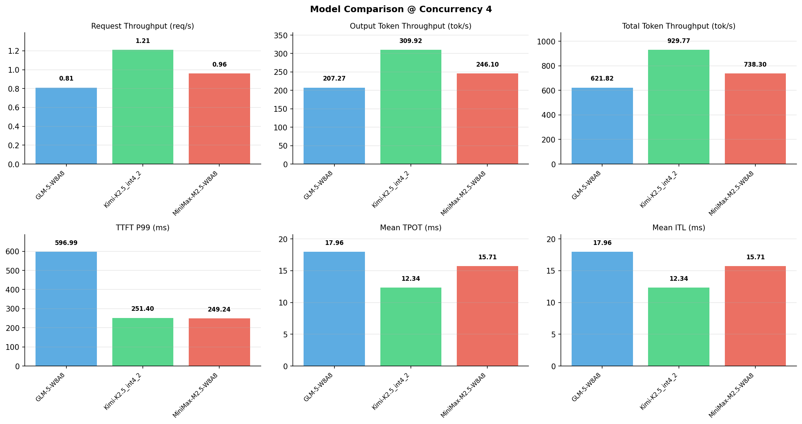

# 多模型性能对比报告

**测试日期：** 2026-05-14

**芯片平台：** inspur_metax_c550

**测试套件：** test_05

**Run ID：** 01, 01, 01

**并发级别：** 4并发

**测试配置：** 1000-i512-o256

---

## 🤖 芯片和模型配置信息

| 参数名称 | **MiniMax-M2.5-W8A8** | **GLM-5-W8A8** | **Kimi-K2.5_int4_2** |
|----------|----------|----------|----------|
| **max_position_embeddings** | 196608 | 202752 | 262144 |
| **model_name** | MiniMax-M2.5-W8A8 | GLM-5-W8A8 | Kimi-K2.5_int4_2 |
| **model_size** | 215G | 712G | 496G |
| **python_version** | 3.10.10 | 3.10.10 | 3.10.10 |
| **quantization_config** | int8 | int8 | int4 |
| **sglang_version** | 0.5.9+maca3.5.3.204 | 0.5.9+maca3.5.3.204 | 0.5.9+maca3.5.3.204 |
| **temperature** | N/A | N/A | N/A |
| **top_k** | 40 | N/A | N/A |
| **top_p** | 0.95 | N/A | N/A |
| **transformers_version** | 4.57.6 | 5.1.0 | 4.56.2 |

---

## ⚙️ SGLang 启动配置信息

| 参数名称 | **MiniMax-M2.5-W8A8** | **GLM-5-W8A8** | **Kimi-K2.5_int4_2** |
|----------|----------|----------|----------|
| **Attention Backend** | flashinfer | flashinfer | flashinfer |
| **Chunked Prefill Size** | N/A | 8192 | 8192 |
| **Context Length** | 196608 | 202752 | 262144 |
| **Cuda Graph Max Bs** | N/A | 64 | 64 |
| **Disable Radix Cache** | True | True | True |
| **Dp Size** | N/A | 4 | N/A |
| **Max Queued Requests** | None | None | None |
| **Max Running Requests** | 64 | 64 | 64 |
| **Mem Fraction Static** | 0.9 | 0.8 | 0.8 |
| **Model Name** | MiniMax-M2.5-W8A8 | GLM-5-W8A8 | Kimi-K2.5_int4_2 |
| **Nnodes** | 1 | 2 | 2 |
| **Pp Size** | 1 | 1 | 1 |
| **Quantization** | w8a8_int8 | w8a8_int8 | w4a8_int8 |
| **Reasoning Parser** | minimax-append-think | glm45 | kimi_k2 |
| **Tool Call Parser** | minimax-m2 | glm47 | kimi_k2 |
| **Tp Size** | 8 | 16 | 16 |

---

## 📊 模型列表

| 模型名称 | Run ID | 状态 |
|----------|--------|------|
| MiniMax-M2.5-W8A8 | 01 | [OK] |
| GLM-5-W8A8 | 01 | [OK] |
| Kimi-K2.5_int4_2 | 01 | [OK] |

---

## 📊 测试概览

| 项目            | 配置                                     | 备注  |
|---------------|----------------------------------------|-----|
| **数据集**       | random                                 |     |
| **并发数**       | 1, 4, 8, 16, 32, 64, 128    |     |
| **总请求数**      | 1000                                    |     |
| **输入输出长度** | (128, 128), (512, 256), (1024, 512), (2048, 1024), (4096, 2048), (8192, 1024) |     |
| **测试套件**     | test_05                           |     |
| **被测芯片**      | inspur_metax_c550 |     |
| **SGLang版本**   | 0.5.9                           |     |

---

## 📈 服务基准结果对比

| 指标 | MiniMax-M2.5-W8A8 (基准) | GLM-5-W8A8 | 差异 | % | Kimi-K2.5_int4_2 | 差异 | % |
|------|--------------- | --------- | ------- | ------- | --------- | ------- | -------|
| 成功请求数 | 1000 | 1000 | 0.00 | 0.0% | 1000 | 0.00 | 0.0% |
| 测试持续时间 (s) | 1040.23 | 1235.08 | +194.85 | +18.7% | 826.01 | -214.22 | -20.6% |
| 总输入 tokens | 512000 | 512000 | 0.00 | 0.0% | 512000 | 0.00 | 0.0% |
| 总生成 tokens | 256000 | 256000 | 0.00 | 0.0% | 256000 | 0.00 | 0.0% |
| **请求吞吐量 (req/s)** | 0.96 | 0.81 | -0.15 | -15.6% | 1.21 | +0.25 | +26.0% |
| **输出 token 吞吐量 (tok/s)** | 246.10 | 207.27 | -38.83 | -15.8% | 309.92 | +63.82 | +25.9% |
| **总 token 吞吐量 (tok/s)** | 738.30 | 621.82 | -116.48 | -15.8% | 929.77 | +191.47 | +25.9% |

---

## ⏱️ 首 Token 延迟 (TTFT) 对比

| 指标 | MiniMax-M2.5-W8A8 (基准) | GLM-5-W8A8 | 差异 | % | Kimi-K2.5_int4_2 | 差异 | % |
|------|--------------- | --------- | ------- | ------- | --------- | ------- | -------|
| 平均 TTFT (ms) | 152.81 | 357.39 | +204.58 | +133.9% | 151.29 | -1.52 | -1.0% |
| 中位 TTFT (ms) | 149.79 | 347.10 | +197.31 | +131.7% | 145.36 | -4.43 | -3.0% |
| P99 TTFT (ms) | 249.24 | 596.99 | +347.75 | +139.5% | 251.40 | +2.16 | +0.9% |

---

## ⚡ 每 Token 生成时间 (TPOT) 对比

| 指标 | MiniMax-M2.5-W8A8 (基准) | GLM-5-W8A8 | 差异 | % | Kimi-K2.5_int4_2 | 差异 | % |
|------|--------------- | --------- | ------- | ------- | --------- | ------- | -------|
| 平均 TPOT (ms) | 15.71 | 17.96 | +2.25 | +14.3% | 12.34 | -3.37 | -21.5% |
| 中位 TPOT (ms) | 15.86 | 16.73 | +0.87 | +5.5% | 11.97 | -3.89 | -24.5% |
| P99 TPOT (ms) | 16.06 | 28.99 | +12.93 | +80.5% | 17.96 | +1.90 | +11.8% |

---

## 🔄 Token 间延迟 (ITL) 对比

| 指标 | MiniMax-M2.5-W8A8 (基准) | GLM-5-W8A8 | 差异 | % | Kimi-K2.5_int4_2 | 差异 | % |
|------|--------------- | --------- | ------- | ------- | --------- | ------- | -------|
| 平均 ITL (ms) | 15.71 | 17.96 | +2.25 | +14.3% | 12.34 | -3.37 | -21.5% |
| 中位 ITL (ms) | 15.45 | 12.78 | -2.67 | -17.3% | 8.80 | -6.65 | -43.0% |
| P95 ITL (ms) | 15.58 | 50.80 | +35.22 | +226.1% | 26.41 | +10.83 | +69.5% |
| P99 ITL (ms) | 23.55 | 89.42 | +65.87 | +279.7% | 51.37 | +27.82 | +118.1% |

---

## ⏱️ 端到端延迟 (E2E) 对比

| 指标 | MiniMax-M2.5-W8A8 (基准) | GLM-5-W8A8 | 差异 | % | Kimi-K2.5_int4_2 | 差异 | % |
|------|--------------- | --------- | ------- | ------- | --------- | ------- | -------|
| 平均 E2E 延迟 (ms) | 4159.12 | 4935.95 | +776.83 | +18.7% | 3298.97 | -860.15 | -20.7% |
| 中位 E2E 延迟 (ms) | 4199.45 | 4617.59 | +418.14 | +10.0% | 3198.90 | -1000.55 | -23.8% |
| P90 E2E 延迟 (ms) | 4236.09 | 6180.54 | +1944.45 | +45.9% | 3920.14 | -315.95 | -7.5% |
| P99 E2E 延迟 (ms) | 4253.75 | 7737.11 | +3483.36 | +81.9% | 4731.64 | +477.89 | +11.2% |

---

## 📊 模型性能对比

---

## 📝 分析小结

- **请求吞吐量**: Kimi-K2.5_int4_2 最高，达 1.21 req/s
- **总token吞吐量**: Kimi-K2.5_int4_2 最高，达 930 tok/s
- **TTFT P99**: MiniMax-M2.5-W8A8 最优，为 249.24ms
- **TPOT P99**: MiniMax-M2.5-W8A8 最优，为 16.06ms

---

*报告生成时间: 2026-05-14*

