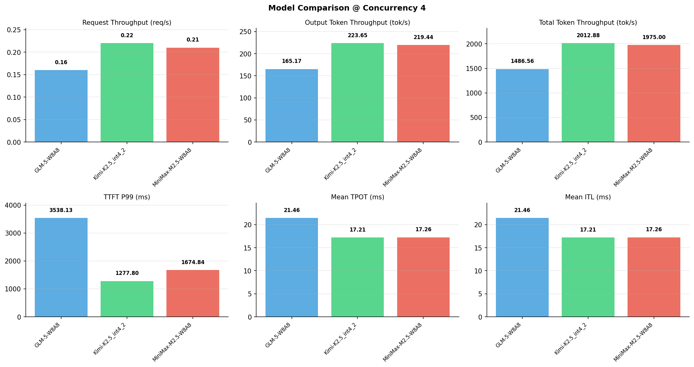

# 多模型性能对比报告

**测试日期：** 2026-05-14

**芯片平台：** inspur_metax_c550

**测试套件：** test_05

**Run ID：** 01, 01, 01

**并发级别：** 4并发

**测试配置：** 1000-i8192-o1024

---

## 🤖 芯片和模型配置信息

| 参数名称 | **MiniMax-M2.5-W8A8** | **GLM-5-W8A8** | **Kimi-K2.5_int4_2** |
|----------|----------|----------|----------|
| **max_position_embeddings** | 196608 | 202752 | 262144 |
| **model_name** | MiniMax-M2.5-W8A8 | GLM-5-W8A8 | Kimi-K2.5_int4_2 |
| **model_size** | 215G | 712G | 496G |
| **python_version** | 3.10.10 | 3.10.10 | 3.10.10 |
| **quantization_config** | int8 | int8 | int4 |
| **sglang_version** | 0.5.9+maca3.5.3.204 | 0.5.9+maca3.5.3.204 | 0.5.9+maca3.5.3.204 |
| **temperature** | N/A | N/A | N/A |
| **top_k** | 40 | N/A | N/A |
| **top_p** | 0.95 | N/A | N/A |
| **transformers_version** | 4.57.6 | 5.1.0 | 4.56.2 |

---

## ⚙️ SGLang 启动配置信息

| 参数名称 | **MiniMax-M2.5-W8A8** | **GLM-5-W8A8** | **Kimi-K2.5_int4_2** |
|----------|----------|----------|----------|
| **Attention Backend** | flashinfer | flashinfer | flashinfer |
| **Chunked Prefill Size** | N/A | 8192 | 8192 |
| **Context Length** | 196608 | 202752 | 262144 |
| **Cuda Graph Max Bs** | N/A | 64 | 64 |
| **Disable Radix Cache** | True | True | True |
| **Dp Size** | N/A | 4 | N/A |
| **Max Queued Requests** | None | None | None |
| **Max Running Requests** | 64 | 64 | 64 |
| **Mem Fraction Static** | 0.9 | 0.8 | 0.8 |
| **Model Name** | MiniMax-M2.5-W8A8 | GLM-5-W8A8 | Kimi-K2.5_int4_2 |
| **Nnodes** | 1 | 2 | 2 |
| **Pp Size** | 1 | 1 | 1 |
| **Quantization** | w8a8_int8 | w8a8_int8 | w4a8_int8 |
| **Reasoning Parser** | minimax-append-think | glm45 | kimi_k2 |
| **Tool Call Parser** | minimax-m2 | glm47 | kimi_k2 |
| **Tp Size** | 8 | 16 | 16 |

---

## 📊 模型列表

| 模型名称 | Run ID | 状态 |
|----------|--------|------|
| MiniMax-M2.5-W8A8 | 01 | [OK] |
| GLM-5-W8A8 | 01 | [OK] |
| Kimi-K2.5_int4_2 | 01 | [OK] |

---

## 📊 测试概览

| 项目            | 配置                                     | 备注  |
|---------------|----------------------------------------|-----|
| **数据集**       | random                                 |     |
| **并发数**       | 1, 4, 8, 16, 32, 64, 128    |     |
| **总请求数**      | 1000                                    |     |
| **输入输出长度** | (128, 128), (512, 256), (1024, 512), (2048, 1024), (4096, 2048), (8192, 1024) |     |
| **测试套件**     | test_05                           |     |
| **被测芯片**      | inspur_metax_c550 |     |
| **SGLang版本**   | 0.5.9                           |     |

---

## 📈 服务基准结果对比

| 指标 | MiniMax-M2.5-W8A8 (基准) | GLM-5-W8A8 | 差异 | % | Kimi-K2.5_int4_2 | 差异 | % |
|------|--------------- | --------- | ------- | ------- | --------- | ------- | -------|
| 成功请求数 | 1000 | 1000 | 0.00 | 0.0% | 1000 | 0.00 | 0.0% |
| 测试持续时间 (s) | 4666.34 | 6199.53 | +1533.19 | +32.9% | 4578.51 | -87.83 | -1.9% |
| 总输入 tokens | 8192000 | 8192000 | 0.00 | 0.0% | 8192000 | 0.00 | 0.0% |
| 总生成 tokens | 1024000 | 1024000 | 0.00 | 0.0% | 1024000 | 0.00 | 0.0% |
| **请求吞吐量 (req/s)** | 0.21 | 0.16 | -0.05 | -23.8% | 0.22 | +0.01 | +4.8% |
| **输出 token 吞吐量 (tok/s)** | 219.44 | 165.17 | -54.27 | -24.7% | 223.65 | +4.21 | +1.9% |
| **总 token 吞吐量 (tok/s)** | 1975.00 | 1486.56 | -488.44 | -24.7% | 2012.88 | +37.88 | +1.9% |

---

## ⏱️ 首 Token 延迟 (TTFT) 对比

| 指标 | MiniMax-M2.5-W8A8 (基准) | GLM-5-W8A8 | 差异 | % | Kimi-K2.5_int4_2 | 差异 | % |
|------|--------------- | --------- | ------- | ------- | --------- | ------- | -------|
| 平均 TTFT (ms) | 1002.75 | 2754.49 | +1751.74 | +174.7% | 685.95 | -316.80 | -31.6% |
| 中位 TTFT (ms) | 1180.83 | 2722.82 | +1541.99 | +130.6% | 665.83 | -515.00 | -43.6% |
| P99 TTFT (ms) | 1674.84 | 3538.13 | +1863.29 | +111.3% | 1277.80 | -397.04 | -23.7% |

---

## ⚡ 每 Token 生成时间 (TPOT) 对比

| 指标 | MiniMax-M2.5-W8A8 (基准) | GLM-5-W8A8 | 差异 | % | Kimi-K2.5_int4_2 | 差异 | % |
|------|--------------- | --------- | ------- | ------- | --------- | ------- | -------|
| 平均 TPOT (ms) | 17.26 | 21.46 | +4.20 | +24.3% | 17.21 | -0.05 | -0.3% |
| 中位 TPOT (ms) | 17.23 | 21.29 | +4.06 | +23.6% | 17.13 | -0.10 | -0.6% |
| P99 TPOT (ms) | 18.01 | 31.87 | +13.86 | +77.0% | 23.01 | +5.00 | +27.8% |

---

## 🔄 Token 间延迟 (ITL) 对比

| 指标 | MiniMax-M2.5-W8A8 (基准) | GLM-5-W8A8 | 差异 | % | Kimi-K2.5_int4_2 | 差异 | % |
|------|--------------- | --------- | ------- | ------- | --------- | ------- | -------|
| 平均 ITL (ms) | 17.26 | 21.46 | +4.20 | +24.3% | 17.21 | -0.05 | -0.3% |
| 中位 ITL (ms) | 16.83 | 13.42 | -3.41 | -20.3% | 14.85 | -1.98 | -11.8% |
| P95 ITL (ms) | 16.97 | 15.93 | -1.04 | -6.1% | 29.75 | +12.78 | +75.3% |
| P99 ITL (ms) | 23.89 | 667.28 | +643.39 | +2693.1% | 30.56 | +6.67 | +27.9% |

---

## ⏱️ 端到端延迟 (E2E) 对比

| 指标 | MiniMax-M2.5-W8A8 (基准) | GLM-5-W8A8 | 差异 | % | Kimi-K2.5_int4_2 | 差异 | % |
|------|--------------- | --------- | ------- | ------- | --------- | ------- | -------|
| 平均 E2E 延迟 (ms) | 18663.66 | 24709.21 | +6045.55 | +32.4% | 18291.10 | -372.56 | -2.0% |
| 中位 E2E 延迟 (ms) | 18640.42 | 24498.74 | +5858.32 | +31.4% | 18200.42 | -440.00 | -2.4% |
| P90 E2E 延迟 (ms) | 18723.62 | 25203.64 | +6480.02 | +34.6% | 19843.40 | +1119.78 | +6.0% |
| P99 E2E 延迟 (ms) | 19852.65 | 35540.21 | +15687.56 | +79.0% | 24233.02 | +4380.37 | +22.1% |

---

## 📊 模型性能对比

---

## 📝 分析小结

- **请求吞吐量**: Kimi-K2.5_int4_2 最高，达 0.22 req/s
- **总token吞吐量**: Kimi-K2.5_int4_2 最高，达 2013 tok/s
- **TTFT P99**: Kimi-K2.5_int4_2 最优，为 1277.80ms
- **TPOT P99**: MiniMax-M2.5-W8A8 最优，为 18.01ms

---

*报告生成时间: 2026-05-14*

