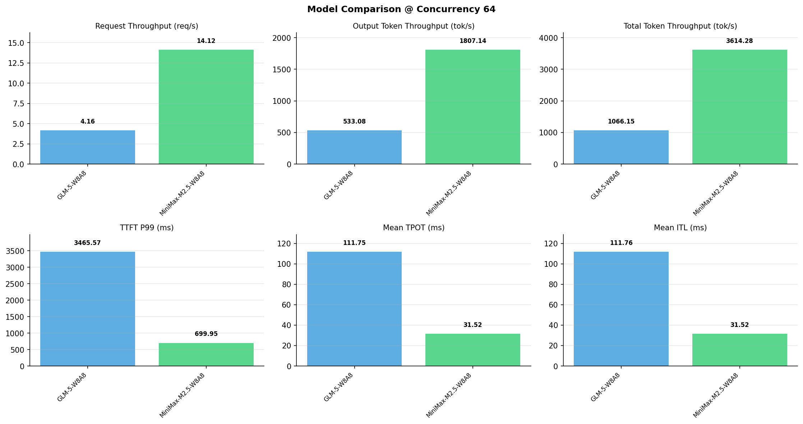

# 多模型性能对比报告

**测试日期：** 2026-05-14

**芯片平台：** inspur_metax_c550

**测试套件：** test_05

**Run ID：** 01, 01, 01

**并发级别：** 64并发

**测试配置：** 1000-i128-o128

---

## 🤖 芯片和模型配置信息

| 参数名称 | **MiniMax-M2.5-W8A8** | **GLM-5-W8A8** |
|----------|----------|----------|
| **max_position_embeddings** | 196608 | 202752 |
| **model_name** | MiniMax-M2.5-W8A8 | GLM-5-W8A8 |
| **model_size** | 215G | 712G |
| **python_version** | 3.10.10 | 3.10.10 |
| **quantization_config** | int8 | int8 |
| **sglang_version** | 0.5.9+maca3.5.3.204 | 0.5.9+maca3.5.3.204 |
| **temperature** | N/A | N/A |
| **top_k** | 40 | N/A |
| **top_p** | 0.95 | N/A |
| **transformers_version** | 4.57.6 | 5.1.0 |

---

## ⚙️ SGLang 启动配置信息

| 参数名称 | **MiniMax-M2.5-W8A8** | **GLM-5-W8A8** |
|----------|----------|----------|
| **Attention Backend** | flashinfer | flashinfer |
| **Chunked Prefill Size** | N/A | 8192 |
| **Context Length** | 196608 | 202752 |
| **Cuda Graph Max Bs** | N/A | 64 |
| **Disable Radix Cache** | True | True |
| **Dp Size** | N/A | 4 |
| **Max Queued Requests** | None | None |
| **Max Running Requests** | 64 | 64 |
| **Mem Fraction Static** | 0.9 | 0.8 |
| **Model Name** | MiniMax-M2.5-W8A8 | GLM-5-W8A8 |
| **Nnodes** | 1 | 2 |
| **Pp Size** | 1 | 1 |
| **Quantization** | w8a8_int8 | w8a8_int8 |
| **Reasoning Parser** | minimax-append-think | glm45 |
| **Tool Call Parser** | minimax-m2 | glm47 |
| **Tp Size** | 8 | 16 |

---

## 📊 模型列表

| 模型名称 | Run ID | 状态 |
|----------|--------|------|
| MiniMax-M2.5-W8A8 | 01 | [OK] |
| GLM-5-W8A8 | 01 | [OK] |

---

## 📊 测试概览

| 项目            | 配置                                     | 备注  |
|---------------|----------------------------------------|-----|
| **数据集**       | random                                 |     |
| **并发数**       | 1, 4, 8, 16, 32, 64, 128    |     |
| **总请求数**      | 1000                                    |     |
| **输入输出长度** | (128, 128), (512, 256), (1024, 512), (2048, 1024), (4096, 2048), (8192, 1024) |     |
| **测试套件**     | test_05                           |     |
| **被测芯片**      | inspur_metax_c550 |     |
| **SGLang版本**   | 0.5.9                           |     |

---

## 📈 服务基准结果对比

| 指标 | MiniMax-M2.5-W8A8 (基准) | GLM-5-W8A8 | 差异 | % |
|------|--------------- | --------- | ------- | -------|
| 成功请求数 | 1000 | 1000 | 0.00 | 0.0% |
| 测试持续时间 (s) | 70.83 | 240.12 | +169.29 | +239.0% |
| 总输入 tokens | 128000 | 128000 | 0.00 | 0.0% |
| 总生成 tokens | 128000 | 128000 | 0.00 | 0.0% |
| **请求吞吐量 (req/s)** | 14.12 | 4.16 | -9.96 | -70.5% |
| **输出 token 吞吐量 (tok/s)** | 1807.14 | 533.08 | -1274.06 | -70.5% |
| **总 token 吞吐量 (tok/s)** | 3614.28 | 1066.15 | -2548.13 | -70.5% |

---

## ⏱️ 首 Token 延迟 (TTFT) 对比

| 指标 | MiniMax-M2.5-W8A8 (基准) | GLM-5-W8A8 | 差异 | % |
|------|--------------- | --------- | ------- | -------|
| 平均 TTFT (ms) | 422.90 | 1031.93 | +609.03 | +144.0% |
| 中位 TTFT (ms) | 423.20 | 700.34 | +277.14 | +65.5% |
| P99 TTFT (ms) | 699.95 | 3465.57 | +2765.62 | +395.1% |

---

## ⚡ 每 Token 生成时间 (TPOT) 对比

| 指标 | MiniMax-M2.5-W8A8 (基准) | GLM-5-W8A8 | 差异 | % |
|------|--------------- | --------- | ------- | -------|
| 平均 TPOT (ms) | 31.52 | 111.75 | +80.23 | +254.5% |
| 中位 TPOT (ms) | 31.48 | 110.53 | +79.05 | +251.1% |
| P99 TPOT (ms) | 33.33 | 175.69 | +142.36 | +427.1% |

---

## 🔄 Token 间延迟 (ITL) 对比

| 指标 | MiniMax-M2.5-W8A8 (基准) | GLM-5-W8A8 | 差异 | % |
|------|--------------- | --------- | ------- | -------|
| 平均 ITL (ms) | 31.52 | 111.76 | +80.24 | +254.6% |
| 中位 ITL (ms) | 30.47 | 98.28 | +67.81 | +222.5% |
| P95 ITL (ms) | 33.27 | 343.77 | +310.50 | +933.3% |
| P99 ITL (ms) | 43.92 | 684.25 | +640.33 | +1457.9% |

---

## ⏱️ 端到端延迟 (E2E) 对比

| 指标 | MiniMax-M2.5-W8A8 (基准) | GLM-5-W8A8 | 差异 | % |
|------|--------------- | --------- | ------- | -------|
| 平均 E2E 延迟 (ms) | 4426.21 | 15224.52 | +10798.31 | +244.0% |
| 中位 E2E 延迟 (ms) | 4422.50 | 15113.65 | +10691.15 | +241.7% |
| P90 E2E 延迟 (ms) | 4477.35 | 20069.09 | +15591.74 | +348.2% |
| P99 E2E 延迟 (ms) | 4718.27 | 23751.04 | +19032.77 | +403.4% |

---

## 📊 模型性能对比

---

## 📝 分析小结

- **请求吞吐量**: MiniMax-M2.5-W8A8 最高，达 14.12 req/s
- **总token吞吐量**: MiniMax-M2.5-W8A8 最高，达 3614 tok/s
- **TTFT P99**: MiniMax-M2.5-W8A8 最优，为 699.95ms
- **TPOT P99**: MiniMax-M2.5-W8A8 最优，为 33.33ms

---

*报告生成时间: 2026-05-14*

